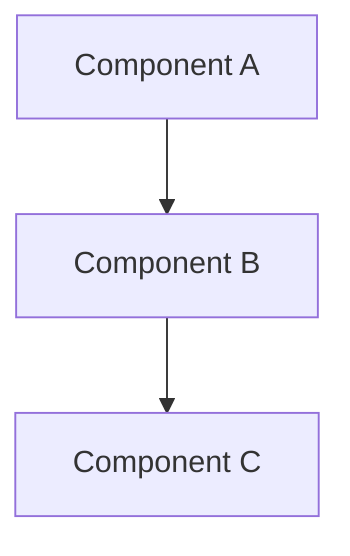
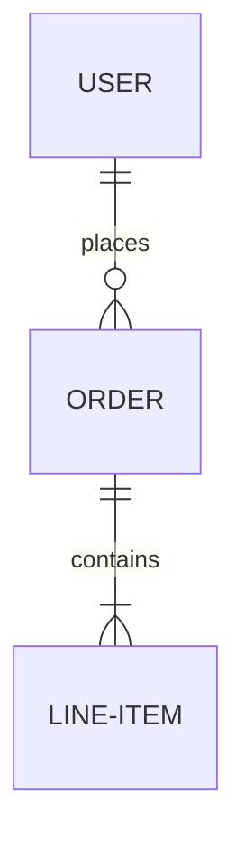

## 🧩 **Synthesis Document Generator**

### Core Function
**Specialized command for generating synthesis-specification.md** that integrates topic-framework.md and all role analysis.md files using @ reference system. Creates comprehensive implementation specification with cross-role insights.

**Dynamic Role Discovery**: Automatically detects which roles participated in brainstorming by scanning for `*/analysis.md` files. Synthesizes only actual participating roles, not predefined lists.

### Primary Capabilities
- **Dynamic Role Discovery**: Automatically identifies participating roles at runtime
- **Framework Integration**: Reference topic-framework.md discussion points across all discovered roles
- **Role Analysis Integration**: Consolidate all discovered role/analysis.md files using @ references
- **Cross-Framework Comparison**: Compare how each participating role addressed framework discussion points
- **@ Reference System**: Create structured references to source documents
- **Update Detection**: Smart updates when new role analyses are added
- **Flexible Participation**: Supports any subset of available roles (1 to 9+)

### Document Integration Model
**Three-Document Reference System**:
1. **topic-framework.md** → Structured discussion framework (input)
2. **[role]/analysis.md** → Role-specific analyses addressing framework (input)
3. **synthesis-specification.md** → Complete integrated specification (output)

## ⚙️ **Execution Protocol**

### ⚠️ Direct Execution by Main Claude
**Execution Model**: Main Claude directly executes this command without delegating to sub-agents.

**Rationale**:
- **Full Context Access**: Avoids context transmission loss that occurs with Task tool delegation
- **Complex Cognitive Analysis**: Leverages main Claude's complete reasoning capabilities for cross-role synthesis
- **Tool Usage**: Combines Read/Write/Glob tools with main Claude's analytical intelligence

**DO NOT use Task tool** - Main Claude performs intelligent analysis directly while reading/writing files, ensuring no information loss from context passing.

### Phase 1: Document Discovery & Validation
```bash
# Detect active brainstorming session
CHECK: .workflow/.active-* marker files
IF active_session EXISTS:
    session_id = get_active_session()
    brainstorm_dir = .workflow/WFS-{session}/.brainstorming/
ELSE:
    ERROR: "No active brainstorming session found"
    EXIT

# Validate required documents
CHECK: brainstorm_dir/topic-framework.md
IF NOT EXISTS:
    ERROR: "topic-framework.md not found. Run /workflow:brainstorm:artifacts first"
    EXIT
```

### Phase 2: Role Analysis Discovery
```bash
# Dynamically discover available role analyses
SCAN_DIRECTORY: .workflow/WFS-{session}/.brainstorming/
FIND_ANALYSES: [
    Scan all subdirectories for */analysis.md files
    Extract role names from directory names
]

# Available roles (for reference, actual participation is dynamic):
# - product-manager
# - product-owner
# - scrum-master
# - system-architect
# - ui-designer
# - ux-expert
# - data-architect
# - subject-matter-expert
# - test-strategist

LOAD_DOCUMENTS: {
    "topic_framework": topic-framework.md,
    "role_analyses": [dynamically discovered analysis.md files],
    "participating_roles": [extract role names from discovered directories],
    "existing_synthesis": synthesis-specification.md (if exists)
}

# Note: Not all roles participate in every brainstorming session
# Only synthesize roles that actually produced analysis.md files
```

### Phase 3: Update Mechanism Check
```bash
# Check for existing synthesis
IF synthesis-specification.md EXISTS:
    SHOW current synthesis summary to user
    ASK: "Synthesis exists. Do you want to:"
    OPTIONS:
      1. "Regenerate completely" → Create new synthesis
      2. "Update with new analyses" → Integrate new role analyses
      3. "Preserve existing" → Exit without changes
ELSE:
    CREATE new synthesis
```

### Phase 4: Synthesis Generation Process
Initialize synthesis task tracking:
```json
[
  {"content": "Validate topic-framework.md and role analyses availability", "status": "in_progress", "activeForm": "Validating source documents"},
  {"content": "Load topic framework discussion points structure", "status": "pending", "activeForm": "Loading framework structure"},
  {"content": "Cross-analyze role responses to each framework point", "status": "pending", "activeForm": "Cross-analyzing framework responses"},
  {"content": "Generate synthesis-specification.md with @ references", "status": "pending", "activeForm": "Generating synthesis with references"},
  {"content": "Update session metadata with synthesis completion", "status": "pending", "activeForm": "Updating session metadata"}
]
```

### Phase 5: Cross-Role Analysis Execution

**Dynamic Role Processing**: The number and types of roles are determined at runtime based on actual analysis.md files discovered in Phase 2.

#### 5.1 Data Collection and Preprocessing
```pseudo
# Iterate over dynamically discovered role analyses
FOR each discovered_role IN participating_roles:
    role_directory = brainstorm_dir + "/" + discovered_role

    # Load role analysis (required)
    role_analysis = Read(role_directory + "/analysis.md")

    # Load optional artifacts if present
    IF EXISTS(role_directory + "/recommendations.md"):
        role_recommendations[discovered_role] = Read(role_directory + "/recommendations.md")
    END IF

    # Extract insights from analysis
    role_insights[discovered_role] = extract_key_insights(role_analysis)
    role_recommendations[discovered_role] = extract_recommendations(role_analysis)
    role_concerns[discovered_role] = extract_concerns_risks(role_analysis)
    role_diagrams[discovered_role] = identify_diagrams_and_visuals(role_analysis)
END FOR

# Log participating roles for metadata
participating_role_count = COUNT(participating_roles)
participating_role_names = participating_roles
```

#### 5.2 Cross-Role Insight Analysis
```pseudo
# Consensus identification (across all participating roles)
consensus_areas = identify_common_themes(role_insights)
agreement_matrix = create_agreement_matrix(role_recommendations)

# Disagreement analysis (track which specific roles disagree)
disagreement_areas = identify_conflicting_views(role_insights)
tension_points = analyze_role_conflicts(role_recommendations)
FOR each conflict IN disagreement_areas:
    conflict.dissenting_roles = identify_dissenting_roles(conflict)
END FOR

# Innovation opportunity extraction
innovation_opportunities = extract_breakthrough_ideas(role_insights)
synergy_opportunities = identify_cross_role_synergies(role_insights)
```

#### 5.3 Priority and Decision Matrix Generation
```pseudo
# Create comprehensive evaluation matrix
FOR each recommendation:
    impact_score = calculate_business_impact(recommendation, role_insights)
    feasibility_score = calculate_technical_feasibility(recommendation, role_insights)
    effort_score = calculate_implementation_effort(recommendation, role_insights)
    risk_score = calculate_associated_risks(recommendation, role_insights)
    
    priority_score = weighted_score(impact_score, feasibility_score, effort_score, risk_score)
END FOR

SORT recommendations BY priority_score DESC
```

## 📊 **Output Specification**

### Output Location
The synthesis process creates **one consolidated document** that integrates all role perspectives:

```
.workflow/WFS-{topic-slug}/.brainstorming/
├── topic-framework.md          # Input: Framework structure
├── [role]/analysis.md          # Input: Role analyses (multiple)
└── synthesis-specification.md  # ★ OUTPUT: Complete integrated specification
```

#### synthesis-specification.md Structure (Complete Specification)

**Document Purpose**: Defines **"WHAT"** to build - comprehensive requirements and design blueprint.
**Scope**: High-level features, requirements, and design specifications. Does NOT include executable task breakdown (that's IMPL_PLAN.md's responsibility).

```markdown
# [Topic] - Integrated Implementation Specification

**Framework Reference**: @topic-framework.md | **Generated**: [timestamp] | **Session**: WFS-[topic-slug]
**Source Integration**: All brainstorming role perspectives consolidated
**Document Type**: Requirements & Design Specification (WHAT to build)

## Executive Summary
Strategic overview with key insights, breakthrough opportunities, and implementation priorities.

## Key Designs & Decisions
### Core Architecture Diagram

*Reference: @system-architect/analysis.md#architecture-diagram*

### User Journey Map

*Reference: @ux-expert/analysis.md#user-journey*

### Data Model Overview

*Reference: @data-architect/analysis.md#data-model*

### Architecture Decision Records (ADRs)
**ADR-01: [Decision Title]**
- **Context**: Background and problem statement
- **Decision**: Chosen approach
- **Rationale**: Why this approach was selected
- **Reference**: @system-architect/analysis.md#adr-01

## Controversial Points & Alternatives
| Point | Adopted Solution | Alternative Solution(s) | Decision Rationale | Dissenting Roles |
|-------|------------------|-------------------------|--------------------| -----------------|
| Authentication | JWT Token (@security-expert) | Session-Cookie (@system-architect) | Stateless API support for multi-platform | System Architect noted session performance benefits |
| UI Framework | React (@ui-designer) | Vue.js (@subject-matter-expert) | Team expertise and ecosystem maturity | Subject Matter Expert preferred Vue for learning curve |

*This section preserves decision context and rejected alternatives for future reference.*

## Requirements & Acceptance Criteria
### Functional Requirements
| ID | Description | Rationale Summary | Source | Priority | Acceptance | Dependencies |
|----|-------------|-------------------|--------|----------|------------|--------------|
| FR-01 | User authentication | Enable secure multi-platform access | @product-manager/analysis.md | High | User can login via email/password | None |
| FR-02 | Data export | User-requested analytics feature | @product-owner/analysis.md | Medium | Export to CSV/JSON | FR-01 |

### Non-Functional Requirements
| ID | Description | Rationale Summary | Target | Validation | Source |
|----|-------------|-------------------|--------|------------|--------|
| NFR-01 | Response time | UX research shows <200ms critical | <200ms | Load testing | @ux-expert/analysis.md |
| NFR-02 | Data encryption | Compliance requirement | AES-256 | Security audit | @security-expert/analysis.md |

### Business Requirements
| ID | Description | Rationale Summary | Value | Success Metric | Source |
|----|-------------|-------------------|-------|----------------|--------|
| BR-01 | User retention | Market analysis shows engagement gap | High | 80% 30-day retention | @product-manager/analysis.md |
| BR-02 | Revenue growth | Business case justification | High | 25% MRR increase | @product-owner/analysis.md |

## Design Specifications
### UI/UX Guidelines
**Consolidated from**: @ui-designer/analysis.md, @ux-expert/analysis.md
- Component specifications and interaction patterns
- Visual design system and accessibility requirements
- User flow and interface specifications

### Architecture Design
**Consolidated from**: @system-architect/analysis.md, @data-architect/analysis.md
- System architecture and component interactions
- Data flow and storage strategy
- Technology stack decisions

### Domain Expertise & Standards
**Consolidated from**: @subject-matter-expert/analysis.md
- Industry standards and best practices
- Compliance requirements and regulations
- Technical quality and domain-specific patterns

## Process & Collaboration Concerns
**Consolidated from**: @scrum-master/analysis.md, @product-owner/analysis.md

### Team Capability Assessment
| Required Skill | Current Level | Gap Analysis | Mitigation Strategy | Reference |
|----------------|---------------|--------------|---------------------|-----------|
| Kubernetes | Intermediate | Need advanced knowledge | Training + external consultant | @scrum-master/analysis.md |
| React Hooks | Advanced | Team ready | None | @scrum-master/analysis.md |

### Process Risks
| Risk | Impact | Probability | Mitigation | Owner |
|------|--------|-------------|------------|-------|
| Cross-team API dependency | High | Medium | Early API contract definition | @scrum-master/analysis.md |
| UX-Dev alignment gap | Medium | High | Weekly design sync meetings | @ux-expert/analysis.md |

### Collaboration Patterns
- **Design-Dev Pairing**: UI Designer and Frontend Dev pair programming for complex interactions
- **Architecture Reviews**: Weekly arch review for system-level decisions
- **User Testing Cadence**: Bi-weekly UX testing sessions with real users
- **Reference**: @scrum-master/analysis.md#collaboration

### Timeline Constraints
- **Blocking Dependencies**: Project-X API must complete before Phase 2
- **Resource Constraints**: Only 2 backend developers available in Q1
- **External Dependencies**: Third-party OAuth provider integration timeline
- **Reference**: @scrum-master/analysis.md#constraints

## Implementation Roadmap (High-Level)
### Development Phases
**Phase 1** (0-3 months): Foundation and core features
**Phase 2** (3-6 months): Advanced features and integrations
**Phase 3** (6+ months): Optimization and innovation

### Technical Guidelines
- Development standards and code organization
- Testing strategy and quality assurance
- Deployment and monitoring approach

### Feature Grouping (Epic-Level)
- High-level feature grouping and prioritization
- Epic-level dependencies and sequencing
- Strategic milestones and release planning

**Note**: Detailed task breakdown into executable work items is handled by `/workflow:plan` → `IMPL_PLAN.md`

## Risk Assessment & Mitigation
### Critical Risks Identified
1. **Risk**: Description | **Mitigation**: Strategy
2. **Risk**: Description | **Mitigation**: Strategy

### Success Factors
- Key factors for implementation success
- Continuous monitoring requirements
- Quality gates and validation checkpoints

---
*Complete implementation specification consolidating all role perspectives into actionable guidance*
```

## 🔄 **Session Integration**

### Streamlined Status Synchronization
Upon completion, update `workflow-session.json`:

**Dynamic Role Participation**: The `participating_roles` and `roles_synthesized` values are determined at runtime based on actual analysis.md files discovered.

```json
{
  "phases": {
    "BRAINSTORM": {
      "status": "completed",
      "synthesis_completed": true,
      "completed_at": "timestamp",
      "participating_roles": ["<dynamically-discovered-role-1>", "<dynamically-discovered-role-2>", "..."],
      "available_roles": ["product-manager", "product-owner", "scrum-master", "system-architect", "ui-designer", "ux-expert", "data-architect", "subject-matter-expert", "test-strategist"],
      "consolidated_output": {
        "synthesis_specification": ".workflow/WFS-{topic}/.brainstorming/synthesis-specification.md"
      },
      "synthesis_quality": {
        "role_integration": "complete",
        "requirement_coverage": "comprehensive",
        "decision_transparency": "alternatives_documented",
        "process_risks_identified": true,
        "implementation_readiness": "ready"
      },
      "content_metrics": {
        "roles_synthesized": "<COUNT(participating_roles)>",
        "functional_requirements": "<dynamic-count>",
        "non_functional_requirements": "<dynamic-count>",
        "business_requirements": "<dynamic-count>",
        "architecture_decisions": "<dynamic-count>",
        "controversial_points": "<dynamic-count>",
        "diagrams_included": "<dynamic-count>",
        "process_risks": "<dynamic-count>",
        "team_skill_gaps": "<dynamic-count>",
        "implementation_phases": "<dynamic-count>",
        "risk_factors_identified": "<dynamic-count>"
      }
    }
  }
}
```

**Example with actual values**:
```json
{
  "phases": {
    "BRAINSTORM": {
      "status": "completed",
      "participating_roles": ["product-manager", "system-architect", "ui-designer", "ux-expert", "scrum-master"],
      "content_metrics": {
        "roles_synthesized": 5,
        "functional_requirements": 18,
        "controversial_points": 2
      }
    }
  }
}
```

## ✅ **Quality Assurance**

### Required Synthesis Elements
- [ ] Integration of all available role analyses with comprehensive coverage
- [ ] **Key Designs & Decisions**: Architecture diagrams, user journey maps, ADRs documented
- [ ] **Controversial Points**: Disagreement points, alternatives, and decision rationale captured
- [ ] **Process Concerns**: Team capability gaps, process risks, collaboration patterns identified
- [ ] Quantified priority recommendation matrix with evaluation criteria
- [ ] Actionable implementation plan with phased approach
- [ ] Comprehensive risk assessment with mitigation strategies

### Synthesis Analysis Quality Standards
- [ ] **Completeness**: Integrates all available role analyses without gaps
- [ ] **Visual Clarity**: Key diagrams (architecture, data model, user journey) included via Mermaid or images
- [ ] **Decision Transparency**: Documents not just decisions, but alternatives and why they were rejected
- [ ] **Insight Generation**: Identifies cross-role patterns and deep insights
- [ ] **Actionability**: Provides specific, executable recommendations with rationale
- [ ] **Balance**: Considers all role perspectives, including process-oriented roles (Scrum Master)
- [ ] **Forward-Looking**: Includes long-term strategic and innovation considerations

### Output Validation Criteria
- [ ] **Priority-Based**: Recommendations prioritized using multi-dimensional evaluation
- [ ] **Context-Rich**: Each requirement includes rationale summary for immediate understanding
- [ ] **Resource-Aware**: Team skill gaps and constraints explicitly documented
- [ ] **Risk-Managed**: Both technical and process risks captured with mitigation strategies
- [ ] **Measurable Success**: Clear success metrics and monitoring frameworks
- [ ] **Clear Actions**: Specific next steps with assigned responsibilities and timelines

### Integration Excellence Standards
- [ ] **Cross-Role Synthesis**: Successfully identifies and documents role perspective conflicts
- [ ] **No Role Marginalization**: Process, UX, and compliance concerns equally visible as functional requirements
- [ ] **Strategic Coherence**: Recommendations form coherent strategic direction
- [ ] **Implementation Readiness**: Plans detailed enough for immediate execution, with clear handoff to IMPL_PLAN.md
- [ ] **Stakeholder Alignment**: Addresses needs and concerns of all key stakeholders
- [ ] **Decision Traceability**: Every major decision traceable to source role analysis via @ references
- [ ] **Continuous Improvement**: Establishes framework for ongoing optimization and learning

## 🚀 **Recommended Next Steps**

After synthesis completion, follow this recommended workflow:

### Option 1: Standard Planning Workflow (Recommended)
```bash
# Step 1: Verify conceptual clarity (Quality Gate)
/workflow:concept-verify --session WFS-{session-id}
# → Interactive Q&A (up to 5 questions) to clarify ambiguities in synthesis

# Step 2: Proceed to action planning (after concept verification)
/workflow:plan --session WFS-{session-id}
# → Generates IMPL_PLAN.md and task.json files

# Step 3: Verify action plan quality (Quality Gate)
/workflow:action-plan-verify --session WFS-{session-id}
# → Read-only analysis to catch issues before execution

# Step 4: Start implementation
/workflow:execute --session WFS-{session-id}
```

### Option 2: TDD Workflow
```bash
# Step 1: Verify conceptual clarity
/workflow:concept-verify --session WFS-{session-id}

# Step 2: Generate TDD task chains (RED-GREEN-REFACTOR)
/workflow:tdd-plan --session WFS-{session-id} "Feature description"

# Step 3: Verify TDD plan quality
/workflow:action-plan-verify --session WFS-{session-id}

# Step 4: Execute TDD workflow
/workflow:execute --session WFS-{session-id}
```

### Quality Gates Explained

**`/workflow:concept-verify`** (Phase 2 - After Brainstorming):
- **Purpose**: Detect and resolve conceptual ambiguities before detailed planning
- **Time**: 10-20 minutes (interactive)
- **Value**: Reduces downstream rework by 40-60%
- **Output**: Updated synthesis-specification.md with clarifications

**`/workflow:action-plan-verify`** (Phase 4 - After Planning):
- **Purpose**: Validate IMPL_PLAN.md and task.json consistency and completeness
- **Time**: 5-10 minutes (read-only analysis)
- **Value**: Prevents execution of flawed plans, saves 2-5 days
- **Output**: Verification report with actionable recommendations

### Skip Verification? (Not Recommended)

If you want to skip verification and proceed directly:
```bash
/workflow:plan --session WFS-{session-id}
/workflow:execute --session WFS-{session-id}
```

⚠️ **Warning**: Skipping verification increases risk of late-stage issues and rework.
