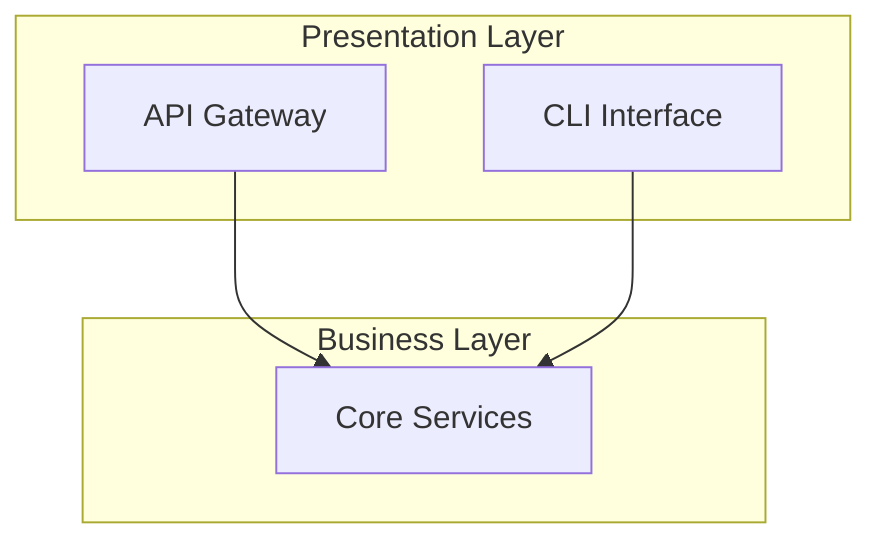
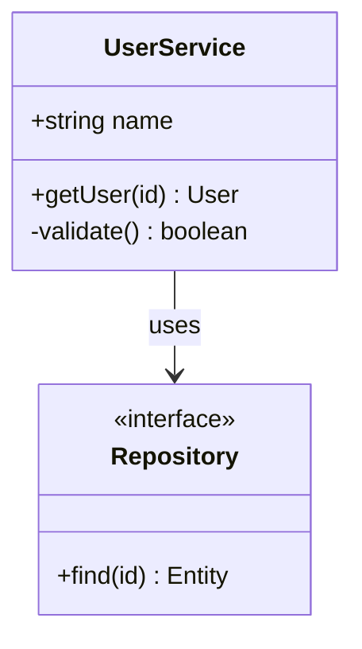
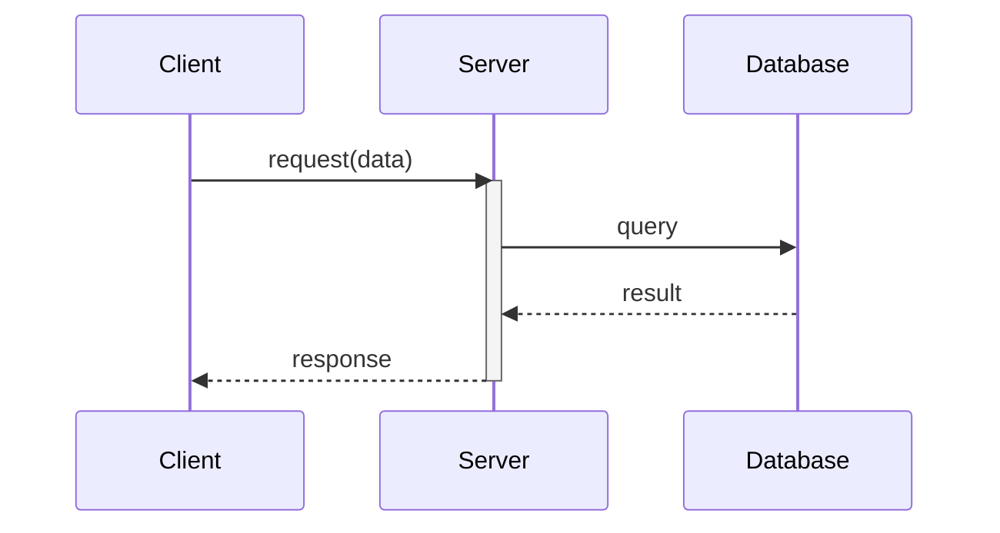
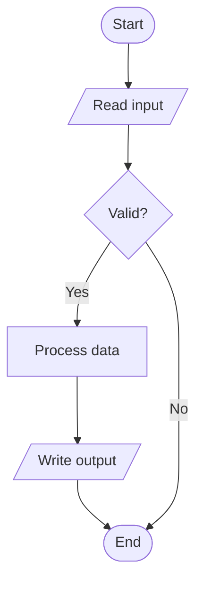

# Workflow Docs Analyze Command (/workflow:docs:analyze)

## Overview

**Iterative project analysis command** that guides users through multi-phase analysis to produce tailored project reports. Uses multi-agent collaboration with incremental report updates based on user feedback.

**Core Differentiator**: Unlike static analysis tools, this command engages in multi-round dialogue to understand user's specific focus areas and iteratively refines reports until user satisfaction.

## Report Types

| Type | Focus | Output |
|------|-------|--------|
| `architecture` | System structure, module relationships, dependencies | ARCHITECTURE-REPORT.md |
| `design` | Design patterns, class diagrams, component interactions | DESIGN-REPORT.md |
| `methods` | Key algorithms, critical paths, core functions explained | METHODS-REPORT.md |
| `comprehensive` | All above combined | COMPREHENSIVE-REPORT.md |

## Execution Philosophy

**User-Centric Iteration Model**:
1. **Discover** user's actual analysis needs (not assume)
2. **Explore** codebase from multiple angles
3. **Generate** initial report with clear structure
4. **Iterate** based on user feedback until satisfied
5. **Finalize** polished report

## Execution Process

```
Input Parsing:
   ├─ Parse: scope/path (optional, defaults to project root)
   └─ Parse: --type flag (optional, determines initial focus)

Phase 1: Requirements Discovery (AskUserQuestion)
   ├─ Ask: Report type preference (if not specified)
   ├─ Ask: Focus areas within chosen type
   ├─ Ask: Depth level (overview/detailed/deep-dive)
   └─ Output: analysis_config object

Phase 2: Project Exploration (cli-explore-agent)
   ├─ Execute: Parallel exploration by focus areas
   ├─ Generate: exploration-{angle}.json files
   └─ Output: explorations-manifest.json

Phase 3: Deep Analysis (Gemini CLI)
   ├─ Execute: Multi-dimensional analysis
   ├─ Generate: analysis-{dimension}.json files
   └─ Output: analysis-manifest.json

Phase 4: Initial Report Generation
   ├─ Synthesize: Merge all analysis results
   ├─ Generate: {TYPE}-REPORT.md (draft)
   └─ Output: Present report to user

Phase 5: Iterative Refinement (Loop)
   ├─ Ask: User feedback on current report
   ├─ Decision:
   │   ├─ "satisfied" → Finalize and exit
   │   ├─ "expand section X" → Deep-dive specific area
   │   ├─ "add details on Y" → Augment with new analysis
   │   └─ "change focus" → Re-run Phase 3 with new config
   └─ Update: Incremental report modification

Finalize:
   └─ Output: Final {TYPE}-REPORT.md
```

## 5-Phase Execution

### Phase 1: Requirements Discovery

**Purpose**: Understand user's actual analysis needs through interactive questioning

**Step 1.1: Initialize TodoWrite**

```javascript
TodoWrite([
  {content: "Phase 1: Requirements Discovery", status: "in_progress", activeForm: "Discovering analysis requirements"},
  {content: "Phase 2: Project Exploration", status: "pending", activeForm: "Exploring project structure"},
  {content: "Phase 3: Deep Analysis", status: "pending", activeForm: "Performing deep analysis"},
  {content: "Phase 4: Initial Report Generation", status: "pending", activeForm: "Generating initial report"},
  {content: "Phase 5: Iterative Refinement", status: "pending", activeForm: "Refining report based on feedback"}
])
```

**Step 1.2: Report Type Selection (if not specified)**

```javascript
if (!type_specified) {
  AskUserQuestion({
    questions: [{
      question: "What type of project analysis report would you like?",
      header: "Report Type",
      multiSelect: false,
      options: [
        {label: "Architecture (Recommended)", description: "System structure, module relationships, layer analysis, dependency graph"},
        {label: "Design", description: "Design patterns, class relationships, component interactions, abstraction analysis"},
        {label: "Methods", description: "Key algorithms, critical code paths, core function explanations with examples"},
        {label: "Comprehensive", description: "All above combined into a complete project analysis"}
      ]
    }]
  })
}
```

**Step 1.3: Focus Area Discovery**

```javascript
// Based on report type, ask focused questions
const focusQuestions = {
  architecture: {
    question: "Which architectural aspects are you most interested in?",
    header: "Focus Areas",
    multiSelect: true,
    options: [
      {label: "Layer Structure", description: "How the system is divided into layers (presentation, business, data)"},
      {label: "Module Dependencies", description: "How modules depend on and communicate with each other"},
      {label: "Entry Points", description: "How requests flow through the system from entry to response"},
      {label: "Data Flow", description: "How data moves and transforms across the system"}
    ]
  },
  design: {
    question: "Which design aspects do you want to understand?",
    header: "Design Focus",
    multiSelect: true,
    options: [
      {label: "Design Patterns", description: "Identify and explain patterns used in the codebase"},
      {label: "Class Relationships", description: "Inheritance, composition, and associations between classes"},
      {label: "Interface Contracts", description: "How components communicate through interfaces/protocols"},
      {label: "State Management", description: "How application state is managed and mutated"}
    ]
  },
  methods: {
    question: "What kind of method analysis do you need?",
    header: "Method Focus",
    multiSelect: true,
    options: [
      {label: "Core Algorithms", description: "Key algorithms that define the system's behavior"},
      {label: "Critical Paths", description: "Most important execution flows in the application"},
      {label: "Public APIs", description: "External-facing methods and their contracts"},
      {label: "Complex Logic", description: "Methods with high cyclomatic complexity explained"}
    ]
  }
};

AskUserQuestion({questions: [focusQuestions[selected_type]]})
```

**Step 1.4: Depth Level Selection**

```javascript
AskUserQuestion({
  questions: [{
    question: "How detailed should the analysis be?",
    header: "Depth",
    multiSelect: false,
    options: [
      {label: "Overview (Recommended)", description: "High-level understanding, suitable for onboarding or quick review"},
      {label: "Detailed", description: "In-depth analysis with code examples and explanations"},
      {label: "Deep-Dive", description: "Exhaustive analysis with implementation details and edge cases"}
    ]
  }]
})
```

**Step 1.5: Store Analysis Config**

```javascript
const analysis_config = {
  type: selected_type,
  focus_areas: selected_focus_areas,
  depth: selected_depth,
  scope: scope_path || ".",
  timestamp: new Date().toISOString()
};

// Create output directory
const outputDir = `.workflow/.scratchpad/analyze-${Date.now()}`;
bash(`mkdir -p ${outputDir}`);
Write(`${outputDir}/analysis-config.json`, JSON.stringify(analysis_config, null, 2));
```

**TodoWrite**: Mark Phase 1 completed, Phase 2 in_progress

---

### Phase 2: Project Exploration

**Purpose**: Multi-angle exploration based on user's focus areas

**Step 2.1: Launch Parallel Explore Agents**

```javascript
const explorationAngles = mapFocusToAngles(analysis_config.focus_areas);
// Examples:
// - "Layer Structure" → ["architecture", "dependencies"]
// - "Design Patterns" → ["patterns", "abstractions"]
// - "Core Algorithms" → ["algorithms", "complexity"]

const explorationTasks = explorationAngles.map((angle, index) =>
  Task({
    subagent_type: "cli-explore-agent",
    run_in_background: false,
    description: `Explore: ${angle}`,
    prompt: `
## Exploration Objective
Execute **${angle}** exploration for project analysis report.

## Context
- **Angle**: ${angle}
- **Report Type**: ${analysis_config.type}
- **Depth**: ${analysis_config.depth}
- **Scope**: ${analysis_config.scope}
- **Output**: ${outputDir}/exploration-${angle}.json

## Exploration Protocol

**Step 1: Structural Discovery**
- Execute: ccw tool exec get_modules_by_depth '{}'
- Find files relevant to ${angle} using rg/glob
- Map directory structure and module boundaries

**Step 2: Pattern Recognition**
- Identify ${angle}-related patterns and conventions
- Note file naming, organization patterns
- Extract key abstractions

**Step 3: Relationship Mapping**
- Map dependencies and relationships
- Identify integration points
- Note coupling and cohesion patterns

## Output Format
{
  "angle": "${angle}",
  "findings": {
    "structure": [...],
    "patterns": [...],
    "relationships": [...],
    "key_files": [{path, relevance, rationale}]
  },
  "insights": [...],
  "depth_notes": "${analysis_config.depth}-specific observations"
}

Write output to: ${outputDir}/exploration-${angle}.json
`
  })
);
```

**Step 2.2: Generate Exploration Manifest**

```javascript
const manifest = {
  config: analysis_config,
  explorations: explorationAngles.map(angle => ({
    angle,
    file: `exploration-${angle}.json`
  })),
  timestamp: new Date().toISOString()
};
Write(`${outputDir}/explorations-manifest.json`, JSON.stringify(manifest, null, 2));
```

**TodoWrite**: Mark Phase 2 completed, Phase 3 in_progress

---

### Phase 3: Deep Analysis

**Purpose**: Use Gemini CLI for in-depth analysis based on exploration results

**Step 3.1: Synthesize Exploration Results**

```javascript
// Read all exploration files
const explorations = explorationAngles.map(angle => 
  JSON.parse(Read(`${outputDir}/exploration-${angle}.json`))
);

// Extract key files to analyze
const keyFiles = explorations.flatMap(e => e.findings.key_files)
  .sort((a, b) => b.relevance - a.relevance)
  .slice(0, 20); // Top 20 most relevant files
```

**Step 3.2: Execute Deep Analysis via Gemini CLI**

```javascript
const analysisPrompt = buildAnalysisPrompt(analysis_config, keyFiles);

Bash({
  command: `ccw cli -p "
PURPOSE: Generate ${analysis_config.type} analysis report for project
TASK: 
  • Analyze project structure and patterns from ${analysis_config.type} perspective
  • Focus on: ${analysis_config.focus_areas.join(', ')}
  • Depth level: ${analysis_config.depth}
  • Key files to analyze: ${keyFiles.map(f => f.path).join(', ')}
MODE: analysis
CONTEXT: @**/* | Exploration results from ${outputDir}/
EXPECTED: 
  - Structured ${analysis_config.type} analysis
  - Clear explanations with code references
  - Mermaid diagrams where applicable
  - Actionable insights
RULES: $(cat ~/.claude/workflows/cli-templates/protocols/analysis-protocol.md) | 
  Focus on ${analysis_config.focus_areas.join(', ')} | 
  Depth: ${analysis_config.depth}
" --tool gemini --mode analysis`,
  run_in_background: true,
  timeout: 600000
});
```

**Step 3.3: Store Analysis Results**

```javascript
// After CLI completes, store structured results
Write(`${outputDir}/deep-analysis.json`, JSON.stringify({
  type: analysis_config.type,
  focus_areas: analysis_config.focus_areas,
  analysis_result: cli_output,
  diagrams: extracted_diagrams,
  code_references: extracted_references
}, null, 2));
```

**TodoWrite**: Mark Phase 3 completed, Phase 3.5 in_progress

---

### Phase 3.5: Diagram Generation

**Purpose**: Generate Mermaid diagrams based on analysis results, tailored to report type

**Step 3.5.1: Determine Required Diagrams**

```javascript
// Map report types to required diagram types
const diagramRequirements = {
  architecture: [
    {type: 'architecture', format: 'graph TD', name: 'System Architecture'},
    {type: 'layers', format: 'graph TD', name: 'Layer Structure'},
    {type: 'dependencies', format: 'graph LR', name: 'Module Dependencies'},
    {type: 'dataflow', format: 'flowchart LR', name: 'Data Flow'}
  ],
  design: [
    {type: 'class', format: 'classDiagram', name: 'Class Diagram'},
    {type: 'components', format: 'graph TD', name: 'Component Diagram'},
    {type: 'patterns', format: 'graph TD', name: 'Design Patterns'},
    {type: 'state', format: 'stateDiagram-v2', name: 'State Management'}
  ],
  methods: [
    {type: 'algorithm', format: 'flowchart TD', name: 'Algorithm Flowchart'},
    {type: 'sequence', format: 'sequenceDiagram', name: 'Call Sequence'},
    {type: 'critical_path', format: 'flowchart LR', name: 'Critical Path'},
    {type: 'api', format: 'graph LR', name: 'API Structure'}
  ],
  comprehensive: [
    {type: 'architecture', format: 'graph TD', name: 'System Architecture'},
    {type: 'class', format: 'classDiagram', name: 'Class Diagram'},
    {type: 'sequence', format: 'sequenceDiagram', name: 'Key Sequences'},
    {type: 'dataflow', format: 'flowchart LR', name: 'Data Flow'}
  ]
};

const requiredDiagrams = diagramRequirements[config.type];
bash(`mkdir -p ${outputDir}/diagrams`);
```

**Step 3.5.2: Generate Architecture Diagrams (graph TD)**

```javascript
function generateArchitectureDiagram(analysis) {
  let mermaid = 'graph TD\n';

  // Subgraphs for layers/modules
  const layers = analysis.structure?.layers || extractLayers(analysis);
  for (const layer of layers) {
    mermaid += `    subgraph ${sanitizeId(layer.name)}["${escapeLabel(layer.name)}"]\n`;
    for (const component of layer.components || []) {
      mermaid += `        ${sanitizeId(component.id)}["${escapeLabel(component.name)}"]\n`;
    }
    mermaid += '    end\n';
  }

  // Connections
  const connections = analysis.relationships || [];
  for (const conn of connections) {
    const label = conn.label ? `|"${escapeLabel(conn.label)}"|` : '';
    mermaid += `    ${sanitizeId(conn.from)} -->${label} ${sanitizeId(conn.to)}\n`;
  }

  // Styling
  mermaid += '\n    %% Styling\n';
  mermaid += '    classDef core fill:#e1f5fe,stroke:#01579b\n';
  mermaid += '    classDef external fill:#fff3e0,stroke:#e65100\n';

  return mermaid;
}

if (requiredDiagrams.some(d => d.type === 'architecture')) {
  const archDiagram = generateArchitectureDiagram(deepAnalysis);
  Write(`${outputDir}/diagrams/architecture.mmd`, archDiagram);
}
```

**Step 3.5.3: Generate Layer/Dependency Diagrams**

```javascript
function generateLayerDiagram(analysis) {
  let mermaid = 'graph TD\n';

  const layers = ['Presentation', 'Application', 'Domain', 'Infrastructure'];
  const detectedLayers = analysis.layers || inferLayers(analysis);

  for (let i = 0; i < detectedLayers.length; i++) {
    const layer = detectedLayers[i];
    mermaid += `    subgraph L${i}["${escapeLabel(layer.name)}"]\n`;
    mermaid += `        direction LR\n`;
    for (const mod of layer.modules || []) {
      mermaid += `        ${sanitizeId(mod)}["${escapeLabel(mod)}"]\n`;
    }
    mermaid += '    end\n';

    if (i < detectedLayers.length - 1) {
      mermaid += `    L${i} --> L${i + 1}\n`;
    }
  }

  return mermaid;
}

function generateDependencyDiagram(analysis) {
  let mermaid = 'graph LR\n';

  const modules = analysis.modules || [];
  const deps = analysis.dependencies || [];

  // Nodes
  for (const mod of modules) {
    const shape = mod.type === 'core' ? '([' : '[';
    const shapeEnd = mod.type === 'core' ? '])' : ']';
    mermaid += `    ${sanitizeId(mod.name)}${shape}"${escapeLabel(mod.name)}"${shapeEnd}\n`;
  }

  // Edges with labels
  for (const dep of deps) {
    const style = dep.type === 'weak' ? '-.->' : '-->';
    const label = dep.count ? `|"${dep.count} refs"|` : '';
    mermaid += `    ${sanitizeId(dep.from)} ${style}${label} ${sanitizeId(dep.to)}\n`;
  }

  return mermaid;
}

if (requiredDiagrams.some(d => d.type === 'layers')) {
  Write(`${outputDir}/diagrams/layers.mmd`, generateLayerDiagram(deepAnalysis));
}
if (requiredDiagrams.some(d => d.type === 'dependencies')) {
  Write(`${outputDir}/diagrams/dependencies.mmd`, generateDependencyDiagram(deepAnalysis));
}
```

**Step 3.5.4: Generate Class Diagrams (classDiagram)**

```javascript
function generateClassDiagram(analysis) {
  let mermaid = 'classDiagram\n';

  const entities = analysis.entities || analysis.classes || [];

  // Classes with properties and methods
  for (const entity of entities.slice(0, 15)) { // Limit for readability
    mermaid += `    class ${sanitizeId(entity.name)} {\n`;

    // Properties
    for (const prop of (entity.properties || []).slice(0, 8)) {
      const vis = {public: '+', private: '-', protected: '#'}[prop.visibility] || '+';
      mermaid += `        ${vis}${sanitizeType(prop.type)} ${prop.name}\n`;
    }

    // Methods
    for (const method of (entity.methods || []).slice(0, 6)) {
      const vis = {public: '+', private: '-', protected: '#'}[method.visibility] || '+';
      const params = (method.params || []).map(p => `${p.name}`).join(', ');
      mermaid += `        ${vis}${method.name}(${params}) ${sanitizeType(method.returnType || 'void')}\n`;
    }

    mermaid += '    }\n';
  }

  // Relationships
  const relationships = analysis.relationships || [];
  const arrows = {
    inheritance: '--|>',
    implementation: '..|>',
    composition: '*--',
    aggregation: 'o--',
    association: '-->',
    dependency: '..>'
  };

  for (const rel of relationships) {
    const arrow = arrows[rel.type] || '-->';
    const label = rel.label ? ` : ${escapeLabel(rel.label)}` : '';
    mermaid += `    ${sanitizeId(rel.from)} ${arrow} ${sanitizeId(rel.to)}${label}\n`;
  }

  return mermaid;
}

if (requiredDiagrams.some(d => d.type === 'class')) {
  Write(`${outputDir}/diagrams/class-diagram.mmd`, generateClassDiagram(deepAnalysis));
}
```

**Step 3.5.5: Generate Flowcharts (flowchart TD)**

```javascript
function generateAlgorithmFlowchart(algorithm) {
  let mermaid = 'flowchart TD\n';

  // Start
  mermaid += `    START(["Start: ${escapeLabel(algorithm.name)}"])\n`;

  // Input processing
  if (algorithm.inputs?.length > 0) {
    mermaid += `    INPUT[/"Input: ${algorithm.inputs.map(i => i.name).join(', ')}"/]\n`;
    mermaid += '    START --> INPUT\n';
  }

  // Process steps
  let prevNode = algorithm.inputs?.length > 0 ? 'INPUT' : 'START';
  for (let i = 0; i < (algorithm.steps || []).length; i++) {
    const step = algorithm.steps[i];
    const nodeId = `STEP${i}`;

    if (step.type === 'decision') {
      mermaid += `    ${nodeId}{"${escapeLabel(step.description)}"}\n`;
      mermaid += `    ${prevNode} --> ${nodeId}\n`;
      if (step.yes_branch) {
        mermaid += `    ${nodeId} -->|"Yes"| ${sanitizeId(step.yes_branch)}\n`;
      }
      if (step.no_branch) {
        mermaid += `    ${nodeId} -->|"No"| ${sanitizeId(step.no_branch)}\n`;
      }
    } else {
      mermaid += `    ${nodeId}["${escapeLabel(step.description)}"]\n`;
      mermaid += `    ${prevNode} --> ${nodeId}\n`;
    }
    prevNode = nodeId;
  }

  // Output and end
  mermaid += `    OUTPUT[/"Output: ${escapeLabel(algorithm.output || 'Result')}"/]\n`;
  mermaid += `    ${prevNode} --> OUTPUT\n`;
  mermaid += '    END_([End])\n';
  mermaid += '    OUTPUT --> END_\n';

  return mermaid;
}

function generateDataFlowDiagram(analysis) {
  let mermaid = 'flowchart LR\n';

  const flows = analysis.dataFlows || [];

  // Data stores
  mermaid += '    subgraph DataStores["Data Stores"]\n';
  for (const store of analysis.dataStores || []) {
    mermaid += `        ${sanitizeId(store.id)}[("${escapeLabel(store.name)}")]\n`;
  }
  mermaid += '    end\n';

  // Processes
  mermaid += '    subgraph Processes["Processes"]\n';
  for (const proc of analysis.processes || []) {
    mermaid += `        ${sanitizeId(proc.id)}["${escapeLabel(proc.name)}"]\n`;
  }
  mermaid += '    end\n';

  // Flows
  for (const flow of flows) {
    mermaid += `    ${sanitizeId(flow.from)} -->|"${escapeLabel(flow.data)}"| ${sanitizeId(flow.to)}\n`;
  }

  return mermaid;
}

// Generate algorithm flowcharts
const algorithms = deepAnalysis.algorithms || [];
for (const algo of algorithms.slice(0, 3)) { // Top 3 algorithms
  const flowchart = generateAlgorithmFlowchart(algo);
  Write(`${outputDir}/diagrams/algorithm-${sanitizeId(algo.name)}.mmd`, flowchart);
}

if (requiredDiagrams.some(d => d.type === 'dataflow')) {
  Write(`${outputDir}/diagrams/dataflow.mmd`, generateDataFlowDiagram(deepAnalysis));
}
```

**Step 3.5.6: Generate Sequence Diagrams (sequenceDiagram)**

```javascript
function generateSequenceDiagram(scenario) {
  let mermaid = 'sequenceDiagram\n';

  // Title
  mermaid += `    title ${escapeLabel(scenario.name)}\n`;

  // Participants
  for (const actor of scenario.actors || []) {
    const type = actor.type === 'external' ? 'actor' : 'participant';
    mermaid += `    ${type} ${sanitizeId(actor.id)} as ${escapeLabel(actor.name)}\n`;
  }

  mermaid += '\n';

  // Messages
  for (const msg of scenario.messages || []) {
    let arrow;
    switch (msg.type) {
      case 'async': arrow = '->>'; break;
      case 'response': arrow = '-->>'; break;
      case 'create': arrow = '->>+'; break;
      case 'destroy': arrow = '->>-'; break;
      default: arrow = '->>';
    }

    mermaid += `    ${sanitizeId(msg.from)}${arrow}${sanitizeId(msg.to)}: ${escapeLabel(msg.description)}\n`;

    // Activations
    if (msg.activate) {
      mermaid += `    activate ${sanitizeId(msg.to)}\n`;
    }
    if (msg.deactivate) {
      mermaid += `    deactivate ${sanitizeId(msg.from)}\n`;
    }

    // Notes
    if (msg.note) {
      mermaid += `    Note over ${sanitizeId(msg.to)}: ${escapeLabel(msg.note)}\n`;
    }
  }

  // Loops and conditions
  for (const block of scenario.blocks || []) {
    if (block.type === 'loop') {
      mermaid += `    loop ${escapeLabel(block.condition)}\n`;
      for (const m of block.messages) {
        mermaid += `        ${sanitizeId(m.from)}->>${sanitizeId(m.to)}: ${escapeLabel(m.description)}\n`;
      }
      mermaid += '    end\n';
    }
  }

  return mermaid;
}

// Generate sequence diagrams for key scenarios
const scenarios = deepAnalysis.sequences || deepAnalysis.scenarios || [];
for (const scenario of scenarios.slice(0, 3)) {
  const seqDiagram = generateSequenceDiagram(scenario);
  Write(`${outputDir}/diagrams/sequence-${sanitizeId(scenario.name)}.mmd`, seqDiagram);
}
```

**Step 3.5.7: Generate State Diagrams (stateDiagram-v2)**

```javascript
function generateStateDiagram(stateAnalysis) {
  let mermaid = 'stateDiagram-v2\n';

  const states = stateAnalysis.states || [];
  const transitions = stateAnalysis.transitions || [];

  // States
  for (const state of states) {
    if (state.type === 'initial') {
      mermaid += `    [*] --> ${sanitizeId(state.name)}\n`;
    } else if (state.type === 'final') {
      mermaid += `    ${sanitizeId(state.name)} --> [*]\n`;
    } else if (state.substates) {
      mermaid += `    state ${sanitizeId(state.name)} {\n`;
      for (const sub of state.substates) {
        mermaid += `        ${sanitizeId(sub.name)}\n`;
      }
      mermaid += '    }\n';
    } else {
      mermaid += `    ${sanitizeId(state.name)} : ${escapeLabel(state.description || state.name)}\n`;
    }
  }

  // Transitions
  for (const trans of transitions) {
    const label = trans.event ? ` : ${escapeLabel(trans.event)}` : '';
    mermaid += `    ${sanitizeId(trans.from)} --> ${sanitizeId(trans.to)}${label}\n`;
  }

  return mermaid;
}

if (requiredDiagrams.some(d => d.type === 'state')) {
  const stateAnalysis = deepAnalysis.stateManagement || {};
  if (stateAnalysis.states?.length > 0) {
    Write(`${outputDir}/diagrams/state.mmd`, generateStateDiagram(stateAnalysis));
  }
}
```

**Step 3.5.8: Helper Functions & Validation**

```javascript
// Sanitize ID for Mermaid (only alphanumeric and underscore)
function sanitizeId(text) {
  return text.replace(/[^a-zA-Z0-9_]/g, '_').replace(/^[0-9]/, '_$&');
}

// Escape special characters in labels
function escapeLabel(text) {
  if (!text) return '';
  return text
    .replace(/"/g, "'")
    .replace(/[(){}[\]<>]/g, char => `#${char.charCodeAt(0)};`)
    .substring(0, 50); // Limit length
}

// Sanitize type names
function sanitizeType(type) {
  if (!type) return 'any';
  return type.replace(/[<>]/g, '').replace(/\|/g, ' or ');
}

// Validate all generated diagrams
function validateMermaidDiagrams(diagramDir) {
  const files = Glob(`${diagramDir}/*.mmd`);
  const results = [];

  for (const file of files) {
    const content = Read(file);
    const issues = [];

    // Check for common syntax errors
    if (content.includes('undefined')) issues.push('Contains undefined');
    if (content.match(/-->.*-->/)) issues.push('Double arrow syntax');
    if (!content.match(/^(graph|flowchart|classDiagram|sequenceDiagram|stateDiagram)/m)) {
      issues.push('Missing diagram type declaration');
    }

    // Check for unescaped special chars in labels
    const labelMatches = content.match(/\["[^"]*[(){}[\]<>][^"]*"\]/g);
    if (labelMatches?.some(m => !m.includes('#'))) {
      issues.push('Unescaped special characters in labels');
    }

    results.push({
      file: file.split('/').pop(),
      valid: issues.length === 0,
      issues
    });
  }

  return results;
}

const validationResults = validateMermaidDiagrams(`${outputDir}/diagrams`);
Write(`${outputDir}/diagrams/validation.json`, JSON.stringify(validationResults, null, 2));

// Log validation summary
const validCount = validationResults.filter(r => r.valid).length;
console.log(`Diagram Validation: ${validCount}/${validationResults.length} passed`);
```

**Step 3.5.9: Generate Diagram Manifest**

```javascript
const diagramManifest = {
  report_type: config.type,
  generated_at: new Date().toISOString(),
  diagrams: requiredDiagrams.map(req => {
    const filename = `${req.type}.mmd`;
    const exists = file_exists(`${outputDir}/diagrams/${filename}`);
    return {
      type: req.type,
      format: req.format,
      name: req.name,
      filename: exists ? filename : null,
      status: exists ? 'generated' : 'skipped'
    };
  }),
  validation: validationResults
};

Write(`${outputDir}/diagrams/manifest.json`, JSON.stringify(diagramManifest, null, 2));
```

**TodoWrite**: Mark Phase 3.5 completed, Phase 4 in_progress

---

### Phase 4: Initial Report Generation

**Purpose**: Synthesize all analysis into structured report

**Step 4.1: Load All Analysis Data and Diagrams**

```javascript
const config = JSON.parse(Read(`${outputDir}/analysis-config.json`));
const explorations = JSON.parse(Read(`${outputDir}/explorations-manifest.json`));
const deepAnalysis = JSON.parse(Read(`${outputDir}/deep-analysis.json`));
const diagramManifest = JSON.parse(Read(`${outputDir}/diagrams/manifest.json`));

// Load all generated diagrams
const diagrams = {};
for (const diag of diagramManifest.diagrams.filter(d => d.status === 'generated')) {
  diagrams[diag.type] = Read(`${outputDir}/diagrams/${diag.filename}`);
}
```

**Step 4.2: Generate Report Structure**

```javascript
const reportTemplate = getReportTemplate(config.type);
// Templates define section structure for each report type

const reportSections = {
  architecture: [
    "# Architecture Report",
    "## Executive Summary",
    "## System Overview",
    "## Layer Analysis",
    "## Module Dependencies",
    "## Data Flow",
    "## Entry Points & Critical Paths",
    "## Dependency Graph (Mermaid)",
    "## Recommendations"
  ],
  design: [
    "# Design Report",
    "## Executive Summary",
    "## Design Patterns Used",
    "## Class Relationships",
    "## Interface Contracts",
    "## State Management",
    "## Component Diagrams (Mermaid)",
    "## Design Recommendations"
  ],
  methods: [
    "# Key Methods Report",
    "## Executive Summary",
    "## Core Algorithms",
    "## Critical Code Paths",
    "## Public API Reference",
    "## Complex Logic Breakdown",
    "## Sequence Diagrams (Mermaid)",
    "## Optimization Suggestions"
  ],
  comprehensive: [
    "# Comprehensive Project Analysis",
    "## Executive Summary",
    "## Architecture Overview",
    "## Design Patterns & Principles",
    "## Key Methods & Algorithms",
    "## System Diagrams",
    "## Recommendations & Next Steps"
  ]
};
```

**Step 4.3: Generate Initial Report**

```javascript
const reportPath = `${outputDir}/${config.type.toUpperCase()}-REPORT.md`;
const report = generateReport(reportSections[config.type], explorations, deepAnalysis);
Write(reportPath, report);
```

**Step 4.4: Present to User**

```markdown
## Initial Report Generated

**Report Type**: ${config.type}
**Focus Areas**: ${config.focus_areas.join(', ')}
**Depth**: ${config.depth}

**Output**: ${reportPath}

### Report Preview
[First 50 lines of report...]

---
**Ready for your feedback.** The report can be refined based on your input.
```

**TodoWrite**: Mark Phase 4 completed, Phase 5 in_progress

---

### Phase 5: Iterative Refinement (Discovery-Driven)

**Purpose**: Generate targeted questions based on agent analysis findings, then refine report based on user responses

**Core Philosophy**: Questions are NOT predetermined. They emerge from what the agent discovered during analysis.

**Step 5.1: Extract Discoveries from Analysis**

```javascript
// Parse deep analysis results for actionable discoveries
function extractDiscoveries(deepAnalysis) {
  return {
    // Ambiguities: Areas where analysis found multiple interpretations
    ambiguities: deepAnalysis.findings.filter(f => f.confidence < 0.7),

    // Complexity hotspots: Areas that may need deeper explanation
    complexityHotspots: deepAnalysis.findings.filter(f => f.complexity === 'high'),

    // Pattern variations: Where code deviates from expected patterns
    patternDeviations: deepAnalysis.patterns.filter(p => p.consistency < 0.8),

    // Unclear dependencies: Relationships that couldn't be fully traced
    unclearDependencies: deepAnalysis.dependencies.filter(d => d.type === 'implicit'),

    // Potential issues: Areas flagged for attention
    potentialIssues: deepAnalysis.recommendations.filter(r => r.priority === 'investigate'),

    // Depth opportunities: Sections that could benefit from expansion
    depthOpportunities: deepAnalysis.sections.filter(s => s.has_more_detail)
  };
}

const discoveries = extractDiscoveries(deepAnalysis);
```

**Step 5.2: Generate Dynamic Questions Based on Discoveries**

```javascript
function buildDynamicQuestions(discoveries, config) {
  const questions = [];

  // Question 1: Address ambiguities found
  if (discoveries.ambiguities.length > 0) {
    const topAmbiguity = discoveries.ambiguities[0];
    questions.push({
      question: `Analysis found ambiguity in "${topAmbiguity.area}": ${topAmbiguity.description}. Which interpretation is correct?`,
      header: "Clarify",
      multiSelect: false,
      options: topAmbiguity.interpretations.map((interp, i) => ({
        label: interp.summary,
        description: interp.detail
      }))
    });
  }

  // Question 2: Complexity deep-dive selection
  if (discoveries.complexityHotspots.length > 0) {
    questions.push({
      question: `These areas have high complexity. Which would you like explained in more detail?`,
      header: "Deep-Dive",
      multiSelect: true,
      options: discoveries.complexityHotspots.slice(0, 4).map(h => ({
        label: h.name,
        description: `${h.file}:${h.line} - ${h.brief}`
      }))
    });
  }

  // Question 3: Pattern deviation confirmation
  if (discoveries.patternDeviations.length > 0) {
    const deviation = discoveries.patternDeviations[0];
    questions.push({
      question: `Found pattern inconsistency: "${deviation.pattern}" is used differently in ${deviation.locations.length} places. Should I analyze this deviation?`,
      header: "Patterns",
      multiSelect: false,
      options: [
        {label: "Yes, analyze differences", description: "Add detailed comparison to report"},
        {label: "Skip, it's intentional", description: "Note as intentional variation"},
        {label: "Flag as tech debt", description: "Add to recommendations section"}
      ]
    });
  }

  // Question 4: Dependency clarification
  if (discoveries.unclearDependencies.length > 0) {
    questions.push({
      question: `Found ${discoveries.unclearDependencies.length} implicit dependencies. Should I trace them fully?`,
      header: "Dependencies",
      multiSelect: false,
      options: [
        {label: "Yes, trace all (Recommended)", description: "Complete dependency graph, may take longer"},
        {label: "Only critical paths", description: "Focus on main execution flows"},
        {label: "Skip for now", description: "Keep current analysis level"}
      ]
    });
  }

  // Always include satisfaction check as final question
  questions.push({
    question: "How would you like to proceed with the current report?",
    header: "Action",
    multiSelect: false,
    options: [
      {label: "Continue refining", description: "Apply above selections and show next discoveries"},
      {label: "Finalize report", description: "Report meets my needs, generate final version"},
      {label: "Change scope", description: "Adjust focus areas or analysis depth"}
    ]
  });

  return questions.slice(0, 4); // Max 4 questions per iteration
}

const dynamicQuestions = buildDynamicQuestions(discoveries, config);
AskUserQuestion({questions: dynamicQuestions});
```

**Step 5.3: Process User Responses and Update Analysis**

```javascript
function processResponses(responses, discoveries, deepAnalysis) {
  const updates = [];

  // Handle ambiguity resolution
  if (responses.clarify) {
    const resolution = {
      area: discoveries.ambiguities[0].area,
      resolved_to: responses.clarify,
      confidence: 1.0 // User confirmed
    };
    updates.push({type: 'resolve_ambiguity', data: resolution});
  }

  // Handle deep-dive requests
  if (responses.deepDive && responses.deepDive.length > 0) {
    const deepDiveTargets = responses.deepDive;
    updates.push({type: 'expand_sections', data: deepDiveTargets});
  }

  // Handle pattern deviation response
  if (responses.patterns) {
    updates.push({type: 'pattern_handling', data: responses.patterns});
  }

  // Handle dependency tracing
  if (responses.dependencies) {
    updates.push({type: 'dependency_depth', data: responses.dependencies});
  }

  return updates;
}

const updates = processResponses(user_responses, discoveries, deepAnalysis);
```

**Step 5.4: Incremental Analysis & Report Update**

```javascript
// Execute targeted re-analysis based on user responses
async function applyUpdates(updates, outputDir, config) {
  for (const update of updates) {
    switch (update.type) {
      case 'expand_sections':
        // Re-run Gemini CLI for specific sections only
        for (const target of update.data) {
          Bash({
            command: `ccw cli -p "
PURPOSE: Deep-dive analysis of ${target.name}
TASK: Provide detailed explanation of ${target.file}:${target.line}
  • Trace execution flow step by step
  • Explain complex logic with examples
  • Show relationships to other components
MODE: analysis
CONTEXT: @${target.file} | Previous analysis from ${outputDir}/
EXPECTED: Detailed section content for report insertion
RULES: $(cat ~/.claude/workflows/cli-templates/protocols/analysis-protocol.md)
" --tool gemini --mode analysis`,
            run_in_background: true
          });
        }
        break;

      case 'resolve_ambiguity':
        // Update analysis with confirmed interpretation
        deepAnalysis.findings = deepAnalysis.findings.map(f =>
          f.area === update.data.area
            ? {...f, interpretation: update.data.resolved_to, confidence: 1.0}
            : f
        );
        break;

      case 'dependency_depth':
        if (update.data === 'Yes, trace all (Recommended)') {
          // Launch dependency tracing agent
          Task({
            subagent_type: "cli-explore-agent",
            description: "Trace full dependencies",
            prompt: `Trace all implicit dependencies found in ${outputDir}/deep-analysis.json`
          });
        }
        break;
    }
  }
}

await applyUpdates(updates, outputDir, config);

// Regenerate report sections affected by updates
const currentReport = Read(reportPath);
const updatedSections = regenerateAffectedSections(currentReport, updates);
Write(reportPath, updatedSections);
Write(`${outputDir}/iterations/v${iteration_count}.md`, currentReport); // Archive previous version
```

**Step 5.5: Check Termination or Continue Loop**

```javascript
iteration_count++;

if (user_responses.action === 'Finalize report') {
  // Exit refinement loop
  finalized = true;
} else if (user_responses.action === 'Change scope') {
  // Return to Phase 1 for scope adjustment
  goto Phase1_Step1_3; // Focus area selection
} else {
  // Extract new discoveries from updated analysis
  const newDiscoveries = extractDiscoveries(deepAnalysis);

  if (newDiscoveries.total_count === 0) {
    // No more discoveries to clarify
    console.log("All ambiguities resolved. Report is comprehensive.");
    AskUserQuestion({
      questions: [{
        question: "No further clarifications needed. Finalize the report?",
        header: "Complete",
        multiSelect: false,
        options: [
          {label: "Yes, finalize", description: "Generate final polished report"},
          {label: "Add custom section", description: "I want to add something specific"}
        ]
      }]
    });
  } else {
    // Continue with next round of discovery-driven questions
    goto Step5.2;
  }
}

// Safety limit
if (iteration_count > 7) {
  console.log("Maximum refinement iterations reached. Finalizing report.");
  finalized = true;
}
```

**Step 5.6: Discovery Summary Between Iterations**

```javascript
// Show user what was learned in this iteration
function summarizeIteration(iteration_count, updates, discoveries) {
  return `
### Iteration ${iteration_count} Summary

**Clarifications Applied**: ${updates.filter(u => u.type === 'resolve_ambiguity').length}
**Sections Expanded**: ${updates.filter(u => u.type === 'expand_sections').length}
**Patterns Addressed**: ${updates.filter(u => u.type === 'pattern_handling').length}

**Remaining Discoveries**:
- Ambiguities: ${discoveries.ambiguities.length}
- Complexity hotspots: ${discoveries.complexityHotspots.length}
- Pattern deviations: ${discoveries.patternDeviations.length}

**Report Sections Updated**: [list affected sections]
`;
}

console.log(summarizeIteration(iteration_count, updates, discoveries));
```

---

### Finalization

**Step 6.1: Polish Final Report**

```javascript
// Add metadata and finalize formatting
const finalReport = `
<!-- Generated by /workflow:docs:analyze -->
<!-- Type: ${config.type} | Focus: ${config.focus_areas.join(', ')} | Depth: ${config.depth} -->
<!-- Generated: ${new Date().toISOString()} | Iterations: ${iteration_count} -->

${report_content}

---
*Report generated through ${iteration_count} refinement iterations.*
`;

Write(reportPath, finalReport);
```

**Step 6.2: Summary Output**

```markdown
## Analysis Complete

**Final Report**: ${reportPath}
**Report Type**: ${config.type}
**Focus Areas**: ${config.focus_areas.join(', ')}
**Refinement Iterations**: ${iteration_count}

### Report Contents
- ${section_count} sections
- ${diagram_count} Mermaid diagrams
- ${code_reference_count} code references

### Recommended Next Steps
1. Share report with team members
2. Use findings to guide development decisions
3. Run `/workflow:plan` to create implementation tasks based on recommendations
```

**TodoWrite**: Mark Phase 5 completed

---

## TodoWrite Pattern

**Dynamic Task Tracking** with phase-level visibility:

```javascript
// Initial state
[
  {content: "Phase 1: Requirements Discovery", status: "pending", activeForm: "Discovering analysis requirements"},
  {content: "Phase 2: Project Exploration", status: "pending", activeForm: "Exploring project structure"},
  {content: "Phase 3: Deep Analysis", status: "pending", activeForm: "Performing deep analysis"},
  {content: "Phase 3.5: Diagram Generation", status: "pending", activeForm: "Generating Mermaid diagrams"},
  {content: "Phase 4: Initial Report Generation", status: "pending", activeForm: "Generating initial report"},
  {content: "Phase 5: Iterative Refinement", status: "pending", activeForm: "Refining report based on feedback"}
]

// During Phase 3.5, show diagram generation progress
[
  {content: "Phase 1: Requirements Discovery", status: "completed", activeForm: "Discovering analysis requirements"},
  {content: "Phase 2: Project Exploration", status: "completed", activeForm: "Exploring project structure"},
  {content: "Phase 3: Deep Analysis", status: "completed", activeForm: "Performing deep analysis"},
  {content: "Phase 3.5: Diagram Generation", status: "in_progress", activeForm: "Generating Mermaid diagrams"},
  {content: "  → Architecture diagram", status: "completed", activeForm: "Generating architecture diagram"},
  {content: "  → Class diagram", status: "in_progress", activeForm: "Generating class diagram"},
  {content: "  → Sequence diagrams", status: "pending", activeForm: "Generating sequence diagrams"},
  {content: "Phase 4: Initial Report Generation", status: "pending", activeForm: "Generating initial report"},
  {content: "Phase 5: Iterative Refinement", status: "pending", activeForm: "Refining report based on feedback"}
]

// During Phase 5 iterations, expand to show current refinement
[
  {content: "Phase 1: Requirements Discovery", status: "completed", activeForm: "Discovering analysis requirements"},
  {content: "Phase 2: Project Exploration", status: "completed", activeForm: "Exploring project structure"},
  {content: "Phase 3: Deep Analysis", status: "completed", activeForm: "Performing deep analysis"},
  {content: "Phase 3.5: Diagram Generation", status: "completed", activeForm: "Generating Mermaid diagrams"},
  {content: "Phase 4: Initial Report Generation", status: "completed", activeForm: "Generating initial report"},
  {content: "Phase 5: Iterative Refinement", status: "in_progress", activeForm: "Refining report based on feedback"},
  {content: "  → Iteration 2: Expanding Architecture section", status: "in_progress", activeForm: "Expanding section"}
]
```

## Usage Examples

```bash
# Interactive analysis (prompts for all preferences)
/workflow:docs:analyze

# Architecture report for specific directory
/workflow:docs:analyze src/core --type=architecture

# Design patterns analysis
/workflow:docs:analyze --type=design

# Comprehensive analysis of entire project
/workflow:docs:analyze --type=comprehensive

# Key methods analysis for API module
/workflow:docs:analyze src/api --type=methods
```

## Output Structure

```
.workflow/.scratchpad/analyze-{timestamp}/
├── analysis-config.json         # User's analysis preferences
├── exploration-{angle}.json     # Per-angle exploration results
├── explorations-manifest.json   # Exploration summary
├── deep-analysis.json           # Gemini CLI analysis output
├── diagrams/                    # Generated Mermaid diagrams
│   ├── manifest.json            # Diagram generation manifest
│   ├── validation.json          # Syntax validation results
│   ├── architecture.mmd         # System architecture (graph TD)
│   ├── layers.mmd               # Layer structure (graph TD)
│   ├── dependencies.mmd         # Module dependencies (graph LR)
│   ├── class-diagram.mmd        # Class relationships (classDiagram)
│   ├── dataflow.mmd             # Data flow (flowchart LR)
│   ├── algorithm-*.mmd          # Algorithm flowcharts (flowchart TD)
│   ├── sequence-*.mmd           # Call sequences (sequenceDiagram)
│   └── state.mmd                # State transitions (stateDiagram-v2)
├── {TYPE}-REPORT.md             # Final report (main output)
└── iterations/                  # Refinement history
    ├── v1-initial.md
    ├── v2-expanded.md
    └── ...
```

## Report Quality Standards

**All reports must include**:
1. **Executive Summary**: 3-5 key takeaways
2. **Visual Diagrams**: Mermaid syntax for architecture/flow visualization
3. **Code References**: `file:line` format for easy navigation
4. **Actionable Insights**: Specific recommendations, not generic advice
5. **Consistent Depth**: Match user's selected depth level throughout

**Quality Gates**:
- [ ] All focus areas addressed
- [ ] Diagrams render correctly (Mermaid syntax valid)
- [ ] Code references are accurate (files exist)
- [ ] No placeholder content
- [ ] Recommendations are project-specific

## Error Handling

| Error | Recovery |
|-------|----------|
| CLI timeout | Reduce scope, retry with fewer files |
| Exploration failure | Fall back to direct file reading |
| User abandons iteration | Save current progress, allow resume |
| Invalid scope path | Prompt user to correct path |

## Related Commands

**Prerequisite Commands**:
- None required (can be run independently)

**Follow-up Commands**:
- `/workflow:plan` - Create implementation tasks from recommendations
- `/memory:docs` - Generate project documentation
- `/workflow:review` - Review specific areas identified in analysis

**Alternative Commands**:
- `/memory:code-map-memory` - For feature-specific code mapping
- `/memory:load` - For quick context loading without reports

---

## Mermaid Diagram Specifications

### Diagram Types by Report

| Report Type | Diagrams Generated |
|-------------|-------------------|
| `architecture` | architecture.mmd, layers.mmd, dependencies.mmd, dataflow.mmd |
| `design` | class-diagram.mmd, components.mmd, patterns.mmd, state.mmd |
| `methods` | algorithm-*.mmd, sequence-*.mmd, critical-path.mmd, api.mmd |
| `comprehensive` | architecture.mmd, class-diagram.mmd, sequence-*.mmd, dataflow.mmd |

### Syntax Rules (Ensuring Valid Diagrams)

```javascript
// 1. Node IDs: Only alphanumeric and underscore
sanitizeId("User-Service") → "User_Service"
sanitizeId("3rdParty") → "_3rdParty"

// 2. Labels: Escape special characters with HTML entities
escapeLabel("Process(data)") → "Process#40;data#41;"
escapeLabel("Check {valid?}") → "Check #123;valid?#125;"

// 3. Edge labels: Always use double quotes
// ✓ Correct
A -->|"calls(param)"| B

// ✗ Wrong
A -->|calls(param)| B

// 4. Subgraph titles: Use quoted labels
// ✓ Correct
subgraph ServiceLayer["Service Layer (Core)"]

// ✗ Wrong
subgraph ServiceLayer[Service Layer (Core)]
```

### Diagram Format Examples

**Architecture (graph TD)**:


**Class Diagram (classDiagram)**:


**Sequence Diagram (sequenceDiagram)**:


**Flowchart (flowchart TD)**:


### Validation Checks

The diagram generator validates:
- [ ] Diagram type declaration present
- [ ] No `undefined` values in output
- [ ] Special characters properly escaped
- [ ] No double arrow syntax errors
- [ ] Subgraph brackets balanced
- [ ] Node IDs are valid identifiers
