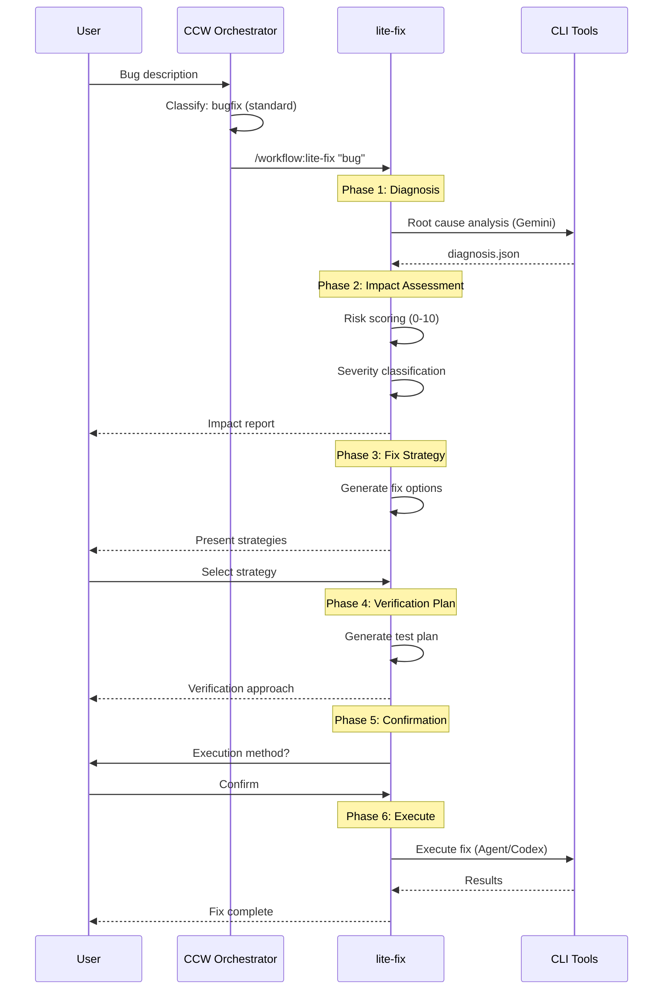
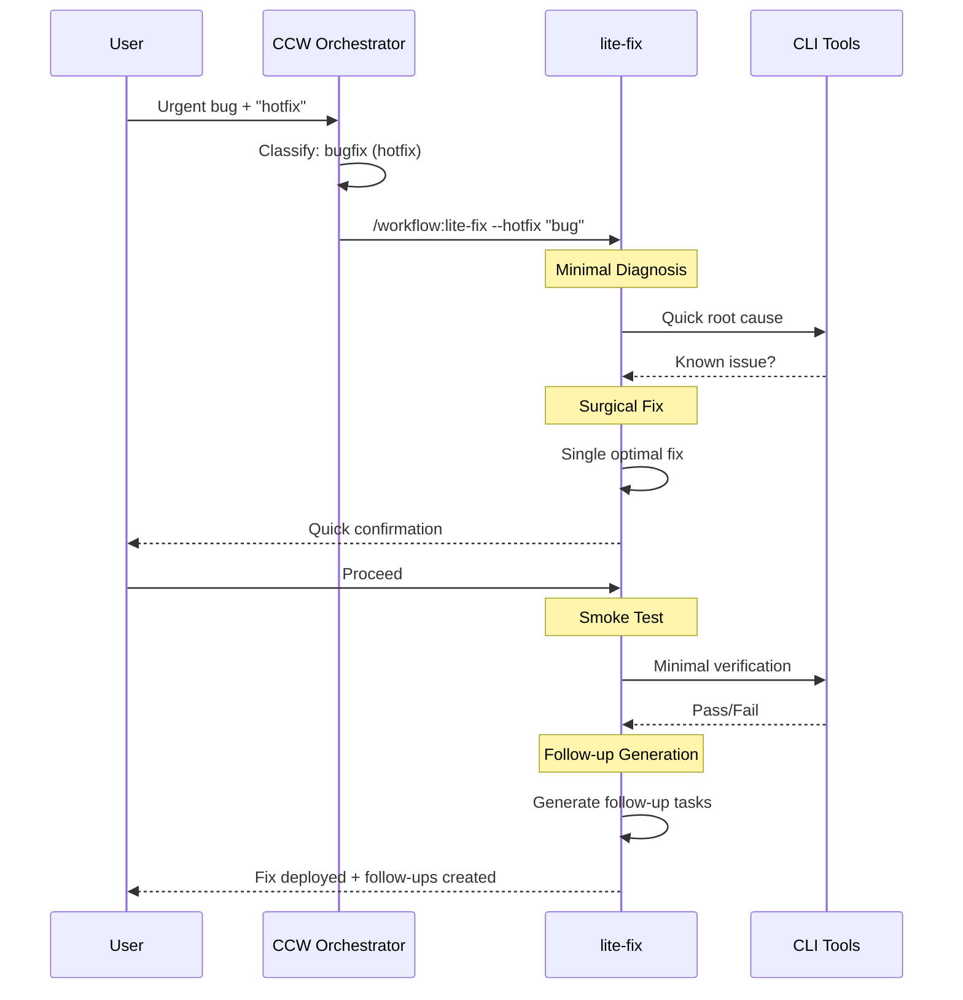

# Action: Bugfix Workflow

缺陷修复工作流：智能诊断 + 影响评估 + 修复

## Pattern

```
lite-fix [--hotfix]
```

## Trigger Conditions

- Keywords: "fix", "bug", "error", "crash", "broken", "fail", "修复", "报错"
- Problem symptoms described
- Error messages present

## Execution Flow

### Standard Mode



### Hotfix Mode



## When to Use

### Standard Mode (/workflow:lite-fix)
✅ **Use for**:
- 已知症状的 Bug
- 本地化修复（1-5 文件）
- 非紧急问题
- 需要完整诊断

### Hotfix Mode (/workflow:lite-fix --hotfix)
✅ **Use for**:
- 生产事故
- 紧急修复
- 明确的单点故障
- 时间敏感

❌ **Don't use** (for either mode):
- 需要架构变更 → `/workflow:plan --mode bugfix`
- 多个相关问题 → `/issue:plan`

## Severity Classification

| Score | Severity | Response | Verification |
|-------|----------|----------|--------------|
| 8-10 | Critical | Immediate | Smoke test only |
| 6-7.9 | High | Fast track | Integration tests |
| 4-5.9 | Medium | Normal | Full test suite |
| 0-3.9 | Low | Scheduled | Comprehensive |

## Configuration

```javascript
const bugfixConfig = {
  standard: {
    diagnosis: {
      tool: 'gemini',
      depth: 'comprehensive',
      timeout: 300000  // 5 min
    },
    impact: {
      riskThreshold: 6.0,  // High risk threshold
      autoEscalate: true
    },
    verification: {
      levels: ['smoke', 'integration', 'full'],
      autoSelect: true  // Based on severity
    }
  },
  
  hotfix: {
    diagnosis: {
      tool: 'gemini',
      depth: 'minimal',
      timeout: 60000  // 1 min
    },
    fix: {
      strategy: 'single',  // Single optimal fix
      surgical: true
    },
    followup: {
      generate: true,
      types: ['comprehensive-fix', 'post-mortem']
    }
  }
}
```

## Example Invocations

```bash
# Standard bug fix
ccw "用户头像上传失败，返回 413 错误"
→ lite-fix
→ Diagnosis: File size limit in nginx
→ Impact: 6.5 (High)
→ Fix: Update nginx config + add client validation
→ Verify: Integration test

# Production hotfix
ccw "紧急：支付网关返回 5xx 错误，影响所有用户"
→ lite-fix --hotfix
→ Quick diagnosis: API key expired
→ Surgical fix: Rotate key
→ Smoke test: Payment flow
→ Follow-ups: Key rotation automation, monitoring alert

# Unknown root cause
ccw "购物车随机丢失商品，原因不明"
→ lite-fix
→ Deep diagnosis (auto)
→ Root cause: Race condition in concurrent updates
→ Fix: Add optimistic locking
→ Verify: Concurrent test suite
```

## Output Artifacts

```
.workflow/.lite-fix/{bug-slug}-{timestamp}/
├── diagnosis.json       # Root cause analysis
├── impact.json          # Risk assessment
├── fix-plan.json        # Fix strategy
├── task.json            # Enhanced task for execution
└── followup.json        # Follow-up tasks (hotfix only)
```

## Follow-up Tasks (Hotfix Mode)

```json
{
  "followups": [
    {
      "id": "FOLLOWUP-001",
      "type": "comprehensive-fix",
      "title": "Complete fix for payment gateway issue",
      "due": "3 days",
      "description": "Implement full solution with proper error handling"
    },
    {
      "id": "FOLLOWUP-002",
      "type": "post-mortem",
      "title": "Post-mortem analysis",
      "due": "1 week",
      "description": "Document incident and prevention measures"
    }
  ]
}
```
