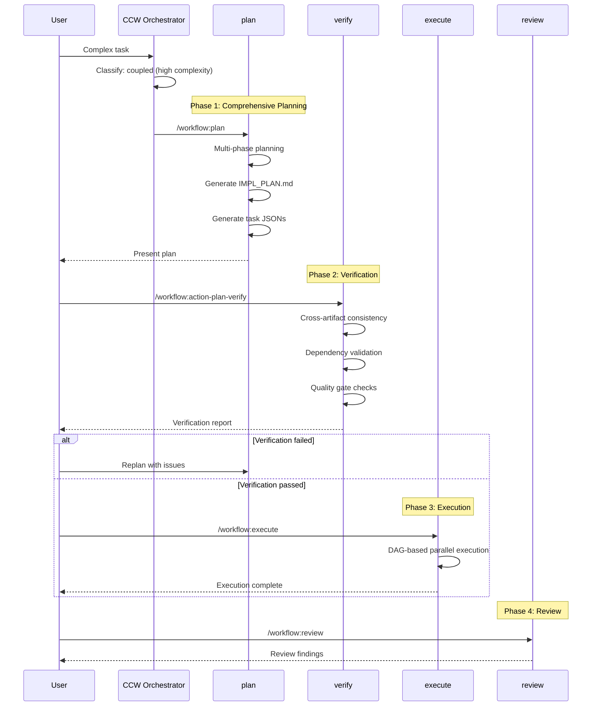

# Action: Coupled Workflow

复杂耦合工作流：完整规划 + 验证 + 执行

## Pattern

```
plan → action-plan-verify → execute
```

## Trigger Conditions

- Complexity: High
- Keywords: "refactor", "重构", "migrate", "迁移", "architect", "架构"
- Cross-module changes
- System-level modifications

## Execution Flow



## When to Use

✅ **Ideal scenarios**:
- 大规模重构
- 架构迁移
- 跨模块功能开发
- 技术栈升级
- 团队协作项目

❌ **Avoid when**:
- 简单的局部修改
- 时间紧迫
- 独立的小功能

## Verification Checks

| Check | Description | Severity |
|-------|-------------|----------|
| Dependency Cycles | 检测循环依赖 | Critical |
| Missing Tasks | 计划与实际不符 | High |
| File Conflicts | 多任务修改同文件 | Medium |
| Coverage Gaps | 未覆盖的需求 | Medium |

## Configuration

```javascript
const coupledConfig = {
  plan: {
    phases: 5,  // Full 5-phase planning
    taskGeneration: 'action-planning-agent',
    outputFormat: {
      implPlan: '.workflow/plans/IMPL_PLAN.md',
      taskJsons: '.workflow/tasks/IMPL-*.json'
    }
  },
  
  verify: {
    required: true,  // Always verify before execute
    autoReplan: false,  // Manual replan on failure
    qualityGates: ['no-cycles', 'no-conflicts', 'complete-coverage']
  },
  
  execute: {
    dagParallel: true,
    checkpointInterval: 3,  // Checkpoint every 3 tasks
    rollbackOnFailure: true
  },
  
  review: {
    types: ['architecture', 'security'],
    required: true
  }
}
```

## Task JSON Structure

```json
{
  "id": "IMPL-001",
  "title": "重构认证模块核心逻辑",
  "scope": "src/auth/**",
  "action": "refactor",
  "depends_on": [],
  "modification_points": [
    {
      "file": "src/auth/service.ts",
      "target": "AuthService",
      "change": "Extract OAuth2 logic"
    }
  ],
  "acceptance": [
    "所有现有测试通过",
    "OAuth2 流程可用"
  ]
}
```

## Example Invocations

```bash
# Architecture refactoring
ccw "重构整个认证模块，从 session 迁移到 JWT"
→ plan (5 phases)
→ verify
→ execute

# System migration
ccw "将数据库从 MySQL 迁移到 PostgreSQL"
→ plan (migration strategy)
→ verify (data integrity checks)
→ execute (staged migration)

# Cross-module feature
ccw "实现跨服务的分布式事务支持"
→ plan (architectural design)
→ verify (consistency checks)
→ execute (incremental rollout)
```

## Output Artifacts

```
.workflow/
├── plans/
│   └── IMPL_PLAN.md           # Comprehensive plan
├── tasks/
│   ├── IMPL-001.json
│   ├── IMPL-002.json
│   └── ...
├── verify/
│   └── verification-report.md  # Verification results
└── reviews/
    └── {review-type}.md        # Review findings
```

## Replan Flow

When verification fails:

```javascript
if (verificationResult.status === 'failed') {
  console.log(`
## Verification Failed

**Issues found**:
${verificationResult.issues.map(i => `- ${i.severity}: ${i.message}`).join('\n')}

**Options**:
1. /workflow:replan - Address issues and regenerate plan
2. /workflow:plan --force - Proceed despite issues (not recommended)
3. Review issues manually and fix plan files
`)
}
```
