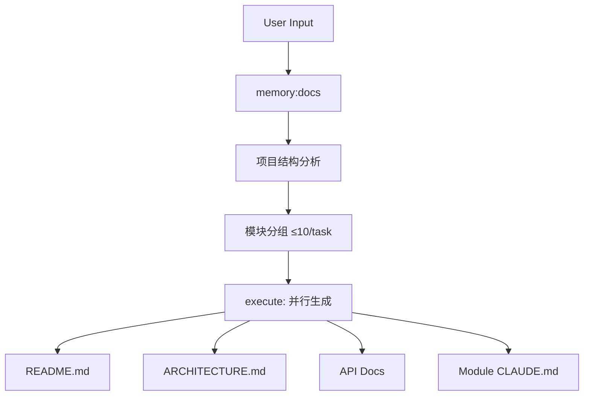
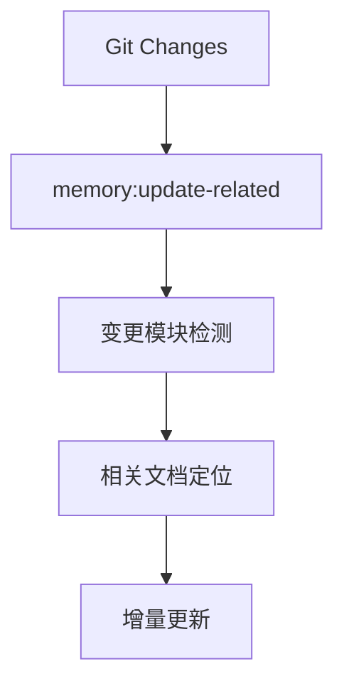

# Documentation Workflow Action

## Pattern
```
memory:docs → execute  (full)
memory:update-related  (incremental)
```

## Trigger Conditions

- 关键词: "文档", "documentation", "docs", "readme", "注释"
- 变体触发:
  - `incremental`: "更新", "增量", "相关"
  - `full`: "全部", "完整", "所有"

## Variants

### Full Documentation


### Incremental Update


## Configuration

| 参数 | 默认值 | 说明 |
|------|--------|------|
| batch_size | 4 | 每agent处理模块数 |
| format | markdown | 输出格式 |
| include_api | true | 生成API文档 |
| include_diagrams | true | 生成Mermaid图 |

## CLI Integration

| 阶段 | CLI Hint | 用途 |
|------|----------|------|
| memory:docs | `gemini --mode analysis` | 项目结构分析 |
| execute | `gemini --mode write` | 文档生成 |
| update-related | `gemini --mode write` | 增量更新 |

## Slash Commands

```bash
/memory:docs              # 规划全量文档生成
/memory:docs-full-cli     # CLI执行全量文档
/memory:docs-related-cli  # CLI执行增量文档
/memory:update-related    # 更新变更相关文档
/memory:update-full       # 更新所有CLAUDE.md
```

## Output Structure

```
project/
├── README.md              # 项目概览
├── ARCHITECTURE.md        # 架构文档
├── docs/
│   └── api/               # API文档
└── src/
    └── module/
        └── CLAUDE.md      # 模块文档
```

## When to Use

- 新项目初始化文档
- 大版本发布前文档更新
- 代码变更后同步文档
- API文档生成

## Risk Assessment

| 风险 | 缓解措施 |
|------|----------|
| 文档与代码不同步 | git hook集成 |
| 生成内容过于冗长 | batch_size控制 |
| 遗漏重要模块 | 全量扫描验证 |
