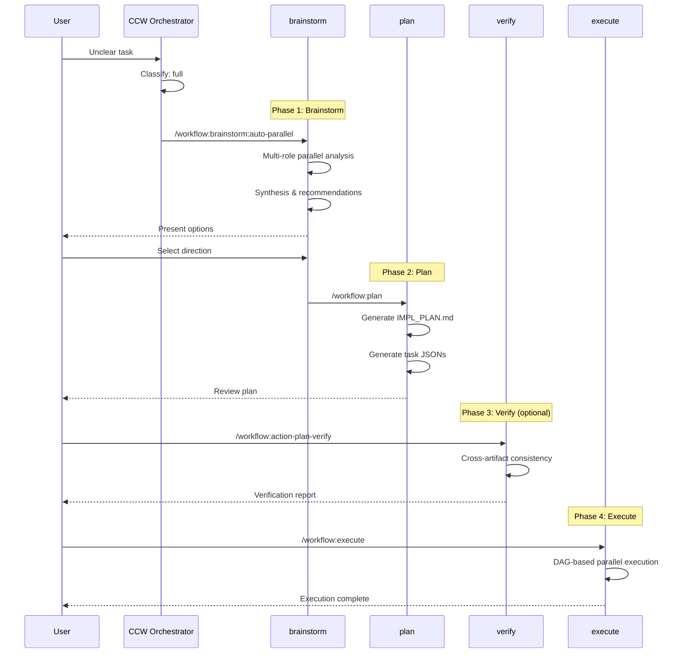

# Action: Full Workflow

完整探索工作流：分析 + 头脑风暴 + 规划 + 执行

## Pattern

```
brainstorm:auto-parallel → plan → [verify] → execute
```

## Trigger Conditions

- Intent: Exploration (uncertainty detected)
- Keywords: "不确定", "不知道", "explore", "怎么做", "what if"
- No clear implementation path

## Execution Flow



## When to Use

✅ **Ideal scenarios**:
- 产品方向探索
- 技术选型评估
- 架构设计决策
- 复杂功能规划
- 需要多角色视角

❌ **Avoid when**:
- 任务明确简单
- 时间紧迫
- 已有成熟方案

## Brainstorm Roles

| Role | Focus | Typical Questions |
|------|-------|-------------------|
| Product Manager | 用户价值、市场定位 | "用户痛点是什么？" |
| System Architect | 技术方案、架构设计 | "如何保证可扩展性？" |
| UX Expert | 用户体验、交互设计 | "用户流程是否顺畅？" |
| Security Expert | 安全风险、合规要求 | "有哪些安全隐患？" |
| Data Architect | 数据模型、存储方案 | "数据如何组织？" |

## Configuration

```javascript
const fullConfig = {
  brainstorm: {
    defaultRoles: ['product-manager', 'system-architect', 'ux-expert'],
    maxRoles: 5,
    synthesis: true  // Always generate synthesis
  },
  
  plan: {
    verifyBeforeExecute: true,  // Recommend verification
    taskFormat: 'json'  // Generate task JSONs
  },
  
  execute: {
    dagParallel: true,  // DAG-based parallel execution
    testGeneration: 'optional'  // Suggest test-gen after
  }
}
```

## Continuation Points

After each phase, CCW can continue to the next:

```javascript
// After brainstorm completes
console.log(`
## Brainstorm Complete

**Next steps**:
1. /workflow:plan "基于头脑风暴结果规划实施"
2. Or refine: /workflow:brainstorm:synthesis
`)

// After plan completes
console.log(`
## Plan Complete

**Next steps**:
1. /workflow:action-plan-verify (recommended)
2. /workflow:execute (直接执行)
`)
```

## Example Invocations

```bash
# Product exploration
ccw "我想做一个团队协作工具，但不确定具体方向"
→ brainstorm:auto-parallel (5 roles)
→ plan
→ execute

# Technical exploration
ccw "如何设计一个高可用的消息队列系统？"
→ brainstorm:auto-parallel (system-architect, data-architect)
→ plan
→ verify
→ execute
```

## Output Artifacts

```
.workflow/
├── brainstorm/
│   ├── {session}/
│   │   ├── role-{role}.md
│   │   └── synthesis.md
├── plans/
│   └── IMPL_PLAN.md
└── tasks/
    └── IMPL-*.json
```
