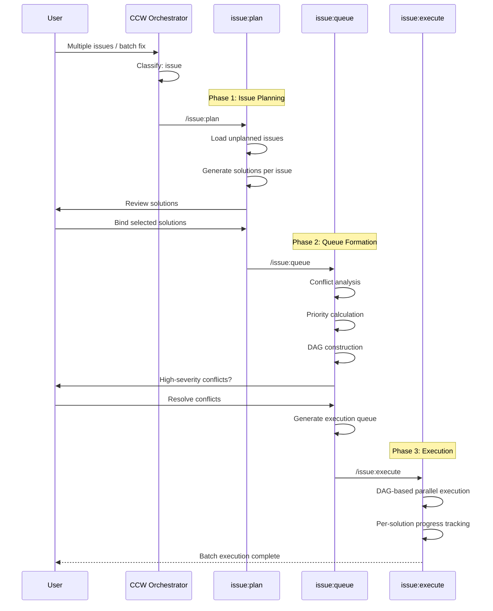

# Action: Issue Workflow

Issue 批量处理工作流：规划 + 队列 + 批量执行

## Pattern

```
issue:plan → issue:queue → issue:execute
```

## Trigger Conditions

- Keywords: "issues", "batch", "queue", "多个", "批量"
- Multiple related problems
- Long-running fix campaigns
- Priority-based processing needed

## Execution Flow



## When to Use

✅ **Ideal scenarios**:
- 多个相关 Bug 需要批量修复
- GitHub Issues 批量处理
- 技术债务清理
- 安全漏洞批量修复
- 代码质量改进活动

❌ **Avoid when**:
- 单一问题 → `/workflow:lite-fix`
- 独立不相关的任务 → 分别处理
- 紧急生产问题 → `/workflow:lite-fix --hotfix`

## Issue Lifecycle

```
draft → planned → queued → executing → completed
         ↓           ↓
      skipped    on-hold
```

## Conflict Types

| Type | Description | Resolution |
|------|-------------|------------|
| File | 多个解决方案修改同一文件 | Sequential execution |
| API | API 签名变更影响 | Dependency ordering |
| Data | 数据结构变更冲突 | User decision |
| Dependency | 包依赖冲突 | Version negotiation |
| Architecture | 架构方向冲突 | User decision (high severity) |

## Configuration

```javascript
const issueConfig = {
  plan: {
    solutionsPerIssue: 3,  // Generate up to 3 solutions
    autoSelect: false,  // User must bind solution
    planningAgent: 'issue-plan-agent'
  },
  
  queue: {
    conflictAnalysis: true,
    priorityCalculation: true,
    clarifyThreshold: 'high',  // Ask user for high-severity conflicts
    queueAgent: 'issue-queue-agent'
  },
  
  execute: {
    dagParallel: true,
    executionLevel: 'solution',  // Execute by solution, not task
    executor: 'codex',
    resumable: true
  }
}
```

## Example Invocations

```bash
# From GitHub Issues
ccw "批量处理所有 label:bug 的 GitHub Issues"
→ issue:new (import from GitHub)
→ issue:plan (generate solutions)
→ issue:queue (form execution queue)
→ issue:execute (batch execute)

# Tech debt cleanup
ccw "处理所有 TODO 注释和已知技术债务"
→ issue:discover (find issues)
→ issue:plan (plan solutions)
→ issue:queue (prioritize)
→ issue:execute (execute)

# Security vulnerabilities
ccw "修复所有 npm audit 报告的安全漏洞"
→ issue:new (from audit report)
→ issue:plan (upgrade strategies)
→ issue:queue (conflict resolution)
→ issue:execute (staged upgrades)
```

## Queue Structure

```json
{
  "queue_id": "QUE-20251227-143000",
  "status": "active",
  "execution_groups": [
    {
      "id": "P1",
      "type": "parallel",
      "solutions": ["SOL-ISS-001-1", "SOL-ISS-002-1"],
      "description": "Independent fixes, no file overlap"
    },
    {
      "id": "S1",
      "type": "sequential",
      "solutions": ["SOL-ISS-003-1"],
      "depends_on": ["P1"],
      "description": "Depends on P1 completion"
    }
  ]
}
```

## Output Artifacts

```
.workflow/issues/
├── issues.jsonl              # All issues (one per line)
├── solutions/
│   ├── ISS-001.jsonl         # Solutions for ISS-001
│   └── ISS-002.jsonl
├── queues/
│   ├── index.json            # Queue index
│   └── QUE-xxx.json          # Queue details
└── execution/
    └── {queue-id}/
        ├── progress.json
        └── results/
```

## Progress Tracking

```javascript
// Real-time progress during execution
const progress = {
  queue_id: "QUE-xxx",
  total_solutions: 5,
  completed: 2,
  in_progress: 1,
  pending: 2,
  current_group: "P1",
  eta: "15 minutes"
}
```

## Resume Capability

```bash
# If execution interrupted
ccw "继续执行 issue 队列"
→ Detects active queue: QUE-xxx
→ Resumes from last checkpoint
→ /issue:execute --resume
```
