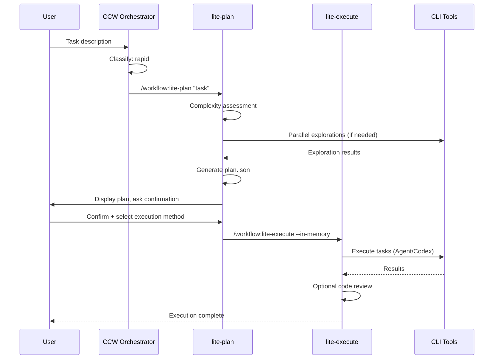

# Action: Rapid Workflow

快速迭代工作流组合：多模型协作分析 + 直接执行

## Pattern

```
lite-plan → lite-execute
```

## Trigger Conditions

- Complexity: Low to Medium
- Intent: Feature development
- Context: Clear requirements, known implementation path
- No uncertainty keywords

## Execution Flow



## When to Use

✅ **Ideal scenarios**:
- 添加单一功能（如用户头像上传）
- 修改现有功能（如更新表单验证）
- 小型重构（如抽取公共方法）
- 添加测试用例
- 文档更新

❌ **Avoid when**:
- 不确定实现方案
- 跨多个模块
- 需要架构决策
- 有复杂依赖关系

## Configuration

```javascript
const rapidConfig = {
  explorationThreshold: {
    // Force exploration if task mentions specific files
    forceExplore: /\b(file|文件|module|模块|class|类)\s*[:：]?\s*\w+/i,
    // Skip exploration for simple tasks
    skipExplore: /\b(add|添加|create|创建)\s+(comment|注释|log|日志)/i
  },
  
  defaultExecution: 'Agent',  // Agent for low complexity
  
  codeReview: {
    default: 'Skip',  // Skip review for simple tasks
    threshold: 'medium'  // Enable for medium+ complexity
  }
}
```

## Example Invocations

```bash
# Simple feature
ccw "添加用户退出登录按钮"
→ lite-plan → lite-execute (Agent)

# With exploration
ccw "优化 AuthService 的 token 刷新逻辑"
→ lite-plan -e → lite-execute (Agent, Gemini review)

# Medium complexity
ccw "实现用户偏好设置的本地存储"
→ lite-plan -e → lite-execute (Codex)
```

## Output Artifacts

```
.workflow/.lite-plan/{task-slug}-{date}/
├── exploration-*.json      # If exploration was triggered
├── explorations-manifest.json
└── plan.json               # Implementation plan
```
