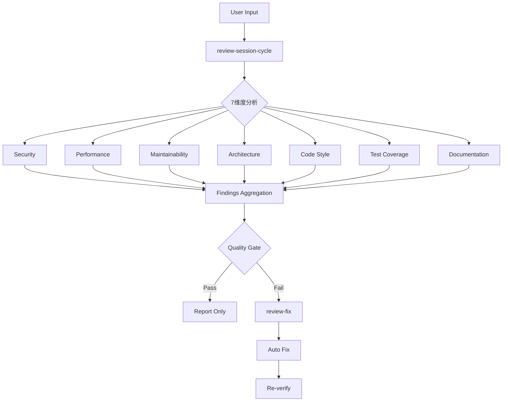

# Review-Fix Workflow Action

## Pattern
```
review-session-cycle → review-fix
```

## Trigger Conditions

- 关键词: "review", "审查", "检查代码", "code review", "质量检查"
- 场景: PR审查、代码质量提升、安全审计

## Execution Flow



## Configuration

| 参数 | 默认值 | 说明 |
|------|--------|------|
| dimensions | all | 审查维度(security,performance,etc.) |
| quality_gate | 80 | 质量门槛分数 |
| auto_fix | true | 自动修复发现的问题 |
| severity_threshold | medium | 最低关注级别 |

## CLI Integration

| 阶段 | CLI Hint | 用途 |
|------|----------|------|
| review-session-cycle | `gemini --mode analysis` | 多维度深度分析 |
| review-fix | `codex --mode write` | 自动修复问题 |

## Slash Commands

```bash
/workflow:review-session-cycle  # 会话级代码审查
/workflow:review-module-cycle   # 模块级代码审查
/workflow:review-fix            # 自动修复审查发现
/workflow:review --type security  # 专项安全审查
```

## Review Dimensions

| 维度 | 检查点 |
|------|--------|
| Security | 注入、XSS、敏感数据暴露 |
| Performance | N+1查询、内存泄漏、算法复杂度 |
| Maintainability | 代码重复、复杂度、命名 |
| Architecture | 依赖方向、层级违规、耦合度 |
| Code Style | 格式、约定、一致性 |
| Test Coverage | 覆盖率、边界用例 |
| Documentation | 注释、API文档、README |

## When to Use

- PR合并前审查
- 重构后质量验证
- 安全合规审计
- 技术债务评估

## Risk Assessment

| 风险 | 缓解措施 |
|------|----------|
| 误报过多 | severity_threshold过滤 |
| 修复引入新问题 | re-verify循环 |
| 审查不全面 | 7维度覆盖 |
