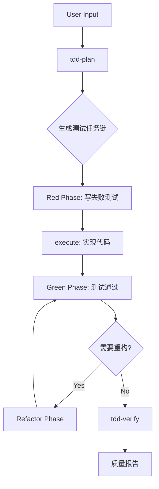

# TDD Workflow Action

## Pattern
```
tdd-plan → execute → tdd-verify
```

## Trigger Conditions

- 关键词: "tdd", "test-driven", "测试驱动", "先写测试", "red-green"
- 场景: 需要高质量代码保证、关键业务逻辑、回归风险高

## Execution Flow



## Configuration

| 参数 | 默认值 | 说明 |
|------|--------|------|
| coverage_target | 80% | 目标覆盖率 |
| cycle_limit | 10 | 最大Red-Green-Refactor循环 |
| strict_mode | false | 严格模式(必须先红后绿) |

## CLI Integration

| 阶段 | CLI Hint | 用途 |
|------|----------|------|
| tdd-plan | `gemini --mode analysis` | 分析测试策略 |
| execute | `codex --mode write` | 实现代码 |
| tdd-verify | `gemini --mode analysis` | 验证TDD合规性 |

## Slash Commands

```bash
/workflow:tdd-plan          # 生成TDD任务链
/workflow:execute           # 执行Red-Green-Refactor
/workflow:tdd-verify        # 验证TDD合规性+覆盖率
```

## When to Use

- 核心业务逻辑开发
- 需要高测试覆盖率的模块
- 重构现有代码时确保不破坏功能
- 团队要求TDD实践

## Risk Assessment

| 风险 | 缓解措施 |
|------|----------|
| 测试粒度不当 | tdd-plan阶段评估测试边界 |
| 过度测试 | 聚焦行为而非实现 |
| 循环过多 | cycle_limit限制 |
