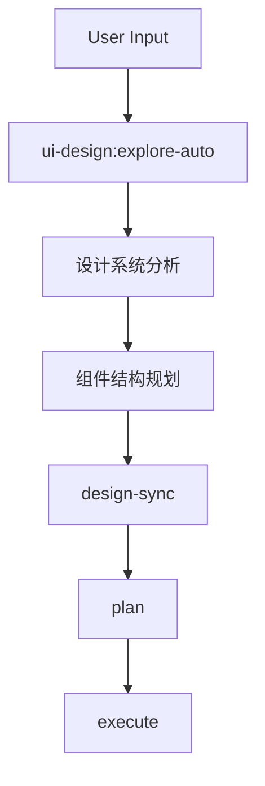
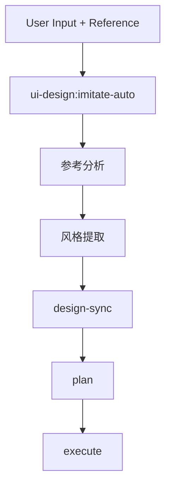

# UI Design Workflow Action

## Pattern
```
ui-design:[explore|imitate]-auto → design-sync → plan → execute
```

## Trigger Conditions

- 关键词: "ui", "界面", "design", "组件", "样式", "布局", "前端"
- 变体触发:
  - `imitate`: "参考", "模仿", "像", "类似"
  - `explore`: 无特定参考时默认

## Variants

### Explore (探索式设计)


### Imitate (参考式设计)


## Configuration

| 参数 | 默认值 | 说明 |
|------|--------|------|
| design_system | auto | 设计系统(auto/tailwind/mui/custom) |
| responsive | true | 响应式设计 |
| accessibility | true | 无障碍支持 |

## CLI Integration

| 阶段 | CLI Hint | 用途 |
|------|----------|------|
| explore/imitate | `gemini --mode analysis` | 设计分析、风格提取 |
| design-sync | - | 设计决策与代码库同步 |
| plan | - | 内置规划 |
| execute | `codex --mode write` | 组件实现 |

## Slash Commands

```bash
/workflow:ui-design:explore-auto   # 探索式UI设计
/workflow:ui-design:imitate-auto   # 参考式UI设计
/workflow:ui-design:design-sync    # 设计与代码同步（关键步骤）
/workflow:ui-design:style-extract  # 提取现有样式
/workflow:ui-design:codify-style   # 样式代码化
```

## When to Use

- 新页面/组件开发
- UI重构或现代化
- 设计系统建立
- 参考其他产品设计

## Risk Assessment

| 风险 | 缓解措施 |
|------|----------|
| 设计不一致 | style-extract确保复用 |
| 响应式问题 | 多断点验证 |
| 可访问性缺失 | a11y检查集成 |
