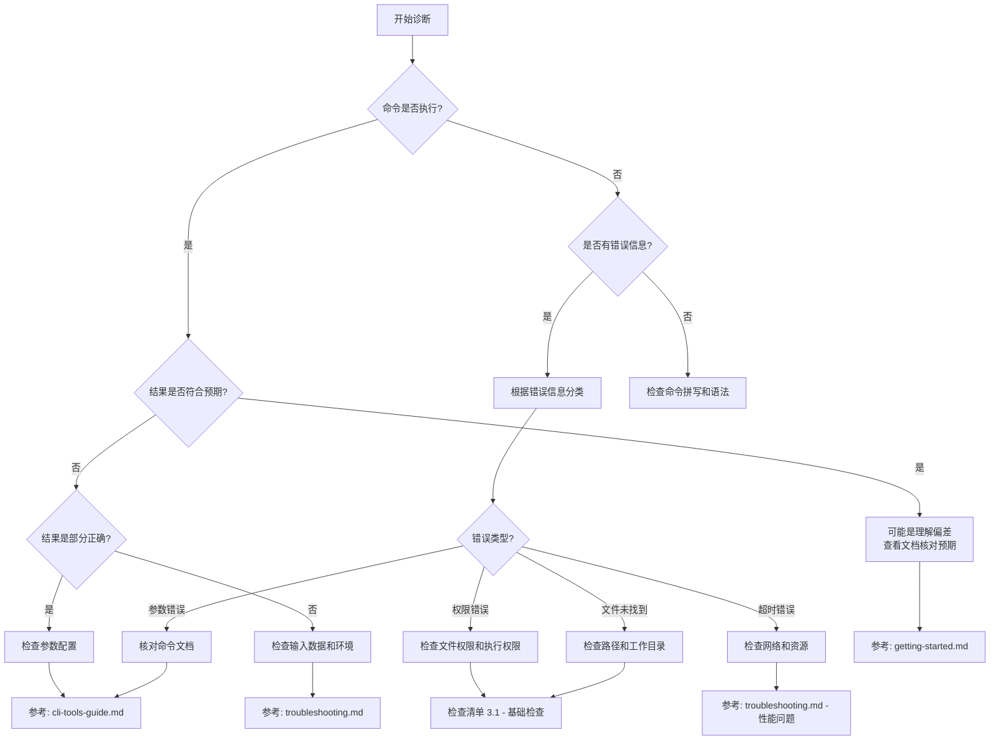

# 交互式诊断模板

> 本模板通过结构化的问题引导，帮助您快速定位问题根源。请按顺序完成各个部分。

## 📋 第一步：问题分类

<!-- 选择最符合您情况的问题类型（可多选） -->

- [ ] 命令执行失败或报错
- [ ] 命令执行成功但结果不符合预期
- [ ] 不知道该使用哪个命令
- [ ] 配置或环境问题
- [ ] 工作流程问题
- [ ] 性能或超时问题
- [ ] 其他: __________

## 📜 第二步：完整执行流程记录

> **关键**: 详细记录您的完整操作历史，这是快速定位问题的基础

### 2.1 执行环境

```bash
# 当前工作目录
pwd

# 相关环境变量（如适用）
echo $CLAUDE_WORKFLOW_SESSION
echo $PROJECT_ROOT
```

**工作目录**: <!-- 填写您的工作目录路径 -->
**相关环境变量**: <!-- 如有，请填写 -->

### 2.2 完整命令历史

<!-- 请按时间顺序列出您执行的所有相关命令 -->
<!-- ⚠️ 隐私提示: 请删除或替换敏感信息，如：API密钥、密码、真实路径、用户名等 -->

```bash
# 命令 1 - [简短描述此命令的目的]
# 示例: /workflow:plan --agent "implement user authentication"

# 输出/结果:
# [请粘贴输出，注意删除敏感信息]

# 命令 2 - [简短描述此命令的目的]


# 输出/结果:


# 命令 3 - [简短描述此命令的目的]


# 输出/结果:

```

**隐私保护指南**:
- ✅ 可以包含: 命令名称、参数结构、错误代码
- ❌ 应该移除: API密钥、密码、真实文件路径、个人身份信息
- 💡 替换示例:
  - `/real/path/project` → `/path/to/project`
  - `user@email.com` → `user@example.com`
  - `sk-abc123xyz` → `sk-***`

### 2.3 相关文件状态

<!-- 如果问题涉及特定文件，请说明文件状态 -->

- **涉及的文件路径**:
- **文件是否存在**: [ ] 是 / [ ] 否
- **文件权限**: <!-- 如果相关 -->
- **最近修改时间**: <!-- 如果相关 -->

## 🔍 第三步：交互式问题定位

### 3.1 命令执行问题诊断

<!-- 如果您的问题涉及命令执行，请完成此检查清单 -->

#### 基础检查
- [ ] 命令名称拼写正确
- [ ] 所有必需参数都已提供
- [ ] 参数格式符合文档要求
- [ ] 路径使用正确的格式（Windows/Linux）
- [ ] 具有执行命令所需的权限

#### 环境检查
- [ ] 在正确的目录下执行命令
- [ ] 相关依赖工具已安装（如 git, node, gemini, codex）
- [ ] 环境变量配置正确
- [ ] 没有其他进程占用相关资源

#### 上下文检查
- [ ] Workflow session 状态正常（如适用）
- [ ] 相关配置文件存在且格式正确
- [ ] 前置步骤已完成
- [ ] 没有冲突的并发操作

### 3.2 结果不符预期诊断

<!-- 如果命令执行成功但结果不对，请回答以下问题 -->

**期望结果**: <!-- 详细描述您期望看到什么 -->

**实际结果**: <!-- 详细描述实际发生了什么 -->

**差异分析**:
- [ ] 结果格式不同
- [ ] 内容缺失或多余
- [ ] 数据内容错误
- [ ] 文件生成位置错误
- [ ] 其他: __________

**可能原因**:
- [ ] 对命令功能的理解有误
- [ ] 参数配置不当
- [ ] 输入数据格式问题
- [ ] 工作流状态不匹配
- [ ] 其他: __________

### 3.3 使用方法不确定诊断

<!-- 如果您不确定应该使用什么命令或如何使用，请回答 -->

**您想要实现的目标**: <!-- 用一句话描述 -->

**您已经查看的文档**:
- [ ] getting-started.md
- [ ] workflow-patterns.md
- [ ] cli-tools-guide.md
- [ ] 特定命令文档: __________
- [ ] 其他: __________

**您已经尝试的方法**:
1.
2.
3.

**具体的困惑点**:
- [ ] 不知道用哪个命令
- [ ] 不理解参数含义
- [ ] 不清楚执行顺序
- [ ] 不知道如何组合使用
- [ ] 其他: __________

## 🔄 第四步：决策树导航



**根据决策树，您的问题可能属于**: <!-- 填写决策树的最终节点 -->

## 💡 第五步：自助解决尝试

<!-- 根据上述诊断结果，尝试以下解决方案 -->

### 已尝试的解决方案

#### 尝试 1:
- **方案**: <!-- 描述您尝试的解决方案 -->
- **结果**: [ ] 成功 / [ ] 失败 / [ ] 部分成功
- **详细说明**: <!-- 详细说明结果 -->

#### 尝试 2:
- **方案**:
- **结果**: [ ] 成功 / [ ] 失败 / [ ] 部分成功
- **详细说明**:

#### 尝试 3:
- **方案**:
- **结果**: [ ] 成功 / [ ] 失败 / [ ] 部分成功
- **详细说明**:

## 📞 第六步：寻求帮助

<!-- 如果自助解决未成功，请完成此部分以便他人协助 -->

### 核心问题总结

<!-- 基于以上所有信息，用 1-2 句话总结您的核心问题 -->

### 卡住的具体环节

<!-- 在整个流程中，您具体卡在哪一步？ -->

### 最重要的疑问

<!-- 如果只能问一个问题，您最想知道什么？ -->

### 紧急程度

- [ ] 紧急 - 阻碍关键工作进展
- [ ] 重要 - 影响工作效率但有临时方案
- [ ] 一般 - 希望改进但不紧急

## 📎 附加信息

### 系统信息

- **操作系统**: Windows / Mac / Linux
- **OS 版本**:
- **Claude Code 版本**:
- **相关工具版本**:
  - Git:
  - Node:
  - Gemini CLI:
  - Codex:
  - 其他:

### 相关文件

<!-- 如果有相关的配置文件、日志文件或错误截图，请说明 -->

- [ ] 命令输出日志
- [ ] 配置文件内容
- [ ] 错误截图
- [ ] Workflow session 文件
- [ ] 其他: __________

### 参考链接

<!-- 相关的 issue、文档链接或其他参考资料 -->

---

## ✅ 提交前检查清单

提交此诊断前，请确认：

- [ ] 已完整填写"完整执行流程记录"（第二步）
- [ ] 已完成至少一个诊断清单（第三步）
- [ ] 已尝试至少 2 种解决方案（第五步）
- [ ] 已清晰总结核心问题（第六步）
- [ ] 已附加必要的系统信息和日志

---

**诊断日期**: <!-- 自动填充 -->
**提交人**: <!-- 自动填充 -->
