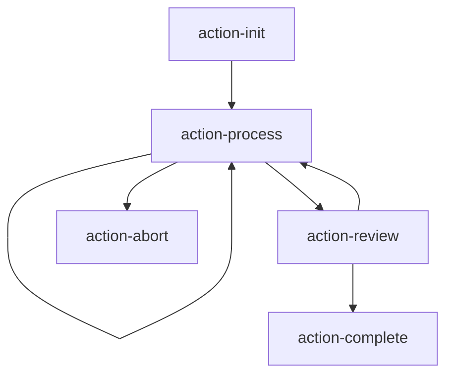

# Execution Modes Specification

两种 Skill 执行模式的详细规范定义。

---

## 模式概览

| 特性 | Sequential (顺序) | Autonomous (自主) |
|------|-------------------|-------------------|
| 执行顺序 | 固定（数字前缀） | 动态（编排器决策） |
| 阶段依赖 | 强依赖 | 弱依赖/无依赖 |
| 状态管理 | 隐式（阶段产出） | 显式（状态文件） |
| 适用场景 | 流水线任务 | 交互式任务 |
| 复杂度 | 低 | 中-高 |
| 可扩展性 | 插入子阶段 | 添加新动作 |

---

## Mode 1: Sequential (顺序模式)

### 定义

阶段按固定顺序线性执行，每个阶段的输出作为下一阶段的输入。

### 目录结构

```
phases/
├── 01-{first-step}.md
├── 02-{second-step}.md
├── 02.5-{sub-step}.md      # 可选：子阶段
├── 03-{third-step}.md
└── ...
```

### 执行流程

```
┌─────────┐     ┌─────────┐     ┌─────────┐
│Phase 01 │────▶│Phase 02 │────▶│Phase 03 │────▶ ...
└─────────┘     └─────────┘     └─────────┘
     │               │               │
     ▼               ▼               ▼
  output1.json   output2.md      output3.md
```

### Phase 文件规范

```markdown
# Phase N: {阶段名称}

{一句话描述}

## Objective

{详细目标}

## Input

- 依赖: {上一阶段产出}
- 配置: {配置文件}

## Execution Steps

### Step 1: {步骤}
{执行代码或说明}

### Step 2: {步骤}
{执行代码或说明}

## Output

- **File**: `{输出文件}`
- **Format**: {JSON/Markdown}

## Next Phase

→ [Phase N+1: xxx](0N+1-xxx.md)
```

### 适用场景

- **文档生成**: 收集 → 分析 → 组装 → 优化
- **代码分析**: 扫描 → 解析 → 报告
- **数据处理**: 提取 → 转换 → 加载

### 优点

- 逻辑清晰，易于理解
- 调试简单，可逐阶段验证
- 输出可预测

### 缺点

- 灵活性低
- 难以处理分支逻辑
- 用户交互受限

---

## Mode 2: Autonomous (自主模式)

### 定义

无固定执行顺序，由编排器 (Orchestrator) 根据当前状态动态选择下一个动作。

### 目录结构

```
phases/
├── orchestrator.md          # 编排器：核心决策逻辑
├── state-schema.md          # 状态结构定义
└── actions/                 # 独立动作（无顺序）
    ├── action-{a}.md
    ├── action-{b}.md
    ├── action-{c}.md
    └── ...
```

### 核心组件

#### 1. Orchestrator (编排器)

```markdown
# Orchestrator

## Role

根据当前状态选择并执行下一个动作。

## State Reading

读取状态文件: `{workDir}/state.json`

## Decision Logic

```javascript
function selectNextAction(state) {
  // 1. 检查终止条件
  if (state.status === 'completed') return null;
  if (state.error_count > MAX_RETRIES) return 'action-abort';
  
  // 2. 根据状态选择动作
  if (!state.initialized) return 'action-init';
  if (state.pending_items.length > 0) return 'action-process';
  if (state.needs_review) return 'action-review';
  
  // 3. 默认动作
  return 'action-complete';
}
```

## Execution Loop

```
while (true) {
  state = readState();
  action = selectNextAction(state);
  if (!action) break;
  
  result = executeAction(action, state);
  updateState(result);
}
```
```

#### 2. State Schema (状态结构)

```markdown
# State Schema

## 状态文件

位置: `{workDir}/state.json`

## 结构定义

```typescript
interface SkillState {
  // 元信息
  skill_name: string;
  started_at: string;
  updated_at: string;
  
  // 执行状态
  status: 'pending' | 'running' | 'completed' | 'failed';
  current_action: string | null;
  completed_actions: string[];
  
  // 业务数据
  context: Record<string, any>;
  pending_items: any[];
  results: Record<string, any>;
  
  // 错误追踪
  errors: Array<{
    action: string;
    message: string;
    timestamp: string;
  }>;
  error_count: number;
}
```

## 初始状态

```json
{
  "skill_name": "{skill-name}",
  "started_at": "{ISO8601}",
  "updated_at": "{ISO8601}",
  "status": "pending",
  "current_action": null,
  "completed_actions": [],
  "context": {},
  "pending_items": [],
  "results": {},
  "errors": [],
  "error_count": 0
}
```
```

#### 3. Action (动作)

```markdown
# Action: {action-name}

## Purpose

{动作目的}

## Preconditions

- [ ] 条件1
- [ ] 条件2

## Execution

{执行逻辑}

## State Updates

```javascript
return {
  completed_actions: [...state.completed_actions, 'action-name'],
  results: {
    ...state.results,
    action_name: { /* 结果 */ }
  },
  // 其他状态更新
};
```

## Next Actions (Hints)

- 成功时: `action-{next}`
- 失败时: `action-retry` 或 `action-abort`
```

### 执行流程

```
┌─────────────────────────────────────────────────────────────────┐
│                      Orchestrator Loop                           │
│  ┌─────────────────────────────────────────────────────────┐    │
│  │                                                          │    │
│  │   ┌──────────┐     ┌──────────┐     ┌──────────┐        │    │
│  │   │ Read     │────▶│ Select   │────▶│ Execute  │        │    │
│  │   │ State    │     │ Action   │     │ Action   │        │    │
│  │   └──────────┘     └──────────┘     └──────────┘        │    │
│  │        ▲                                  │              │    │
│  │        │                                  ▼              │    │
│  │        │           ┌──────────┐                         │    │
│  │        └───────────│ Update   │◀────────────────────────┘    │
│  │                    │ State    │                              │
│  │                    └──────────┘                              │
│  │                                                          │    │
│  └─────────────────────────────────────────────────────────┘    │
│                              │                                   │
│                              ▼                                   │
│                    ┌──────────────────┐                         │
│                    │ Termination?     │                         │
│                    │ - completed      │                         │
│                    │ - max_retries    │                         │
│                    │ - user_abort     │                         │
│                    └──────────────────┘                         │
└─────────────────────────────────────────────────────────────────┘
```

### 动作目录 (Action Catalog)

在 `specs/action-catalog.md` 中定义：

```markdown
# Action Catalog

## Available Actions

| Action | Purpose | Preconditions | Effects |
|--------|---------|---------------|---------|
| action-init | 初始化状态 | status=pending | status=running |
| action-process | 处理待办项 | pending_items.length>0 | pending_items-- |
| action-review | 用户审核 | needs_review=true | needs_review=false |
| action-complete | 完成任务 | pending_items.length=0 | status=completed |
| action-abort | 中止任务 | error_count>MAX | status=failed |

## Action Dependencies Graph


```

### 适用场景

- **交互式任务**: 问答、对话、表单填写
- **状态机任务**: Issue 管理、工作流审批
- **探索式任务**: 调试、诊断、搜索

### 优点

- 高度灵活，适应动态需求
- 支持复杂分支逻辑
- 易于扩展新动作

### 缺点

- 复杂度高
- 状态管理开销
- 调试难度大

---

## 模式选择指南

### 决策流程

```
用户需求分析
     │
     ▼
┌────────────────────────────┐
│ 阶段间是否有强依赖关系？     │
└────────────────────────────┘
     │
     ├── 是 → Sequential
     │
     └── 否 → 继续判断
              │
              ▼
     ┌────────────────────────────┐
     │ 是否需要动态响应用户意图？   │
     └────────────────────────────┘
              │
              ├── 是 → Autonomous
              │
              └── 否 → Sequential
```

### 快速判断表

| 问题 | Sequential | Autonomous |
|------|------------|------------|
| 输出结构是否固定？ | ✓ | ✗ |
| 是否需要用户多轮交互？ | ✗ | ✓ |
| 阶段是否可以跳过/重复？ | ✗ | ✓ |
| 是否有复杂分支逻辑？ | ✗ | ✓ |
| 调试是否需要简单？ | ✓ | ✗ |

---

## 混合模式

某些复杂 Skill 可能需要混合使用两种模式：

```
phases/
├── 01-init.md                 # Sequential: 初始化
├── 02-orchestrator.md         # Autonomous: 核心交互循环
│   └── actions/
│       ├── action-a.md
│       └── action-b.md
└── 03-finalize.md             # Sequential: 收尾
```

**适用场景**:
- 初始化和收尾固定，中间交互灵活
- 多阶段任务，某阶段需要动态决策
