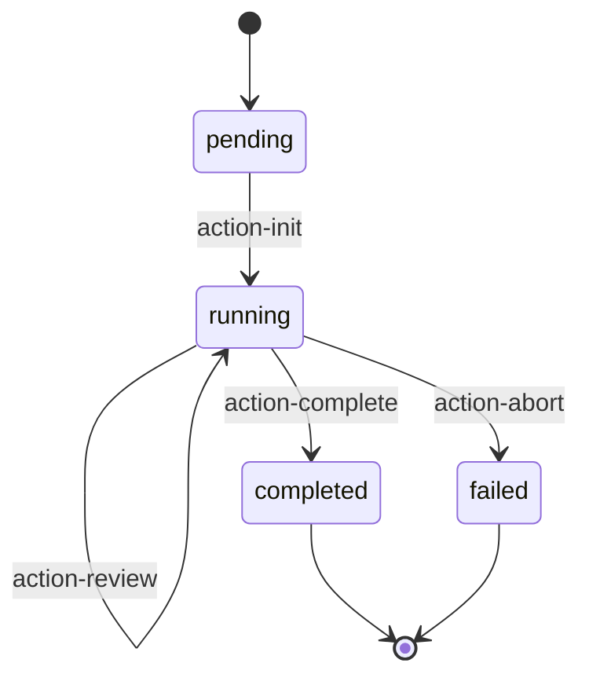

# Autonomous Orchestrator Template

自主模式编排器的模板。

## Purpose

生成 Autonomous 执行模式的 Orchestrator 文件，负责状态驱动的动作选择和执行循环。

## Usage Context

| Phase | Usage |
|-------|-------|
| Phase 3 (Phase Generation) | `config.execution_mode === 'autonomous'` 时生成 |
| Generation Trigger | 创建编排器逻辑，管理动作选择和状态更新 |
| Output Location | `.claude/skills/{skill-name}/phases/orchestrator.md` |

---

## ⚠️ 重要提示

> **Phase 0 是强制前置阶段**：在 Orchestrator 启动执行循环之前，必须先完成 Phase 0 的规范研读。
>
> 生成 Orchestrator 时，需要确保：
> 1. SKILL.md 中已包含 Phase 0 规范研读步骤
> 2. Orchestrator 启动前验证规范已阅读
> 3. 所有 Action 文件都引用相关的规范文档
> 4. Architecture Overview 中 Phase 0 位于 Orchestrator 之前

## 模板结构

```markdown
# Orchestrator

## Role

根据当前状态选择并执行下一个动作。

## State Management

### 读取状态

\`\`\`javascript
const state = JSON.parse(Read(`${workDir}/state.json`));
\`\`\`

### 更新状态

\`\`\`javascript
function updateState(updates) {
  const state = JSON.parse(Read(`${workDir}/state.json`));
  const newState = {
    ...state,
    ...updates,
    updated_at: new Date().toISOString()
  };
  Write(`${workDir}/state.json`, JSON.stringify(newState, null, 2));
  return newState;
}
\`\`\`

## Decision Logic

\`\`\`javascript
function selectNextAction(state) {
  // 1. 终止条件检查
  {{termination_checks}}
  
  // 2. 错误限制检查
  if (state.error_count >= 3) {
    return 'action-abort';
  }
  
  // 3. 动作选择逻辑
  {{action_selection_logic}}
  
  // 4. 默认完成
  return 'action-complete';
}
\`\`\`

## Execution Loop

\`\`\`javascript
async function runOrchestrator() {
  console.log('=== Orchestrator Started ===');
  
  let iteration = 0;
  const MAX_ITERATIONS = 100;
  
  while (iteration < MAX_ITERATIONS) {
    iteration++;
    
    // 1. 读取当前状态
    const state = JSON.parse(Read(`${workDir}/state.json`));
    console.log(`[Iteration ${iteration}] Status: ${state.status}`);
    
    // 2. 选择下一个动作
    const actionId = selectNextAction(state);
    
    if (!actionId) {
      console.log('No action selected, terminating.');
      break;
    }
    
    console.log(`[Iteration ${iteration}] Executing: ${actionId}`);
    
    // 3. 更新状态：当前动作
    updateState({ current_action: actionId });
    
    // 4. 执行动作
    try {
      const actionPrompt = Read(`phases/actions/${actionId}.md`);
      
      const result = await Task({
        subagent_type: 'universal-executor',
        run_in_background: false,
        prompt: \`
[STATE]
\${JSON.stringify(state, null, 2)}

[ACTION]
\${actionPrompt}

[RETURN]
Return JSON with stateUpdates field.
\`
      });
      
      const actionResult = JSON.parse(result);
      
      // 5. 更新状态：动作完成
      updateState({
        current_action: null,
        completed_actions: [...state.completed_actions, actionId],
        ...actionResult.stateUpdates
      });
      
    } catch (error) {
      // 错误处理
      updateState({
        current_action: null,
        errors: [...state.errors, {
          action: actionId,
          message: error.message,
          timestamp: new Date().toISOString()
        }],
        error_count: state.error_count + 1
      });
    }
  }
  
  console.log('=== Orchestrator Finished ===');
}
\`\`\`

## Action Catalog

| Action | Purpose | Preconditions |
|--------|---------|---------------|
{{action_catalog_table}}

## Termination Conditions

{{termination_conditions_list}}

## Error Recovery

| Error Type | Recovery Strategy |
|------------|-------------------|
| 动作执行失败 | 重试最多 3 次 |
| 状态不一致 | 回滚到上一个稳定状态 |
| 用户中止 | 保存当前状态，允许恢复 |
```

## 变量说明

| 变量 | 说明 |
|------|------|
| `{{termination_checks}}` | 终止条件检查代码 |
| `{{action_selection_logic}}` | 动作选择逻辑代码 |
| `{{action_catalog_table}}` | 动作目录表格 |
| `{{termination_conditions_list}}` | 终止条件列表 |

## 生成函数

```javascript
function generateOrchestrator(config) {
  const actions = config.autonomous_config.actions;
  const terminations = config.autonomous_config.termination_conditions || [];
  
  // 生成终止条件检查
  const terminationChecks = terminations.map(t => {
    const checks = {
      'user_exit': 'if (state.status === "user_exit") return null;',
      'error_limit': 'if (state.error_count >= 3) return "action-abort";',
      'task_completed': 'if (state.status === "completed") return null;',
      'max_iterations': 'if (state.iteration_count >= 100) return "action-abort";'
    };
    return checks[t] || `if (state.${t}) return null;`;
  }).join('\n  ');
  
  // 生成动作选择逻辑
  const actionSelectionLogic = actions.map(action => {
    if (!action.preconditions?.length) {
      return `// ${action.name}: 无前置条件，需要手动添加选择逻辑`;
    }
    const conditions = action.preconditions.map(p => `state.${p}`).join(' && ');
    return `if (${conditions}) return '${action.id}';`;
  }).join('\n  ');
  
  // 生成动作目录表格
  const actionCatalogTable = actions.map(a => 
    `| [${a.id}](actions/${a.id}.md) | ${a.description || a.name} | ${a.preconditions?.join(', ') || '-'} |`
  ).join('\n');
  
  // 生成终止条件列表
  const terminationConditionsList = terminations.map(t => `- ${t}`).join('\n');
  
  return template
    .replace('{{termination_checks}}', terminationChecks)
    .replace('{{action_selection_logic}}', actionSelectionLogic)
    .replace('{{action_catalog_table}}', actionCatalogTable)
    .replace('{{termination_conditions_list}}', terminationConditionsList);
}
```

## 编排策略

### 1. 优先级策略

按预定义优先级选择动作：

```javascript
const PRIORITY = ['action-init', 'action-process', 'action-review', 'action-complete'];

function selectByPriority(state, availableActions) {
  for (const actionId of PRIORITY) {
    if (availableActions.includes(actionId) && checkPreconditions(actionId, state)) {
      return actionId;
    }
  }
  return null;
}
```

### 2. 用户驱动策略

询问用户选择下一个动作：

```javascript
async function selectByUser(state, availableActions) {
  const response = await AskUserQuestion({
    questions: [{
      question: "选择下一个操作：",
      header: "操作",
      multiSelect: false,
      options: availableActions.map(a => ({
        label: a.name,
        description: a.description
      }))
    }]
  });
  
  return availableActions.find(a => a.name === response["操作"])?.id;
}
```

### 3. 状态驱动策略

完全基于状态自动决策：

```javascript
function selectByState(state) {
  // 初始化
  if (state.status === 'pending') return 'action-init';
  
  // 有待处理项
  if (state.pending_items?.length > 0) return 'action-process';
  
  // 需要审核
  if (state.needs_review) return 'action-review';
  
  // 完成
  return 'action-complete';
}
```

## 状态机示例


