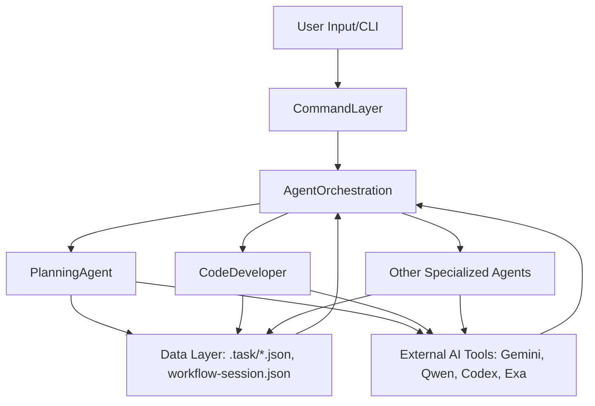

# Architecture: Claude_dms3 System Architecture

## Related Files
- `workflow-architecture.md` - Core system, session, and task architecture.
- `intelligent-tools-strategy.md` - Describes tool selection, prompt structure, and execution modes.
- `mcp-tool-strategy.md` - Details triggering mechanisms for external tools like Exa.
- `action-planning-agent.md` - Explains the role and process of the planning agent.
- `code-developer.md` - Explains the role and process of the code implementation agent.

## Summary
The Claude_dms3 project is a sophisticated CLI-based system designed for autonomous software engineering. It leverages a "JSON-only data model" for task state management, "directory-based session management," and a "unified file structure" to organize workflows. The system employs multiple specialized AI agents (e.g., action-planning-agent, code-developer) and integrates external tools (Gemini, Qwen, Codex, Exa) through a "universal prompt template" and "intelligent tool selection strategy." Its core philosophy emphasizes incremental progress, context-driven execution, and strict quality standards, supported by a hierarchical task system with dynamic decomposition.

## Key Findings
1.  **JSON-Only Data Model for Task State**: The system's task state is stored exclusively in JSON files (`.task/IMPL-*.json`), which are the single source of truth. All markdown documents are read-only generated views, eliminating bidirectional sync complexity. (`workflow-architecture.md`)
2.  **Directory-Based Session Management**: Workflow sessions are managed through a simple directory structure (`.workflow/active/` for active, `.workflow/archives/` for completed), where the location of a session directory determines its state. (`workflow-architecture.md`)
3.  **Hierarchical Task Structure with Flow Control**: Tasks are organized hierarchically (max 2 levels: IMPL-N, IMPL-N.M) and include a `flow_control` field within their JSON schema to define sequential `pre_analysis` and `implementation_approach` steps with dependency management. (`workflow-architecture.md`)
4.  **Intelligent Tool Selection and Universal Prompt Template**: The system dynamically selects AI models (Gemini, Qwen, Codex) based on the task type (analysis vs. implementation) and uses a consistent "Universal Prompt Template" structure for all CLI tools, standardizing interaction and context passing. (`intelligent-tools-strategy.md`)
5.  **Agent-Based Execution**: Specialized agents like the `action-planning-agent` (for generating plans and tasks) and `code-developer` (for implementing code and tests) process tasks based on provided context packages, ensuring clear separation of concerns and automated execution. (`action-planning-agent.md`, `code-developer.md`)
6.  **Quantification Requirements**: A mandatory rule enforces explicit counts and enumerations in all task specifications, requirements, and acceptance criteria to eliminate ambiguity and ensure measurable outcomes. (`action-planning-agent.md`)

## Detailed Analysis

### 1. System Overview
The Claude_dms3 system is a CLI-driven, multi-agent orchestrator for software development. Its core principles revolve around **autonomy, consistency, and traceability**. The architectural style can be described as an **Agent-Oriented Architecture** interacting with external LLM-based tools, governed by a **Command-Query Responsibility Segregation (CQRS)**-like approach where JSON files are the command/state store and markdown files are generated views.

**Core Principles**:
*   **JSON-Only Data Model**: `.task/IMPL-*.json` files are the single source of truth for task states, ensuring consistency and avoiding synchronization issues. (`workflow-architecture.md`)
*   **Context-Driven Execution**: Agents and tools operate with rich context, including session metadata, analysis results, and project-specific artifacts, passed via "context packages." (`action-planning-agent.md`, `code-developer.md`)
*   **Incremental Progress**: The `code-developer` agent, for instance, emphasizes small, testable changes. (`code-developer.md`)
*   **Quantification**: Explicit counts and measurable acceptance criteria are mandatory in task definitions. (`action-planning-agent.md`)

**Technology Stack**:
*   **Core**: Shell scripting (Bash/PowerShell), `jq` for JSON processing, `find`, `grep`, `rg` for file system operations.
*   **AI Models**: Gemini (primary for analysis), Qwen (fallback for analysis), Codex (for implementation and testing).
*   **External Tools**: Exa (for code context and web search).

### 2. System Structure
The system follows a layered architecture, conceptually:

```
+--------------------------+
|      User Interface      |  (CLI Commands: /cli:chat, /workflow:plan, etc.)
+------------+-------------+
             |
             v
+------------+-------------+
|     Command Layer        |  (Parses user input, prepares context for agents)
+------------+-------------+
             |
             v
+------------+-------------+
|    Agent Orchestration   |  (Selects & coordinates agents, manages workflow sessions)
+------------+-------------+
             |
             v
+------------+-------------+     +-------------------+
|  Specialized AI Agents   |<----> External AI Tools |
| (action-planning, code-  |     | (Gemini, Qwen,    |
|   developer, test-fix)   |     |  Codex, Exa)      |
+------------+-------------+     +-------------------+
             ^
             | (Reads/Writes Task JSONs)
+------------+-------------+
|     Data / State Layer   |  (JSON-only task files, workflow-session.json)
+--------------------------+
```

### 3. Module Map

| Module / Component          | Layer                | Responsibilities                                      | Dependencies                                                                      |
| :-------------------------- | :------------------- | :---------------------------------------------------- | :-------------------------------------------------------------------------------- |
| **User Interface**          | Presentation         | User command input, display of CLI output.            | Command Layer                                                                     |
| **Command Layer**           | Application          | Parse user commands, prepare context for agents.      | Agent Orchestration, Data Layer                                                   |
| **Agent Orchestration**     | Application          | Manage workflow sessions, select and invoke agents.   | Specialized AI Agents, Data Layer, External AI Tools                              |
| `action-planning-agent`     | Specialized AI Agent | Create implementation plans, generate task JSONs.     | External AI Tools (Exa), Data Layer                                               |
| `code-developer`            | Specialized AI Agent | Implement code, write tests, follow tech stack.       | External AI Tools (Exa, Codex), Data Layer                                        |
| `workflow-architecture`     | Core System Logic    | Defines system-wide conventions for data model, session, and task management. | N/A (foundational)                                                                |
| `intelligent-tools-strategy`| Core System Logic    | Defines tool selection logic, prompt templates.       | External AI Tools (Gemini, Qwen, Codex)                                           |
| `mcp-tool-strategy`         | Core System Logic    | Defines conditions for triggering Exa tools.          | External AI Tools (Exa)                                                           |
| **Data / State Layer**      | Persistence          | Store task definitions (`.task/*.json`), session metadata (`workflow-session.json`). | Specialized AI Agents, Agent Orchestration                                        |
| **External AI Tools**       | External Service     | Provide LLM capabilities (analysis, code gen, search).| Specialized AI Agents                                                            |

### 4. Module Interactions

**Core Data Flow (Workflow Execution Example)**:

1.  **User Initiates Workflow**: User executes a CLI command (e.g., `/workflow:plan "Implement feature X"`).
2.  **Command Layer Processes**: The command layer translates the user's request into a structured input for the agent orchestration.
3.  **Agent Orchestration Invokes Planning Agent**: The system determines that a planning task is needed and invokes the `action-planning-agent`.
4.  **Planning Agent's Context Assessment**: The `action-planning-agent` receives a "context package" (JSON) containing session metadata, analysis results (if any), and an inventory of brainstorming artifacts. It can optionally use MCP tools (Exa) for further context enhancement. (`action-planning-agent.md`)
5.  **Planning Agent Generates Tasks**: Based on the context, the `action-planning-agent` generates:
    *   Multiple task JSON files (`.task/IMPL-*.json`) adhering to a 5-field schema and quantification requirements.
    *   An overall `IMPL_PLAN.md` document.
    *   A `TODO_LIST.md` for progress tracking.
    All these are stored in the respective session directory within `.workflow/active/WFS-[topic-slug]`. (`action-planning-agent.md`)
6.  **User/System Initiates Implementation**: Once planning is complete, the user or system might trigger an implementation phase (e.g., `/cli:execute IMPL-1`).
7.  **Agent Orchestration Invokes Code Developer**: The `code-developer` agent is invoked for the specified task.
8.  **Code Developer's Context Assessment**: The `code-developer` receives the task's JSON (which includes `flow_control` for `pre_analysis` steps and `implementation_approach`) and assesses the context, potentially loading tech stack guidelines. It can use local search tools (`rg`, `find`) and MCP tools (Exa) for further information gathering. (`code-developer.md`)
9.  **Code Developer Executes Task**: The `code-developer` executes the `implementation_approach` steps sequentially, respecting `depends_on` relationships and using external AI tools (Codex for implementation, Gemini/Qwen for analysis). It performs incremental changes, ensuring code quality and test pass rates. (`code-developer.md`)
10. **Task Completion and Summary**: Upon successful completion of a task, the `code-developer` updates the `TODO_LIST.md` and generates a detailed summary (`.summaries/IMPL-*-summary.md`) within the session directory. (`code-developer.md`)

**Dependency Graph (High-Level)**:


### 5. Design Patterns

*   **Agent-Oriented Programming**: The system is composed of autonomous, specialized agents that interact to achieve complex goals. Each agent (e.g., `action-planning-agent`, `code-developer`) has a defined role, input, and output.
*   **Single Source of Truth**: The "JSON-only data model" for task states is a strict application of this pattern, simplifying data consistency.
*   **Command Pattern**: CLI commands abstract complex operations, encapsulating requests as objects to be passed to agents.
*   **Strategy Pattern**: The "Intelligent Tools Selection Strategy" dynamically chooses the appropriate AI model (Gemini, Qwen, Codex) based on the task's needs.
*   **Template Method Pattern**: The "Universal Prompt Template" and various task-specific templates provide a skeletal structure for commands, allowing agents to fill in details.
*   **Observer Pattern (Implicit)**: Changes in `.task/*.json` or `workflow-session.json` (the state) implicitly trigger updates in derived views like `TODO_LIST.md`.
*   **Context Object Pattern**: The "context package" passed to agents bundles all relevant information needed for task execution.

### 6. Aggregated API Overview
The system's "API" is primarily its command-line interface and the structured inputs/outputs (JSON files) that agents process. There are no traditional RESTful APIs exposed in the public sense within the core system, but rather internal "tool calls" made by agents to external AI services.

**Key "API" (CLI Commands) Categories**:
*   **Workflow Management**: `workflow:plan`, `workflow:execute`, `workflow:status`, `workflow:session:*`
*   **CLI Utilities**: `cli:analyze`, `cli:chat`, `cli:codex-execute`
*   **Memory Management**: `memory:load`, `memory:update`
*   **Task Management**: `task:breakdown`, `task:create`, `task:replan`
*   **Brainstorming**: `workflow:brainstorm:*`
*   **UI Design**: `workflow:ui-design:*`

**Internal API (Agent Inputs/Outputs)**:
*   **Context Package (Input to Agents)**: A JSON object containing `session_id`, `session_metadata`, `analysis_results`, `artifacts_inventory`, `context_package`, `mcp_capabilities`, `mcp_analysis`. (`action-planning-agent.md`)
*   **Task JSON (`.task/IMPL-*.json`)**: Standardized 6-field JSON schema (`id`, `title`, `status`, `meta`, `context`, `flow_control`). (`workflow-architecture.md`)
*   **`flow_control` object**: Contains `pre_analysis` (context gathering) and `implementation_approach` (implementation steps) arrays, with support for variable references and dependency management. (`workflow-architecture.md`)

### 7. Data Flow
The data flow is highly structured and context-rich, moving between the command layer, agent orchestration, specialized agents, and external AI tools. A typical flow for implementing a feature involves:

1.  **Plan Generation**: User request -> Command Layer -> Agent Orchestration -> `action-planning-agent`.
2.  **Context Loading**: `action-planning-agent` loads `context package` (session state, existing analysis, artifacts).
3.  **Task & Plan Output**: `action-planning-agent` writes `.task/IMPL-*.json`, `IMPL_PLAN.md`, `TODO_LIST.md`.
4.  **Task Execution**: Agent Orchestration selects an `IMPL-N` task -> `code-developer` agent.
5.  **Pre-Analysis**: `code-developer` executes `flow_control.pre_analysis` steps (e.g., `bash()` commands, `Read()`, `Glob()`, `Grep()`, `mcp__exa__*()` calls, `gemini` for pattern analysis).
6.  **Implementation**: `code-developer` executes `flow_control.implementation_approach` steps (e.g., `codex` for code generation, `bash()` for tests, `gemini` for quality review). Outputs from earlier steps feed into later ones via `[variable_name]` references.
7.  **Status Update**: `code-developer` updates task status in `.task/IMPL-*.json`, `TODO_LIST.md`, and generates `.summaries/IMPL-*-summary.md`.

### 8. Security and Scalability

**Security**:
*   **Strict Permission Framework**: Each CLI execution requires explicit user authorization. `analysis` mode is read-only, `write` and `auto` modes require explicit `--approval-mode yolo` (Gemini/Qwen) or `--skip-git-repo-check -s danger-full-access` (Codex). This prevents unauthorized modifications. (`intelligent-tools-strategy.md`)
*   **No File Modifications in Analysis Mode**: By design, analysis agents cannot modify the file system, reducing risk. (`intelligent-tools-strategy.md`)
*   **Context Scope Limitation**: Use of `cd` and `--include-directories` limits the context provided to agents, preventing agents from accessing unrelated parts of the codebase. (`intelligent-tools-strategy.md`)
*   **Quantification Requirements**: The strict quantification and explicit listing of modification points provide transparency and auditability for agent actions. (`action-planning-agent.md`)

**Scalability**:
*   **On-Demand Resource Creation**: Directories and files (like subtask JSONs) are created only when needed, avoiding unnecessary resource allocation. (`workflow-architecture.md`)
*   **Distributed AI Processing**: Leveraging external AI services (Gemini, Qwen, Codex) offloads heavy computational tasks, allowing the core CLI system to remain lightweight and orchestrate.
*   **Hierarchical Task Decomposition**: The ability to break down complex problems into smaller, manageable subtasks (max 2 levels) inherently supports handling larger projects by distributing work. (`workflow-architecture.md`)
*   **Task Complexity Classification**: The system classifies tasks (simple, medium, complex) and applies appropriate timeout allocations and strategies, ensuring efficient resource utilization. (`workflow-architecture.md`)
*   **Session Management**: The directory-based session management allows for multiple concurrent workflows by separating their states. (`workflow-architecture.md`)