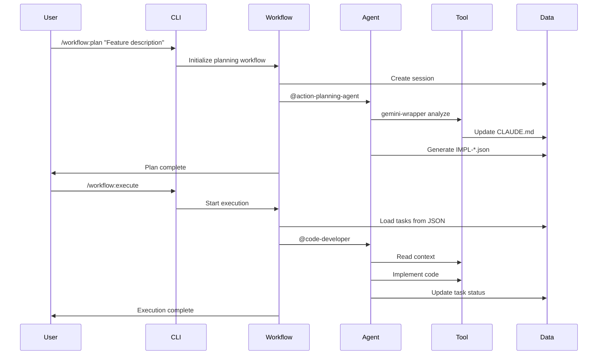
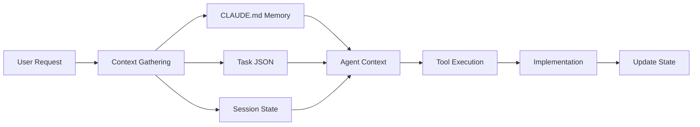
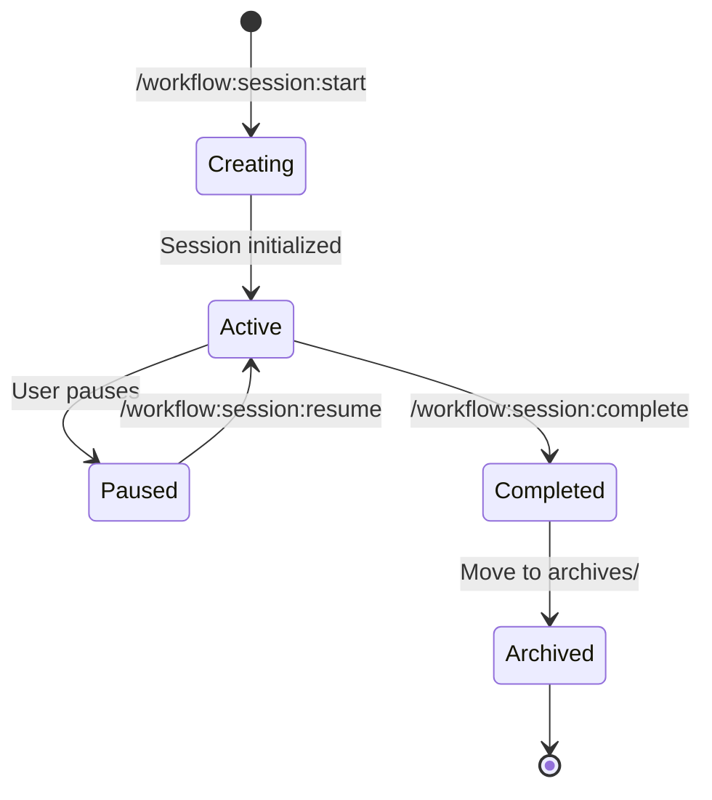

# 🏗️ Claude Code Workflow (CCW) - Architecture Overview

This document provides a high-level overview of CCW's architecture, design principles, and system components.

---

## 📋 Table of Contents

- [Design Philosophy](#design-philosophy)
- [System Architecture](#system-architecture)
- [Core Components](#core-components)
- [Data Flow](#data-flow)
- [Multi-Agent System](#multi-agent-system)
- [CLI Tool Integration](#cli-tool-integration)
- [Session Management](#session-management)
- [Memory System](#memory-system)

---

## 🎯 Design Philosophy

CCW is built on several core design principles that differentiate it from traditional AI-assisted development tools:

### 1. **Context-First Architecture**
- Pre-defined context gathering eliminates execution uncertainty
- Agents receive the correct information *before* implementation
- Context is loaded dynamically based on task requirements

### 2. **JSON-First State Management**
- Task states live in `.task/IMPL-*.json` files as the single source of truth
- Markdown documents are read-only generated views
- Eliminates state drift and synchronization complexity
- Enables programmatic orchestration

### 3. **Autonomous Multi-Phase Orchestration**
- Commands chain specialized sub-commands and agents
- Automates complex workflows with zero user intervention
- Each phase validates its output before proceeding

### 4. **Multi-Model Strategy**
- Leverages unique strengths of different AI models
- Gemini for analysis and exploration
- Codex for implementation
- Qwen for architecture and planning

### 5. **Hierarchical Memory System**
- 4-layer documentation system (CLAUDE.md files)
- Provides context at the appropriate level of abstraction
- Prevents information overload

### 6. **Specialized Role-Based Agents**
- Suite of agents mirrors a real software team
- Each agent has specific responsibilities
- Agents collaborate to complete complex tasks

---

## 🏛️ System Architecture

```mermaid
graph TB
    subgraph "User Interface Layer"
        CLI[Slash Commands]
        CHAT[Natural Language]
    end

    subgraph "Orchestration Layer"
        WF[Workflow Engine]
        SM[Session Manager]
        TM[Task Manager]
    end

    subgraph "Agent Layer"
        AG1[@code-developer]
        AG2[@test-fix-agent]
        AG3[@ui-design-agent]
        AG4[@cli-execution-agent]
        AG5[More Agents...]
    end

    subgraph "Tool Layer"
        GEMINI[Gemini CLI]
        QWEN[Qwen CLI]
        CODEX[Codex CLI]
        BASH[Bash/System]
    end

    subgraph "Data Layer"
        JSON[Task JSON Files]
        MEM[CLAUDE.md Memory]
        STATE[Session State]
    end

    CLI --> WF
    CHAT --> WF
    WF --> SM
    WF --> TM
    SM --> STATE
    TM --> JSON
    WF --> AG1
    WF --> AG2
    WF --> AG3
    WF --> AG4
    AG1 --> GEMINI
    AG1 --> QWEN
    AG1 --> CODEX
    AG2 --> BASH
    AG3 --> GEMINI
    AG4 --> CODEX
    GEMINI --> MEM
    QWEN --> MEM
    CODEX --> JSON
```

---

## 🔧 Core Components

### 1. **Workflow Engine**

The workflow engine orchestrates complex development processes through multiple phases:

- **Planning Phase**: Analyzes requirements and generates implementation plans
- **Execution Phase**: Coordinates agents to implement tasks
- **Verification Phase**: Validates implementation quality
- **Testing Phase**: Generates and executes tests
- **Review Phase**: Performs code review and quality analysis

**Key Features**:
- Multi-phase orchestration
- Automatic session management
- Context propagation between phases
- Quality gates at each phase transition

### 2. **Session Manager**

Manages isolated workflow contexts:

```
.workflow/
├── active/                    # Active sessions
│   ├── WFS-user-auth/        # User authentication session
│   ├── WFS-payment/          # Payment integration session
│   └── WFS-dashboard/        # Dashboard redesign session
└── archives/                  # Completed sessions
    └── WFS-old-feature/      # Archived session
```

**Capabilities**:
- Directory-based session tracking
- Session state persistence
- Parallel session support
- Session archival and resumption

### 3. **Task Manager**

Handles hierarchical task structures:

```json
{
  "id": "IMPL-1.2",
  "title": "Implement JWT authentication",
  "status": "pending",
  "meta": {
    "type": "feature",
    "agent": "code-developer"
  },
  "context": {
    "requirements": ["JWT authentication", "OAuth2 support"],
    "focus_paths": ["src/auth", "tests/auth"],
    "acceptance": ["JWT validation works", "OAuth flow complete"]
  },
  "flow_control": {
    "pre_analysis": [...],
    "implementation_approach": {...}
  }
}
```

**Features**:
- JSON-first data model
- Hierarchical task decomposition (max 2 levels)
- Dynamic subtask creation
- Dependency tracking

### 4. **Memory System**

Four-layer hierarchical documentation:

```
CLAUDE.md (Project root - high-level overview)
├── src/CLAUDE.md (Source layer - module summaries)
│   ├── auth/CLAUDE.md (Module layer - component details)
│   │   └── jwt/CLAUDE.md (Component layer - implementation details)
```

**Memory Commands**:
- `/memory:update-full` - Complete project rebuild
- `/memory:update-related` - Incremental updates for changed modules
- `/memory:load` - Quick context loading for specific tasks

---

## 🔄 Data Flow

### Typical Workflow Execution Flow



### Context Flow



---

## 🤖 Multi-Agent System

### Agent Specialization

CCW uses specialized agents for different types of tasks:

| Agent | Responsibility | Tools Used |
|-------|---------------|------------|
| **@code-developer** | Code implementation | Gemini, Qwen, Codex, Bash |
| **@test-fix-agent** | Test generation and fixing | Codex, Bash |
| **@ui-design-agent** | UI design and prototyping | Gemini, Claude Vision |
| **@action-planning-agent** | Task planning and decomposition | Gemini |
| **@cli-execution-agent** | Autonomous CLI task handling | Codex, Gemini, Qwen |
| **@cli-explore-agent** | Codebase exploration | ripgrep, find |
| **@context-search-agent** | Context gathering | Grep, Glob |
| **@doc-generator** | Documentation generation | Gemini, Qwen |
| **@memory-bridge** | Memory system updates | Gemini, Qwen |
| **@universal-executor** | General task execution | All tools |

### Agent Communication

Agents communicate through:
1. **Shared Session State**: All agents can read/write session JSON
2. **Task JSON Files**: Tasks contain context for agent handoffs
3. **CLAUDE.md Memory**: Shared project knowledge base
4. **Flow Control**: Pre-analysis and implementation approach definitions

---

## 🛠️ CLI Tool Integration

### Three CLI Tools

CCW integrates three external AI tools, each optimized for specific tasks:

#### 1. **Gemini CLI** - Deep Analysis
- **Strengths**: Pattern recognition, architecture understanding, comprehensive analysis
- **Use Cases**:
  - Codebase exploration
  - Architecture analysis
  - Bug diagnosis
  - Memory system updates

#### 2. **Qwen CLI** - Architecture & Planning
- **Strengths**: System design, code generation, architectural planning
- **Use Cases**:
  - Architecture design
  - System planning
  - Code generation
  - Refactoring strategies

#### 3. **Codex CLI** - Autonomous Development
- **Strengths**: Self-directed implementation, error fixing, test generation
- **Use Cases**:
  - Feature implementation
  - Bug fixes
  - Test generation
  - Autonomous development

### Tool Selection Strategy

CCW automatically selects the best tool based on task type:

```
Analysis Task → Gemini CLI
Planning Task → Qwen CLI
Implementation Task → Codex CLI
```

Users can override with `--tool` parameter:
```bash
/cli:analyze --tool codex "Analyze authentication flow"
```

---

## 📦 Session Management

### Session Lifecycle



### Session Structure

```
.workflow/active/WFS-feature-name/
├── workflow-session.json          # Session metadata
├── .task/                          # Task JSON files
│   ├── IMPL-1.json
│   ├── IMPL-1.1.json
│   └── IMPL-2.json
├── .chat/                          # Chat logs
├── brainstorming/                  # Brainstorm artifacts
│   ├── guidance-specification.md
│   └── system-architect/analysis.md
└── artifacts/                      # Generated files
    ├── IMPL_PLAN.md
    └── verification-report.md
```

---

## 💾 Memory System

### Hierarchical CLAUDE.md Structure

The memory system maintains project knowledge across four layers:

#### **Layer 1: Project Root**
```markdown
# Project Overview
- High-level architecture
- Technology stack
- Key design decisions
- Entry points
```

#### **Layer 2: Source Directory**
```markdown
# Source Code Structure
- Module summaries
- Dependency relationships
- Common patterns
```

#### **Layer 3: Module Directory**
```markdown
# Module Details
- Component responsibilities
- API interfaces
- Internal structure
```

#### **Layer 4: Component Directory**
```markdown
# Component Implementation
- Function signatures
- Implementation details
- Usage examples
```

### Memory Update Strategies

#### Full Update (`/memory:update-full`)
- Rebuilds entire project documentation
- Uses layer-based execution (Layer 3 → 1)
- Batch processing (4 modules/agent)
- Fallback mechanism (gemini → qwen → codex)

#### Incremental Update (`/memory:update-related`)
- Updates only changed modules
- Analyzes git changes
- Efficient for daily development

#### Quick Load (`/memory:load`)
- No file updates
- Task-specific context gathering
- Returns JSON context package
- Fast context injection

---

## 🔐 Quality Assurance

### Quality Gates

CCW enforces quality at multiple levels:

1. **Planning Phase**:
   - Requirements coverage check
   - Dependency validation
   - Task specification quality assessment

2. **Execution Phase**:
   - Context validation before implementation
   - Pattern consistency checks
   - Test generation

3. **Review Phase**:
   - Code quality analysis
   - Security review
   - Architecture review

### Verification Commands

- `/workflow:action-plan-verify` - Validates plan quality before execution
- `/workflow:tdd-verify` - Verifies TDD cycle compliance
- `/workflow:review` - Post-implementation review

---

## 🚀 Performance Optimizations

### 1. **Lazy Loading**
- Files created only when needed
- On-demand document generation
- Minimal upfront cost

### 2. **Parallel Execution**
- Independent tasks run concurrently
- Multi-agent parallel brainstorming
- Batch processing for memory updates

### 3. **Context Caching**
- CLAUDE.md acts as knowledge cache
- Reduces redundant analysis
- Faster context retrieval

### 4. **Atomic Session Management**
- Ultra-fast session switching (<10ms)
- Simple file marker system
- No database overhead

---

## 📊 Scalability

### Horizontal Scalability

- **Multiple Sessions**: Run parallel workflows for different features
- **Team Collaboration**: Session-based isolation prevents conflicts
- **Incremental Updates**: Only update affected modules

### Vertical Scalability

- **Hierarchical Tasks**: Efficient task decomposition (max 2 levels)
- **Selective Context**: Load only relevant context for each task
- **Batch Processing**: Process multiple modules per agent invocation

---

## 🔮 Extensibility

### Adding New Agents

Create agent definition in `.claude/agents/`:

```markdown
# Agent Name

## Role
Agent description

## Tools Available
- Tool 1
- Tool 2

## Prompt
Agent instructions...
```

### Adding New Commands

Create command in `.claude/commands/`:

```bash
#!/usr/bin/env bash
# Command implementation
```

### Custom Workflows

Combine existing commands to create custom workflows:

```bash
/workflow:brainstorm:auto-parallel "Topic"
/workflow:plan
/workflow:action-plan-verify
/workflow:execute
/workflow:review
```

---

## 🎓 Best Practices

### For Users

1. **Keep Memory Updated**: Run `/memory:update-related` after major changes
2. **Use Quality Gates**: Run `/workflow:action-plan-verify` before execution
3. **Session Management**: Complete sessions with `/workflow:session:complete`
4. **Tool Selection**: Let CCW auto-select tools unless you have specific needs

### For Developers

1. **Follow JSON-First**: Never modify markdown documents directly
2. **Agent Context**: Provide complete context in task JSON
3. **Error Handling**: Implement graceful fallbacks
4. **Testing**: Test agents independently before integration

---

## 📚 Further Reading

- [Getting Started Guide](GETTING_STARTED.md) - Quick start tutorial
- [Command Reference](COMMAND_REFERENCE.md) - All available commands
- [Command Specification](COMMAND_SPEC.md) - Detailed command specs
- [Workflow Diagrams](WORKFLOW_DIAGRAMS.md) - Visual workflow representations
- [Contributing Guide](CONTRIBUTING.md) - How to contribute
- [Examples](EXAMPLES.md) - Real-world use cases

---

**Last Updated**: 2025-11-20
**Version**: 5.8.1
