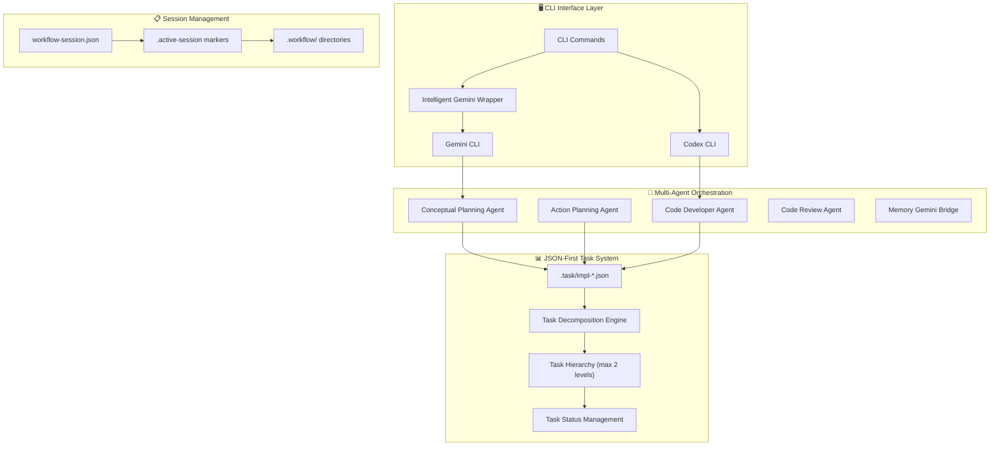
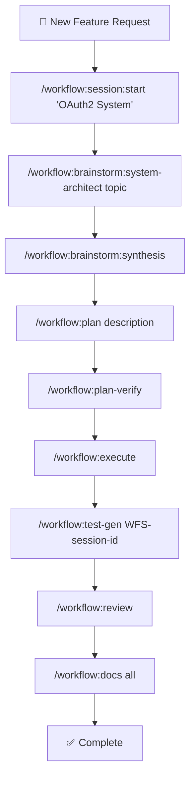
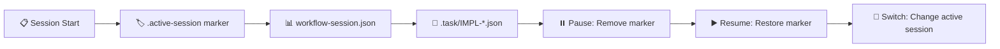

# 🚀 Claude Code Workflow (CCW)

<div align="center">

[](https://github.com/catlog22/Claude-Code-Workflow/releases)
[](LICENSE)
[]()
[](https://github.com/modelcontextprotocol)

**Languages:** [English](README.md) | [中文](README_CN.md)

</div>

---

## 📋 Overview

**Claude Code Workflow (CCW)** is a next-generation multi-agent automation framework for software development that orchestrates complex development tasks through intelligent workflow management and autonomous execution.

> **🧪 Latest Release v2.1.0-experimental**: Introduces **experimental MCP (Model Context Protocol) tools integration** for enhanced codebase analysis and external context retrieval. Includes Exa MCP Server for external API patterns and Code Index MCP for advanced internal codebase exploration. See [CHANGELOG.md](CHANGELOG.md) for details.

> **⚠️ Experimental Features**: MCP tools are optional and experimental. All existing functionality remains stable.

### 🌟 Key Innovations

- **🔄 Enhanced Workflow Lifecycle**: Complete development cycle: Brainstorm → Plan → Verify → Execute → Test → Review
- **🧪 Automated Test Generation**: Comprehensive test workflow generation (`/workflow:test-gen`) with full coverage planning
- **✅ Plan Verification System**: Pre-execution validation using dual Gemini/Codex analysis (`/workflow:plan-verify`)
- **🎯 JSON-First Architecture**: Single source of truth with atomic session management
- **💡 Brainstorm Artifacts**: Multi-perspective planning with synthesis and structured document generation
- **🔧 MCP Tools Integration** *(Experimental)*: Enhanced codebase analysis through Model Context Protocol tools

---

## 🏗️ System Architecture

### **🔧 Core Architectural Principles**



### 🏛️ **Four-Layer Architecture**

CCW operates through four distinct architectural layers with defined responsibilities and data contracts:

| Layer | Components | Data Flow | Integration Points |
|-------|------------|-----------|-------------------|
| **🖥️ Interface Layer** | CLI Commands, Gemini/Codex/Qwen Wrappers | User input → Commands → Agents | External CLI tools, approval modes |
| **📋 Session Layer** | `.active-[session]` markers, `workflow-session.json` | Session state → Task discovery | Atomic session switching |
| **📊 Task/Data Layer** | `.task/impl-*.json`, hierarchy management | Task definitions → Agent execution | JSON-first model, generated views |
| **🤖 Orchestration Layer** | Multi-agent coordination, dependency resolution | Agent outputs → Task updates | Intelligent execution flow |

---

## ✨ Major Enhancements v2.0

### 🔄 **Enhanced Workflow Lifecycle**
Complete development lifecycle with quality gates at each phase:

1. **💡 Brainstorm Phase** - Multi-perspective conceptual planning with role-based analysis
2. **📋 Plan Phase** - Structured implementation planning with task decomposition
3. **✅ Verify Phase** - Pre-execution validation using Gemini (strategic) + Codex (technical)
4. **⚡ Execute Phase** - Autonomous implementation with multi-agent orchestration
5. **🧪 Test Phase** - Automated test workflow generation with comprehensive coverage
6. **🔍 Review Phase** - Quality assurance and completion validation

### 🧪 **Automated Test Generation**
Comprehensive test workflow creation:
- **Implementation Analysis**: Scans completed IMPL-* tasks for test requirements
- **Multi-layered Testing**: Unit, Integration, E2E, Performance, Security tests
- **Agent Assignment**: Specialized test agents for different test types
- **Dependency Mapping**: Test execution follows implementation dependency chains

### ✅ **Plan Verification System**
Dual-engine validation before execution:
- **Gemini Strategic Analysis**: High-level feasibility and architectural soundness
- **Codex Technical Analysis**: Implementation details and technical feasibility
- **Cross-Validation**: Identifies conflicts between strategic vision and technical constraints
- **Improvement Suggestions**: Actionable recommendations before implementation begins

---

## 📊 Complexity Management System

CCW automatically adapts workflow structure based on project complexity:

| **Complexity** | **Task Count** | **Structure** | **Features** |
|---|---|---|---|
| 🟢 **Simple** | <5 tasks | Single-level | Minimal overhead, direct execution |
| 🟡 **Medium** | 5-10 tasks | Two-level hierarchy | Progress tracking, automated docs |
| 🔴 **Complex** | >10 tasks | Force re-scoping | Multi-iteration planning required |

---

## 🛠️ Complete Command Reference

### 🎮 **Core System Commands**

| Command | Function | Example |
|---|---|---|
| `🎯 /enhance-prompt` | Technical context enhancement | `/enhance-prompt "add auth system"` |
| `📊 /context` | Unified context management | `/context --analyze --format=tree` |
| `📝 /update-memory-full` | Complete documentation update | `/update-memory-full` |
| `🔄 /update-memory-related` | Smart context-aware updates | `/update-memory-related` |

### 🚀 **Unified CLI Commands (v3.0.0+)**

| Command | Purpose | Usage |
|---|---|---|
| `/cli:analyze` | Deep codebase analysis | `/cli:analyze "[target]" [--tool <tool>]` |
| `/cli:chat` | Direct interaction with a tool | `/cli:chat "[inquiry]" [--tool <tool>]` |
| `/cli:execute` | Intelligent execution with YOLO permissions | `/cli:execute "[description|task-id]" [--tool <tool>]` |
| `/cli:cli-init`| Initialize CLI tool configurations | `/cli:cli-init [--tool <tool>]` |
| `/cli:mode:bug-index` | Bug analysis and fix suggestions | `/cli:mode:bug-index "[description]" [--tool <tool>]` |
| `/cli:mode:code-analysis` | Deep code analysis and debugging | `/cli:mode:code-analysis "[target]" [--tool <tool>]` |
| `/cli:mode:plan` | Project planning and architecture | `/cli:mode:plan "[topic]" [--tool <tool>]` |

**Supported tools for `--tool` flag:** `gemini` (default), `qwen`, `codex`.

---

### 📖 **Migration Guide: From v2 to v3.0.0**

Version 3.0.0 introduces a unified CLI command structure, consolidating the previous tool-specific commands (`/gemini:*`, `/qwen:*`, `/codex:*`) into a single, more powerful `/cli:*` command set.

**Key Change**: The specific tool (Gemini, Qwen, Codex) is now selected using the `--tool <name>` flag. If no tool is specified, it defaults to `gemini`.

**Command Mapping:**

| Old Command (v2) | New Command (v3.0.0) | Notes |
|---|---|---|
| `/gemini:analyze "..."` | `/cli:analyze "..."` | Defaults to Gemini. |
| `/qwen:analyze "..."` | `/cli:analyze "..." --tool qwen` | Specify Qwen with `--tool`. |
| `/codex:chat "..."` | `/cli:chat "..." --tool codex` | Specify Codex with `--tool`. |
| `/gemini:execute "..."` | `/cli:execute "..."` | Defaults to Gemini. |
| `/gemini:mode:bug-index "..."` | `/cli:mode:bug-index "..."` | Defaults to Gemini. |
| `/qwen:mode:plan "..."` | `/cli:mode:plan "..." --tool qwen` | Specify Qwen with `--tool`. |

The commands `/gemini:mode:auto` and `/gemini:mode:plan-precise` have been removed and their functionality integrated into the enhanced `/cli:execute` and `/cli:mode:plan` commands respectively.

---

### 🎯 **Workflow Management**

#### 📋 Session Management
| Command | Function | Usage |
|---|---|---|
| `🚀 /workflow:session:start` | Create new session | `/workflow:session:start "OAuth2 System"` |
| `⏸️ /workflow:session:pause` | Pause current session | `/workflow:session:pause` |
| `▶️ /workflow:session:resume` | Resume session | `/workflow:session:resume "OAuth2 System"` |
| `📋 /workflow:session:list` | List all sessions | `/workflow:session:list --active` |
| `🔄 /workflow:session:switch` | Switch sessions | `/workflow:session:switch "Payment Fix"` |

#### 🎯 Workflow Operations
| Command | Function | Usage |
|---|---|---|
| `💭 /workflow:brainstorm:*` | Multi-perspective planning with role experts | `/workflow:brainstorm:system-architect "microservices"` |
| `🤝 /workflow:brainstorm:synthesis` | Synthesize all brainstorming perspectives | `/workflow:brainstorm:synthesis` |
| `🎨 /workflow:brainstorm:artifacts` | Generate structured planning documents | `/workflow:brainstorm:artifacts "topic description"` |
| `📋 /workflow:plan` | Convert to executable implementation plans | `/workflow:plan "description" \| file.md \| ISS-001` |
| `🔍 /workflow:plan-deep` | Deep technical planning with Gemini analysis | `/workflow:plan-deep "requirements description"` |
| `✅ /workflow:plan-verify` | Pre-execution validation using dual analysis | `/workflow:plan-verify` |
| `⚡ /workflow:execute` | Coordinate agents for implementation | `/workflow:execute` |
| `🔄 /workflow:resume` | Intelligent workflow resumption | `/workflow:resume [--from TASK-ID] [--retry]` |
| `📊 /workflow:status` | Generate on-demand views from task data | `/workflow:status [task-id] [format] [validation]` |
| `🧪 /workflow:test-gen` | Generate comprehensive test workflows | `/workflow:test-gen WFS-session-id` |
| `🔍 /workflow:review` | Execute review phase for quality validation | `/workflow:review` |
| `📚 /workflow:docs` | Generate hierarchical documentation | `/workflow:docs "architecture" \| "api" \| "all"` |

#### 🏷️ Task Management
| Command | Function | Usage |
|---|---|---|
| `➕ /task:create` | Create implementation task with context | `/task:create "User Authentication System"` |
| `🔄 /task:breakdown` | Intelligent task decomposition | `/task:breakdown task-id` |
| `⚡ /task:execute` | Execute tasks with appropriate agents | `/task:execute task-id` |
| `📋 /task:replan` | Replan tasks with detailed input | `/task:replan task-id ["text" \| file.md \| ISS-001]` |

#### 🏷️ Issue Management
| Command | Function | Usage |
|---|---|---|
| `➕ /workflow:issue:create` | Create new project issue | `/workflow:issue:create "API Rate Limiting" --priority=high` |
| `📋 /workflow:issue:list` | List and filter issues | `/workflow:issue:list --status=open --assigned=system-architect` |
| `📝 /workflow:issue:update` | Update existing issue | `/workflow:issue:update ISS-001 --status=in-progress` |
| `✅ /workflow:issue:close` | Close completed issue | `/workflow:issue:close ISS-001 --reason=resolved` |

#### 🧠 Brainstorming Role Commands
| Role | Command | Purpose |
|---|---|---|
| 🏗️ **System Architect** | `/workflow:brainstorm:system-architect` | Technical architecture analysis |
| 🔒 **Security Expert** | `/workflow:brainstorm:security-expert` | Security and threat analysis |
| 📊 **Product Manager** | `/workflow:brainstorm:product-manager` | User needs and business value |
| 🎨 **UI Designer** | `/workflow:brainstorm:ui-designer` | User experience and interface |
| 📈 **Business Analyst** | `/workflow:brainstorm:business-analyst` | Process optimization analysis |
| 🔬 **Innovation Lead** | `/workflow:brainstorm:innovation-lead` | Emerging technology opportunities |
| 📋 **Feature Planner** | `/workflow:brainstorm:feature-planner` | Feature development planning |
| 🗄️ **Data Architect** | `/workflow:brainstorm:data-architect` | Data modeling and analytics |
| 👥 **User Researcher** | `/workflow:brainstorm:user-researcher` | User behavior analysis |
| 🚀 **Auto Selection** | `/workflow:brainstorm:auto` | Dynamic role selection |

---

## 🎯 Complete Development Workflows

### 🚀 **Enhanced Workflow Lifecycle**



### ⚡ **Workflow Session Management**



### 🔥 **Quick Development Examples**

#### **🚀 Complete Feature Development Workflow**
```bash
# 1. Initialize focused session
/workflow:session:start "User Dashboard Feature"

# 2. Multi-perspective brainstorming
/workflow:brainstorm:system-architect "dashboard analytics system"
/workflow:brainstorm:ui-designer "dashboard user experience"
/workflow:brainstorm:data-architect "analytics data flow"

# 3. Synthesize all perspectives
/workflow:brainstorm:synthesis

# 4. Create executable implementation plan
/workflow:plan "user dashboard with analytics and real-time data"

# 5. Verify plan before execution
/workflow:plan-verify

# 6. Execute implementation with agent coordination
/workflow:execute

# 7. Generate comprehensive test suite
/workflow:test-gen WFS-user-dashboard-feature

# 8. Quality assurance and review
/workflow:review

# 9. Generate documentation
/workflow:docs "all"
```

#### **⚡ Rapid Bug Resolution**
```bash
# Quick bug fix workflow
/workflow:session:start "Payment Processing Fix"
/cli:mode:bug-index "Payment validation fails on concurrent requests" --tool gemini
/cli:mode:bug-index "Fix race condition in payment validation" --tool codex
/workflow:review
```

#### **📊 Architecture Analysis & Refactoring**
```bash
# Deep architecture workflow
/workflow:session:start "API Refactoring Initiative"
/cli:analyze "current API architecture patterns and technical debt" --tool gemini
/workflow:plan-deep "microservices transition strategy"
/workflow:plan-verify
/cli:execute "Refactor monolith to microservices architecture" --tool qwen
/workflow:test-gen WFS-api-refactoring-initiative
/workflow:review
```

---

## 📖 完整工作流详解 (Complete Workflow Guide)

> **💡 社区讨论**: [LINUX DO 论坛讨论帖](https://linux.do/t/topic/995175/24)
> **📦 项目仓库**: [GitHub - Claude-Code-Workflow](https://github.com/catlog22/Claude-Code-Workflow)

### 🎯 核心工作流程 (Core Workflow)

**完整开发流程**: 头脑风暴 → 用户打磨修改 → 行动规划 → 执行 → 测试


### 🧠 头脑风暴阶段 (Brainstorming Phase)

#### 涉及指令:
- `/workflow:brainstorm:auto-parallel` - 自动概念规划（并行版）
- `/workflow:brainstorm:auto-squeeze` - 自动概念规划（串行版，用于测试）
- 单个角色指令（用于重新规划）

#### 工作流程:

1. **初始规划**: 通过 `/workflow:brainstorm:auto-squeeze [topic]` 进行自动规划
2. **修改优化**: 如果对规划不满意，使用单个角色指令如 `/workflow:brainstorm:ui-designer` 进行修改
3. **综合文档**: 通过 `/workflow:brainstorm:synthesis` 生成综合规划文档

**可用角色指令**:
- `🏗️ system-architect` - 系统架构分析
- `🎨 ui-designer` - UI/UX 设计规划
- `🗄️ data-architect` - 数据架构设计
- `🔒 security-expert` - 安全架构分析
- `📊 product-manager` - 产品需求分析
- `🔬 innovation-lead` - 技术创新建议
- `📋 feature-planner` - 功能规划
- `📈 business-analyst` - 业务流程分析
- `👥 user-researcher` - 用户行为分析

### 📋 行动规划阶段 (Action Planning Phase)

前述工作过程被称为**概念规划**，完成后进入**行动规划**阶段：

```bash
/workflow:plan "d:\test_project\.workflow\.active-WFS-promptmaster-platform"
# 一般会传入前一项任务的标识符，也可以增加任务描述
```

#### Plan 命令协调器架构:

`/workflow:plan` 被设计为协调器，自动协调其他斜杠命令执行，包括四个阶段：

1. **🚀 Session 启动**: `/workflow:session:start` - 启动一个 workflow session
2. **🔍 上下文收集**: `/workflow:tools:context-gather`
   - 查找相关代码文件（如果是功能更新）
   - 使用 MCP 查找示例代码
   - 产出 `context-package.json` 供 agent 引用
3. **🧪 概念增强**: `/workflow:tools:concept-enhanced`
   - 使用 CLI 工具对现有计划进行分析
   - 提出改进建议及重点关注事项
   - 产出 `ANALYSIS_RESULTS.md` 供 agent 引用
4. **📝 任务生成**: `/workflow:tools:task-generate` 或 `/workflow:tools:task-generate-agent`
   - 制定详细规划
   - 产出任务 JSON 文件、`IMPL_PLAN.md`、`TODO_LIST.md`

#### 🗂️ Context Package 示例结构:

```json
{
  "metadata": {
    "task_description": "Implement PromptMaster platform...",
    "phase_type": "brainstorming",
    "brainstorming_completed": true,
    "session_id": "WFS-promptmaster-platform",
    "tech_stack": {
      "frontend": ["Vue 3", "TypeScript", "Element Plus"],
      "backend": ["Python", "FastAPI", "SQLAlchemy"],
      "database": ["PostgreSQL", "Redis"]
    }
  },
  "assets": [
    {
      "type": "documentation",
      "path": ".workflow/WFS-xxx/.brainstorming/synthesis-specification.md",
      "priority": "critical"
    }
  ],
  "implementation_guidance": {
    "start_with": ["项目结构初始化", "数据库架构", "认证系统"],
    "key_deliverables": ["后端API", "前端界面", "测试套件"]
  }
}
```

#### 📋 Task JSON 示例结构:

```json
{
  "id": "IMPL-1",
  "title": "Project Infrastructure & Environment Setup",
  "status": "pending",
  "meta": {
    "type": "feature",
    "agent": "@code-developer",
    "complexity": "medium",
    "priority": "P0"
  },
  "context": {
    "requirements": ["设置后端项目结构", "配置 Docker Compose"],
    "focus_paths": ["backend/", "frontend/", "docker-compose.yml"],
    "acceptance": ["后端服务运行在 8000 端口", "前端运行在 3000 端口"]
  },
  "flow_control": {
    "pre_analysis": [
      {
        "step": "load_synthesis_specification",
        "action": "加载综合规范文档",
        "commands": ["Read(.workflow/xxx/synthesis-specification.md)"]
      }
    ]
  }
}
```

系统自动产生上下文，执行下一个斜杠命令，直到流程执行完毕。

### ⚡ 任务执行阶段 (Execution Phase)

通过 `/workflow:execute` 进入任务执行阶段：

#### 🤖 Agent 自动分配:
- **code-developer**: 代码开发任务
- **code-review-test-agent**: 代码审查和测试任务

#### 📚 技术栈指南自动加载:
Agent 根据上下文自动加载对应的技术栈指南（位置：`~\.claude\workflows\cli-templates\tech-stacks`）

**可用技术栈模板**:
- `typescript-dev.md` - TypeScript 开发规范
- `python-dev.md` - Python 开发约定
- `react-dev.md` - React 架构指南
- `vue-dev.md` - Vue 开发最佳实践
- `fastapi-dev.md` - FastAPI 后端规范

> 💡 **欢迎贡献**: 如果您有更好的技术栈提示词，欢迎提交 PR！

### 🐛 功能新增与 Bug 修复工作流 (Feature & Bug Fix Workflow)

#### 快速交互式规划:

使用 CLI 命令进行交互式询问，形成计划文档：

```bash
# Bug 分析和修复
/cli:mode:bug-index "描述 bug 现象" --tool gemini

# 深度代码分析
/cli:mode:code-analysis "分析目标" --tool codex

# 架构规划
/cli:mode:plan "规划主题" --tool qwen
```

**执行策略**:
- **简单任务**: 让 Claude 直接执行
- **复杂任务**: 按照完整工作流执行（头脑风暴 → 规划 → 执行）

### 🧪 测试工作流 (Testing Workflow)

在 `/workflow:execute` 完成后：

```bash
# 生成测试工作流
/workflow:test-gen WFS-session-id

# 执行测试任务
/workflow:execute
```

测试工作流自动生成多层次测试：
- **单元测试** (Unit Tests)
- **集成测试** (Integration Tests)
- **端到端测试** (E2E Tests)
- **性能测试** (Performance Tests)
- **安全测试** (Security Tests)


---

## 🏗️ Project Structure

```
📁 .claude/
├── 🤖 agents/                 # AI agent definitions
├── 🎯 commands/              # CLI command implementations
│   ├── cli/                 # NEW: Unified CLI commands
│   │   └── mode/
│   └── 🎯 workflow/         # Workflow management
├── 🎨 output-styles/         # Output formatting templates
├── 🎭 planning-templates/    # Role-specific planning
├── 💬 prompt-templates/      # AI interaction templates
├── 🔧 scripts/              # Automation utilities
│   ├── 📊 gemini-wrapper           # Intelligent Gemini wrapper
│   ├── 🔧 get_modules_by_depth.sh  # Project analysis
│   └── 📋 read-task-paths.sh       # Task path conversion
├── 🛠️ workflows/            # Core workflow documentation
│   ├── 🏛️ workflow-architecture.md      # System architecture
│   ├── 📊 intelligent-tools-strategy.md # Tool selection guide
│   ├── 🔧 context-search-strategy.md  # Search and discovery strategy
│   └── 🔧 tools-implementation-guide.md # Implementation details
└── ⚙️ settings.local.json   # Local configuration

📁 .workflow/                 # Session workspace (auto-generated)
├── 🏷️ .active-[session]     # Active session markers
└── 📋 WFS-[topic-slug]/      # Individual sessions
    ├── ⚙️ workflow-session.json    # Session metadata
    ├── 📊 .task/impl-*.json        # Task definitions
    ├── 📝 IMPL_PLAN.md             # Planning documents
    ├── ✅ TODO_LIST.md              # Progress tracking
    ├── 📚 .summaries/              # Completion summaries
    ├── 🧠 .process/                # NEW: Planning artifacts
    │   └── 📈 ANALYSIS_RESULTS.md  # Analysis results
    └── 🧪 WFS-test-[session]/     # NEW: Generated test workflows
```

---

## ⚡ Performance & Technical Specs

### 📊 **Performance Metrics**
| Metric | Performance | Details |
|--------|-------------|---------|
| 🔄 **Session Switching** | <10ms | Atomic marker file operations |
| 📊 **JSON Queries** | <1ms | Direct JSON access, no parsing overhead |
| 📝 **Doc Updates** | <30s | Medium projects, intelligent targeting |
| 🔍 **Context Loading** | <5s | Complex codebases with caching |
| ⚡ **Task Execution** | 10min timeout | Complex operations with error handling |

### 🛠️ **System Requirements**
- **🖥️ OS**: Windows 10+, Ubuntu 18.04+, macOS 10.15+
- **📦 Dependencies**: Git, Node.js (Gemini), Python 3.8+ (Codex)
- **💾 Storage**: ~50MB core + variable project data
- **🧠 Memory**: 512MB minimum, 2GB recommended

### 🔗 **Integration Requirements**
- **🔍 Gemini CLI**: Required for analysis and strategic planning workflows
- **🤖 Codex CLI**: Required for autonomous development and bug fixing
- **🔮 Qwen CLI**: Required for architecture analysis and code generation
- **📂 Git Repository**: Required for change tracking and version control
- **🎯 Claude Code IDE**: Recommended for optimal experience

---

## ⚙️ Installation & Configuration

### 🚀 **Quick Installation**
```powershell
Invoke-Expression (Invoke-WebRequest -Uri "https://raw.githubusercontent.com/catlog22/Claude-Code-Workflow/main/install-remote.ps1" -UseBasicParsing).Content
```

### ✅ **Verify Installation**
```bash
/workflow:session:list
```

### ⚙️ **Essential Configuration**

#### **Gemini CLI Setup**
```json
// ~/.gemini/settings.json
{
  "contextFileName": "CLAUDE.md"
}
```

#### **Optimized .geminiignore**
```bash
# Performance optimization
/dist/
/build/
/node_modules/
/.next/

# Temporary files
*.tmp
*.log
/temp/

# Include important docs
!README.md
!**/CLAUDE.md
```

### 🔧 **MCP Tools Configuration** *(Optional Enhancement)*

[](https://github.com/modelcontextprotocol)

**MCP (Model Context Protocol) tools provide enhanced codebase analysis capabilities. They are completely optional - CCW works perfectly without them.**

#### **Quick MCP Setup**
1. **Install MCP Servers** (choose what you need):
   ```bash
   # Option 1: Exa MCP Server (External API patterns)
   # 📋 Installation Guide: https://github.com/exa-labs/exa-mcp-server

   # Option 2: Code Index MCP (Advanced code search)
   # 📋 Installation Guide: https://github.com/johnhuang316/code-index-mcp
   ```

2. **Configure Claude Code IDE**:
   - Follow the MCP server installation guides above
   - Restart Claude Code IDE after MCP server installation
   - CCW will automatically detect and use available MCP tools

#### **Benefits When Enabled**
- 📊 **Faster Analysis**: Direct codebase indexing vs manual searching
- 🌐 **External Context**: Real-world API patterns and examples
- 🔍 **Advanced Search**: Pattern matching and similarity detection
- ⚡ **Automatic Fallback**: Uses traditional tools when MCP unavailable

#### **Configuration Resources**
| MCP Server | Installation Guide | Purpose |
|------------|-------------------|---------|
| 🌐 **Exa MCP** | [Installation Guide](https://github.com/exa-labs/exa-mcp-server) | External API patterns & best practices |
| 🔍 **Code Index MCP** | [Installation Guide](https://github.com/johnhuang316/code-index-mcp) | Advanced internal codebase search |
| 📖 **MCP Protocol** | [Official Documentation](https://github.com/modelcontextprotocol) | Technical specifications |

> **💡 Pro Tip**: Start with basic CCW functionality, then add MCP tools when you want enhanced analysis capabilities.

---

## 🤝 Contributing

### 🛠️ **Development Setup**
1. 🍴 Fork the repository
2. 🌿 Create feature branch: `git checkout -b feature/enhancement-name`
3. 📦 Install dependencies
4. ✅ Test with sample projects
5. 📤 Submit detailed pull request

### 📏 **Code Standards**
- ✅ Follow existing command patterns
- 🔄 Maintain backward compatibility
- 🧪 Add tests for new functionality
- 📚 Update documentation
- 🏷️ Use semantic versioning

---

## 📞 Support & Resources

<div align="center">

| Resource | Link | Description |
|----------|------|-------------|
| 📚 **Documentation** | [Project Wiki](https://github.com/catlog22/Claude-Code-Workflow/wiki) | Comprehensive guides |
| 🐛 **Issues** | [GitHub Issues](https://github.com/catlog22/Claude-Code-Workflow/issues) | Bug reports & features |
| 💬 **Discussions** | [Community Forum](https://github.com/catlog22/Claude-Code-Workflow/discussions) | Community support |
| 📋 **Changelog** | [Release History](CHANGELOG.md) | Version history |

</div>

---

## 📄 License

This project is licensed under the **MIT License** - see the [LICENSE](LICENSE) file for details.

---

<div align="center">

**🚀 Claude Code Workflow (CCW)**

*Professional software development workflow automation through intelligent multi-agent coordination and autonomous execution capabilities.*

[](https://github.com/catlog22/Claude-Code-Workflow)

</div>