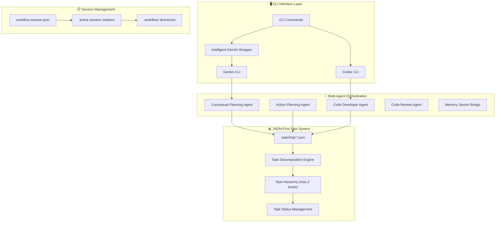
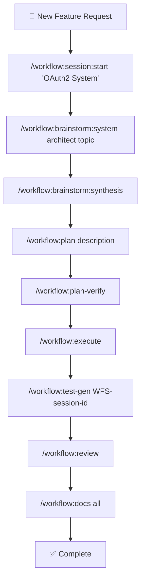
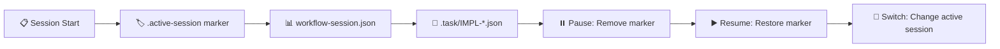

# 🚀 Claude Code Workflow (CCW)

<div align="center">

[](https://github.com/catlog22/Claude-Code-Workflow/releases)
[](LICENSE)
[]()

**Languages:** [English](README.md) | [中文](README_CN.md)

</div>

---

## 📋 Overview

**Claude Code Workflow (CCW)** is a next-generation multi-agent automation framework for software development that orchestrates complex development tasks through intelligent workflow management and autonomous execution.

> **🎯 Latest Release v2.0**: Major architectural evolution with enhanced workflow lifecycle, comprehensive test workflow generation, plan verification system, and brainstorm artifacts integration. See [CHANGELOG.md](CHANGELOG.md) for details.

### 🌟 Key Innovations

- **🔄 Enhanced Workflow Lifecycle**: Complete development cycle: Brainstorm → Plan → Verify → Execute → Test → Review
- **🧪 Automated Test Generation**: Comprehensive test workflow generation (`/workflow:test-gen`) with full coverage planning
- **✅ Plan Verification System**: Pre-execution validation using dual Gemini/Codex analysis (`/workflow:plan-verify`)
- **🎯 JSON-First Architecture**: Single source of truth with atomic session management
- **💡 Brainstorm Artifacts**: Multi-perspective planning with synthesis and structured document generation

---

## 🏗️ System Architecture

### **🔧 Core Architectural Principles**



### 🏛️ **Four-Layer Architecture**

CCW operates through four distinct architectural layers with defined responsibilities and data contracts:

| Layer | Components | Data Flow | Integration Points |
|-------|------------|-----------|-------------------|
| **🖥️ Interface Layer** | CLI Commands, Gemini/Codex/Qwen Wrappers | User input → Commands → Agents | External CLI tools, approval modes |
| **📋 Session Layer** | `.active-[session]` markers, `workflow-session.json` | Session state → Task discovery | Atomic session switching |
| **📊 Task/Data Layer** | `.task/impl-*.json`, hierarchy management | Task definitions → Agent execution | JSON-first model, generated views |
| **🤖 Orchestration Layer** | Multi-agent coordination, dependency resolution | Agent outputs → Task updates | Intelligent execution flow |

---

## ✨ Major Enhancements v2.0

### 🔄 **Enhanced Workflow Lifecycle**
Complete development lifecycle with quality gates at each phase:

1. **💡 Brainstorm Phase** - Multi-perspective conceptual planning with role-based analysis
2. **📋 Plan Phase** - Structured implementation planning with task decomposition
3. **✅ Verify Phase** - Pre-execution validation using Gemini (strategic) + Codex (technical)
4. **⚡ Execute Phase** - Autonomous implementation with multi-agent orchestration
5. **🧪 Test Phase** - Automated test workflow generation with comprehensive coverage
6. **🔍 Review Phase** - Quality assurance and completion validation

### 🧪 **Automated Test Generation**
Comprehensive test workflow creation:
- **Implementation Analysis**: Scans completed IMPL-* tasks for test requirements
- **Multi-layered Testing**: Unit, Integration, E2E, Performance, Security tests
- **Agent Assignment**: Specialized test agents for different test types
- **Dependency Mapping**: Test execution follows implementation dependency chains

### ✅ **Plan Verification System**
Dual-engine validation before execution:
- **Gemini Strategic Analysis**: High-level feasibility and architectural soundness
- **Codex Technical Analysis**: Implementation details and technical feasibility
- **Cross-Validation**: Identifies conflicts between strategic vision and technical constraints
- **Improvement Suggestions**: Actionable recommendations before implementation begins

---

## 📊 Complexity Management System

CCW automatically adapts workflow structure based on project complexity:

| **Complexity** | **Task Count** | **Structure** | **Features** |
|---|---|---|---|
| 🟢 **Simple** | <5 tasks | Single-level | Minimal overhead, direct execution |
| 🟡 **Medium** | 5-10 tasks | Two-level hierarchy | Progress tracking, automated docs |
| 🔴 **Complex** | >10 tasks | Force re-scoping | Multi-iteration planning required |

---

## 🛠️ Complete Command Reference

### 🎮 **Core System Commands**

| Command | Function | Example |
|---------|----------|---------|
| `🎯 /enhance-prompt` | Technical context enhancement | `/enhance-prompt "add auth system"` |
| `📊 /context` | Unified context management | `/context --analyze --format=tree` |
| `📝 /update-memory-full` | Complete documentation update | `/update-memory-full` |
| `🔄 /update-memory-related` | Smart context-aware updates | `/update-memory-related` |

### 🔍 **Gemini CLI Commands** (Analysis & Investigation)

| Command | Purpose | Usage |
|---------|---------|-------|
| `🔍 /gemini:analyze` | Deep codebase analysis | `/gemini:analyze "authentication patterns"` |
| `💬 /gemini:chat` | Direct Gemini interaction | `/gemini:chat "explain this architecture"` |
| `⚡ /gemini:execute` | Intelligent execution with YOLO permissions | `/gemini:execute "implement task-001"` |
| `🎯 /gemini:mode:auto` | Auto template selection | `/gemini:mode:auto "analyze security vulnerabilities"` |
| `🐛 /gemini:mode:bug-index` | Bug analysis and fix suggestions | `/gemini:mode:bug-index "payment processing fails"` |
| `📋 /gemini:mode:plan` | Project planning and architecture | `/gemini:mode:plan "microservices architecture"` |
| `🎯 /gemini:mode:plan-precise` | Precise path planning analysis | `/gemini:mode:plan-precise "complex refactoring"` |

### 🔮 **Qwen CLI Commands** (Architecture & Code Generation)

| Command | Purpose | Usage |
|---------|---------|-------|
| `🔍 /qwen:analyze` | Architecture analysis and code quality | `/qwen:analyze "system architecture patterns"` |
| `💬 /qwen:chat` | Direct Qwen interaction | `/qwen:chat "design authentication system"` |
| `⚡ /qwen:execute` | Intelligent implementation with YOLO permissions | `/qwen:execute "implement user authentication"` |
| `🚀 /qwen:mode:auto` | Auto template selection and execution | `/qwen:mode:auto "build microservices API"` |
| `🐛 /qwen:mode:bug-index` | Bug analysis and fix suggestions | `/qwen:mode:bug-index "memory leak in service"` |
| `📋 /qwen:mode:plan` | Architecture planning and analysis | `/qwen:mode:plan "design scalable database"` |
| `🎯 /qwen:mode:plan-precise` | Precise architectural planning | `/qwen:mode:plan-precise "complex system migration"` |

### 🤖 **Codex CLI Commands** (Development & Implementation)

| Command | Purpose | Usage |
|---------|---------|-------|
| `🔍 /codex:analyze` | Development analysis | `/codex:analyze "optimization opportunities"` |
| `💬 /codex:chat` | Direct Codex interaction | `/codex:chat "implement JWT auth"` |
| `⚡ /codex:execute` | Autonomous implementation with YOLO permissions | `/codex:execute "refactor user service"` |
| `🚀 /codex:mode:auto` | **PRIMARY**: Full autonomous development | `/codex:mode:auto "build payment system"` |
| `🐛 /codex:mode:bug-index` | Autonomous bug fixing and implementation | `/codex:mode:bug-index "fix race condition"` |
| `📋 /codex:mode:plan` | Development planning and implementation | `/codex:mode:plan "implement API endpoints"` |

### 🎯 **Workflow Management**

#### 📋 Session Management
| Command | Function | Usage |
|---------|----------|-------|
| `🚀 /workflow:session:start` | Create new session | `/workflow:session:start "OAuth2 System"` |
| `⏸️ /workflow:session:pause` | Pause current session | `/workflow:session:pause` |
| `▶️ /workflow:session:resume` | Resume session | `/workflow:session:resume "OAuth2 System"` |
| `📋 /workflow:session:list` | List all sessions | `/workflow:session:list --active` |
| `🔄 /workflow:session:switch` | Switch sessions | `/workflow:session:switch "Payment Fix"` |

#### 🎯 Workflow Operations
| Command | Function | Usage |
|---------|----------|-------|
| `💭 /workflow:brainstorm:*` | Multi-perspective planning with role experts | `/workflow:brainstorm:system-architect "microservices"` |
| `🤝 /workflow:brainstorm:synthesis` | Synthesize all brainstorming perspectives | `/workflow:brainstorm:synthesis` |
| `🎨 /workflow:brainstorm:artifacts` | Generate structured planning documents | `/workflow:brainstorm:artifacts "topic description"` |
| `📋 /workflow:plan` | Convert to executable implementation plans | `/workflow:plan "description" \| file.md \| ISS-001` |
| `🔍 /workflow:plan-deep` | Deep technical planning with Gemini analysis | `/workflow:plan-deep "requirements description"` |
| `✅ /workflow:plan-verify` | Pre-execution validation using dual analysis | `/workflow:plan-verify` |
| `⚡ /workflow:execute` | Coordinate agents for implementation | `/workflow:execute` |
| `🔄 /workflow:resume` | Intelligent workflow resumption | `/workflow:resume [--from TASK-ID] [--retry]` |
| `📊 /workflow:status` | Generate on-demand views from task data | `/workflow:status [task-id] [format] [validation]` |
| `🧪 /workflow:test-gen` | Generate comprehensive test workflows | `/workflow:test-gen WFS-session-id` |
| `🔍 /workflow:review` | Execute review phase for quality validation | `/workflow:review` |
| `📚 /workflow:docs` | Generate hierarchical documentation | `/workflow:docs "architecture" \| "api" \| "all"` |

#### 🏷️ Task Management
| Command | Function | Usage |
|---------|----------|-------|
| `➕ /task:create` | Create implementation task with context | `/task:create "User Authentication System"` |
| `🔄 /task:breakdown` | Intelligent task decomposition | `/task:breakdown task-id` |
| `⚡ /task:execute` | Execute tasks with appropriate agents | `/task:execute task-id` |
| `📋 /task:replan` | Replan tasks with detailed input | `/task:replan task-id ["text" \| file.md \| ISS-001]` |

#### 🏷️ Issue Management
| Command | Function | Usage |
|---------|----------|-------|
| `➕ /workflow:issue:create` | Create new project issue | `/workflow:issue:create "API Rate Limiting" --priority=high` |
| `📋 /workflow:issue:list` | List and filter issues | `/workflow:issue:list --status=open --assigned=system-architect` |
| `📝 /workflow:issue:update` | Update existing issue | `/workflow:issue:update ISS-001 --status=in-progress` |
| `✅ /workflow:issue:close` | Close completed issue | `/workflow:issue:close ISS-001 --reason=resolved` |

#### 🧠 Brainstorming Role Commands
| Role | Command | Purpose |
|------|---------|---------|
| 🏗️ **System Architect** | `/workflow:brainstorm:system-architect` | Technical architecture analysis |
| 🔒 **Security Expert** | `/workflow:brainstorm:security-expert` | Security and threat analysis |
| 📊 **Product Manager** | `/workflow:brainstorm:product-manager` | User needs and business value |
| 🎨 **UI Designer** | `/workflow:brainstorm:ui-designer` | User experience and interface |
| 📈 **Business Analyst** | `/workflow:brainstorm:business-analyst` | Process optimization analysis |
| 🔬 **Innovation Lead** | `/workflow:brainstorm:innovation-lead` | Emerging technology opportunities |
| 📋 **Feature Planner** | `/workflow:brainstorm:feature-planner` | Feature development planning |
| 🗄️ **Data Architect** | `/workflow:brainstorm:data-architect` | Data modeling and analytics |
| 👥 **User Researcher** | `/workflow:brainstorm:user-researcher` | User behavior analysis |
| 🚀 **Auto Selection** | `/workflow:brainstorm:auto` | Dynamic role selection |

---

## 🎯 Complete Development Workflows

### 🚀 **Enhanced Workflow Lifecycle**



### ⚡ **Workflow Session Management**



### 🔥 **Quick Development Examples**

#### **🚀 Complete Feature Development Workflow**
```bash
# 1. Initialize focused session
/workflow:session:start "User Dashboard Feature"

# 2. Multi-perspective brainstorming
/workflow:brainstorm:system-architect "dashboard analytics system"
/workflow:brainstorm:ui-designer "dashboard user experience"
/workflow:brainstorm:data-architect "analytics data flow"

# 3. Synthesize all perspectives
/workflow:brainstorm:synthesis

# 4. Create executable implementation plan
/workflow:plan "user dashboard with analytics and real-time data"

# 5. Verify plan before execution
/workflow:plan-verify

# 6. Execute implementation with agent coordination
/workflow:execute

# 7. Generate comprehensive test suite
/workflow:test-gen WFS-user-dashboard-feature

# 8. Quality assurance and review
/workflow:review

# 9. Generate documentation
/workflow:docs "all"
```

#### **⚡ Rapid Bug Resolution**
```bash
# Quick bug fix workflow
/workflow:session:start "Payment Processing Fix"
/gemini:mode:bug-index "Payment validation fails on concurrent requests"
/codex:mode:bug-index "Fix race condition in payment validation"
/workflow:review
```

#### **📊 Architecture Analysis & Refactoring**
```bash
# Deep architecture workflow
/workflow:session:start "API Refactoring Initiative"
/gemini:analyze "current API architecture patterns and technical debt"
/workflow:plan-deep "microservices transition strategy"
/workflow:plan-verify
/qwen:mode:auto "Refactor monolith to microservices architecture"
/workflow:test-gen WFS-api-refactoring-initiative
/workflow:review
```

---

## 🏗️ Project Structure

```
📁 .claude/
├── 🤖 agents/                 # AI agent definitions
├── 🎯 commands/              # CLI command implementations
│   ├── 🔍 gemini/           # Gemini CLI commands
│   ├── 🤖 codex/            # Codex CLI commands
│   └── 🎯 workflow/         # Workflow management
├── 🎨 output-styles/         # Output formatting templates
├── 🎭 planning-templates/    # Role-specific planning
├── 💬 prompt-templates/      # AI interaction templates
├── 🔧 scripts/              # Automation utilities
│   ├── 📊 gemini-wrapper           # Intelligent Gemini wrapper
│   ├── 🔧 get_modules_by_depth.sh  # Project analysis
│   └── 📋 read-task-paths.sh       # Task path conversion
├── 🛠️ workflows/            # Core workflow documentation
│   ├── 🏛️ workflow-architecture.md      # System architecture
│   ├── 📊 intelligent-tools-strategy.md # Tool selection guide
│   ├── 🔧 context-search-strategy.md  # Search and discovery strategy
│   └── 🔧 tools-implementation-guide.md # Implementation details
└── ⚙️ settings.local.json   # Local configuration

📁 .workflow/                 # Session workspace (auto-generated)
├── 🏷️ .active-[session]     # Active session markers
└── 📋 WFS-[topic-slug]/      # Individual sessions
    ├── ⚙️ workflow-session.json    # Session metadata
    ├── 📊 .task/impl-*.json        # Task definitions
    ├── 📝 IMPL_PLAN.md             # Planning documents
    ├── ✅ TODO_LIST.md              # Progress tracking
    ├── 📚 .summaries/              # Completion summaries
    ├── 🧠 .process/                # NEW: Planning artifacts
    │   └── 📈 ANALYSIS_RESULTS.md  # Analysis results
    └── 🧪 WFS-test-[session]/     # NEW: Generated test workflows
```

---

## ⚡ Performance & Technical Specs

### 📊 **Performance Metrics**
| Metric | Performance | Details |
|--------|-------------|---------|
| 🔄 **Session Switching** | <10ms | Atomic marker file operations |
| 📊 **JSON Queries** | <1ms | Direct JSON access, no parsing overhead |
| 📝 **Doc Updates** | <30s | Medium projects, intelligent targeting |
| 🔍 **Context Loading** | <5s | Complex codebases with caching |
| ⚡ **Task Execution** | 10min timeout | Complex operations with error handling |

### 🛠️ **System Requirements**
- **🖥️ OS**: Windows 10+, Ubuntu 18.04+, macOS 10.15+
- **📦 Dependencies**: Git, Node.js (Gemini), Python 3.8+ (Codex)
- **💾 Storage**: ~50MB core + variable project data
- **🧠 Memory**: 512MB minimum, 2GB recommended

### 🔗 **Integration Requirements**
- **🔍 Gemini CLI**: Required for analysis and strategic planning workflows
- **🤖 Codex CLI**: Required for autonomous development and bug fixing
- **🔮 Qwen CLI**: Required for architecture analysis and code generation
- **📂 Git Repository**: Required for change tracking and version control
- **🎯 Claude Code IDE**: Recommended for optimal experience

---

## ⚙️ Installation & Configuration

### 🚀 **Quick Installation**
```powershell
Invoke-Expression (Invoke-WebRequest -Uri "https://raw.githubusercontent.com/catlog22/Claude-Code-Workflow/main/install-remote.ps1" -UseBasicParsing).Content
```

### ✅ **Verify Installation**
```bash
/workflow:session:list
```

### ⚙️ **Essential Configuration**

#### **Gemini CLI Setup**
```json
// ~/.gemini/settings.json
{
  "contextFileName": "CLAUDE.md"
}
```

#### **Optimized .geminiignore**
```bash
# Performance optimization
/dist/
/build/
/node_modules/
/.next/

# Temporary files
*.tmp
*.log
/temp/

# Include important docs
!README.md
!**/CLAUDE.md
```

---

## 🤝 Contributing

### 🛠️ **Development Setup**
1. 🍴 Fork the repository
2. 🌿 Create feature branch: `git checkout -b feature/enhancement-name`
3. 📦 Install dependencies
4. ✅ Test with sample projects
5. 📤 Submit detailed pull request

### 📏 **Code Standards**
- ✅ Follow existing command patterns
- 🔄 Maintain backward compatibility
- 🧪 Add tests for new functionality
- 📚 Update documentation
- 🏷️ Use semantic versioning

---

## 📞 Support & Resources

<div align="center">

| Resource | Link | Description |
|----------|------|-------------|
| 📚 **Documentation** | [Project Wiki](https://github.com/catlog22/Claude-Code-Workflow/wiki) | Comprehensive guides |
| 🐛 **Issues** | [GitHub Issues](https://github.com/catlog22/Claude-Code-Workflow/issues) | Bug reports & features |
| 💬 **Discussions** | [Community Forum](https://github.com/catlog22/Claude-Code-Workflow/discussions) | Community support |
| 📋 **Changelog** | [Release History](CHANGELOG.md) | Version history |

</div>

---

## 📄 License

This project is licensed under the **MIT License** - see the [LICENSE](LICENSE) file for details.

---

<div align="center">

**🚀 Claude Code Workflow (CCW)**

*Professional software development workflow automation through intelligent multi-agent coordination and autonomous execution capabilities.*

[](https://github.com/catlog22/Claude-Code-Workflow)

</div>