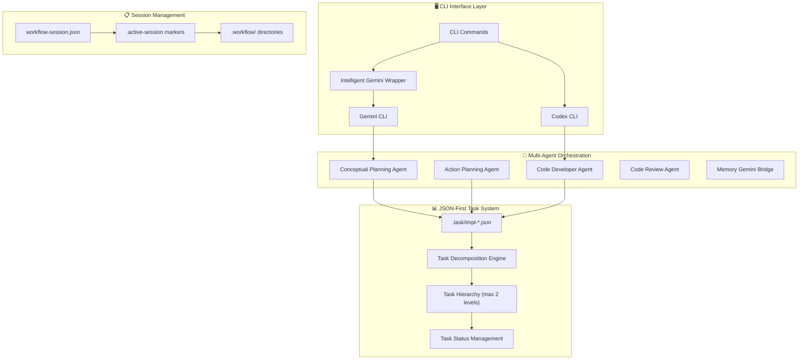
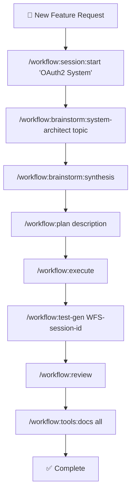
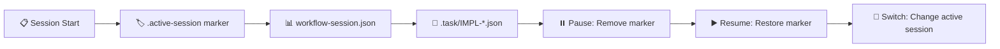
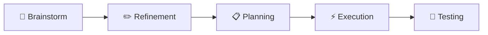

# 🚀 Claude Code Workflow (CCW)

<div align="center">

[](https://github.com/catlog22/Claude-Code-Workflow/releases)
[](LICENSE)
[]()
[](https://github.com/modelcontextprotocol)

**Languages:** [English](README.md) | [中文](README_CN.md)

</div>

---

## ⚙️ Installation

### 🚀 **Quick Installation via Shell**

**For PowerShell (Windows):**
```powershell
Invoke-Expression (Invoke-WebRequest -Uri "https://raw.githubusercontent.com/catlog22/Claude-Code-Workflow/main/install-remote.ps1" -UseBasicParsing).Content
```

**For Bash/Zsh (Linux/macOS):**
```bash
bash <(curl -fsSL https://raw.githubusercontent.com/catlog22/Claude-Code-Workflow/main/install-remote.sh)
```

### ✅ **Verify Installation**
```bash
/workflow:session:list
```

---

## 📋 Overview

**Claude Code Workflow (CCW)** is a next-generation multi-agent automation framework for software development that orchestrates complex development tasks through intelligent workflow management and autonomous execution.

> **🎉 Latest Release v3.0.0**: Major update with **unified CLI command structure**. Consolidates Gemini, Qwen, and Codex commands into a single `/cli:*` command set with `--tool` flag for tool selection. Includes comprehensive workflow guide and command verification. See [CHANGELOG.md](CHANGELOG.md) for details.

> **⚠️ Breaking Changes**: Previous tool-specific commands (`/gemini:*`, `/qwen:*`, `/codex:*`) are deprecated. Use new unified `/cli:*` commands instead. See migration guide below.

### 🌟 Key Innovations

- **🔄 Enhanced Workflow Lifecycle**: Complete development cycle: Brainstorm → Plan → Execute → Test → Review
- **🧪 Automated Test Generation**: Comprehensive test workflow generation (`/workflow:test-gen`) with full coverage planning
- **🎯 JSON-First Architecture**: Single source of truth with atomic session management
- **💡 Brainstorm Artifacts**: Multi-perspective planning with synthesis and structured document generation
- **🤖 Intelligent Agent Orchestration**: Automated agent assignment and task coordination
- **🔧 MCP Tools Integration** *(Experimental)*: Enhanced codebase analysis through Model Context Protocol tools

---

## 🏗️ System Architecture

### **🔧 Core Architectural Principles**



### 🏛️ **Four-Layer Architecture**

CCW operates through four distinct architectural layers with defined responsibilities and data contracts:

| Layer | Components | Data Flow | Integration Points |
|-------|------------|-----------|-------------------|
| **🖥️ Interface Layer** | CLI Commands, Gemini/Codex/Qwen Wrappers | User input → Commands → Agents | External CLI tools, approval modes |
| **📋 Session Layer** | `.active-[session]` markers, `workflow-session.json` | Session state → Task discovery | Atomic session switching |
| **📊 Task/Data Layer** | `.task/impl-*.json`, hierarchy management | Task definitions → Agent execution | JSON-first model, generated views |
| **🤖 Orchestration Layer** | Multi-agent coordination, dependency resolution | Agent outputs → Task updates | Intelligent execution flow |

---

## ✨ Major Enhancements v2.0

### 🔄 **Enhanced Workflow Lifecycle**
Complete development lifecycle with quality gates at each phase:

1. **💡 Brainstorm Phase** - Multi-perspective conceptual planning with role-based analysis
2. **📋 Plan Phase** - Structured implementation planning with task decomposition
3. **⚡ Execute Phase** - Autonomous implementation with multi-agent orchestration
4. **🧪 Test Phase** - Automated test workflow generation with comprehensive coverage
5. **🔍 Review Phase** - Quality assurance and completion validation

### 🧪 **Automated Test Generation**
Comprehensive test workflow creation:
- **Implementation Analysis**: Scans completed IMPL-* tasks for test requirements
- **Multi-layered Testing**: Unit, Integration, E2E, Performance, Security tests
- **Agent Assignment**: Specialized test agents for different test types
- **Dependency Mapping**: Test execution follows implementation dependency chains


---

## 📊 Complexity Management System

CCW automatically adapts workflow structure based on project complexity:

| **Complexity** | **Task Count** | **Structure** | **Features** |
|---|---|---|---|
| 🟢 **Simple** | <5 tasks | Single-level | Minimal overhead, direct execution |
| 🟡 **Medium** | 5-10 tasks | Two-level hierarchy | Progress tracking, automated docs |
| 🔴 **Complex** | >10 tasks | Force re-scoping | Multi-iteration planning required |

---

## 🛠️ Complete Command Reference

### 🎮 **Core System Commands**

| Command | Function | Example |
|---|---|---|
| `🎯 /enhance-prompt` | Technical context enhancement | `/enhance-prompt "add auth system"` |
| `📝 /update-memory-full` | Complete documentation update | `/update-memory-full` |
| `🔄 /update-memory-related` | Smart context-aware updates | `/update-memory-related` |

### 🚀 **Unified CLI Commands (v3.0.0+)**

| Command | Purpose | Usage |
|---|---|---|
| `/cli:analyze` | Deep codebase analysis | `/cli:analyze "[target]" [--tool <tool>]` |
| `/cli:chat` | Direct interaction with a tool | `/cli:chat "[inquiry]" [--tool <tool>]` |
| `/cli:execute` | Intelligent execution with YOLO permissions | `/cli:execute "[description|task-id]" [--tool <tool>]` |
| `/cli:cli-init`| Initialize CLI tool configurations | `/cli:cli-init [--tool <tool>]` |
| `/cli:mode:bug-index` | Bug analysis and fix suggestions | `/cli:mode:bug-index "[description]" [--tool <tool>]` |
| `/cli:mode:code-analysis` | Deep code analysis and debugging | `/cli:mode:code-analysis "[target]" [--tool <tool>]` |
| `/cli:mode:plan` | Project planning and architecture | `/cli:mode:plan "[topic]" [--tool <tool>]` |

**Supported tools for `--tool` flag:** `gemini` (default), `qwen`, `codex`.

---

### 📖 **Migration Guide: From v2 to v3.0.0**

Version 3.0.0 introduces a unified CLI command structure, consolidating the previous tool-specific commands (`/gemini:*`, `/qwen:*`, `/codex:*`) into a single, more powerful `/cli:*` command set.

**Key Change**: The specific tool (Gemini, Qwen, Codex) is now selected using the `--tool <name>` flag. If no tool is specified, it defaults to `gemini`.

**Command Mapping:**

| Old Command (v2) | New Command (v3.0.0) | Notes |
|---|---|---|
| `/gemini:analyze "..."` | `/cli:analyze "..."` | Defaults to Gemini. |
| `/qwen:analyze "..."` | `/cli:analyze "..." --tool qwen` | Specify Qwen with `--tool`. |
| `/codex:chat "..."` | `/cli:chat "..." --tool codex` | Specify Codex with `--tool`. |
| `/gemini:execute "..."` | `/cli:execute "..."` | Defaults to Gemini. |
| `/gemini:mode:bug-index "..."` | `/cli:mode:bug-index "..."` | Defaults to Gemini. |
| `/qwen:mode:plan "..."` | `/cli:mode:plan "..." --tool qwen` | Specify Qwen with `--tool`. |

The commands `/gemini:mode:auto` and `/gemini:mode:plan-precise` have been removed and their functionality integrated into the enhanced `/cli:execute` and `/cli:mode:plan` commands respectively.

---

### 🎯 **Workflow Management**

#### 📋 Session Management
| Command | Function | Usage |
|---|---|---|
| `🚀 /workflow:session:start` | Create new session | `/workflow:session:start "OAuth2 System"` |
| `⏸️ /workflow:session:pause` | Pause current session | `/workflow:session:pause` |
| `▶️ /workflow:session:resume` | Resume session | `/workflow:session:resume "OAuth2 System"` |
| `✅ /workflow:session:complete` | Complete current session | `/workflow:session:complete` |
| `📋 /workflow:session:list` | List all sessions | `/workflow:session:list --active` |
| `🔄 /workflow:session:switch` | Switch sessions | `/workflow:session:switch "Payment Fix"` |

#### 🎯 Workflow Operations
| Command | Function | Usage |
|---|---|---|
| `💭 /workflow:brainstorm:*` | Multi-perspective planning with role experts | `/workflow:brainstorm:system-architect "microservices"` |
| `🚀 /workflow:brainstorm:auto-parallel` | Automated parallel brainstorming | `/workflow:brainstorm:auto-parallel "topic"` |
| `🔄 /workflow:brainstorm:auto-squeeze` | Automated sequential brainstorming | `/workflow:brainstorm:auto-squeeze "topic"` |
| `🤝 /workflow:brainstorm:synthesis` | Synthesize all brainstorming perspectives | `/workflow:brainstorm:synthesis` |
| `🎨 /workflow:brainstorm:artifacts` | Generate structured planning documents | `/workflow:brainstorm:artifacts "topic description"` |
| `📋 /workflow:plan` | Convert to executable implementation plans | `/workflow:plan "description" \| file.md \| ISS-001` |
| `⚡ /workflow:execute` | Coordinate agents for implementation | `/workflow:execute` |
| `🔄 /workflow:resume` | Intelligent workflow resumption | `/workflow:resume [--from TASK-ID] [--retry]` |
| `📊 /workflow:status` | Generate on-demand views from task data | `/workflow:status [task-id]` |
| `🧪 /workflow:test-gen` | Generate comprehensive test workflows | `/workflow:test-gen WFS-session-id` |
| `🔍 /workflow:review` | Execute review phase for quality validation | `/workflow:review` |

#### 🔧 Workflow Tools (Internal)
| Command | Function | Usage |
|---|---|---|
| `🔍 /workflow:tools:context-gather` | Intelligent context collection | `/workflow:tools:context-gather --session WFS-id "task"` |
| `🧪 /workflow:tools:concept-enhanced` | Enhanced concept analysis | `/workflow:tools:concept-enhanced --session WFS-id` |
| `📝 /workflow:tools:task-generate` | Manual task generation | `/workflow:tools:task-generate --session WFS-id` |
| `🤖 /workflow:tools:task-generate-agent` | Autonomous task generation | `/workflow:tools:task-generate-agent --session WFS-id` |
| `📊 /workflow:tools:status` | Advanced status reporting | `/workflow:tools:status [task-id]` |
| `📚 /workflow:tools:docs` | Generate hierarchical documentation | `/workflow:tools:docs "architecture" \| "api" \| "all"` |

#### 🏷️ Task Management
| Command | Function | Usage |
|---|---|---|
| `➕ /task:create` | Create implementation task with context | `/task:create "User Authentication System"` |
| `🔄 /task:breakdown` | Intelligent task decomposition | `/task:breakdown task-id` |
| `⚡ /task:execute` | Execute tasks with appropriate agents | `/task:execute task-id` |
| `📋 /task:replan` | Replan tasks with detailed input | `/task:replan task-id ["text" \| file.md \| ISS-001]` |

#### 🏷️ Issue Management
| Command | Function | Usage |
|---|---|---|
| `➕ /workflow:issue:create` | Create new project issue | `/workflow:issue:create "API Rate Limiting" --priority=high` |
| `📋 /workflow:issue:list` | List and filter issues | `/workflow:issue:list --status=open --assigned=system-architect` |
| `📝 /workflow:issue:update` | Update existing issue | `/workflow:issue:update ISS-001 --status=in-progress` |
| `✅ /workflow:issue:close` | Close completed issue | `/workflow:issue:close ISS-001 --reason=resolved` |

#### 🧠 Brainstorming Role Commands
| Role | Command | Purpose |
|---|---|---|
| 🏗️ **System Architect** | `/workflow:brainstorm:system-architect` | Technical architecture analysis |
| 🔒 **Security Expert** | `/workflow:brainstorm:security-expert` | Security and threat analysis |
| 📊 **Product Manager** | `/workflow:brainstorm:product-manager` | User needs and business value |
| 🎨 **UI Designer** | `/workflow:brainstorm:ui-designer` | User experience and interface |
| 📈 **Business Analyst** | `/workflow:brainstorm:business-analyst` | Process optimization analysis |
| 🔬 **Innovation Lead** | `/workflow:brainstorm:innovation-lead` | Emerging technology opportunities |
| 📋 **Feature Planner** | `/workflow:brainstorm:feature-planner` | Feature development planning |
| 🗄️ **Data Architect** | `/workflow:brainstorm:data-architect` | Data modeling and analytics |
| 👥 **User Researcher** | `/workflow:brainstorm:user-researcher` | User behavior analysis |
| 🚀 **Auto Selection** | `/workflow:brainstorm:auto` | Dynamic role selection |

---

## 🎯 Complete Development Workflows

### 🚀 **Enhanced Workflow Lifecycle**



### ⚡ **Workflow Session Management**



### 🔥 **Quick Development Examples**

#### **🚀 Complete Feature Development Workflow**
```bash
# 1. Initialize focused session
/workflow:session:start "User Dashboard Feature"

# 2. Multi-perspective brainstorming
/workflow:brainstorm:system-architect "dashboard analytics system"
/workflow:brainstorm:ui-designer "dashboard user experience"
/workflow:brainstorm:data-architect "analytics data flow"

# 3. Synthesize all perspectives
/workflow:brainstorm:synthesis

# 4. Create executable implementation plan
/workflow:plan "user dashboard with analytics and real-time data"

# 5. Execute implementation with agent coordination
/workflow:execute

# 6. Generate comprehensive test suite
/workflow:test-gen WFS-user-dashboard-feature

# 7. Quality assurance and review
/workflow:review

# 8. Generate documentation
/workflow:tools:docs "all"
```

#### **⚡ Rapid Bug Resolution**
```bash
# Quick bug fix workflow
/workflow:session:start "Payment Processing Fix"
/cli:mode:bug-index "Payment validation fails on concurrent requests" --tool gemini
/cli:mode:bug-index "Fix race condition in payment validation" --tool codex
/workflow:review
```

#### **📊 Architecture Analysis & Refactoring**
```bash
# Deep architecture workflow
/workflow:session:start "API Refactoring Initiative"
/cli:analyze "current API architecture patterns and technical debt" --tool gemini
/workflow:plan "microservices transition strategy"
/cli:execute "Refactor monolith to microservices architecture" --tool qwen
/workflow:test-gen WFS-api-refactoring-initiative
/workflow:review
```

---

## 📖 Complete Workflow Guide

> **💡 Community Discussion**: [LINUX DO Forum Thread](https://linux.do/t/topic/995175/24)
> **📦 Repository**: [GitHub - Claude-Code-Workflow](https://github.com/catlog22/Claude-Code-Workflow)

### 🎯 Core Workflow Process

**Complete Development Flow**: Brainstorm → User Refinement → Action Planning → Execution → Testing



### 🧠 Brainstorming Phase

#### Available Commands:
- `/workflow:brainstorm:auto-parallel` - Automated concept planning (parallel execution)
- `/workflow:brainstorm:auto-squeeze` - Automated concept planning (sequential execution for testing)
- Individual role commands (for replanning)

#### Workflow Steps:

1. **Initial Planning**: Execute `/workflow:brainstorm:auto-squeeze [topic]` for automated planning
2. **Refinement**: If unsatisfied with the plan, use individual role commands like `/workflow:brainstorm:ui-designer` to refine
3. **Synthesis**: Execute `/workflow:brainstorm:synthesis` to generate comprehensive planning documentation

**Available Role Commands**:
- `🏗️ system-architect` - System architecture analysis
- `🎨 ui-designer` - UI/UX design planning
- `🗄️ data-architect` - Data architecture design
- `🔒 security-expert` - Security architecture analysis
- `📊 product-manager` - Product requirements analysis
- `🔬 innovation-lead` - Technical innovation recommendations
- `📋 feature-planner` - Feature planning
- `📈 business-analyst` - Business process analysis
- `👥 user-researcher` - User behavior analysis

### 📋 Action Planning Phase

The previous stage is called **Concept Planning**. After completion, enter the **Action Planning** phase:

```bash
/workflow:plan "d:\test_project\.workflow\.active-WFS-promptmaster-platform"
# Typically pass the session identifier from the previous task, can also add task description
```

#### Plan Command Coordinator Architecture:

`/workflow:plan` is designed as a coordinator that automatically orchestrates other slash commands in four phases:

1. **🚀 Session Initialization**: `/workflow:session:start` - Start a workflow session
2. **🔍 Context Gathering**: `/workflow:tools:context-gather`
   - Locate relevant code files (for feature updates)
   - Use MCP to find example code
   - Generate `context-package.json` for agent reference
3. **🧪 Concept Enhancement**: `/workflow:tools:concept-enhanced`
   - Analyze existing plans using CLI tools
   - Provide improvement suggestions and key focus areas
   - Generate `ANALYSIS_RESULTS.md` for agent reference
4. **📝 Task Generation**: `/workflow:tools:task-generate` or `/workflow:tools:task-generate-agent`
   - Develop detailed plans
   - Generate task JSON files, `IMPL_PLAN.md`, `TODO_LIST.md`

#### 🗂️ Context Package Structure Example:

```json
{
  "metadata": {
    "task_description": "Implement PromptMaster platform...",
    "phase_type": "brainstorming",
    "brainstorming_completed": true,
    "session_id": "WFS-promptmaster-platform",
    "tech_stack": {
      "frontend": ["Vue 3", "TypeScript", "Element Plus"],
      "backend": ["Python", "FastAPI", "SQLAlchemy"],
      "database": ["PostgreSQL", "Redis"]
    }
  },
  "assets": [
    {
      "type": "documentation",
      "path": ".workflow/WFS-xxx/.brainstorming/synthesis-specification.md",
      "priority": "critical"
    }
  ],
  "implementation_guidance": {
    "start_with": ["Project structure initialization", "Database architecture", "Authentication system"],
    "key_deliverables": ["Backend API", "Frontend interface", "Test suite"]
  }
}
```

#### 📋 Task JSON Structure Example:

```json
{
  "id": "IMPL-1",
  "title": "Project Infrastructure & Environment Setup",
  "status": "pending",
  "meta": {
    "type": "feature",
    "agent": "@code-developer",
    "complexity": "medium",
    "priority": "P0"
  },
  "context": {
    "requirements": ["Setup backend project structure", "Configure Docker Compose"],
    "focus_paths": ["backend/", "frontend/", "docker-compose.yml"],
    "acceptance": ["Backend service running on port 8000", "Frontend running on port 3000"]
  },
  "flow_control": {
    "pre_analysis": [
      {
        "step": "load_synthesis_specification",
        "action": "Load comprehensive specification document",
        "commands": ["Read(.workflow/xxx/synthesis-specification.md)"]
      }
    ]
  }
}
```

The system automatically generates context and executes the next slash command until the workflow completes.

### ⚡ Execution Phase

Enter the execution phase via `/workflow:execute`:

#### 🤖 Automatic Agent Assignment:
- **code-developer**: Code development tasks
- **code-review-test-agent**: Code review and testing tasks

#### 📚 Tech Stack Guidelines Auto-Loading:
Agents automatically load corresponding tech stack guidelines based on context (location: `~\.claude\workflows\cli-templates\tech-stacks`)

**Available Tech Stack Templates**:
- `typescript-dev.md` - TypeScript development standards
- `python-dev.md` - Python development conventions
- `react-dev.md` - React architecture guidelines
- `vue-dev.md` - Vue development best practices
- `fastapi-dev.md` - FastAPI backend standards

> 💡 **Contributions Welcome**: If you have better tech stack prompts, PRs are welcome!

### 🐛 Feature Development & Bug Fix Workflow

#### Quick Interactive Planning:

Use CLI commands for interactive inquiry to form planning documents:

```bash
# Bug analysis and fixing
/cli:mode:bug-index "Describe bug symptoms" --tool gemini

# Deep code analysis
/cli:mode:code-analysis "Analysis target" --tool codex

# Architecture planning
/cli:mode:plan "Planning topic" --tool qwen
```

**Execution Strategy**:
- **Simple tasks**: Let Claude execute directly
- **Complex tasks**: Use `/workflow:plan` for structured planning and execution

### 🧪 Testing Workflow

After `/workflow:execute` completion:

```bash
# Generate test workflow
/workflow:test-gen WFS-session-id

# Execute test tasks
/workflow:execute
```

Test workflow automatically generates multi-level tests:
- **Unit Tests**
- **Integration Tests**
- **End-to-End Tests** (E2E)
- **Performance Tests**
- **Security Tests**


---

## 🏗️ Project Structure

```
📁 .claude/
├── 🤖 agents/                 # AI agent definitions
├── 🎯 commands/              # CLI command implementations
│   ├── cli/                 # NEW: Unified CLI commands
│   │   └── mode/
│   └── 🎯 workflow/         # Workflow management
├── 🎨 output-styles/         # Output formatting templates
├── 🎭 planning-templates/    # Role-specific planning
├── 💬 prompt-templates/      # AI interaction templates
├── 🔧 scripts/              # Automation utilities
│   ├── 📊 gemini-wrapper           # Intelligent Gemini wrapper
│   ├── 🔧 get_modules_by_depth.sh  # Project analysis
│   └── 📋 read-task-paths.sh       # Task path conversion
├── 🛠️ workflows/            # Core workflow documentation
│   ├── 🏛️ workflow-architecture.md      # System architecture
│   ├── 📊 intelligent-tools-strategy.md # Tool selection guide
│   ├── 🔧 context-search-strategy.md  # Search and discovery strategy
│   └── 🔧 tools-implementation-guide.md # Implementation details
└── ⚙️ settings.local.json   # Local configuration

📁 .workflow/                 # Session workspace (auto-generated)
├── 🏷️ .active-[session]     # Active session markers
└── 📋 WFS-[topic-slug]/      # Individual sessions
    ├── ⚙️ workflow-session.json    # Session metadata
    ├── 📊 .task/impl-*.json        # Task definitions
    ├── 📝 IMPL_PLAN.md             # Planning documents
    ├── ✅ TODO_LIST.md              # Progress tracking
    ├── 📚 .summaries/              # Completion summaries
    ├── 🧠 .process/                # NEW: Planning artifacts
    │   └── 📈 ANALYSIS_RESULTS.md  # Analysis results
    └── 🧪 WFS-test-[session]/     # NEW: Generated test workflows
```

---

## ⚡ Performance & Technical Specs

### 📊 **Performance Metrics**
| Metric | Performance | Details |
|--------|-------------|---------|
| 🔄 **Session Switching** | <10ms | Atomic marker file operations |
| 📊 **JSON Queries** | <1ms | Direct JSON access, no parsing overhead |
| 📝 **Doc Updates** | <30s | Medium projects, intelligent targeting |
| 🔍 **Context Loading** | <5s | Complex codebases with caching |
| ⚡ **Task Execution** | 10min timeout | Complex operations with error handling |

### 🛠️ **System Requirements**
- **🖥️ OS**: Windows 10+, Ubuntu 18.04+, macOS 10.15+
- **📦 Dependencies**: Git, Node.js (Gemini), Python 3.8+ (Codex)
- **💾 Storage**: ~50MB core + variable project data
- **🧠 Memory**: 512MB minimum, 2GB recommended

### 🔗 **Integration Requirements**
- **🔍 Gemini CLI**: Required for analysis and strategic planning workflows
- **🤖 Codex CLI**: Required for autonomous development and bug fixing
- **🔮 Qwen CLI**: Required for architecture analysis and code generation
- **📂 Git Repository**: Required for change tracking and version control
- **🎯 Claude Code IDE**: Recommended for optimal experience

---

## ⚙️ Essential Configuration

#### **Gemini CLI Setup**
```json
// ~/.gemini/settings.json
{
  "contextFileName": "CLAUDE.md"
}
```

#### **Optimized .geminiignore**
```bash
# Performance optimization
/dist/
/build/
/node_modules/
/.next/

# Temporary files
*.tmp
*.log
/temp/

# Include important docs
!README.md
!**/CLAUDE.md
```

### 🔧 **MCP Tools Configuration** *(Optional Enhancement)*

[](https://github.com/modelcontextprotocol)

**MCP (Model Context Protocol) tools provide enhanced codebase analysis capabilities. They are completely optional - CCW works perfectly without them.**

#### **Quick MCP Setup**
1. **Install MCP Servers** (choose what you need):
   ```bash
   # Option 1: Exa MCP Server (External API patterns)
   # 📋 Installation Guide: https://github.com/exa-labs/exa-mcp-server

   # Option 2: Code Index MCP (Advanced code search)
   # 📋 Installation Guide: https://github.com/johnhuang316/code-index-mcp
   ```

2. **Configure Claude Code IDE**:
   - Follow the MCP server installation guides above
   - Restart Claude Code IDE after MCP server installation
   - CCW will automatically detect and use available MCP tools

#### **Benefits When Enabled**
- 📊 **Faster Analysis**: Direct codebase indexing vs manual searching
- 🌐 **External Context**: Real-world API patterns and examples
- 🔍 **Advanced Search**: Pattern matching and similarity detection
- ⚡ **Automatic Fallback**: Uses traditional tools when MCP unavailable

#### **Configuration Resources**
| MCP Server | Installation Guide | Purpose |
|------------|-------------------|---------|
| 🌐 **Exa MCP** | [Installation Guide](https://github.com/exa-labs/exa-mcp-server) | External API patterns & best practices |
| 🔍 **Code Index MCP** | [Installation Guide](https://github.com/johnhuang316/code-index-mcp) | Advanced internal codebase search |
| 📖 **MCP Protocol** | [Official Documentation](https://github.com/modelcontextprotocol) | Technical specifications |

> **💡 Pro Tip**: Start with basic CCW functionality, then add MCP tools when you want enhanced analysis capabilities.

---

## 🤝 Contributing

### 🛠️ **Development Setup**
1. 🍴 Fork the repository
2. 🌿 Create feature branch: `git checkout -b feature/enhancement-name`
3. 📦 Install dependencies
4. ✅ Test with sample projects
5. 📤 Submit detailed pull request

### 📏 **Code Standards**
- ✅ Follow existing command patterns
- 🔄 Maintain backward compatibility
- 🧪 Add tests for new functionality
- 📚 Update documentation
- 🏷️ Use semantic versioning

---

## 📞 Support & Resources

<div align="center">

| Resource | Link | Description |
|----------|------|-------------|
| 📚 **Documentation** | [Project Wiki](https://github.com/catlog22/Claude-Code-Workflow/wiki) | Comprehensive guides |
| 🐛 **Issues** | [GitHub Issues](https://github.com/catlog22/Claude-Code-Workflow/issues) | Bug reports & features |
| 💬 **Discussions** | [Community Forum](https://github.com/catlog22/Claude-Code-Workflow/discussions) | Community support |
| 📋 **Changelog** | [Release History](CHANGELOG.md) | Version history |

</div>

---

## 📄 License

This project is licensed under the **MIT License** - see the [LICENSE](LICENSE) file for details.

---

<div align="center">

**🚀 Claude Code Workflow (CCW)**

*Professional software development workflow automation through intelligent multi-agent coordination and autonomous execution capabilities.*

[](https://github.com/catlog22/Claude-Code-Workflow)

</div>