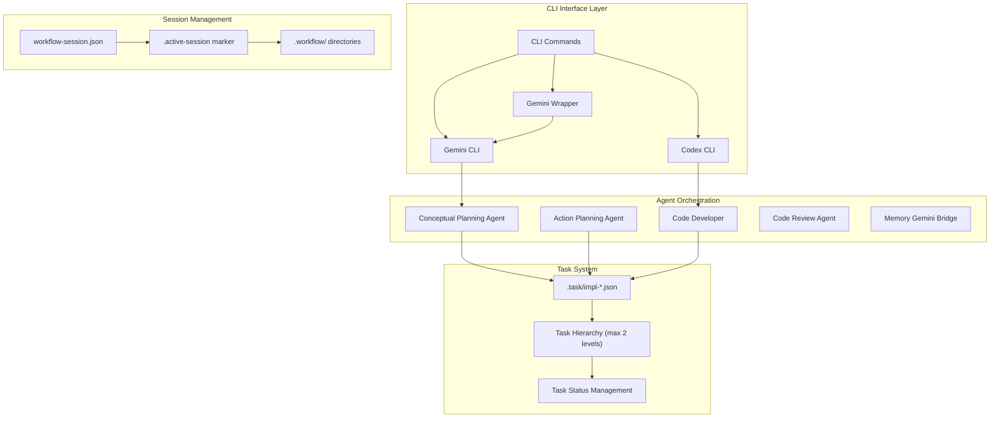
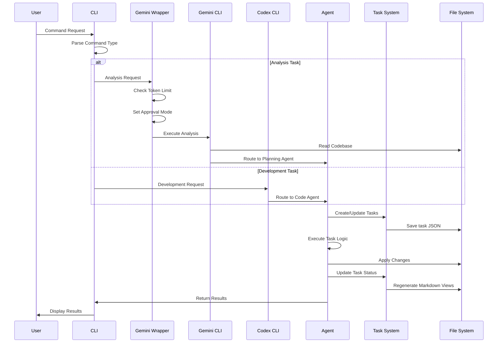
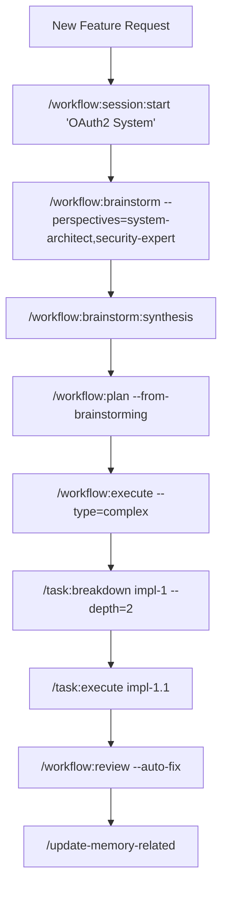

# Claude Code Workflow (CCW)

<div align="right">

**Languages:** [English](README.md) | [中文](README_CN.md)

</div>

A comprehensive multi-agent automation framework for software development that orchestrates complex development tasks through intelligent workflow management and autonomous execution.

> **📦 Latest Release v1.2**: Enhanced workflow diagrams, intelligent task saturation control, path-specific analysis system, and comprehensive documentation updates with detailed mermaid visualizations. See [CHANGELOG.md](CHANGELOG.md) for details.

## Architecture Overview

Claude Code Workflow (CCW) is built on three core architectural principles enhanced with intelligent workflow orchestration:

### **System Architecture Visualization**



### **JSON-First Data Model**
- **Single Source of Truth**: All workflow states and task definitions stored in structured `.task/impl-*.json` files
- **Task-Specific Paths**: New `paths` field enables precise CLI analysis targeting concrete project paths
- **Generated Views**: Markdown documents created on-demand from JSON data sources
- **Data Consistency**: Eliminates synchronization issues through centralized data management
- **Performance**: Direct JSON operations with sub-millisecond query response times

### **Atomic Session Management**
- **Marker File System**: Session state managed through atomic `.workflow/.active-[session]` files
- **Instant Context Switching**: Zero-overhead session management and switching
- **Conflict Resolution**: Automatic detection and resolution of session state conflicts
- **Scalability**: Support for concurrent sessions without performance degradation

### **Adaptive Complexity Management**
CCW automatically adjusts workflow structure based on project complexity:

| Complexity Level | Task Count | Structure | Features |
|------------------|------------|-----------|----------|
| **Simple** | <5 tasks | Single-level hierarchy | Minimal overhead, direct execution |
| **Medium** | 5-15 tasks | Two-level task breakdown | Progress tracking, automated documentation |
| **Complex** | >15 tasks | Three-level deep hierarchy | Full orchestration, multi-agent coordination |

## Major Enhancements Since v1.0

### **🚀 Intelligent Task Saturation Control**
Advanced workflow planning prevents agent overload and optimizes task distribution across the system.

### **🧠 Gemini Wrapper Intelligence**
Smart wrapper automatically manages token limits and approval modes based on task analysis:
- Analysis keywords → `--approval-mode default`
- Development tasks → `--approval-mode yolo`
- Automatic `--all-files` flag management based on project size

### **🎯 Path-Specific Analysis System**
New task-specific path management enables precise CLI analysis targeting concrete project paths instead of wildcards.

### **📝 Unified Template System**
Cross-tool template compatibility with shared template library supporting both Gemini and Codex workflows.

### **⚡ Enhanced Performance**
- Sub-millisecond JSON query response times
- 10-minute execution timeout for complex operations
- On-demand file creation reduces initialization overhead

### **Command Execution Flow**



## Complete Development Workflow Examples

### 🚀 **Complex Feature Development Flow**


### 🎯 **Planning Method Selection Guide**
| Project Type | Recommended Flow | Commands |
|--------------|------------------|----------|
| **Bug Fix** | Direct Planning | `/workflow:plan` → `/task:execute` |
| **Small Feature** | Gemini Analysis | `/gemini:mode:plan` → `/workflow:execute` |
| **Medium Feature** | Document + Gemini | Review docs → `/gemini:analyze` → `/workflow:plan` |
| **Large System** | Full Brainstorming | `/workflow:brainstorm` → synthesis → `/workflow:plan-deep` |

> 📊 **Comprehensive Workflow Diagrams**: For detailed system architecture, agent coordination, session management, and complete workflow variations, see [WORKFLOW_DIAGRAMS.md](WORKFLOW_DIAGRAMS.md).

## Core Components

### Multi-Agent System
- **Conceptual Planning Agent**: Strategic planning and architectural design
- **Action Planning Agent**: Converts high-level concepts into executable implementation plans  
- **Code Developer**: Autonomous code implementation and refactoring
- **Code Review Agent**: Quality assurance and compliance validation
- **Memory Gemini Bridge**: Intelligent documentation management and updates

### Dual CLI Integration
- **Gemini CLI**: Deep codebase analysis, pattern recognition, and investigation workflows
- **Codex CLI**: Autonomous development, code generation, and implementation automation
- **Task-Specific Targeting**: Precise path management for focused analysis (replaces `--all-files`)
- **Template System**: Unified template library for consistent workflow execution
- **Cross-Platform Support**: Windows and Linux compatibility with unified path handling

### Workflow Session Management
- **Session Lifecycle**: Create, pause, resume, switch, and manage development sessions
- **Context Preservation**: Maintains complete workflow state across session transitions
- **Hierarchical Organization**: Structured workflow filesystem with automatic initialization

### Intelligent Documentation System
- **Living Documentation**: Four-tier hierarchical CLAUDE.md system that updates automatically
- **Git Integration**: Context-aware updates based on repository changes
- **Dual Update Modes**: 
  - `related`: Updates only modules affected by recent changes
  - `full`: Complete project-wide documentation refresh

## Installation

### Quick Installation
```powershell
Invoke-Expression (Invoke-WebRequest -Uri "https://raw.githubusercontent.com/catlog22/Claude-Code-Workflow/main/install-remote.ps1" -UseBasicParsing).Content
```

### Verify Installation
```bash
/workflow:session list
```

### Required Configuration
For Gemini CLI integration, configure your settings:
```json
{
  "contextFileName": "CLAUDE.md"
}
```

## Complete Command Reference

### Core System Commands

| Command | Syntax | Description |
|---------|--------|-------------|
| `/enhance-prompt` | `/enhance-prompt <input>` | Enhance user inputs with technical context and structure |
| `/context` | `/context [task-id\|--filter] [--analyze] [--format=tree\|list\|json]` | Unified context management with automatic data consistency |
| `/update-memory-full` | `/update-memory-full` | Complete project-wide CLAUDE.md documentation update |
| `/update-memory-related` | `/update-memory-related` | Context-aware documentation updates for changed modules |

### Gemini CLI Commands (Analysis & Investigation)

| Command | Syntax | Description |
|---------|--------|-------------|
| `/gemini:analyze` | `/gemini:analyze <inquiry> [--all-files] [--save-session]` | Deep codebase analysis and pattern investigation |
| `/gemini:chat` | `/gemini:chat <inquiry> [--all-files] [--save-session]` | Direct Gemini CLI interaction without templates |
| `/gemini:execute` | `/gemini:execute <task-id\|description> [--yolo] [--debug]` | Intelligent execution with automatic context inference |
| `/gemini:mode:auto` | `/gemini:mode:auto "<description>"` | Automatic template selection based on input analysis |
| `/gemini:mode:bug-index` | `/gemini:mode:bug-index <bug-description>` | Specialized bug analysis and diagnostic workflows |
| `/gemini:mode:plan` | `/gemini:mode:plan <planning-topic>` | Architecture and planning template execution |

### Codex CLI Commands (Development & Implementation)

| Command | Syntax | Description |
|---------|--------|-------------|
| `/codex:analyze` | `/codex:analyze <inquiry> [patterns]` | Development-focused codebase analysis |
| `/codex:chat` | `/codex:chat <inquiry> [patterns]` | Direct Codex CLI interaction |
| `/codex:execute` | `/codex:execute <task-description> [patterns]` | Controlled autonomous development |
| `/codex:mode:auto` | `/codex:mode:auto "<task-description>"` | **Primary Mode**: Full autonomous development |
| `/codex:mode:bug-index` | `/codex:mode:bug-index <bug-description>` | Autonomous bug fixing and resolution |
| `/codex:mode:plan` | `/codex:mode:plan <planning-topic>` | Development planning and architecture |

### Workflow Management Commands

#### Session Management
| Command | Syntax | Description |
|---------|--------|-------------|
| `/workflow:session:start` | `/workflow:session:start "<session-name>"` | Create and activate new workflow session |
| `/workflow:session:pause` | `/workflow:session:pause` | Pause current active session |
| `/workflow:session:resume` | `/workflow:session:resume "<session-name>"` | Resume paused workflow session |
| `/workflow:session:list` | `/workflow:session:list [--active\|--all]` | List workflow sessions with status |
| `/workflow:session:switch` | `/workflow:session:switch "<session-name>"` | Switch to different workflow session |
| `/workflow:session:status` | `/workflow:session:status` | Display current session information |

#### Workflow Operations
| Command | Syntax | Description |
|---------|--------|-------------|
| `/workflow:brainstorm` | `/workflow:brainstorm <topic> [--perspectives=role1,role2,...]` | Multi-agent conceptual planning |
| `/workflow:plan` | `/workflow:plan [--from-brainstorming] [--skip-brainstorming]` | Convert concepts to executable plans |
| `/workflow:plan-deep` | `/workflow:plan-deep <topic> [--complexity=high] [--depth=3]` | Deep architectural planning with comprehensive analysis |
| `/workflow:execute` | `/workflow:execute [--type=simple\|medium\|complex] [--auto-create-tasks]` | Enter implementation phase |
| `/workflow:review` | `/workflow:review [--auto-fix]` | Quality assurance and validation |

#### Issue Management
| Command | Syntax | Description |
|---------|--------|-------------|
| `/workflow:issue:create` | `/workflow:issue:create "<title>" [--priority=level] [--type=type]` | Create new project issue |
| `/workflow:issue:list` | `/workflow:issue:list [--status=status] [--assigned=agent]` | List project issues with filtering |
| `/workflow:issue:update` | `/workflow:issue:update <issue-id> [--status=status] [--assign=agent]` | Update existing issue |
| `/workflow:issue:close` | `/workflow:issue:close <issue-id> [--reason=reason]` | Close resolved issue |

### Task Management Commands

| Command | Syntax | Description |
|---------|--------|-------------|
| `/task:create` | `/task:create "<title>" [--type=type] [--priority=level] [--parent=parent-id]` | Create implementation tasks with hierarchy |
| `/task:breakdown` | `/task:breakdown <task-id> [--strategy=auto\|interactive] [--depth=1-3]` | Decompose tasks into manageable subtasks |
| `/task:execute` | `/task:execute <task-id> [--mode=auto\|guided] [--agent=type]` | Execute tasks with agent selection |
| `/task:replan` | `/task:replan [task-id\|--all] [--reason] [--strategy=adjust\|rebuild]` | Adapt tasks to changing requirements |

### Brainstorming Role Commands

| Command | Description |
|---------|-------------|
| `/workflow:brainstorm:business-analyst` | Business requirements and market analysis |
| `/workflow:brainstorm:data-architect` | Data modeling and architecture planning |
| `/workflow:brainstorm:feature-planner` | Feature specification and user stories |
| `/workflow:brainstorm:innovation-lead` | Technology innovation and emerging solutions |
| `/workflow:brainstorm:product-manager` | Product strategy and roadmap planning |
| `/workflow:brainstorm:security-expert` | Security analysis and threat modeling |
| `/workflow:brainstorm:system-architect` | System design and technical architecture |
| `/workflow:brainstorm:ui-designer` | User interface and experience design |
| `/workflow:brainstorm:user-researcher` | User needs analysis and research insights |
| `/workflow:brainstorm:synthesis` | Integrate and synthesize multiple perspectives |

## Usage Workflows

### Complex Feature Development
```bash
# 1. Initialize workflow session
/workflow:session:start "OAuth2 Authentication System"

# 2. Multi-perspective analysis
/workflow:brainstorm "OAuth2 implementation strategy" \
  --perspectives=system-architect,security-expert,data-architect

# 3. Generate implementation plan
/workflow:plan --from-brainstorming

# 4. Create task hierarchy
/task:create "Backend Authentication API"
/task:breakdown IMPL-1 --strategy=auto --depth=2

# 5. Execute development tasks
/codex:mode:auto "Implement JWT token management system"
/codex:mode:auto "Create OAuth2 provider integration"

# 6. Review and validation
/workflow:review --auto-fix

# 7. Update documentation
/update-memory-related
```

### Bug Analysis and Resolution
```bash
# 1. Create focused session
/workflow:session:start "Payment Processing Bug Fix"

# 2. Analyze issue
/gemini:mode:bug-index "Payment validation fails on concurrent requests"

# 3. Implement solution
/codex:mode:auto "Fix race condition in payment validation logic"

# 4. Verify resolution
/workflow:review --auto-fix
```

### Project Documentation Management
```bash
# Daily development workflow
/update-memory-related

# After major changes
git commit -m "Feature implementation complete"
/update-memory-related

# Project-wide refresh
/update-memory-full

# Module-specific updates
cd src/api && /update-memory-related
```

## Directory Structure

```
.claude/
├── agents/                 # AI agent definitions and behaviors
├── commands/              # CLI command implementations  
├── output-styles/         # Output formatting templates
├── planning-templates/    # Role-specific planning approaches
├── prompt-templates/      # AI interaction templates
├── scripts/              # Automation and utility scripts
│   ├── read-task-paths.sh        # Convert task JSON paths to @ format
│   └── get_modules_by_depth.sh   # Project structure analysis
├── tech-stack-templates/ # Technology-specific configurations
├── workflows/            # Core workflow documentation
│   ├── system-architecture.md         # Architecture specifications
│   ├── data-model.md                 # JSON data model standards
│   ├── complexity-rules.md           # Complexity management rules
│   ├── session-management-principles.md # Session system design
│   ├── file-structure-standards.md   # Directory organization
│   ├── intelligent-tools-strategy.md # Tool selection strategy guide
│   └── tools-implementation-guide.md # Tool implementation details
└── settings.local.json   # Local environment configuration

.workflow/                 # Session workspace (auto-generated)
├── .active-[session-name] # Active session marker files
└── WFS-[topic-slug]/      # Individual session directories
    ├── workflow-session.json      # Session metadata
    ├── .task/impl-*.json          # JSON task definitions
    ├── IMPL_PLAN.md               # Generated planning documents
    └── .summaries/                # Completion summaries
```

## Technical Specifications

### Performance Metrics
- **Session switching**: <10ms average
- **JSON query response**: <1ms average  
- **Documentation updates**: <30s for medium projects
- **Context loading**: <5s for complex codebases

### System Requirements
- **Operating System**: Windows 10+, Ubuntu 18.04+, macOS 10.15+
- **Dependencies**: Git, Node.js (for Gemini CLI), Python 3.8+ (for Codex CLI)
- **Storage**: ~50MB for core installation, variable for project data
- **Memory**: 512MB minimum, 2GB recommended for complex workflows

### Integration Requirements
- **Gemini CLI**: Required for analysis workflows
- **Codex CLI**: Required for autonomous development
- **Git Repository**: Required for change tracking and documentation updates
- **Claude Code IDE**: Recommended for optimal command integration

## Configuration

### Required Configuration
For optimal CCW integration, configure Gemini CLI settings:

```json
// ~/.gemini/settings.json or .gemini/settings.json
{
  "contextFileName": "CLAUDE.md"
}
```

This setting ensures that CCW's intelligent documentation system integrates properly with Gemini CLI workflows.

### .geminiignore Configuration

To optimize Gemini CLI performance and reduce context noise, configure a `.geminiignore` file in your project root. This file excludes irrelevant files from analysis, providing cleaner context and faster processing.

#### Creating .geminiignore
Create `.geminiignore` in your project root:

```bash
# Exclude build outputs and dependencies
/dist/
/build/
/node_modules/
/.next/

# Exclude temporary files
*.tmp
*.log
/temp/

# Exclude sensitive files
/.env
/config/secrets.*
apikeys.txt

# Exclude large data files
*.csv
*.json
*.sql

# Include important documentation (negation)
!README.md
!CHANGELOG.md
!**/CLAUDE.md
```

#### Configuration Benefits
- **Improved Performance**: Faster analysis by excluding irrelevant files
- **Better Context**: Cleaner analysis results without build artifacts
- **Reduced Token Usage**: Lower costs by filtering out unnecessary content
- **Enhanced Focus**: Better AI understanding through relevant context only

#### Best Practices
- Always exclude `node_modules/`, `dist/`, `build/` directories
- Filter out log files, temporary files, and build artifacts
- Keep documentation files (use `!` to include specific patterns)
- Update `.geminiignore` when project structure changes
- Restart Gemini CLI session after modifying `.geminiignore`

**Note**: Unlike `.gitignore`, `.geminiignore` only affects Gemini CLI operations and does not impact Git versioning.

## Contributing

### Development Setup
1. Fork the repository
2. Create feature branch: `git checkout -b feature/enhancement-name`
3. Install dependencies: `npm install` or equivalent for your environment
4. Make changes following existing patterns
5. Test with sample projects
6. Submit pull request with detailed description

### Code Standards
- Follow existing command structure patterns
- Maintain backward compatibility for public APIs
- Add tests for new functionality
- Update documentation for user-facing changes
- Use semantic versioning for releases

## Support and Resources

- **Documentation**: [Project Wiki](https://github.com/catlog22/Claude-Code-Workflow/wiki)
- **Issues**: [GitHub Issues](https://github.com/catlog22/Claude-Code-Workflow/issues)
- **Discussions**: [Community Forum](https://github.com/catlog22/Claude-Code-Workflow/discussions)
- **Changelog**: [Release History](CHANGELOG.md)

## License

This project is licensed under the MIT License - see the [LICENSE](LICENSE) file for details.

---

**Claude Code Workflow (CCW)** - Professional software development workflow automation through intelligent agent coordination and autonomous execution capabilities.