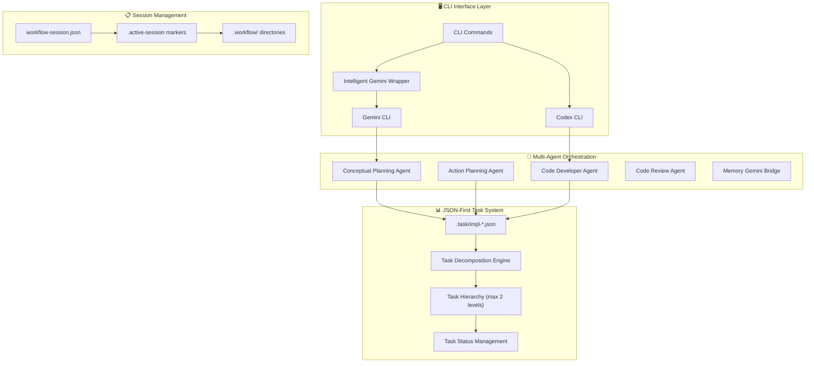
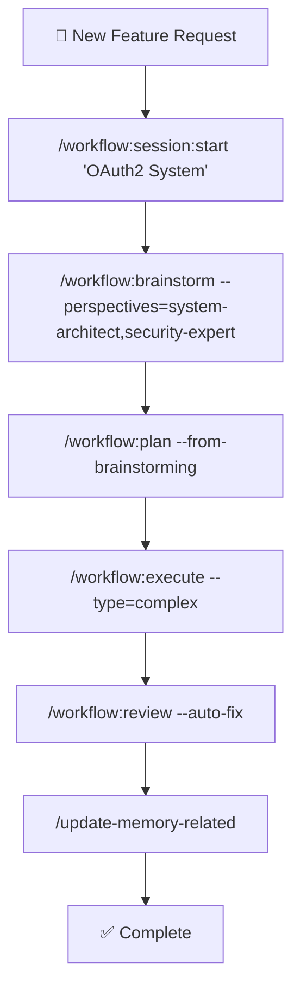

# 🚀 Claude Code Workflow (CCW)

<div align="center">

[](https://github.com/catlog22/Claude-Code-Workflow/releases)
[](LICENSE)
[]()

**Languages:** [English](README.md) | [中文](README_CN.md)

</div>

---

## 📋 Overview

**Claude Code Workflow (CCW)** is a next-generation multi-agent automation framework for software development that orchestrates complex development tasks through intelligent workflow management and autonomous execution.

> **🎯 Latest Release v2.0**: Major architectural evolution with enhanced workflow lifecycle, Python-powered backend (`pycli`), comprehensive test workflow generation, plan verification system, and brainstorm artifacts integration. See [CHANGELOG.md](CHANGELOG.md) for details.

### 🌟 Key Innovations

- **🔄 Enhanced Workflow Lifecycle**: Complete development cycle: Brainstorm → Plan → Verify → Execute → Test → Review
- **🐍 Python-Powered Backend**: Advanced `pycli` integration with hierarchical vector database support for semantic context discovery
- **🧪 Automated Test Generation**: Comprehensive test workflow generation (`/workflow:test-gen`) with full coverage planning
- **✅ Plan Verification System**: Pre-execution validation using dual Gemini/Codex analysis (`/workflow:plan-verify`)
- **🎯 JSON-First Architecture**: Single source of truth with atomic session management
- **💡 Brainstorm Artifacts**: Multi-perspective planning with synthesis and structured document generation

---

## 🏗️ System Architecture

### **🔧 Core Architectural Principles**



### 🏛️ **Three-Pillar Foundation**

| 🏗️ **JSON-First Data Model** | ⚡ **Atomic Session Management** | 🧩 **Adaptive Complexity** |
|---|---|---|
| Single source of truth | Marker-based session state | Auto-adjusts to project size |
| Sub-millisecond queries | Zero-overhead switching | Simple → Medium → Complex |
| Generated Markdown views | Conflict-free concurrency | Task limit enforcement |
| Data consistency guaranteed | Instant context switching | Intelligent decomposition |

---

## ✨ Major Enhancements v2.0

### 🔄 **Enhanced Workflow Lifecycle**
Complete development lifecycle with quality gates at each phase:

1. **💡 Brainstorm Phase** - Multi-perspective conceptual planning with role-based analysis
2. **📋 Plan Phase** - Structured implementation planning with task decomposition
3. **✅ Verify Phase** - Pre-execution validation using Gemini (strategic) + Codex (technical)
4. **⚡ Execute Phase** - Autonomous implementation with multi-agent orchestration
5. **🧪 Test Phase** - Automated test workflow generation with comprehensive coverage
6. **🔍 Review Phase** - Quality assurance and completion validation

### 🐍 **Python-Powered Backend (`pycli`)**
Advanced semantic context discovery system:

```bash
# Hierarchical vector database support
pycli --semantic-search "authentication patterns"

# Auto-detects parent directory vector DB
pycli --context-discovery --inherit-parent

# Intelligent file relevance scoring
pycli --analyze-relevance "jwt token validation"
```

### 🧪 **Automated Test Generation**
Comprehensive test workflow creation:
- **Implementation Analysis**: Scans completed IMPL-* tasks for test requirements
- **Multi-layered Testing**: Unit, Integration, E2E, Performance, Security tests
- **Agent Assignment**: Specialized test agents for different test types
- **Dependency Mapping**: Test execution follows implementation dependency chains

### ✅ **Plan Verification System**
Dual-engine validation before execution:
- **Gemini Strategic Analysis**: High-level feasibility and architectural soundness
- **Codex Technical Analysis**: Implementation details and technical feasibility
- **Cross-Validation**: Identifies conflicts between strategic vision and technical constraints
- **Improvement Suggestions**: Actionable recommendations before implementation begins

---

## 📊 Complexity Management System

CCW automatically adapts workflow structure based on project complexity:

| **Complexity** | **Task Count** | **Structure** | **Features** |
|---|---|---|---|
| 🟢 **Simple** | <5 tasks | Single-level | Minimal overhead, direct execution |
| 🟡 **Medium** | 5-10 tasks | Two-level hierarchy | Progress tracking, automated docs |
| 🔴 **Complex** | >10 tasks | Force re-scoping | Multi-iteration planning required |

---

## 🛠️ Complete Command Reference

### 🎮 **Core System Commands**

| Command | Function | Example |
|---------|----------|---------|
| `🎯 /enhance-prompt` | Technical context enhancement | `/enhance-prompt "add auth system"` |
| `📊 /context` | Unified context management | `/context --analyze --format=tree` |
| `📝 /update-memory-full` | Complete documentation update | `/update-memory-full` |
| `🔄 /update-memory-related` | Smart context-aware updates | `/update-memory-related` |

### 🔍 **Gemini CLI Commands** (Analysis & Investigation)

| Command | Purpose | Usage |
|---------|---------|-------|
| `🔍 /gemini:analyze` | Deep codebase analysis | `/gemini:analyze "authentication patterns"` |
| `💬 /gemini:chat` | Direct Gemini interaction | `/gemini:chat "explain this architecture"` |
| `⚡ /gemini:execute` | Intelligent execution | `/gemini:execute task-001` |
| `🎯 /gemini:mode:auto` | Auto template selection | `/gemini:mode:auto "analyze security"` |
| `🐛 /gemini:mode:bug-index` | Bug analysis workflow | `/gemini:mode:bug-index "payment fails"` |

### 🤖 **Codex CLI Commands** (Development & Implementation)

| Command | Purpose | Usage |
|---------|---------|-------|
| `🔍 /codex:analyze` | Development analysis | `/codex:analyze "optimization opportunities"` |
| `💬 /codex:chat` | Direct Codex interaction | `/codex:chat "implement JWT auth"` |
| `⚡ /codex:execute` | Controlled development | `/codex:execute "refactor user service"` |
| `🚀 /codex:mode:auto` | **PRIMARY**: Full autonomous | `/codex:mode:auto "build payment system"` |
| `🐛 /codex:mode:bug-index` | Autonomous bug fixing | `/codex:mode:bug-index "fix race condition"` |

### 🎯 **Workflow Management**

#### 📋 Session Management
| Command | Function | Usage |
|---------|----------|-------|
| `🚀 /workflow:session:start` | Create new session | `/workflow:session:start "OAuth2 System"` |
| `⏸️ /workflow:session:pause` | Pause current session | `/workflow:session:pause` |
| `▶️ /workflow:session:resume` | Resume session | `/workflow:session:resume "OAuth2 System"` |
| `📋 /workflow:session:list` | List all sessions | `/workflow:session:list --active` |
| `🔄 /workflow:session:switch` | Switch sessions | `/workflow:session:switch "Payment Fix"` |

#### 🎯 Workflow Operations
| Command | Function | Usage |
|---------|----------|-------|
| `💭 /workflow:brainstorm:*` | **NEW**: Multi-perspective planning | `/workflow:brainstorm:system-architect "microservices"` |
| `🎨 /workflow:brainstorm:artifacts` | **NEW**: Generate planning documents | `/workflow:brainstorm:artifacts --synthesis` |
| `📋 /workflow:plan` | Convert to executable plans | `/workflow:plan --from-brainstorming` |
| `✅ /workflow:plan-verify` | **NEW**: Pre-execution validation | `/workflow:plan-verify --dual-analysis` |
| `⚡ /workflow:execute` | Implementation phase | `/workflow:execute --autonomous` |
| `🧪 /workflow:test-gen` | **NEW**: Generate test workflows | `/workflow:test-gen --coverage=comprehensive` |
| `🔍 /workflow:review` | Quality assurance | `/workflow:review --auto-fix` |

#### 🏷️ Task Management
| Command | Function | Usage |
|---------|----------|-------|
| `➕ /task:create` | Create implementation task | `/task:create "User Authentication"` |
| `🔄 /task:breakdown` | Decompose into subtasks | `/task:breakdown IMPL-1 --depth=2` |
| `⚡ /task:execute` | Execute specific task | `/task:execute IMPL-1.1 --mode=auto` |
| `📋 /task:replan` | Adapt to changes | `/task:replan IMPL-1 --strategy=adjust` |

---

## 🎯 Complete Development Workflows

### 🚀 **Complex Feature Development**



### 🔥 **Quick Development Examples**

#### **🚀 Full Stack Feature Implementation**
```bash
# 1. Initialize focused session
/workflow:session:start "User Dashboard Feature"

# 2. Multi-perspective analysis
/workflow:brainstorm "dashboard analytics system" \
  --perspectives=system-architect,ui-designer,data-architect

# 3. Generate executable plan with task decomposition
/workflow:plan --from-brainstorming

# 4. Autonomous implementation
/codex:mode:auto "Implement user dashboard with analytics, charts, and real-time data"

# 5. Quality assurance and deployment
/workflow:review --auto-fix
/update-memory-related
```

#### **⚡ Rapid Bug Resolution**
```bash
# Quick bug fix workflow
/workflow:session:start "Payment Processing Fix"
/gemini:mode:bug-index "Payment validation fails on concurrent requests"
/codex:mode:auto "Fix race condition in payment validation with proper locking"
/workflow:review --auto-fix
```

#### **📊 Architecture Analysis & Refactoring**
```bash
# Deep architecture work
/workflow:session:start "API Refactoring Initiative"
/gemini:analyze "current API architecture patterns and technical debt"
/workflow:plan-deep "microservices transition" --complexity=high --depth=3
/codex:mode:auto "Refactor monolith to microservices following the analysis"
```

---

## 🏗️ Project Structure

```
📁 .claude/
├── 🤖 agents/                 # AI agent definitions
├── 🎯 commands/              # CLI command implementations
│   ├── 🔍 gemini/           # Gemini CLI commands
│   ├── 🤖 codex/            # Codex CLI commands
│   └── 🎯 workflow/         # Workflow management
├── 🎨 output-styles/         # Output formatting templates
├── 🎭 planning-templates/    # Role-specific planning
├── 💬 prompt-templates/      # AI interaction templates
├── 🔧 scripts/              # Automation utilities
│   ├── 📊 gemini-wrapper           # Intelligent Gemini wrapper
│   ├── 🐍 pycli                    # NEW: Python CLI backend
│   ├── 🛠️ install_pycli.sh          # NEW: Python tools installer
│   ├── 📋 read-task-paths.sh       # Task path conversion
│   └── 🏗️ get_modules_by_depth.sh  # Project analysis
├── 🛠️ workflows/            # Core workflow documentation
│   ├── 🏛️ workflow-architecture.md      # System architecture
│   ├── 📊 intelligent-tools-strategy.md # Tool selection guide
│   ├── 🐍 python-tools-strategy.md     # NEW: Python backend strategy
│   └── 🔧 tools-implementation-guide.md # Implementation details
└── ⚙️ settings.local.json   # Local configuration

📁 .workflow/                 # Session workspace (auto-generated)
├── 🏷️ .active-[session]     # Active session markers
└── 📋 WFS-[topic-slug]/      # Individual sessions
    ├── ⚙️ workflow-session.json    # Session metadata
    ├── 📊 .task/impl-*.json        # Task definitions
    ├── 📝 IMPL_PLAN.md             # Planning documents
    ├── ✅ TODO_LIST.md              # Progress tracking
    ├── 📚 .summaries/              # Completion summaries
    ├── 🧠 .process/                # NEW: Planning artifacts
    │   └── 📈 ANALYSIS_RESULTS.md  # Analysis results
    └── 🧪 WFS-test-[session]/     # NEW: Generated test workflows
```

---

## ⚡ Performance & Technical Specs

### 📊 **Performance Metrics**
| Metric | Performance | Details |
|--------|-------------|---------|
| 🔄 **Session Switching** | <10ms | Atomic marker file operations |
| 📊 **JSON Queries** | <1ms | Direct JSON access, no parsing overhead |
| 📝 **Doc Updates** | <30s | Medium projects, intelligent targeting |
| 🔍 **Context Loading** | <5s | Complex codebases with caching |
| ⚡ **Task Execution** | 10min timeout | Complex operations with error handling |

### 🛠️ **System Requirements**
- **🖥️ OS**: Windows 10+, Ubuntu 18.04+, macOS 10.15+
- **📦 Dependencies**: Git, Node.js (Gemini), Python 3.8+ (Codex)
- **💾 Storage**: ~50MB core + variable project data
- **🧠 Memory**: 512MB minimum, 2GB recommended

### 🔗 **Integration Requirements**
- **🔍 Gemini CLI**: Required for analysis workflows
- **🤖 Codex CLI**: Required for autonomous development
- **📂 Git Repository**: Required for change tracking
- **🎯 Claude Code IDE**: Recommended for optimal experience

---

## ⚙️ Installation & Configuration

### 🚀 **Quick Installation**
```powershell
Invoke-Expression (Invoke-WebRequest -Uri "https://raw.githubusercontent.com/catlog22/Claude-Code-Workflow/main/install-remote.ps1" -UseBasicParsing).Content
```

### ✅ **Verify Installation**
```bash
/workflow:session list
```

### ⚙️ **Essential Configuration**

#### **Gemini CLI Setup**
```json
// ~/.gemini/settings.json
{
  "contextFileName": "CLAUDE.md"
}
```

#### **Optimized .geminiignore**
```bash
# Performance optimization
/dist/
/build/
/node_modules/
/.next/

# Temporary files
*.tmp
*.log
/temp/

# Include important docs
!README.md
!**/CLAUDE.md
```

---

## 🤝 Contributing

### 🛠️ **Development Setup**
1. 🍴 Fork the repository
2. 🌿 Create feature branch: `git checkout -b feature/enhancement-name`
3. 📦 Install dependencies
4. ✅ Test with sample projects
5. 📤 Submit detailed pull request

### 📏 **Code Standards**
- ✅ Follow existing command patterns
- 🔄 Maintain backward compatibility
- 🧪 Add tests for new functionality
- 📚 Update documentation
- 🏷️ Use semantic versioning

---

## 📞 Support & Resources

<div align="center">

| Resource | Link | Description |
|----------|------|-------------|
| 📚 **Documentation** | [Project Wiki](https://github.com/catlog22/Claude-Code-Workflow/wiki) | Comprehensive guides |
| 🐛 **Issues** | [GitHub Issues](https://github.com/catlog22/Claude-Code-Workflow/issues) | Bug reports & features |
| 💬 **Discussions** | [Community Forum](https://github.com/catlog22/Claude-Code-Workflow/discussions) | Community support |
| 📋 **Changelog** | [Release History](CHANGELOG.md) | Version history |

</div>

---

## 📄 License

This project is licensed under the **MIT License** - see the [LICENSE](LICENSE) file for details.

---

<div align="center">

**🚀 Claude Code Workflow (CCW)**

*Professional software development workflow automation through intelligent multi-agent coordination and autonomous execution capabilities.*

[](https://github.com/catlog22/Claude-Code-Workflow)

</div>