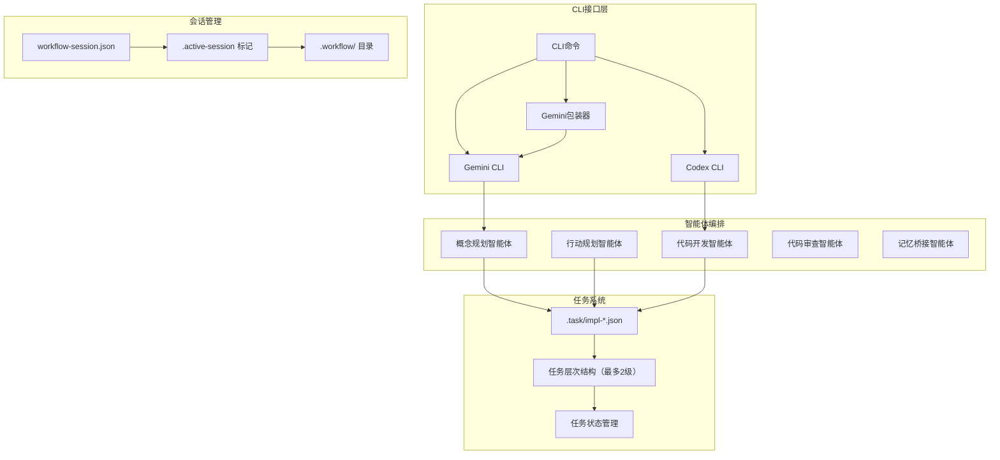
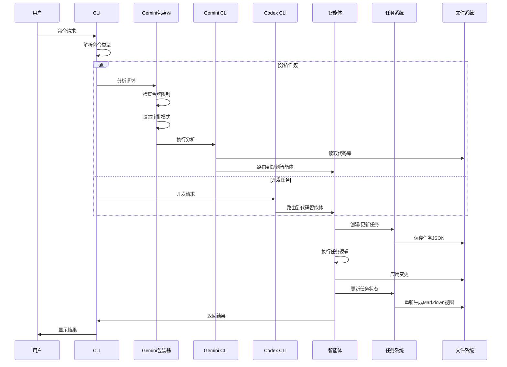

# Claude Code Workflow (CCW)

<div align="right">

**语言:** [English](README.md) | [中文](README_CN.md)

</div>

一个全面的多智能体自动化开发框架，通过智能工作流管理和自主执行协调复杂的软件开发任务。

> **📦 最新版本 v1.2**: 增强工作流图表、智能任务饱和控制、路径特定分析系统以及包含详细mermaid可视化的综合文档更新。详见[CHANGELOG.md](CHANGELOG.md)。

## 架构概览

Claude Code Workflow (CCW) 建立在三个核心架构原则之上，具备智能工作流编排功能：

### **系统架构可视化**



### **JSON优先数据模型**
- **单一数据源**: 所有工作流状态和任务定义存储在结构化的 `.task/impl-*.json` 文件中
- **任务特定路径**: 新增 `paths` 字段实现针对具体项目路径的精准CLI分析
- **生成视图**: 从JSON数据源按需创建Markdown文档
- **数据一致性**: 通过集中式数据管理消除同步问题
- **性能**: 直接JSON操作，亚毫秒级查询响应时间

### **原子化会话管理**
- **标记文件系统**: 通过原子化的 `.workflow/.active-[session]` 文件管理会话状态
- **即时上下文切换**: 零开销的会话管理和切换
- **冲突解决**: 自动检测和解决会话状态冲突
- **可扩展性**: 支持并发会话而无性能下降

### **自适应复杂度管理**
CCW根据项目复杂度自动调整工作流结构：

| 复杂度级别 | 任务数量 | 结构 | 功能 |
|------------|----------|------|------|
| **简单** | <5个任务 | 单级层次结构 | 最小开销，直接执行 |
| **中等** | 5-15个任务 | 两级任务分解 | 进度跟踪，自动文档 |
| **复杂** | >15个任务 | 三级深度层次结构 | 完全编排，多智能体协调 |

## v1.0以来的主要增强功能

### **🚀 智能任务饱和控制**
高级工作流规划防止智能体过载，优化整个系统中的任务分配。

### **🧠 Gemini包装器智能**
智能包装器根据任务分析自动管理令牌限制和审批模式：
- 分析关键词 → `--approval-mode default`
- 开发任务 → `--approval-mode yolo`
- 基于项目大小的自动 `--all-files` 标志管理

### **🎯 路径特定分析系统**
新的任务特定路径管理系统，实现针对具体项目路径的精确CLI分析，替代通配符。

### **📝 统一模板系统**
跨工具模板兼容性，共享模板库支持Gemini和Codex工作流。

### **⚡ 性能增强**
- 亚毫秒级JSON查询响应时间
- 复杂操作10分钟执行超时
- 按需文件创建减少初始化开销

### **命令执行流程**



> 📊 **完整工作流图表**: 有关详细的系统架构、智能体协调、会话管理和CLI集成图表，请参见 [WORKFLOW_DIAGRAMS.md](WORKFLOW_DIAGRAMS.md)。

## 核心组件

### 多智能体系统
- **概念规划智能体**: 战略规划和架构设计
- **行动规划智能体**: 将高层概念转换为可执行的实现计划
- **代码开发智能体**: 自主代码实现和重构
- **代码审查智能体**: 质量保证和合规性验证
- **记忆桥接智能体**: 智能文档管理和更新

### 双CLI集成
- **Gemini CLI**: 深度代码库分析，模式识别和调查工作流
- **Codex CLI**: 自主开发，代码生成和实现自动化
- **任务特定定位**: 精准路径管理实现聚焦分析（替代 `--all-files`）
- **模板系统**: 统一模板库确保一致的工作流执行
- **跨平台支持**: Windows和Linux兼容性，统一路径处理

### 工作流会话管理
- **会话生命周期**: 创建，暂停，恢复，切换和管理开发会话
- **上下文保持**: 在会话转换过程中维持完整的工作流状态
- **层次化组织**: 结构化工作流文件系统，自动初始化

### 智能文档系统
- **活文档**: 四层级分层CLAUDE.md系统，自动更新
- **Git集成**: 基于仓库变更的上下文感知更新
- **双更新模式**: 
  - `related`: 仅更新受近期变更影响的模块
  - `full`: 完整的项目级文档刷新

## 安装

### 快速安装
```powershell
Invoke-Expression (Invoke-WebRequest -Uri "https://raw.githubusercontent.com/catlog22/Claude-Code-Workflow/main/install-remote.ps1" -UseBasicParsing).Content
```

### 验证安装
```bash
/workflow:session list
```

### 必需配置
对于Gemini CLI集成，配置您的设置：
```json
{
  "contextFileName": "CLAUDE.md"
}
```

## 完整命令参考

### 核心系统命令

| 命令 | 语法 | 描述 |
|------|------|------|
| `/enhance-prompt` | `/enhance-prompt <输入>` | 用技术上下文和结构增强用户输入 |
| `/context` | `/context [任务ID\|--filter] [--analyze] [--format=tree\|list\|json]` | 统一上下文管理，自动数据一致性 |
| `/update-memory-full` | `/update-memory-full` | 完整的项目级CLAUDE.md文档更新 |
| `/update-memory-related` | `/update-memory-related` | 针对变更模块的上下文感知文档更新 |

### Gemini CLI命令（分析与调查）

| 命令 | 语法 | 描述 |
|------|------|------|
| `/gemini:analyze` | `/gemini:analyze <查询> [--all-files] [--save-session]` | 深度代码库分析和模式调查 |
| `/gemini:chat` | `/gemini:chat <查询> [--all-files] [--save-session]` | 无模板的直接Gemini CLI交互 |
| `/gemini:execute` | `/gemini:execute <任务ID\|描述> [--yolo] [--debug]` | 智能执行，自动上下文推断 |
| `/gemini:mode:auto` | `/gemini:mode:auto "<描述>"` | 基于输入分析的自动模板选择 |
| `/gemini:mode:bug-index` | `/gemini:mode:bug-index <错误描述>` | 专门的错误分析和诊断工作流 |
| `/gemini:mode:plan` | `/gemini:mode:plan <规划主题>` | 架构和规划模板执行 |

### Codex CLI命令（开发与实现）

| 命令 | 语法 | 描述 |
|------|------|------|
| `/codex:analyze` | `/codex:analyze <查询> [模式]` | 开发导向的代码库分析 |
| `/codex:chat` | `/codex:chat <查询> [模式]` | 直接Codex CLI交互 |
| `/codex:execute` | `/codex:execute <任务描述> [模式]` | 受控的自主开发 |
| `/codex:mode:auto` | `/codex:mode:auto "<任务描述>"` | **主要模式**: 完全自主开发 |
| `/codex:mode:bug-index` | `/codex:mode:bug-index <错误描述>` | 自主错误修复和解决 |
| `/codex:mode:plan` | `/codex:mode:plan <规划主题>` | 开发规划和架构 |

### 工作流管理命令

#### 会话管理
| 命令 | 语法 | 描述 |
|------|------|------|
| `/workflow:session:start` | `/workflow:session:start "<会话名称>"` | 创建并激活新的工作流会话 |
| `/workflow:session:pause` | `/workflow:session:pause` | 暂停当前活跃会话 |
| `/workflow:session:resume` | `/workflow:session:resume "<会话名称>"` | 恢复暂停的工作流会话 |
| `/workflow:session:list` | `/workflow:session:list [--active\|--all]` | 列出工作流会话及状态 |
| `/workflow:session:switch` | `/workflow:session:switch "<会话名称>"` | 切换到不同的工作流会话 |
| `/workflow:session:status` | `/workflow:session:status` | 显示当前会话信息 |

#### 工作流操作
| 命令 | 语法 | 描述 |
|------|------|------|
| `/workflow:brainstorm` | `/workflow:brainstorm <主题> [--perspectives=角色1,角色2,...]` | 多智能体概念规划 |
| `/workflow:plan` | `/workflow:plan [--from-brainstorming] [--skip-brainstorming]` | 将概念转换为可执行计划 |
| `/workflow:plan-deep` | `/workflow:plan-deep <主题> [--complexity=high] [--depth=3]` | 深度架构规划与综合分析 |
| `/workflow:execute` | `/workflow:execute [--type=simple\|medium\|complex] [--auto-create-tasks]` | 进入实现阶段 |
| `/workflow:review` | `/workflow:review [--auto-fix]` | 质量保证和验证 |

#### 问题管理
| 命令 | 语法 | 描述 |
|------|------|------|
| `/workflow:issue:create` | `/workflow:issue:create "<标题>" [--priority=级别] [--type=类型]` | 创建新项目问题 |
| `/workflow:issue:list` | `/workflow:issue:list [--status=状态] [--assigned=智能体]` | 列出项目问题并过滤 |
| `/workflow:issue:update` | `/workflow:issue:update <问题ID> [--status=状态] [--assign=智能体]` | 更新现有问题 |
| `/workflow:issue:close` | `/workflow:issue:close <问题ID> [--reason=原因]` | 关闭已解决的问题 |

### 任务管理命令

| 命令 | 语法 | 描述 |
|------|------|------|
| `/task:create` | `/task:create "<标题>" [--type=类型] [--priority=级别] [--parent=父ID]` | 创建带层次结构的实现任务 |
| `/task:breakdown` | `/task:breakdown <任务ID> [--strategy=auto\|interactive] [--depth=1-3]` | 将任务分解为可管理的子任务 |
| `/task:execute` | `/task:execute <任务ID> [--mode=auto\|guided] [--agent=类型]` | 执行任务并选择智能体 |
| `/task:replan` | `/task:replan [任务ID\|--all] [--reason] [--strategy=adjust\|rebuild]` | 使任务适应变更需求 |

### 头脑风暴角色命令

| 命令 | 描述 |
|------|------|
| `/workflow:brainstorm:business-analyst` | 业务需求和市场分析 |
| `/workflow:brainstorm:data-architect` | 数据建模和架构规划 |
| `/workflow:brainstorm:feature-planner` | 功能规范和用户故事 |
| `/workflow:brainstorm:innovation-lead` | 技术创新和新兴解决方案 |
| `/workflow:brainstorm:product-manager` | 产品策略和路线图规划 |
| `/workflow:brainstorm:security-expert` | 安全分析和威胁建模 |
| `/workflow:brainstorm:system-architect` | 系统设计和技术架构 |
| `/workflow:brainstorm:ui-designer` | 用户界面和体验设计 |
| `/workflow:brainstorm:user-researcher` | 用户需求分析和研究洞察 |
| `/workflow:brainstorm:synthesis` | 整合和综合多个视角 |

## 使用工作流

### 复杂功能开发
```bash
# 1. 初始化工作流会话
/workflow:session:start "OAuth2认证系统"

# 2. 多视角分析
/workflow:brainstorm "OAuth2实现策略" \
  --perspectives=system-architect,security-expert,data-architect

# 3. 生成实现计划
/workflow:plan --from-brainstorming

# 4. 创建任务层次结构
/task:create "后端认证API"
/task:breakdown IMPL-1 --strategy=auto --depth=2

# 5. 执行开发任务
/codex:mode:auto "实现JWT令牌管理系统"
/codex:mode:auto "创建OAuth2提供商集成"

# 6. 审查和验证
/workflow:review --auto-fix

# 7. 更新文档
/update-memory-related
```

### 错误分析和解决
```bash
# 1. 创建专注会话
/workflow:session:start "支付处理错误修复"

# 2. 分析问题
/gemini:mode:bug-index "并发请求时支付验证失败"

# 3. 实现解决方案
/codex:mode:auto "修复支付验证逻辑中的竞态条件"

# 4. 验证解决方案
/workflow:review --auto-fix
```

### 项目文档管理
```bash
# 日常开发工作流
/update-memory-related

# 重大变更后
git commit -m "功能实现完成"
/update-memory-related

# 项目级刷新
/update-memory-full

# 模块特定更新
cd src/api && /update-memory-related
```

## 目录结构

```
.claude/
├── agents/                 # AI智能体定义和行为
├── commands/              # CLI命令实现
├── output-styles/         # 输出格式模板
├── planning-templates/    # 角色特定的规划方法
├── prompt-templates/      # AI交互模板
├── scripts/              # 自动化和实用脚本
├── tech-stack-templates/ # 技术栈特定配置
├── workflows/            # 核心工作流文档
│   ├── system-architecture.md         # 架构规范
│   ├── data-model.md                 # JSON数据模型标准
│   ├── complexity-rules.md           # 复杂度管理规则
│   ├── session-management-principles.md # 会话系统设计
│   ├── file-structure-standards.md   # 目录组织
│   ├── gemini-unified.md             # Gemini CLI集成
│   └── codex-unified.md              # Codex CLI集成
└── settings.local.json   # 本地环境配置

.workflow/                 # 会话工作空间（自动生成）
├── .active-[session-name] # 活跃会话标记文件
└── WFS-[topic-slug]/      # 个别会话目录
    ├── workflow-session.json      # 会话元数据
    ├── .task/impl-*.json          # JSON任务定义
    ├── IMPL_PLAN.md               # 生成的规划文档
    └── .summaries/                # 完成摘要
```

## 技术规范

### 性能指标
- **会话切换**: 平均<10ms
- **JSON查询响应**: 平均<1ms
- **文档更新**: 中型项目<30s
- **上下文加载**: 复杂代码库<5s

### 系统要求
- **操作系统**: Windows 10+, Ubuntu 18.04+, macOS 10.15+
- **依赖项**: Git, Node.js（用于Gemini CLI）, Python 3.8+（用于Codex CLI）
- **存储**: 核心安装约50MB，项目数据可变
- **内存**: 最低512MB，复杂工作流推荐2GB

### 集成要求
- **Gemini CLI**: 分析工作流必需
- **Codex CLI**: 自主开发必需
- **Git仓库**: 变更跟踪和文档更新必需
- **Claude Code IDE**: 推荐用于最佳命令集成

## 配置

### 必需配置
为了实现最佳的CCW集成效果，请配置Gemini CLI设置：

```json
// ~/.gemini/settings.json 或 .gemini/settings.json
{
  "contextFileName": "CLAUDE.md"
}
```

此设置确保CCW的智能文档系统能够与Gemini CLI工作流正确集成。

### .geminiignore 配置

为了优化Gemini CLI性能并减少上下文噪声，请在项目根目录配置 `.geminiignore` 文件。此文件可以排除无关文件的分析，提供更清洁的上下文和更快的处理速度。

#### 创建 .geminiignore
在项目根目录创建 `.geminiignore` 文件：

```bash
# 排除构建输出和依赖项
/dist/
/build/
/node_modules/
/.next/

# 排除临时文件
*.tmp
*.log
/temp/

# 排除敏感文件
/.env
/config/secrets.*
apikeys.txt

# 排除大型数据文件
*.csv
*.json
*.sql

# 包含重要文档（取反模式）
!README.md
!CHANGELOG.md
!**/CLAUDE.md
```

#### 配置优势
- **提升性能**: 通过排除无关文件实现更快的分析速度
- **更好的上下文**: 没有构建产物的更清洁分析结果
- **减少令牌使用**: 通过过滤不必要内容降低成本
- **增强专注度**: 通过相关上下文获得更好的AI理解

#### 最佳实践
- 始终排除 `node_modules/`、`dist/`、`build/` 目录
- 过滤日志文件、临时文件和构建产物
- 保留文档文件（使用 `!` 包含特定模式）
- 项目结构变更时更新 `.geminiignore`
- 修改 `.geminiignore` 后重启Gemini CLI会话

**注意**: 与 `.gitignore` 不同，`.geminiignore` 仅影响Gemini CLI操作，不会影响Git版本控制。

## 贡献

### 开发设置
1. Fork仓库
2. 创建功能分支: `git checkout -b feature/enhancement-name`
3. 安装依赖: `npm install` 或适合您环境的等效命令
4. 按照现有模式进行更改
5. 使用示例项目测试
6. 提交详细描述的拉取请求

### 代码标准
- 遵循现有的命令结构模式
- 维护公共API的向后兼容性
- 为新功能添加测试
- 更新面向用户的变更文档
- 使用语义版本控制进行发布

## 支持和资源

- **文档**: [项目Wiki](https://github.com/catlog22/Claude-Code-Workflow/wiki)
- **问题**: [GitHub Issues](https://github.com/catlog22/Claude-Code-Workflow/issues)
- **讨论**: [社区论坛](https://github.com/catlog22/Claude-Code-Workflow/discussions)
- **变更日志**: [发布历史](CHANGELOG.md)

## 许可证

此项目根据MIT许可证授权 - 详见[LICENSE](LICENSE)文件。

---

**Claude Code Workflow (CCW)** - 通过智能体协调和自主执行能力实现专业的软件开发工作流自动化。