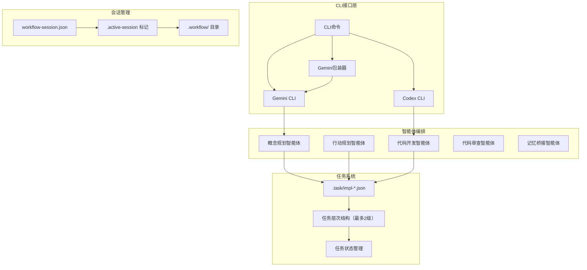
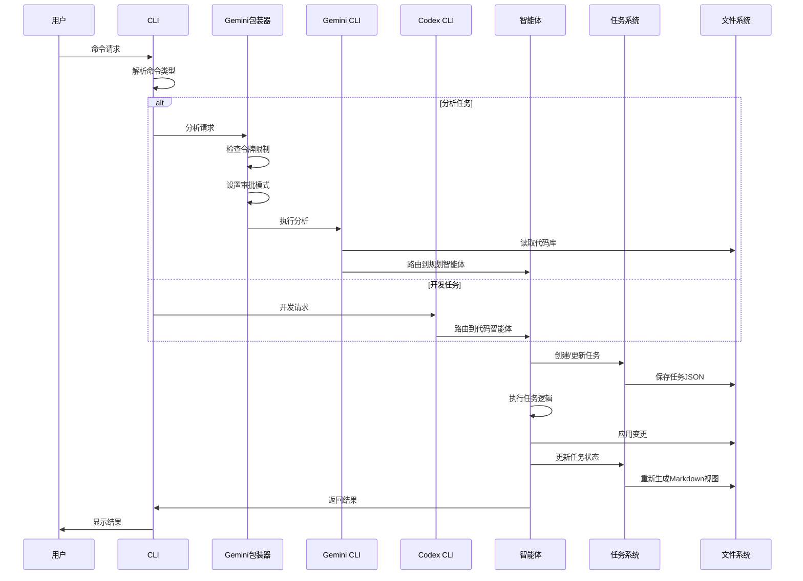
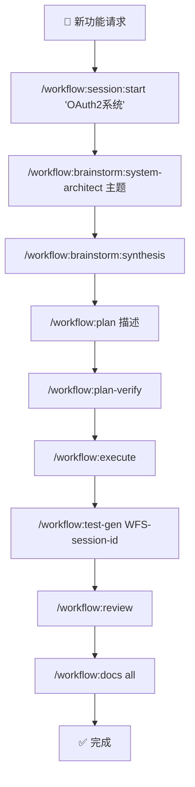

# 🚀 Claude Code Workflow (CCW)

<div align="center">

[](https://github.com/catlog22/Claude-Code-Workflow/releases)
[](LICENSE)
[]()
[](https://github.com/modelcontextprotocol)

**语言:** [English](README.md) | [中文](README_CN.md)

</div>

---

## ⚙️ 安装

### 🚀 **一键快速安装**

CCW 为所有平台提供原生安装脚本 - 无需跨平台依赖！

**Windows (PowerShell):**
```powershell
Invoke-Expression (Invoke-WebRequest -Uri "https://raw.githubusercontent.com/catlog22/Claude-Code-Workflow/main/install-remote.ps1" -UseBasicParsing).Content
```

**Linux/macOS (Bash/Zsh):**
```bash
bash <(curl -fsSL https://raw.githubusercontent.com/catlog22/Claude-Code-Workflow/main/install-remote.sh)
```

### 📦 **从克隆仓库本地安装**

如果您希望在安装前审查代码：

**1. 克隆仓库:**
```bash
git clone https://github.com/catlog22/Claude-Code-Workflow.git
cd Claude-Code-Workflow
```

**2. 运行本地安装器:**

**Windows:**
```powershell
.\Install-Claude.ps1
```

**Linux/macOS:**
```bash
chmod +x Install-Claude.sh
./Install-Claude.sh
```

### ✅ **验证安装**

安装完成后，验证 CCW 是否正常工作：
```bash
/workflow:session:list
```

### 📋 **安装脚本概览**

| 脚本 | 平台 | 用途 |
|------|------|------|
| `install-remote.ps1` | Windows | 通过 PowerShell 一键远程安装 |
| `install-remote.sh` | Linux/macOS | 通过 Bash 一键远程安装 |
| `Install-Claude.ps1` | Windows | 带 GUI 菜单的本地交互式安装器 |
| `Install-Claude.sh` | Linux/macOS | 带彩色菜单的本地交互式安装器 |

**所有安装器都支持:**
- ✅ 交互模式：箭头键导航 (Windows) 或数字菜单 (Linux/macOS)
- ✅ 自动备份现有文件（默认启用）
- ✅ 全局安装到 `~/.claude/` 或自定义路径
- ✅ 非交互模式用于自动化
- ✅ 强制模式跳过确认提示

---

## 📋 概述

**Claude Code Workflow (CCW)** 是新一代多智能体自动化开发框架，通过智能工作流管理和自主执行协调复杂的软件开发任务。

> **🎉 最新版本 v3.0.0**: 重大更新，采用**统一 CLI 命令结构**。将 Gemini、Qwen 和 Codex 命令整合为单一的 `/cli:*` 命令集，通过 `--tool` 标志选择工具。包含完整工作流指南和命令验证。详见 [CHANGELOG.md](CHANGELOG.md)。

> **⚠️ 破坏性变更**: 旧的工具特定命令（`/gemini:*`、`/qwen:*`、`/codex:*`）已弃用。请使用新的统一 `/cli:*` 命令。详见下方迁移指南。

### 🌟 核心创新

- **🔄 增强的工作流生命周期**: 完整开发周期：头脑风暴 → 规划 → 验证 → 执行 → 测试 → 审查
- **🧪 自动测试生成**: 全面的测试工作流生成 (`/workflow:test-gen`) 与完整覆盖规划
- **✅ 计划验证系统**: 使用 Gemini/Codex 双重分析的执行前验证 (`/workflow:plan-verify`)
- **🎯 JSON优先架构**: 具有原子会话管理的单一数据源
- **💡 头脑风暴产物**: 多视角规划与综合和结构化文档生成
- **🚀 MCP 工具集成**: 通过模型上下文协议实现增强的代码库分析和外部上下文获取

### 🔧 MCP 工具增强 (NEW!)

**通过 MCP (Model Context Protocol) 工具实现的高级代码库分析:**

#### 必需的 MCP 服务器
1. **Exa MCP Server** - 外部 API 模式和示例
   - 仓库: https://github.com/exa-labs/exa-mcp-server
   - 功能: `mcp__exa__get_code_context_exa()` - 获取外部最佳实践

2. **Code Index MCP** - 内部代码库探索
   - 仓库: https://github.com/johnhuang316/code-index-mcp
   - 功能:
     - `mcp__code-index__find_files()` - 文件模式匹配
     - `mcp__code-index__search_code_advanced()` - 高级代码搜索

#### MCP 集成优势
- **📊 更快分析**: 直接代码库索引 vs 手动文件搜索
- **🌐 外部上下文**: 真实世界的 API 模式和实现示例
- **🔍 模式识别**: 高级代码模式匹配和相似性检测
- **📈 全面覆盖**: 内部代码探索和外部最佳实践查找
- **⚡ 自动回退**: 如果 MCP 工具不可用，工作流使用传统 bash/CLI 工具

#### 安装和设置
请安装这些 MCP 服务器以启用增强的代码库分析。工作流将在可用时自动使用它们。

---

## 🏗️ 系统架构

### 🏛️ **四层架构**

CCW 通过四个不同的架构层运行，具有明确的职责和数据契约：

| 层级 | 组件 | 数据流 | 集成点 |
|------|------|--------|--------|
| **🖥️ 接口层** | CLI 命令、Gemini/Codex/Qwen 包装器 | 用户输入 → 命令 → 智能体 | 外部 CLI 工具、审批模式 |
| **📋 会话层** | `.active-[session]` 标记、`workflow-session.json` | 会话状态 → 任务发现 | 原子会话切换 |
| **📊 任务/数据层** | `.task/impl-*.json`、层次管理 | 任务定义 → 智能体执行 | JSON优先模型、生成视图 |
| **🤖 编排层** | 多智能体协调、依赖解析 | 智能体输出 → 任务更新 | 智能执行流程 |

### **系统架构可视化**



### **JSON优先数据模型**
- **单一数据源**: 所有工作流状态和任务定义存储在结构化的 `.task/impl-*.json` 文件中
- **任务特定路径**: 新增 `paths` 字段实现针对具体项目路径的精准CLI分析
- **生成视图**: 从JSON数据源按需创建Markdown文档
- **数据一致性**: 通过集中式数据管理消除同步问题
- **性能**: 直接JSON操作，亚毫秒级查询响应时间

### **原子化会话管理**
- **标记文件系统**: 通过原子化的 `.workflow/.active-[session]` 文件管理会话状态
- **即时上下文切换**: 零开销的会话管理和切换
- **冲突解决**: 自动检测和解决会话状态冲突
- **可扩展性**: 支持并发会话而无性能下降

---

## 📊 复杂度管理系统

CCW 根据项目复杂度自动调整工作流结构：

| **复杂度** | **任务数量** | **结构** | **功能** |
|---|---|---|---|
| 🟢 **简单** | <5 任务 | 单级层次结构 | 最小开销，直接执行 |
| 🟡 **中等** | 5-10 任务 | 两级层次结构 | 进度跟踪，自动文档 |
| 🔴 **复杂** | >10 任务 | 强制重新划分范围 | 需要多迭代规划 |

---

### **命令执行流程**



## 完整开发工作流示例

### 🚀 **增强的工作流生命周期**



### ⚡ **工作流会话管理**


### 🎯 **规划方法选择指南**
| 项目类型 | 推荐流程 | 命令序列 |
|----------|----------|----------|
| **Bug修复** | 直接规划 | `/workflow:plan` → `/task:execute` |
| **小功能** | Gemini分析 | `/gemini:mode:plan` → `/workflow:execute` |
| **中等功能** | 文档+Gemini | 查看文档 → `/gemini:analyze` → `/workflow:plan` |
| **大型系统** | 完整头脑风暴 | `/workflow:brainstorm` → 综合 → `/workflow:plan-deep` |

### ✨ v2.0 主要增强功能

### 🔄 **增强的工作流生命周期**
每个阶段都有质量门禁的完整开发生命周期：

1. **💡 头脑风暴阶段** - 基于角色分析的多视角概念规划
2. **📋 规划阶段** - 结构化实现规划与任务分解
3. **✅ 验证阶段** - 使用 Gemini（战略）+ Codex（技术）的执行前验证
4. **⚡ 执行阶段** - 多智能体编排的自主实现
5. **🧪 测试阶段** - 全面覆盖的自动测试工作流生成
6. **🔍 审查阶段** - 质量保证和完成验证

### 🧪 **自动测试生成**
全面的测试工作流创建：
- **实现分析**: 扫描已完成的 IMPL-* 任务以确定测试需求
- **多层测试**: 单元、集成、E2E、性能、安全测试
- **智能体分配**: 不同测试类型的专门测试智能体
- **依赖映射**: 测试执行遵循实现依赖链

### ✅ **计划验证系统**
执行前的双引擎验证：
- **Gemini 战略分析**: 高级可行性和架构合理性
- **Codex 技术分析**: 实现细节和技术可行性
- **交叉验证**: 识别战略愿景与技术约束之间的冲突
- **改进建议**: 实现开始前的可行性建议

## 核心组件

### 多智能体系统
- **概念规划智能体**: 战略规划和架构设计
- **行动规划智能体**: 将高层概念转换为可执行的实现计划
- **代码开发智能体**: 自主代码实现和重构
- **代码审查智能体**: 质量保证和合规性验证
- **记忆桥接智能体**: 智能文档管理和更新

### 双CLI集成
- **Gemini CLI**: 深度代码库分析，模式识别和调查工作流
- **Codex CLI**: 自主开发，代码生成和实现自动化
- **任务特定定位**: 精准路径管理实现聚焦分析（替代 `--all-files`）
- **模板系统**: 统一模板库确保一致的工作流执行
- **跨平台支持**: Windows和Linux兼容性，统一路径处理

### 工作流会话管理
- **会话生命周期**: 创建，暂停，恢复，切换和管理开发会话
- **上下文保持**: 在会话转换过程中维持完整的工作流状态
- **层次化组织**: 结构化工作流文件系统，自动初始化

### 智能文档系统
- **活文档**: 四层级分层CLAUDE.md系统，自动更新
- **Git集成**: 基于仓库变更的上下文感知更新
- **双更新模式**: 
  - `related`: 仅更新受近期变更影响的模块
  - `full`: 完整的项目级文档刷新

## 必需配置
对于Gemini CLI集成，配置您的设置：
```json
{
  "contextFileName": "CLAUDE.md"
}
```

## 完整命令参考

### 核心系统命令

| 命令 | 语法 | 描述 |
|------|------|------|
| `🎯 /enhance-prompt` | `/enhance-prompt "添加认证系统"` | 技术上下文增强 |
| `📊 /context` | `/context --analyze --format=tree` | 统一上下文管理 |
| `📝 /update-memory-full` | `/update-memory-full` | 完整文档更新 |
| `🔄 /update-memory-related` | `/update-memory-related` | 智能上下文感知更新 |

### 🔍 Gemini CLI命令（分析与调查）

| 命令 | 语法 | 描述 |
|------|------|------|
| `🔍 /gemini:analyze` | `/gemini:analyze "认证模式"` | 深度代码库分析 |
| `💬 /gemini:chat` | `/gemini:chat "解释这个架构"` | 直接Gemini交互 |
| `⚡ /gemini:execute` | `/gemini:execute "实现任务-001"` | 智能执行（YOLO权限） |
| `🎯 /gemini:mode:auto` | `/gemini:mode:auto "分析安全漏洞"` | 自动模板选择 |
| `🐛 /gemini:mode:bug-index` | `/gemini:mode:bug-index "支付处理失败"` | 错误分析和修复建议 |
| `📋 /gemini:mode:plan` | `/gemini:mode:plan "微服务架构"` | 项目规划和架构 |
| `🎯 /gemini:mode:plan-precise` | `/gemini:mode:plan-precise "复杂重构"` | 精确路径规划分析 |

### 🔮 Qwen CLI命令（架构与代码生成）

| 命令 | 语法 | 描述 |
|------|------|------|
| `🔍 /qwen:analyze` | `/qwen:analyze "系统架构模式"` | 架构分析和代码质量 |
| `💬 /qwen:chat` | `/qwen:chat "设计认证系统"` | 直接Qwen交互 |
| `⚡ /qwen:execute` | `/qwen:execute "实现用户认证"` | 智能实现（YOLO权限） |
| `🚀 /qwen:mode:auto` | `/qwen:mode:auto "构建微服务API"` | 自动模板选择和执行 |
| `🐛 /qwen:mode:bug-index` | `/qwen:mode:bug-index "服务内存泄漏"` | 错误分析和修复建议 |
| `📋 /qwen:mode:plan` | `/qwen:mode:plan "设计可扩展数据库"` | 架构规划和分析 |
| `🎯 /qwen:mode:plan-precise` | `/qwen:mode:plan-precise "复杂系统迁移"` | 精确架构规划 |

### 🤖 Codex CLI命令（开发与实现）

| 命令 | 语法 | 描述 |
|------|------|------|
| `🔍 /codex:analyze` | `/codex:analyze "优化机会"` | 开发分析 |
| `💬 /codex:chat` | `/codex:chat "实现JWT认证"` | 直接Codex交互 |
| `⚡ /codex:execute` | `/codex:execute "重构用户服务"` | 自主实现（YOLO权限） |
| `🚀 /codex:mode:auto` | `/codex:mode:auto "构建支付系统"` | **主要模式**: 完全自主开发 |
| `🐛 /codex:mode:bug-index` | `/codex:mode:bug-index "修复竞态条件"` | 自主错误修复和实现 |
| `📋 /codex:mode:plan` | `/codex:mode:plan "实现API端点"` | 开发规划和实现 |

### 工作流管理命令

#### 会话管理
| 命令 | 语法 | 描述 |
|------|------|------|
| `/workflow:session:start` | `/workflow:session:start "<会话名称>"` | 创建并激活新的工作流会话 |
| `/workflow:session:pause` | `/workflow:session:pause` | 暂停当前活跃会话 |
| `/workflow:session:resume` | `/workflow:session:resume "<会话名称>"` | 恢复暂停的工作流会话 |
| `/workflow:session:list` | `/workflow:session:list [--active\|--all]` | 列出工作流会话及状态 |
| `/workflow:session:switch` | `/workflow:session:switch "<会话名称>"` | 切换到不同的工作流会话 |
| `/workflow:session:status` | `/workflow:session:status` | 显示当前会话信息 |

#### 工作流操作
| 命令 | 语法 | 描述 |
|------|------|------|
| `💭 /workflow:brainstorm:*` | `/workflow:brainstorm:system-architect "微服务"` | 角色专家的多视角规划 |
| `🤝 /workflow:brainstorm:synthesis` | `/workflow:brainstorm:synthesis` | 综合所有头脑风暴视角 |
| `🎨 /workflow:brainstorm:artifacts` | `/workflow:brainstorm:artifacts "主题描述"` | 生成结构化规划文档 |
| `📋 /workflow:plan` | `/workflow:plan "描述" \| file.md \| ISS-001` | 转换为可执行实现计划 |
| `🔍 /workflow:plan-deep` | `/workflow:plan-deep "需求描述"` | Gemini分析的深度技术规划 |
| `✅ /workflow:plan-verify` | `/workflow:plan-verify` | 双分析的执行前验证 |
| `⚡ /workflow:execute` | `/workflow:execute` | 协调智能体进行实现 |
| `🔄 /workflow:resume` | `/workflow:resume [--from TASK-ID] [--retry]` | 智能工作流恢复 |
| `📊 /workflow:status` | `/workflow:status [task-id] [format] [validation]` | 从任务数据生成按需视图 |
| `🧪 /workflow:test-gen` | `/workflow:test-gen WFS-session-id` | 生成全面测试工作流 |
| `🔍 /workflow:review` | `/workflow:review` | 执行质量验证审查阶段 |
| `📚 /workflow:docs` | `/workflow:docs "architecture" \| "api" \| "all"` | 生成分层文档 |

#### 🏷️ 问题管理
| 命令 | 语法 | 描述 |
|------|------|------|
| `➕ /workflow:issue:create` | `/workflow:issue:create "API 速率限制" --priority=high` | 创建新项目问题 |
| `📋 /workflow:issue:list` | `/workflow:issue:list --status=open --assigned=system-architect` | 列出和过滤问题 |
| `📝 /workflow:issue:update` | `/workflow:issue:update ISS-001 --status=in-progress` | 更新现有问题 |
| `✅ /workflow:issue:close` | `/workflow:issue:close ISS-001 --reason=resolved` | 关闭已完成问题 |

### 任务管理命令

| 命令 | 语法 | 描述 |
|------|------|------|
| `➕ /task:create` | `/task:create "用户认证系统"` | 创建带上下文的实现任务 |
| `🔄 /task:breakdown` | `/task:breakdown task-id` | 智能任务分解 |
| `⚡ /task:execute` | `/task:execute task-id` | 用适当的智能体执行任务 |
| `📋 /task:replan` | `/task:replan task-id ["text" \| file.md \| ISS-001]` | 用详细输入重新规划任务 |

#### 🧠 头脑风暴角色命令
| 角色 | 命令 | 目的 |
|------|---------|----------|
| 🏗️ **系统架构师** | `/workflow:brainstorm:system-architect` | 技术架构分析 |
| 🔒 **安全专家** | `/workflow:brainstorm:security-expert` | 安全和威胁分析 |
| 📊 **产品经理** | `/workflow:brainstorm:product-manager` | 用户需求和商业价值 |
| 🎨 **UI设计师** | `/workflow:brainstorm:ui-designer` | 用户体验和界面 |
| 📈 **业务分析师** | `/workflow:brainstorm:business-analyst` | 流程优化分析 |
| 🔬 **创新负责人** | `/workflow:brainstorm:innovation-lead` | 新兴技术机会 |
| 📋 **功能规划师** | `/workflow:brainstorm:feature-planner` | 功能开发规划 |
| 🗄️ **数据架构师** | `/workflow:brainstorm:data-architect` | 数据建模和分析 |
| 👥 **用户研究员** | `/workflow:brainstorm:user-researcher` | 用户行为分析 |
| 🚀 **自动选择** | `/workflow:brainstorm:auto` | 动态角色选择 |

### 头脑风暴角色命令

| 命令 | 描述 |
|------|------|
| `/workflow:brainstorm:business-analyst` | 业务需求和市场分析 |
| `/workflow:brainstorm:data-architect` | 数据建模和架构规划 |
| `/workflow:brainstorm:feature-planner` | 功能规范和用户故事 |
| `/workflow:brainstorm:innovation-lead` | 技术创新和新兴解决方案 |
| `/workflow:brainstorm:product-manager` | 产品策略和路线图规划 |
| `/workflow:brainstorm:security-expert` | 安全分析和威胁建模 |
| `/workflow:brainstorm:system-architect` | 系统设计和技术架构 |
| `/workflow:brainstorm:ui-designer` | 用户界面和体验设计 |
| `/workflow:brainstorm:user-researcher` | 用户需求分析和研究洞察 |
| `/workflow:brainstorm:synthesis` | 整合和综合多个视角 |

## 使用工作流

### 完整功能开发工作流
```bash
# 1. 初始化专注会话
/workflow:session:start "用户仪表盘功能"

# 2. 多视角头脑风暴
/workflow:brainstorm:system-architect "仪表盘分析系统"
/workflow:brainstorm:ui-designer "仪表盘用户体验"
/workflow:brainstorm:data-architect "分析数据流"

# 3. 综合所有视角
/workflow:brainstorm:synthesis

# 4. 创建可执行实现计划
/workflow:plan "用户仪表盘与分析和实时数据"

# 5. 执行前验证计划
/workflow:plan-verify

# 6. 智能体协调执行实现
/workflow:execute

# 7. 生成全面测试套件
/workflow:test-gen WFS-user-dashboard-feature

# 8. 质量保证和审查
/workflow:review

# 9. 生成文档
/workflow:docs "all"
```

### 快速错误解决
```bash
# 快速错误修复工作流
/workflow:session:start "支付处理修复"
/gemini:mode:bug-index "并发请求时支付验证失败"
/codex:mode:bug-index "修复支付验证竞态条件"
/workflow:review
```

### 架构分析与重构
```bash
# 深度架构工作流
/workflow:session:start "API重构倡议"
/gemini:analyze "当前API架构模式和技术债务"
/workflow:plan-deep "微服务转换策略"
/workflow:plan-verify
/qwen:mode:auto "重构单体架构为微服务架构"
/workflow:test-gen WFS-api-refactoring-initiative
/workflow:review
```

### 项目文档管理
```bash
# 日常开发工作流
/update-memory-related

# 重大变更后
git commit -m "功能实现完成"
/update-memory-related

# 项目级刷新
/update-memory-full

# 模块特定更新
cd src/api && /update-memory-related
```

---

## 📖 完整工作流详解

> **💡 社区讨论**: [LINUX DO 论坛讨论帖](https://linux.do/t/topic/995175/24)
> **📦 项目仓库**: [GitHub - Claude-Code-Workflow](https://github.com/catlog22/Claude-Code-Workflow)

### 🎯 核心工作流程

**完整开发流程**: 头脑风暴 → 用户打磨修改 → 行动规划 → 执行 → 测试


### 🧠 头脑风暴阶段

#### 涉及指令:
- `/workflow:brainstorm:auto-parallel` - 自动概念规划（并行版）
- `/workflow:brainstorm:auto-squeeze` - 自动概念规划（串行版，用于测试）
- 单个角色指令（用于重新规划）

#### 工作流程:

1. **初始规划**: 通过 `/workflow:brainstorm:auto-squeeze [topic]` 进行自动规划
2. **修改优化**: 如果对规划不满意，使用单个角色指令如 `/workflow:brainstorm:ui-designer` 进行修改
3. **综合文档**: 通过 `/workflow:brainstorm:synthesis` 生成综合规划文档

**可用角色指令**:
- `🏗️ system-architect` - 系统架构分析
- `🎨 ui-designer` - UI/UX 设计规划
- `🗄️ data-architect` - 数据架构设计
- `🔒 security-expert` - 安全架构分析
- `📊 product-manager` - 产品需求分析
- `🔬 innovation-lead` - 技术创新建议
- `📋 feature-planner` - 功能规划
- `📈 business-analyst` - 业务流程分析
- `👥 user-researcher` - 用户行为分析

### 📋 行动规划阶段

前述工作过程被称为**概念规划**，完成后进入**行动规划**阶段：

```bash
/workflow:plan "d:\test_project\.workflow\.active-WFS-promptmaster-platform"
# 一般会传入前一项任务的标识符，也可以增加任务描述
```

#### Plan 命令协调器架构:

`/workflow:plan` 被设计为协调器，自动协调其他斜杠命令执行，包括四个阶段：

1. **🚀 Session 启动**: `/workflow:session:start` - 启动一个 workflow session
2. **🔍 上下文收集**: `/workflow:tools:context-gather`
   - 查找相关代码文件（如果是功能更新）
   - 使用 MCP 查找示例代码
   - 产出 `context-package.json` 供 agent 引用
3. **🧪 概念增强**: `/workflow:tools:concept-enhanced`
   - 使用 CLI 工具对现有计划进行分析
   - 提出改进建议及重点关注事项
   - 产出 `ANALYSIS_RESULTS.md` 供 agent 引用
4. **📝 任务生成**: `/workflow:tools:task-generate` 或 `/workflow:tools:task-generate-agent`
   - 制定详细规划
   - 产出任务 JSON 文件、`IMPL_PLAN.md`、`TODO_LIST.md`

#### 🗂️ Context Package 示例结构:

```json
{
  "metadata": {
    "task_description": "Implement PromptMaster platform...",
    "phase_type": "brainstorming",
    "brainstorming_completed": true,
    "session_id": "WFS-promptmaster-platform",
    "tech_stack": {
      "frontend": ["Vue 3", "TypeScript", "Element Plus"],
      "backend": ["Python", "FastAPI", "SQLAlchemy"],
      "database": ["PostgreSQL", "Redis"]
    }
  },
  "assets": [
    {
      "type": "documentation",
      "path": ".workflow/WFS-xxx/.brainstorming/synthesis-specification.md",
      "priority": "critical"
    }
  ],
  "implementation_guidance": {
    "start_with": ["项目结构初始化", "数据库架构", "认证系统"],
    "key_deliverables": ["后端API", "前端界面", "测试套件"]
  }
}
```

#### 📋 Task JSON 示例结构:

```json
{
  "id": "IMPL-1",
  "title": "Project Infrastructure & Environment Setup",
  "status": "pending",
  "meta": {
    "type": "feature",
    "agent": "@code-developer",
    "complexity": "medium",
    "priority": "P0"
  },
  "context": {
    "requirements": ["设置后端项目结构", "配置 Docker Compose"],
    "focus_paths": ["backend/", "frontend/", "docker-compose.yml"],
    "acceptance": ["后端服务运行在 8000 端口", "前端运行在 3000 端口"]
  },
  "flow_control": {
    "pre_analysis": [
      {
        "step": "load_synthesis_specification",
        "action": "加载综合规范文档",
        "commands": ["Read(.workflow/xxx/synthesis-specification.md)"]
      }
    ]
  }
}
```

系统自动产生上下文，执行下一个斜杠命令，直到流程执行完毕。

### ⚡ 任务执行阶段

通过 `/workflow:execute` 进入任务执行阶段：

#### 🤖 Agent 自动分配:
- **code-developer**: 代码开发任务
- **code-review-test-agent**: 代码审查和测试任务

#### 📚 技术栈指南自动加载:
Agent 根据上下文自动加载对应的技术栈指南（位置：`~\.claude\workflows\cli-templates\tech-stacks`）

**可用技术栈模板**:
- `typescript-dev.md` - TypeScript 开发规范
- `python-dev.md` - Python 开发约定
- `react-dev.md` - React 架构指南
- `vue-dev.md` - Vue 开发最佳实践
- `fastapi-dev.md` - FastAPI 后端规范

> 💡 **欢迎贡献**: 如果您有更好的技术栈提示词，欢迎提交 PR！

### 🐛 功能新增与 Bug 修复工作流

#### 快速交互式规划:

使用 CLI 命令进行交互式询问，形成计划文档：

```bash
# Bug 分析和修复
/cli:mode:bug-index "描述 bug 现象" --tool gemini

# 深度代码分析
/cli:mode:code-analysis "分析目标" --tool codex

# 架构规划
/cli:mode:plan "规划主题" --tool qwen
```

**执行策略**:
- **简单任务**: 让 Claude 直接执行
- **复杂任务**: 使用 `/workflow:plan` 进行结构化规划和执行

### 🧪 测试工作流

在 `/workflow:execute` 完成后：

```bash
# 生成测试工作流
/workflow:test-gen WFS-session-id

# 执行测试任务
/workflow:execute
```

测试工作流自动生成多层次测试：
- **单元测试** (Unit Tests)
- **集成测试** (Integration Tests)
- **端到端测试** (E2E Tests)
- **性能测试** (Performance Tests)
- **安全测试** (Security Tests)

---

## 目录结构

```
.claude/
├── agents/                 # AI智能体定义和行为
├── commands/              # CLI命令实现
├── output-styles/         # 输出格式模板
├── planning-templates/    # 角色特定的规划方法
├── prompt-templates/      # AI交互模板
├── scripts/              # 自动化和实用脚本
├── tech-stack-templates/ # 技术栈特定配置
├── workflows/            # 核心工作流文档
│   ├── system-architecture.md         # 架构规范
│   ├── data-model.md                 # JSON数据模型标准
│   ├── complexity-rules.md           # 复杂度管理规则
│   ├── session-management-principles.md # 会话系统设计
│   ├── file-structure-standards.md   # 目录组织
│   ├── intelligent-tools-strategy.md # 工具选择策略指南
│   └── tools-implementation-guide.md # 工具实施详细指南
└── settings.local.json   # 本地环境配置

.workflow/                 # 会话工作空间（自动生成）
├── .active-[session] # 活跃会话标记文件
└── WFS-[topic-slug]/      # 个别会话目录
    ├── workflow-session.json      # 会话元数据
    ├── .task/impl-*.json          # JSON任务定义
    ├── IMPL_PLAN.md               # 生成的规划文档
    └── .summaries/                # 完成摘要
```

## 技术规范

### 性能指标
- **会话切换**: 平均<10ms
- **JSON查询响应**: 平均<1ms
- **文档更新**: 中型项目<30s
- **上下文加载**: 复杂代码库<5s

### 系统要求
- **操作系统**: Windows 10+, Ubuntu 18.04+, macOS 10.15+
- **依赖项**: Git, Node.js（用于Gemini CLI）, Python 3.8+（用于Codex CLI）
- **存储**: 核心安装约50MB，项目数据可变
- **内存**: 最低512MB，复杂工作流推荐2GB

### 集成要求
- **🔍 Gemini CLI**: 分析和战略规划工作流必需
- **🤖 Codex CLI**: 自主开发和错误修复必需
- **🔮 Qwen CLI**: 架构分析和代码生成必需
- **📂 Git仓库**: 变更跟踪和版本控制必需
- **🎯 Claude Code IDE**: 推荐用于最佳体验
- **🔧 MCP 服务器**: 推荐用于增强代码库分析
  - **Exa MCP Server**: 外部 API 模式和最佳实践获取
  - **Code Index MCP**: 高级内部代码库搜索和索引

## 配置

### 必需配置
为了实现最佳的CCW集成效果，请配置Gemini CLI设置：

```json
// ~/.gemini/settings.json 或 .gemini/settings.json
{
  "contextFileName": "CLAUDE.md"
}
```

此设置确保CCW的智能文档系统能够与Gemini CLI工作流正确集成。

### .geminiignore 配置

为了优化Gemini CLI性能并减少上下文噪声，请在项目根目录配置 `.geminiignore` 文件。此文件可以排除无关文件的分析，提供更清洁的上下文和更快的处理速度。

#### 创建 .geminiignore
在项目根目录创建 `.geminiignore` 文件：

```bash
# 排除构建输出和依赖项
/dist/
/build/
/node_modules/
/.next/

# 排除临时文件
*.tmp
*.log
/temp/

# 排除敏感文件
/.env
/config/secrets.*
apikeys.txt

# 排除大型数据文件
*.csv
*.json
*.sql

# 包含重要文档（取反模式）
!README.md
!CHANGELOG.md
!**/CLAUDE.md
```

#### 配置优势
- **提升性能**: 通过排除无关文件实现更快的分析速度
- **更好的上下文**: 没有构建产物的更清洁分析结果
- **减少令牌使用**: 通过过滤不必要内容降低成本
- **增强专注度**: 通过相关上下文获得更好的AI理解

#### 最佳实践
- 始终排除 `node_modules/`、`dist/`、`build/` 目录
- 过滤日志文件、临时文件和构建产物
- 保留文档文件（使用 `!` 包含特定模式）
- 项目结构变更时更新 `.geminiignore`
- 修改 `.geminiignore` 后重启Gemini CLI会话

**注意**: 与 `.gitignore` 不同，`.geminiignore` 仅影响Gemini CLI操作，不会影响Git版本控制。

### 🔧 **MCP 工具配置** *(可选增强)*

[](https://github.com/modelcontextprotocol)

**MCP (模型上下文协议) 工具提供增强的代码库分析能力。它们完全是可选的 - CCW 在没有它们的情况下也能完美工作。**

#### **快速 MCP 设置**
1. **安装 MCP 服务器** (选择您需要的):
   ```bash
   # 选项 1: Exa MCP Server (外部 API 模式)
   # 📋 安装指南: https://github.com/exa-labs/exa-mcp-server

   # 选项 2: Code Index MCP (高级代码搜索)
   # 📋 安装指南: https://github.com/johnhuang316/code-index-mcp
   ```

2. **配置 Claude Code IDE**:
   - 按照上述 MCP 服务器安装指南操作
   - 安装 MCP 服务器后重启 Claude Code IDE
   - CCW 将自动检测并使用可用的 MCP 工具

#### **启用后的好处**
- 📊 **更快分析**: 直接代码库索引 vs 手动搜索
- 🌐 **外部上下文**: 真实世界的 API 模式和示例
- 🔍 **高级搜索**: 模式匹配和相似性检测
- ⚡ **自动回退**: MCP 不可用时使用传统工具

#### **配置资源**
| MCP 服务器 | 安装指南 | 用途 |
|------------|---------|------|
| 🌐 **Exa MCP** | [安装指南](https://github.com/exa-labs/exa-mcp-server) | 外部 API 模式和最佳实践 |
| 🔍 **Code Index MCP** | [安装指南](https://github.com/johnhuang316/code-index-mcp) | 高级内部代码库搜索 |
| 📖 **MCP 协议** | [官方文档](https://github.com/modelcontextprotocol) | 技术规范 |

> **💡 专业提示**: 从基本的 CCW 功能开始，然后在需要增强分析能力时添加 MCP 工具。

## 贡献

### 开发设置
1. Fork仓库
2. 创建功能分支: `git checkout -b feature/enhancement-name`
3. 安装依赖: `npm install` 或适合您环境的等效命令
4. 按照现有模式进行更改
5. 使用示例项目测试
6. 提交详细描述的拉取请求

### 代码标准
- 遵循现有的命令结构模式
- 维护公共API的向后兼容性
- 为新功能添加测试
- 更新面向用户的变更文档
- 使用语义版本控制进行发布

## 支持和资源

- **文档**: [项目Wiki](https://github.com/catlog22/Claude-Code-Workflow/wiki)
- **问题**: [GitHub Issues](https://github.com/catlog22/Claude-Code-Workflow/issues)
- **讨论**: [社区论坛](https://github.com/catlog22/Claude-Code-Workflow/discussions)
- **变更日志**: [发布历史](CHANGELOG.md)

## 许可证

此项目根据MIT许可证授权 - 详见[LICENSE](LICENSE)文件。

---

**Claude Code Workflow (CCW)** - 通过智能体协调和自主执行能力实现专业的软件开发工作流自动化。