# 🚀 Claude Code Workflow (CCW)

<div align="center">

[](https://github.com/catlog22/Claude-Code-Workflow/releases)
[](LICENSE)
[]()

**语言:** [English](README.md) | [中文](README_CN.md)

</div>

---

## 📋 概述

**Claude Code Workflow (CCW)** 是新一代多智能体自动化开发框架，通过智能工作流管理和自主执行协调复杂的软件开发任务。

> **🎯 最新版本 v2.0**: 主要架构演进，包含增强的工作流生命周期、全面的测试工作流生成、计划验证系统和头脑风暴产物集成。详见 [CHANGELOG.md](CHANGELOG.md)。

### 🌟 核心创新

- **🔄 增强的工作流生命周期**: 完整开发周期：头脑风暴 → 规划 → 验证 → 执行 → 测试 → 审查
- **🧪 自动测试生成**: 全面的测试工作流生成 (`/workflow:test-gen`) 与完整覆盖规划
- **✅ 计划验证系统**: 使用 Gemini/Codex 双重分析的执行前验证 (`/workflow:plan-verify`)
- **🎯 JSON优先架构**: 具有原子会话管理的单一数据源
- **💡 头脑风暴产物**: 多视角规划与综合和结构化文档生成

---

## 🏗️ 系统架构

### 🏛️ **四层架构**

CCW 通过四个不同的架构层运行，具有明确的职责和数据契约：

| 层级 | 组件 | 数据流 | 集成点 |
|------|------|--------|--------|
| **🖥️ 接口层** | CLI 命令、Gemini/Codex/Qwen 包装器 | 用户输入 → 命令 → 智能体 | 外部 CLI 工具、审批模式 |
| **📋 会话层** | `.active-[session]` 标记、`workflow-session.json` | 会话状态 → 任务发现 | 原子会话切换 |
| **📊 任务/数据层** | `.task/impl-*.json`、层次管理 | 任务定义 → 智能体执行 | JSON优先模型、生成视图 |
| **🤖 编排层** | 多智能体协调、依赖解析 | 智能体输出 → 任务更新 | 智能执行流程 |

### **系统架构可视化**

```mermaid
graph TB
    subgraph "CLI接口层"
        CLI[CLI命令]
        GEM[Gemini CLI]
        COD[Codex CLI]
        WRAPPER[Gemini包装器]
    end

    subgraph "会话管理"
        MARKER[".active-session 标记"]
        SESSION["workflow-session.json"]
        WDIR[".workflow/ 目录"]
    end

    subgraph "任务系统"
        TASK_JSON[".task/impl-*.json"]
        HIERARCHY["任务层次结构（最多2级）"]
        STATUS["任务状态管理"]
    end

    subgraph "智能体编排"
        PLAN_AGENT[概念规划智能体]
        ACTION_AGENT[行动规划智能体]
        CODE_AGENT[代码开发智能体]
        REVIEW_AGENT[代码审查智能体]
        MEMORY_AGENT[记忆桥接智能体]
    end

    CLI --> GEM
    CLI --> COD
    CLI --> WRAPPER
    WRAPPER --> GEM

    GEM --> PLAN_AGENT
    COD --> CODE_AGENT

    PLAN_AGENT --> TASK_JSON
    ACTION_AGENT --> TASK_JSON
    CODE_AGENT --> TASK_JSON

    TASK_JSON --> HIERARCHY
    HIERARCHY --> STATUS

    SESSION --> MARKER
    MARKER --> WDIR
```



### **JSON优先数据模型**
- **单一数据源**: 所有工作流状态和任务定义存储在结构化的 `.task/impl-*.json` 文件中
- **任务特定路径**: 新增 `paths` 字段实现针对具体项目路径的精准CLI分析
- **生成视图**: 从JSON数据源按需创建Markdown文档
- **数据一致性**: 通过集中式数据管理消除同步问题
- **性能**: 直接JSON操作，亚毫秒级查询响应时间

### **原子化会话管理**
- **标记文件系统**: 通过原子化的 `.workflow/.active-[session]` 文件管理会话状态
- **即时上下文切换**: 零开销的会话管理和切换
- **冲突解决**: 自动检测和解决会话状态冲突
- **可扩展性**: 支持并发会话而无性能下降

---

## 📊 复杂度管理系统

CCW 根据项目复杂度自动调整工作流结构：

| **复杂度** | **任务数量** | **结构** | **功能** |
|---|---|---|---|
| 🟢 **简单** | <5 任务 | 单级层次结构 | 最小开销，直接执行 |
| 🟡 **中等** | 5-10 任务 | 两级层次结构 | 进度跟踪，自动文档 |
| 🔴 **复杂** | >10 任务 | 强制重新划分范围 | 需要多迭代规划 |

---

### **命令执行流程**

```mermaid
sequenceDiagram
    participant User as 用户
    participant CLI
    participant GeminiWrapper as Gemini包装器
    participant GeminiCLI as Gemini CLI
    participant CodexCLI as Codex CLI
    participant Agent as 智能体
    participant TaskSystem as 任务系统
    participant FileSystem as 文件系统

    User->>CLI: 命令请求
    CLI->>CLI: 解析命令类型

    alt 分析任务
        CLI->>GeminiWrapper: 分析请求
        GeminiWrapper->>GeminiWrapper: 检查令牌限制
        GeminiWrapper->>GeminiWrapper: 设置审批模式
        GeminiWrapper->>GeminiCLI: 执行分析
        GeminiCLI->>FileSystem: 读取代码库
        GeminiCLI->>Agent: 路由到规划智能体
    else 开发任务
        CLI->>CodexCLI: 开发请求
        CodexCLI->>Agent: 路由到代码智能体
    end

    Agent->>TaskSystem: 创建/更新任务
    TaskSystem->>FileSystem: 保存任务JSON
    Agent->>Agent: 执行任务逻辑
    Agent->>FileSystem: 应用变更
    Agent->>TaskSystem: 更新任务状态
    TaskSystem->>FileSystem: 重新生成Markdown视图
    Agent->>CLI: 返回结果
    CLI->>User: 显示结果
```



## 完整开发工作流示例

### 🚀 **增强的工作流生命周期**

```mermaid
graph TD
    START[🎯 新功能请求] --> SESSION["/workflow:session:start 'OAuth2系统'"]
    SESSION --> BRAINSTORM["/workflow:brainstorm:system-architect 主题"]
    BRAINSTORM --> SYNTHESIS["/workflow:brainstorm:synthesis"]
    SYNTHESIS --> PLAN["/workflow:plan 描述"]
    PLAN --> VERIFY["/workflow:plan-verify"]
    VERIFY --> EXECUTE["/workflow:execute"]
    EXECUTE --> TEST["/workflow:test-gen WFS-session-id"]
    TEST --> REVIEW["/workflow:review"]
    REVIEW --> DOCS["/workflow:docs all"]
    DOCS --> COMPLETE[✅ 完成]
```



### ⚡ **工作流会话管理**

```mermaid
graph LR
    START[📋 会话开始] --> MARKER[🏷️ .active-session 标记]
    MARKER --> JSON[📊 workflow-session.json]
    JSON --> TASKS[🎯 .task/impl-*.json]
    TASKS --> PAUSE[⏸️ 暂停：删除标记]
    PAUSE --> RESUME[▶️ 恢复：恢复标记]
    RESUME --> SWITCH[🔄 切换：更改活跃会话]
```



### 🎯 **规划方法选择指南**
| 项目类型 | 推荐流程 | 命令序列 |
|----------|----------|----------|
| **Bug修复** | 直接规划 | `/workflow:plan` → `/task:execute` |
| **小功能** | Gemini分析 | `/gemini:mode:plan` → `/workflow:execute` |
| **中等功能** | 文档+Gemini | 查看文档 → `/gemini:analyze` → `/workflow:plan` |
| **大型系统** | 完整头脑风暴 | `/workflow:brainstorm` → 综合 → `/workflow:plan-deep` |

### ✨ v2.0 主要增强功能

### 🔄 **增强的工作流生命周期**
每个阶段都有质量门禁的完整开发生命周期：

1. **💡 头脑风暴阶段** - 基于角色分析的多视角概念规划
2. **📋 规划阶段** - 结构化实现规划与任务分解
3. **✅ 验证阶段** - 使用 Gemini（战略）+ Codex（技术）的执行前验证
4. **⚡ 执行阶段** - 多智能体编排的自主实现
5. **🧪 测试阶段** - 全面覆盖的自动测试工作流生成
6. **🔍 审查阶段** - 质量保证和完成验证

### 🧪 **自动测试生成**
全面的测试工作流创建：
- **实现分析**: 扫描已完成的 IMPL-* 任务以确定测试需求
- **多层测试**: 单元、集成、E2E、性能、安全测试
- **智能体分配**: 不同测试类型的专门测试智能体
- **依赖映射**: 测试执行遵循实现依赖链

### ✅ **计划验证系统**
执行前的双引擎验证：
- **Gemini 战略分析**: 高级可行性和架构合理性
- **Codex 技术分析**: 实现细节和技术可行性
- **交叉验证**: 识别战略愿景与技术约束之间的冲突
- **改进建议**: 实现开始前的可行性建议

## 核心组件

### 多智能体系统
- **概念规划智能体**: 战略规划和架构设计
- **行动规划智能体**: 将高层概念转换为可执行的实现计划
- **代码开发智能体**: 自主代码实现和重构
- **代码审查智能体**: 质量保证和合规性验证
- **记忆桥接智能体**: 智能文档管理和更新

### 双CLI集成
- **Gemini CLI**: 深度代码库分析，模式识别和调查工作流
- **Codex CLI**: 自主开发，代码生成和实现自动化
- **任务特定定位**: 精准路径管理实现聚焦分析（替代 `--all-files`）
- **模板系统**: 统一模板库确保一致的工作流执行
- **跨平台支持**: Windows和Linux兼容性，统一路径处理

### 工作流会话管理
- **会话生命周期**: 创建，暂停，恢复，切换和管理开发会话
- **上下文保持**: 在会话转换过程中维持完整的工作流状态
- **层次化组织**: 结构化工作流文件系统，自动初始化

### 智能文档系统
- **活文档**: 四层级分层CLAUDE.md系统，自动更新
- **Git集成**: 基于仓库变更的上下文感知更新
- **双更新模式**: 
  - `related`: 仅更新受近期变更影响的模块
  - `full`: 完整的项目级文档刷新

## 安装

### 快速安装
```powershell
Invoke-Expression (Invoke-WebRequest -Uri "https://raw.githubusercontent.com/catlog22/Claude-Code-Workflow/main/install-remote.ps1" -UseBasicParsing).Content
```

### 验证安装
```bash
/workflow:session:list
```

### 必需配置
对于Gemini CLI集成，配置您的设置：
```json
{
  "contextFileName": "CLAUDE.md"
}
```

## 完整命令参考

### 核心系统命令

| 命令 | 语法 | 描述 |
|------|------|------|
| `🎯 /enhance-prompt` | `/enhance-prompt "添加认证系统"` | 技术上下文增强 |
| `📊 /context` | `/context --analyze --format=tree` | 统一上下文管理 |
| `📝 /update-memory-full` | `/update-memory-full` | 完整文档更新 |
| `🔄 /update-memory-related` | `/update-memory-related` | 智能上下文感知更新 |

### 🔍 Gemini CLI命令（分析与调查）

| 命令 | 语法 | 描述 |
|------|------|------|
| `🔍 /gemini:analyze` | `/gemini:analyze "认证模式"` | 深度代码库分析 |
| `💬 /gemini:chat` | `/gemini:chat "解释这个架构"` | 直接Gemini交互 |
| `⚡ /gemini:execute` | `/gemini:execute "实现任务-001"` | 智能执行（YOLO权限） |
| `🎯 /gemini:mode:auto` | `/gemini:mode:auto "分析安全漏洞"` | 自动模板选择 |
| `🐛 /gemini:mode:bug-index` | `/gemini:mode:bug-index "支付处理失败"` | 错误分析和修复建议 |
| `📋 /gemini:mode:plan` | `/gemini:mode:plan "微服务架构"` | 项目规划和架构 |
| `🎯 /gemini:mode:plan-precise` | `/gemini:mode:plan-precise "复杂重构"` | 精确路径规划分析 |

### 🔮 Qwen CLI命令（架构与代码生成）

| 命令 | 语法 | 描述 |
|------|------|------|
| `🔍 /qwen:analyze` | `/qwen:analyze "系统架构模式"` | 架构分析和代码质量 |
| `💬 /qwen:chat` | `/qwen:chat "设计认证系统"` | 直接Qwen交互 |
| `⚡ /qwen:execute` | `/qwen:execute "实现用户认证"` | 智能实现（YOLO权限） |
| `🚀 /qwen:mode:auto` | `/qwen:mode:auto "构建微服务API"` | 自动模板选择和执行 |
| `🐛 /qwen:mode:bug-index` | `/qwen:mode:bug-index "服务内存泄漏"` | 错误分析和修复建议 |
| `📋 /qwen:mode:plan` | `/qwen:mode:plan "设计可扩展数据库"` | 架构规划和分析 |
| `🎯 /qwen:mode:plan-precise` | `/qwen:mode:plan-precise "复杂系统迁移"` | 精确架构规划 |

### 🤖 Codex CLI命令（开发与实现）

| 命令 | 语法 | 描述 |
|------|------|------|
| `🔍 /codex:analyze` | `/codex:analyze "优化机会"` | 开发分析 |
| `💬 /codex:chat` | `/codex:chat "实现JWT认证"` | 直接Codex交互 |
| `⚡ /codex:execute` | `/codex:execute "重构用户服务"` | 自主实现（YOLO权限） |
| `🚀 /codex:mode:auto` | `/codex:mode:auto "构建支付系统"` | **主要模式**: 完全自主开发 |
| `🐛 /codex:mode:bug-index` | `/codex:mode:bug-index "修复竞态条件"` | 自主错误修复和实现 |
| `📋 /codex:mode:plan` | `/codex:mode:plan "实现API端点"` | 开发规划和实现 |

### 工作流管理命令

#### 会话管理
| 命令 | 语法 | 描述 |
|------|------|------|
| `/workflow:session:start` | `/workflow:session:start "<会话名称>"` | 创建并激活新的工作流会话 |
| `/workflow:session:pause` | `/workflow:session:pause` | 暂停当前活跃会话 |
| `/workflow:session:resume` | `/workflow:session:resume "<会话名称>"` | 恢复暂停的工作流会话 |
| `/workflow:session:list` | `/workflow:session:list [--active\|--all]` | 列出工作流会话及状态 |
| `/workflow:session:switch` | `/workflow:session:switch "<会话名称>"` | 切换到不同的工作流会话 |
| `/workflow:session:status` | `/workflow:session:status` | 显示当前会话信息 |

#### 工作流操作
| 命令 | 语法 | 描述 |
|------|------|------|
| `💭 /workflow:brainstorm:*` | `/workflow:brainstorm:system-architect "微服务"` | 角色专家的多视角规划 |
| `🤝 /workflow:brainstorm:synthesis` | `/workflow:brainstorm:synthesis` | 综合所有头脑风暴视角 |
| `🎨 /workflow:brainstorm:artifacts` | `/workflow:brainstorm:artifacts "主题描述"` | 生成结构化规划文档 |
| `📋 /workflow:plan` | `/workflow:plan "描述" \| file.md \| ISS-001` | 转换为可执行实现计划 |
| `🔍 /workflow:plan-deep` | `/workflow:plan-deep "需求描述"` | Gemini分析的深度技术规划 |
| `✅ /workflow:plan-verify` | `/workflow:plan-verify` | 双分析的执行前验证 |
| `⚡ /workflow:execute` | `/workflow:execute` | 协调智能体进行实现 |
| `🔄 /workflow:resume` | `/workflow:resume [--from TASK-ID] [--retry]` | 智能工作流恢复 |
| `📊 /workflow:status` | `/workflow:status [task-id] [format] [validation]` | 从任务数据生成按需视图 |
| `🧪 /workflow:test-gen` | `/workflow:test-gen WFS-session-id` | 生成全面测试工作流 |
| `🔍 /workflow:review` | `/workflow:review` | 执行质量验证审查阶段 |
| `📚 /workflow:docs` | `/workflow:docs "architecture" \| "api" \| "all"` | 生成分层文档 |

#### 🏷️ 问题管理
| 命令 | 语法 | 描述 |
|------|------|------|
| `➕ /workflow:issue:create` | `/workflow:issue:create "API 速率限制" --priority=high` | 创建新项目问题 |
| `📋 /workflow:issue:list` | `/workflow:issue:list --status=open --assigned=system-architect` | 列出和过滤问题 |
| `📝 /workflow:issue:update` | `/workflow:issue:update ISS-001 --status=in-progress` | 更新现有问题 |
| `✅ /workflow:issue:close` | `/workflow:issue:close ISS-001 --reason=resolved` | 关闭已完成问题 |

### 任务管理命令

| 命令 | 语法 | 描述 |
|------|------|------|
| `➕ /task:create` | `/task:create "用户认证系统"` | 创建带上下文的实现任务 |
| `🔄 /task:breakdown` | `/task:breakdown task-id` | 智能任务分解 |
| `⚡ /task:execute` | `/task:execute task-id` | 用适当的智能体执行任务 |
| `📋 /task:replan` | `/task:replan task-id ["text" \| file.md \| ISS-001]` | 用详细输入重新规划任务 |

#### 🧠 头脑风暴角色命令
| 角色 | 命令 | 目的 |
|------|---------|----------|
| 🏗️ **系统架构师** | `/workflow:brainstorm:system-architect` | 技术架构分析 |
| 🔒 **安全专家** | `/workflow:brainstorm:security-expert` | 安全和威胁分析 |
| 📊 **产品经理** | `/workflow:brainstorm:product-manager` | 用户需求和商业价值 |
| 🎨 **UI设计师** | `/workflow:brainstorm:ui-designer` | 用户体验和界面 |
| 📈 **业务分析师** | `/workflow:brainstorm:business-analyst` | 流程优化分析 |
| 🔬 **创新负责人** | `/workflow:brainstorm:innovation-lead` | 新兴技术机会 |
| 📋 **功能规划师** | `/workflow:brainstorm:feature-planner` | 功能开发规划 |
| 🗄️ **数据架构师** | `/workflow:brainstorm:data-architect` | 数据建模和分析 |
| 👥 **用户研究员** | `/workflow:brainstorm:user-researcher` | 用户行为分析 |
| 🚀 **自动选择** | `/workflow:brainstorm:auto` | 动态角色选择 |

### 头脑风暴角色命令

| 命令 | 描述 |
|------|------|
| `/workflow:brainstorm:business-analyst` | 业务需求和市场分析 |
| `/workflow:brainstorm:data-architect` | 数据建模和架构规划 |
| `/workflow:brainstorm:feature-planner` | 功能规范和用户故事 |
| `/workflow:brainstorm:innovation-lead` | 技术创新和新兴解决方案 |
| `/workflow:brainstorm:product-manager` | 产品策略和路线图规划 |
| `/workflow:brainstorm:security-expert` | 安全分析和威胁建模 |
| `/workflow:brainstorm:system-architect` | 系统设计和技术架构 |
| `/workflow:brainstorm:ui-designer` | 用户界面和体验设计 |
| `/workflow:brainstorm:user-researcher` | 用户需求分析和研究洞察 |
| `/workflow:brainstorm:synthesis` | 整合和综合多个视角 |

## 使用工作流

### 完整功能开发工作流
```bash
# 1. 初始化专注会话
/workflow:session:start "用户仪表盘功能"

# 2. 多视角头脑风暴
/workflow:brainstorm:system-architect "仪表盘分析系统"
/workflow:brainstorm:ui-designer "仪表盘用户体验"
/workflow:brainstorm:data-architect "分析数据流"

# 3. 综合所有视角
/workflow:brainstorm:synthesis

# 4. 创建可执行实现计划
/workflow:plan "用户仪表盘与分析和实时数据"

# 5. 执行前验证计划
/workflow:plan-verify

# 6. 智能体协调执行实现
/workflow:execute

# 7. 生成全面测试套件
/workflow:test-gen WFS-user-dashboard-feature

# 8. 质量保证和审查
/workflow:review

# 9. 生成文档
/workflow:docs "all"
```

### 快速错误解决
```bash
# 快速错误修复工作流
/workflow:session:start "支付处理修复"
/gemini:mode:bug-index "并发请求时支付验证失败"
/codex:mode:bug-index "修复支付验证竞态条件"
/workflow:review
```

### 架构分析与重构
```bash
# 深度架构工作流
/workflow:session:start "API重构倡议"
/gemini:analyze "当前API架构模式和技术债务"
/workflow:plan-deep "微服务转换策略"
/workflow:plan-verify
/qwen:mode:auto "重构单体架构为微服务架构"
/workflow:test-gen WFS-api-refactoring-initiative
/workflow:review
```

### 项目文档管理
```bash
# 日常开发工作流
/update-memory-related

# 重大变更后
git commit -m "功能实现完成"
/update-memory-related

# 项目级刷新
/update-memory-full

# 模块特定更新
cd src/api && /update-memory-related
```

## 目录结构

```
.claude/
├── agents/                 # AI智能体定义和行为
├── commands/              # CLI命令实现
├── output-styles/         # 输出格式模板
├── planning-templates/    # 角色特定的规划方法
├── prompt-templates/      # AI交互模板
├── scripts/              # 自动化和实用脚本
├── tech-stack-templates/ # 技术栈特定配置
├── workflows/            # 核心工作流文档
│   ├── system-architecture.md         # 架构规范
│   ├── data-model.md                 # JSON数据模型标准
│   ├── complexity-rules.md           # 复杂度管理规则
│   ├── session-management-principles.md # 会话系统设计
│   ├── file-structure-standards.md   # 目录组织
│   ├── intelligent-tools-strategy.md # 工具选择策略指南
│   └── tools-implementation-guide.md # 工具实施详细指南
└── settings.local.json   # 本地环境配置

.workflow/                 # 会话工作空间（自动生成）
├── .active-[session] # 活跃会话标记文件
└── WFS-[topic-slug]/      # 个别会话目录
    ├── workflow-session.json      # 会话元数据
    ├── .task/impl-*.json          # JSON任务定义
    ├── IMPL_PLAN.md               # 生成的规划文档
    └── .summaries/                # 完成摘要
```

## 技术规范

### 性能指标
- **会话切换**: 平均<10ms
- **JSON查询响应**: 平均<1ms
- **文档更新**: 中型项目<30s
- **上下文加载**: 复杂代码库<5s

### 系统要求
- **操作系统**: Windows 10+, Ubuntu 18.04+, macOS 10.15+
- **依赖项**: Git, Node.js（用于Gemini CLI）, Python 3.8+（用于Codex CLI）
- **存储**: 核心安装约50MB，项目数据可变
- **内存**: 最低512MB，复杂工作流推荐2GB

### 集成要求
- **🔍 Gemini CLI**: 分析和战略规划工作流必需
- **🤖 Codex CLI**: 自主开发和错误修复必需
- **🔮 Qwen CLI**: 架构分析和代码生成必需
- **📂 Git仓库**: 变更跟踪和版本控制必需
- **🎯 Claude Code IDE**: 推荐用于最佳体验

## 配置

### 必需配置
为了实现最佳的CCW集成效果，请配置Gemini CLI设置：

```json
// ~/.gemini/settings.json 或 .gemini/settings.json
{
  "contextFileName": "CLAUDE.md"
}
```

此设置确保CCW的智能文档系统能够与Gemini CLI工作流正确集成。

### .geminiignore 配置

为了优化Gemini CLI性能并减少上下文噪声，请在项目根目录配置 `.geminiignore` 文件。此文件可以排除无关文件的分析，提供更清洁的上下文和更快的处理速度。

#### 创建 .geminiignore
在项目根目录创建 `.geminiignore` 文件：

```bash
# 排除构建输出和依赖项
/dist/
/build/
/node_modules/
/.next/

# 排除临时文件
*.tmp
*.log
/temp/

# 排除敏感文件
/.env
/config/secrets.*
apikeys.txt

# 排除大型数据文件
*.csv
*.json
*.sql

# 包含重要文档（取反模式）
!README.md
!CHANGELOG.md
!**/CLAUDE.md
```

#### 配置优势
- **提升性能**: 通过排除无关文件实现更快的分析速度
- **更好的上下文**: 没有构建产物的更清洁分析结果
- **减少令牌使用**: 通过过滤不必要内容降低成本
- **增强专注度**: 通过相关上下文获得更好的AI理解

#### 最佳实践
- 始终排除 `node_modules/`、`dist/`、`build/` 目录
- 过滤日志文件、临时文件和构建产物
- 保留文档文件（使用 `!` 包含特定模式）
- 项目结构变更时更新 `.geminiignore`
- 修改 `.geminiignore` 后重启Gemini CLI会话

**注意**: 与 `.gitignore` 不同，`.geminiignore` 仅影响Gemini CLI操作，不会影响Git版本控制。

## 贡献

### 开发设置
1. Fork仓库
2. 创建功能分支: `git checkout -b feature/enhancement-name`
3. 安装依赖: `npm install` 或适合您环境的等效命令
4. 按照现有模式进行更改
5. 使用示例项目测试
6. 提交详细描述的拉取请求

### 代码标准
- 遵循现有的命令结构模式
- 维护公共API的向后兼容性
- 为新功能添加测试
- 更新面向用户的变更文档
- 使用语义版本控制进行发布

## 支持和资源

- **文档**: [项目Wiki](https://github.com/catlog22/Claude-Code-Workflow/wiki)
- **问题**: [GitHub Issues](https://github.com/catlog22/Claude-Code-Workflow/issues)
- **讨论**: [社区论坛](https://github.com/catlog22/Claude-Code-Workflow/discussions)
- **变更日志**: [发布历史](CHANGELOG.md)

## 许可证

此项目根据MIT许可证授权 - 详见[LICENSE](LICENSE)文件。

---

**Claude Code Workflow (CCW)** - 通过智能体协调和自主执行能力实现专业的软件开发工作流自动化。