# 🌳 CCW Workflow Decision Guide

本指南帮助您选择正确的命令和工作流程，适用于软件开发的完整生命周期。

---

## 📊 全生命周期命令选择流程图

```mermaid
flowchart TD
    Start([开始新任务]) --> Q0{这是Bug修复吗?}

    Q0 -->|是| BugFix[🐛 Bug修复流程]
    Q0 -->|否| Q1{知道要做什么吗?}

    BugFix --> BugSeverity{了解问题根因?}
    BugSeverity -->|清楚| LiteFix[/ /workflow:lite-fix<br>标准Bug修复 /]
    BugSeverity -->|生产事故| HotFix[/ /workflow:lite-fix --hotfix<br>热修复模式 /]
    BugSeverity -->|不清楚| BugDiag[/ /workflow:lite-fix<br>自动诊断根因 /]

    BugDiag --> LiteFix
    LiteFix --> BugComplete[Bug修复完成]
    HotFix --> FollowUp[/ 自动生成跟进任务<br>全面修复+事后分析 /]
    FollowUp --> BugComplete
    BugComplete --> End([任务完成])

    Q1 -->|不知道| Ideation[💡 构思阶段<br>需求探索]
    Q1 -->|知道| Q2{知道怎么做吗?}

    Ideation --> BrainIdea[/ /workflow:brainstorm:auto-parallel<br>探索产品方向和功能定位 /]
    BrainIdea --> Q2

    Q2 -->|不知道| Design[🏗️ 设计探索阶段<br>架构方案探索]
    Q2 -->|知道| Q3{需要UI设计吗?}

    Design --> BrainDesign[/ /workflow:brainstorm:auto-parallel<br>探索技术方案和架构 /]
    BrainDesign --> Q3

    Q3 -->|需要| UIDesign[🎨 UI设计阶段]
    Q3 -->|不需要| Q4{任务复杂度?}

    UIDesign --> Q3a{有参考设计吗?}
    Q3a -->|有| UIImitate[/ /workflow:ui-design:imitate-auto<br>--input 本地文件/图片 /]
    Q3a -->|无| UIExplore[/ /workflow:ui-design:explore-auto<br>--prompt 设计描述 /]

    UIImitate --> UISync[/ /workflow:ui-design:design-sync<br>同步设计系统 /]
    UIExplore --> UISync
    UISync --> Q4

    Q4 -->|简单快速| LitePlan[⚡ 轻量规划<br>/workflow:lite-plan]
    Q4 -->|复杂完整| FullPlan[📋 完整规划<br>/workflow:plan]

    LitePlan --> Q5{需要代码探索?}
    Q5 -->|需要| LitePlanE[/ /workflow:lite-plan -e<br>任务描述 /]
    Q5 -->|不需要| LitePlanNormal[/ /workflow:lite-plan<br>任务描述 /]

    LitePlanE --> LiteConfirm[三维确认:<br>1️⃣ 任务批准<br>2️⃣ 执行方式<br>3️⃣ 代码审查]
    LitePlanNormal --> LiteConfirm

    LiteConfirm --> Q6{选择执行方式}
    Q6 -->|Agent| LiteAgent[/ /workflow:lite-execute<br>使用@code-developer /]
    Q6 -->|CLI工具| LiteCLI[CLI执行<br>Gemini/Qwen/Codex]
    Q6 -->|仅计划| UserImpl[用户手动实现]

    FullPlan --> PlanVerify{验证计划质量?}
    PlanVerify -->|是| Verify[/ /workflow:action-plan-verify /]
    PlanVerify -->|否| Execute
    Verify --> Q7{验证通过?}
    Q7 -->|否| FixPlan[修复计划问题]
    Q7 -->|是| Execute
    FixPlan --> Execute

    Execute[🚀 执行阶段<br>/workflow:execute]
    LiteAgent --> TestDecision
    LiteCLI --> TestDecision
    UserImpl --> TestDecision
    Execute --> TestDecision

    TestDecision{需要测试吗?}
    TestDecision -->|TDD模式| TDD[/ /workflow:tdd-plan<br>测试驱动开发 /]
    TestDecision -->|后置测试| TestGen[/ /workflow:test-gen<br>生成测试 /]
    TestDecision -->|已有测试| TestCycle[/ /workflow:test-cycle-execute<br>测试修复循环 /]
    TestDecision -->|不需要| Review

    TDD --> TDDExecute[/ /workflow:execute<br>Red-Green-Refactor /]
    TDDExecute --> TDDVerify[/ /workflow:tdd-verify<br>验证TDD合规 /]
    TDDVerify --> Review

    TestGen --> TestExecute[/ /workflow:execute<br>执行测试任务 /]
    TestExecute --> TestResult{测试通过?}
    TestResult -->|否| TestCycle
    TestResult -->|是| Review

    TestCycle --> TestPass{通过率≥95%?}
    TestPass -->|否,继续修复| TestCycle
    TestPass -->|是| Review

    Review[📝 审查阶段]
    Review --> Q8{需要专项审查?}
    Q8 -->|安全| SecurityReview[/ /workflow:review<br>--type security /]
    Q8 -->|架构| ArchReview[/ /workflow:review<br>--type architecture /]
    Q8 -->|质量| QualityReview[/ /workflow:review<br>--type quality /]
    Q8 -->|综合| GeneralReview[/ /workflow:review<br>综合审查 /]
    Q8 -->|不需要| Complete

    SecurityReview --> Complete
    ArchReview --> Complete
    QualityReview --> Complete
    GeneralReview --> Complete

    Complete[✅ 完成阶段<br>/workflow:session:complete]
    Complete --> End

    style Start fill:#e1f5ff
    style BugFix fill:#ffccbc
    style LiteFix fill:#ffccbc
    style HotFix fill:#ff8a65
    style BugDiag fill:#ffccbc
    style BugComplete fill:#c8e6c9
    style End fill:#c8e6c9
    style BrainIdea fill:#fff9c4
    style BrainDesign fill:#fff9c4
    style UIImitate fill:#f8bbd0
    style UIExplore fill:#f8bbd0
    style LitePlan fill:#b3e5fc
    style FullPlan fill:#b3e5fc
    style Execute fill:#c5e1a5
    style TDD fill:#ffccbc
    style TestGen fill:#ffccbc
    style TestCycle fill:#ffccbc
    style Review fill:#d1c4e9
    style Complete fill:#c8e6c9
```



---

## 🎯 决策关键点说明

### 0️⃣ **首要决策 - "这是Bug修复吗？"**

| 情况 | 命令 | 说明 |
|------|------|------|
| 🐛 **标准Bug修复** | `/workflow:lite-fix "bug描述"` | 自适应严重性评估，完整诊断→影响评估→修复→验证 |
| 🔥 **生产热修复** | `/workflow:lite-fix --hotfix "bug描述"` | 最小化诊断，快速修复，自动生成跟进任务 |
| ❓ **根因不清楚** | `/workflow:lite-fix` | 自动进行深度诊断并执行修复 |
| ✅ **功能开发** | 继续后续流程 | 不是Bug修复，按正常开发流程 |

**Lite-Fix 工作流特性**:
- **阶段 1**: 智能根因诊断（自适应搜索策略）
- **阶段 2**: 自动影响评估和风险评分（0-10分）
- **阶段 3**: 修复策略生成（单一最优 vs 多选项）
- **阶段 4**: 风险感知验证计划（完整测试 → 烟雾测试）
- **阶段 5**: 用户确认（执行方式 + 验证级别 + 可选审查）
- **阶段 6**: 执行调度 + 会话产物跟踪

**会话产物** (保存到 `.workflow/.lite-fix/{bug-slug}-{timestamp}/`):
- `diagnosis.json` - 根因分析、复现步骤
- `impact.json` - 风险评分、严重性、工作流适应
- `fix-plan.json` - 修复策略、实现任务
- `task.json` - 完整上下文的增强任务 JSON
- `followup.json` - 跟进任务（仅热修复模式）

**示例**：
```bash
# 标准Bug修复（自动适应严重性）
/workflow:lite-fix "用户头像上传失败，返回 413 错误"
→ 自动诊断 → 风险评分 6.5 (High) → 快速修复策略 → 集成测试

# 生产热修复（紧急修复）
/workflow:lite-fix --hotfix "支付网关返回 5xx 错误"
→ 最小化诊断 → 假设 Critical → 手术式修复 → 烟雾测试
→ 自动生成: 全面修复任务（3天内）+ 事后分析（1周内）

# 根因不清楚（lite-fix 自动诊断）
/workflow:lite-fix "购物车随机丢失商品"
→ 自动深度诊断 → 识别根因 → 实现修复
```

**何时使用 lite-fix**:
- ✅ 任何有明确症状的Bug（自动适应严重性）
- ✅ 本地化修复（1-5个文件）
- ✅ 生产事故（使用 `--hotfix` 模式）
- ✅ 根因不清楚（自动进行深度诊断）
- ❌ 需要架构变更 → 用 `/workflow:plan --mode bugfix`

---

### 1️⃣ **构思阶段 - "知道要做什么吗？"**

| 情况 | 命令 | 说明 |
|------|------|------|
| ❌ 不确定产品方向 | `/workflow:brainstorm:auto-parallel "探索XXX领域的产品机会"` | 产品经理、用户体验专家等多角色分析 |
| ✅ 明确功能需求 | 跳过，进入设计阶段 | 已知道要构建什么功能 |

**示例**：
```bash
# 不确定场景：我想做一个协作工具，但不确定具体做什么
/workflow:brainstorm:auto-parallel "探索团队协作工具的产品定位和核心功能" --count 5

# 确定场景：我要做一个实时文档协作编辑器（需求明确）
# 跳过构思，进入设计阶段
```

---

### 2️⃣ **设计阶段 - "知道怎么做吗？"**

| 情况 | 命令 | 说明 |
|------|------|------|
| ❌ 不知道技术方案 | `/workflow:brainstorm:auto-parallel "设计XXX系统架构"` | 系统架构师、安全专家等分析技术方案 |
| ✅ 清晰实现路径 | 跳过，直接进入规划 | 已知道用什么技术栈、架构模式 |

**示例**：
```bash
# 不知道怎么做：实时协作编辑的冲突解决机制？用什么算法？
/workflow:brainstorm:auto-parallel "设计实时协作文档编辑系统的冲突解决机制" --count 4

# 知道怎么做：使用Operational Transformation + WebSocket + Redis
# 跳过设计探索，直接规划实现
/workflow:plan "使用OT算法实现实时协作编辑，WebSocket通信，Redis存储"
```

---

### 3️⃣ **UI设计阶段 - "需要UI设计吗？"**

| 情况 | 命令 | 说明 |
|------|------|------|
| 🎨 有参考设计 | `/workflow:ui-design:imitate-auto --input "本地文件/图片"` | 基于本地参考文件/图片复制设计 |
| 🎨 从零设计 | `/workflow:ui-design:explore-auto --prompt "描述"` | 生成多个设计变体 |
| ⏭️ 后端/无UI | 跳过 | 纯后端API、CLI工具等 |

**示例**：
```bash
# 有参考：使用本地截图或代码文件
/workflow:ui-design:imitate-auto --input "design-refs/*.png"
# 或从现有代码导入
/workflow:ui-design:imitate-auto --input "./src/components"

# 无参考：从零设计
/workflow:ui-design:explore-auto --prompt "现代简洁的文档协作编辑界面" --style-variants 3

# 同步设计到项目
/workflow:ui-design:design-sync --session WFS-xxx --selected-prototypes "v1,v2"
```

---

### 4️⃣ **规划阶段 - 选择工作流类型**

| 工作流 | 适用场景 | 特点 |
|--------|---------|------|
| `/workflow:lite-plan` | 快速任务、小功能 | 内存规划、三维确认、快速执行 |
| `/workflow:plan` | 复杂项目、团队协作 | 持久化计划、质量门禁、完整追溯 |

**Lite-Plan 三维确认**：
1. **任务批准**：确认/修改/取消
2. **执行方式**：Agent / 提供计划 / CLI工具（Gemini/Qwen/Codex）
3. **代码审查**：否 / Claude / Gemini / Qwen / Codex

**示例**：
```bash
# 简单任务
/workflow:lite-plan "添加用户头像上传功能"

# 需要代码探索
/workflow:lite-plan -e "重构认证模块为OAuth2标准"

# 复杂项目
/workflow:plan "实现完整的实时协作编辑系统"
/workflow:action-plan-verify  # 验证计划质量
/workflow:execute
```

---

### 5️⃣ **测试阶段 - 选择测试策略**

| 策略 | 命令 | 适用场景 |
|------|------|---------|
| **TDD模式** | `/workflow:tdd-plan` | 从头开始，测试驱动开发 |
| **后置测试** | `/workflow:test-gen` | 代码已完成，补充测试 |
| **测试修复** | `/workflow:test-cycle-execute` | 已有测试，需要修复失败用例 |

**示例**：
```bash
# TDD：先写测试，再实现
/workflow:tdd-plan "用户认证模块"
/workflow:execute  # Red-Green-Refactor循环
/workflow:tdd-verify  # 验证TDD合规

# 后置测试：代码完成后补测试
/workflow:test-gen WFS-user-auth-implementation
/workflow:execute

# 测试修复：已有测试，但失败率高
/workflow:test-cycle-execute --max-iterations 5
# 自动迭代修复直到通过率≥95%
```

---

### 6️⃣ **审查阶段 - 选择审查类型**

| 类型 | 命令 | 关注点 |
|------|------|--------|
| **安全审查** | `/workflow:review --type security` | SQL注入、XSS、认证漏洞 |
| **架构审查** | `/workflow:review --type architecture` | 设计模式、耦合度、可扩展性 |
| **质量审查** | `/workflow:review --type quality` | 代码风格、复杂度、可维护性 |
| **综合审查** | `/workflow:review` | 全方位检查 |

**示例**：
```bash
# 安全关键系统
/workflow:review --type security

# 架构重构后
/workflow:review --type architecture

# 日常开发
/workflow:review --type quality
```

---

### 7️⃣ **CLI 工具协作模式 - 多模型智能协同**

本项目集成了三种 CLI 工具，支持灵活的串联、并行和混合执行方式：

| 工具 | 核心能力 | 上下文长度 | 适用场景 |
|------|---------|-----------|---------|
| **Gemini** | 深度分析、架构设计、规划 | 超长上下文 | 代码理解、执行流追踪、技术方案评估 |
| **Qwen** | 代码审查、模式识别 | 超长上下文 | Gemini 备选、多维度分析 |
| **Codex** | 精确代码撰写、Bug定位 | 标准上下文 | 功能实现、测试生成、代码重构 |

#### 📋 三种执行模式

**1. 串联执行（Serial Execution）** - 顺序依赖

适用场景：后续任务依赖前一任务的结果

```bash
# 示例：分析后实现
# Step 1: Gemini 分析架构
使用 gemini 分析认证模块的架构设计，识别关键组件和数据流

# Step 2: Codex 基于分析结果实现
让 codex 根据上述架构分析，实现 JWT 认证中间件
```

**执行流程**：
```
Gemini 分析 → 输出架构报告 → Codex 读取报告 → 实现代码
```

---

**2. 并行执行（Parallel Execution）** - 同时进行

适用场景：多个独立任务，无依赖关系

```bash
# 示例：多维度分析
用 gemini 分析认证模块的安全性，关注 JWT、密码存储、会话管理
用 qwen 分析认证模块的性能瓶颈，识别慢查询和优化点
让 codex 为认证模块生成单元测试，覆盖所有核心功能
```

**执行流程**：
```
        ┌─ Gemini: 安全分析 ─┐
并行 ───┼─ Qwen: 性能分析 ──┼─→ 汇总结果
        └─ Codex: 测试生成 ─┘
```

---

**3. 混合执行（Hybrid Execution）** - 串并结合

适用场景：复杂任务，部分并行、部分串联

```bash
# 示例：完整功能开发
# Phase 1: 并行分析（独立任务）
使用 gemini 分析现有认证系统的架构模式
用 qwen 评估 OAuth2 集成的技术方案

# Phase 2: 串联实现（依赖 Phase 1）
让 codex 基于上述分析，实现 OAuth2 认证流程

# Phase 3: 并行优化（独立任务）
用 gemini 审查代码质量和安全性
让 codex 生成集成测试
```

**执行流程**：
```
Phase 1: Gemini 分析 ──┐
         Qwen 评估 ────┼─→ Phase 2: Codex 实现 ──→ Phase 3: Gemini 审查 ──┐
                       │                                    Codex 测试 ──┼─→ 完成
                       └────────────────────────────────────────────────┘
```

---

#### 🎯 语义调用 vs 命令调用

**方式一：自然语言语义调用**（推荐）

```bash
# 用户只需自然描述，Claude Code 自动调用工具
"使用 gemini 分析这个模块的依赖关系"
→ Claude Code 自动生成：cd src && gemini -p "分析依赖关系"

"让 codex 实现用户注册功能"
→ Claude Code 自动生成：codex -C src/auth --full-auto exec "实现注册"
```

---

#### 🔗 语义调用与结果上下文（Memory）

通过自然语言描述，Claude 会自动选择并执行适当的 CLI 工具（Gemini/Qwen/Codex），分析结果作为后续操作的上下文。

**1. 语义调用示例**

```bash
# 用自然语言描述需求，Claude 自动选择工具
"使用 gemini 分析认证模块架构"
→ Claude 自动执行 Gemini CLI 并保存结果

"让 qwen 评估性能瓶颈"
→ Claude 自动执行 Qwen CLI 并保存结果

"用 codex 实现这个功能"
→ Claude 自动执行 Codex CLI
```

**2. 结果作为规划依据**

```bash
# Step 1: 分析现状（生成 memory）
使用 gemini 深度分析认证系统的架构、安全性和性能问题
→ 输出：详细分析报告（自动保存）

# Step 2: 基于分析结果规划
/workflow:plan "根据上述 Gemini 分析报告重构认证系统"
→ 系统自动读取 .chat/ 中的分析报告作为上下文
→ 生成精准的实施计划
```

**3. 结果作为实现依据**

```bash
# Step 1: 并行分析（生成多个 memory）
使用 gemini 分析现有代码结构
用 qwen 评估技术方案可行性
→ 输出：多份分析报告

# Step 2: 基于所有分析结果实现
让 codex 综合上述 Gemini 和 Qwen 的分析，实现最优方案
→ Codex 自动读取前序分析结果
→ 生成符合架构设计的代码
```

**4. 跨会话引用**

```bash
# 引用历史会话的分析结果
"参考 WFS-2024-001 中的架构分析，用 codex 实现新的支付模块"
→ Claude 自动加载指定会话的上下文
→ 基于历史分析进行实现
```

**5. Memory 更新循环**

```bash
# 迭代优化流程
使用 gemini 分析当前实现的问题
→ 生成问题报告（memory）

让 codex 根据问题报告优化代码
→ 实现改进（更新 memory）

用 qwen 验证优化效果
→ 验证报告（追加 memory）

# 所有结果累积为完整的项目 memory
→ 支持后续决策和实现
```

**Memory 流转示例**：

```
┌─────────────────────────────────────────────────────────────┐
│  Phase 1: 分析阶段（生成 Memory）                             │
├─────────────────────────────────────────────────────────────┤
│  Gemini 分析  →  架构分析报告 (.chat/analyze-001.md)          │
│  Qwen 评估    →  方案评估报告 (.chat/analyze-002.md)          │
└─────────────────────┬───────────────────────────────────────┘
                      │ 作为 Memory 输入
                      ↓
┌─────────────────────────────────────────────────────────────┐
│  Phase 2: 规划阶段（使用 Memory）                             │
├─────────────────────────────────────────────────────────────┤
│  /workflow:plan  →  读取分析报告  →  生成实施计划             │
│                     (.task/IMPL-*.json)                      │
└─────────────────────┬───────────────────────────────────────┘
                      │ 作为 Memory 输入
                      ↓
┌─────────────────────────────────────────────────────────────┐
│  Phase 3: 实现阶段（使用 Memory）                             │
├─────────────────────────────────────────────────────────────┤
│  Codex 实现   →  读取计划+分析  →  生成代码                   │
│                     (.chat/execute-001.md)                   │
└─────────────────────┬───────────────────────────────────────┘
                      │ 作为 Memory 输入
                      ↓
┌─────────────────────────────────────────────────────────────┐
│  Phase 4: 验证阶段（使用 Memory）                             │
├─────────────────────────────────────────────────────────────┤
│  Gemini 审查  →  读取实现代码  →  质量报告                    │
│                     (.chat/review-001.md)                    │
└─────────────────────────────────────────────────────────────┘
                      │
                      ↓
            完整的项目 Memory 库
          支持未来所有决策和实现
```

**最佳实践**：

1. **保持连续性**：在同一会话中执行相关任务，自动共享 memory
2. **显式引用**：跨会话时明确引用历史分析（如"参考 WFS-xxx 的分析"）
3. **增量更新**：每次分析和实现都追加到 memory，形成完整的决策链
4. **定期整理**：使用 `/memory:update-related` 将 CLI 结果整合到 CLAUDE.md
5. **质量优先**：高质量的分析 memory 能显著提升后续实现质量

---

#### 🔄 工作流集成示例

**集成到 Lite 工作流**：

```bash
# 1. 规划阶段：Gemini 分析
/workflow:lite-plan -e "重构支付模块"
→ 三维确认选择 "CLI 工具执行"

# 2. 执行阶段：选择执行方式
# 选项 A: 串联执行
→ "使用 gemini 分析支付流程" → "让 codex 重构代码"

# 选项 B: 并行分析 + 串联实现
→ "用 gemini 分析架构" + "用 qwen 评估方案"
→ "让 codex 基于分析结果重构"
```

**集成到 Full 工作流**：

```bash
# 1. 规划阶段
/workflow:plan "实现分布式缓存"
/workflow:action-plan-verify

# 2. 分析阶段（并行）
使用 gemini 分析现有缓存架构
用 qwen 评估 Redis 集群方案

# 3. 实现阶段（串联）
/workflow:execute  # 或使用 CLI
让 codex 实现 Redis 集群集成

# 4. 测试阶段（并行）
/workflow:test-gen WFS-cache
→ 内部使用 gemini 分析 + codex 生成测试

# 5. 审查阶段（串联）
用 gemini 审查代码质量
/workflow:review --type architecture
```

---

#### 💡 最佳实践

**何时使用串联**：
- 实现依赖设计方案
- 测试依赖代码实现
- 优化依赖性能分析

**何时使用并行**：
- 多维度分析（安全+性能+架构）
- 多模块独立开发
- 同时生成代码和测试

**何时使用混合**：
- 复杂功能开发（分析→设计→实现→测试）
- 大规模重构（评估→规划→执行→验证）
- 技术栈迁移（调研→方案→实施→优化）

**工具选择建议**：
1. **需要理解代码** → Gemini（首选）或 Qwen
2. **需要编写代码** → Codex
3. **复杂分析** → Gemini + Qwen 并行（互补验证）
4. **精确实现** → Codex（基于 Gemini 分析）
5. **快速原型** → 直接使用 Codex

---

## 🔄 典型场景完整流程

### 场景A：新功能开发（知道怎么做）

```bash
# 1. 规划
/workflow:plan "添加JWT认证和权限管理"

# 2. 验证计划
/workflow:action-plan-verify

# 3. 执行
/workflow:execute

# 4. 测试
/workflow:test-gen WFS-jwt-auth
/workflow:execute

# 5. 审查
/workflow:review --type security

# 6. 完成
/workflow:session:complete
```

---

### 场景B：新功能开发（不知道怎么做）

```bash
# 1. 设计探索
/workflow:brainstorm:auto-parallel "设计分布式缓存系统架构" --count 5

# 2. UI设计（如需要）
/workflow:ui-design:explore-auto --prompt "缓存管理后台界面"
/workflow:ui-design:design-sync --session WFS-xxx

# 3. 规划
/workflow:plan

# 4. 验证
/workflow:action-plan-verify

# 5. 执行
/workflow:execute

# 6. TDD测试
/workflow:tdd-plan "缓存系统核心模块"
/workflow:execute

# 7. 审查
/workflow:review --type architecture
/workflow:review --type security

# 8. 完成
/workflow:session:complete
```

---

### 场景C：快速功能开发（Lite工作流）

```bash
# 1. 轻量规划（可能需要代码探索）
/workflow:lite-plan -e "优化数据库查询性能"

# 2. 三维确认
# - 确认任务
# - 选择Agent执行
# - 选择Gemini代码审查

# 3. 自动执行（/workflow:lite-execute内部调用）

# 4. 完成
```

---

### 场景D：Bug修复（标准流程）

```bash
# 1. 标准Bug修复（自动适应严重性）
/workflow:lite-fix "用户登录后token立即过期"

# 工作流自动执行:
# → Phase 1: 诊断根因（JWT验证逻辑错误）
# → Phase 2: 影响评估（风险评分 7.1 - High）
# → Phase 3: 修复策略（快速补丁 vs 全面重构）
# → Phase 4: 验证计划（集成测试）
# → Phase 5: 用户确认（选择Agent执行）
# → Phase 6: 执行修复 + 生成产物

# 2. 会话产物自动保存到:
# .workflow/.lite-fix/user-login-token-expire-2025-01-23-14-30-45/
# ├── diagnosis.json
# ├── impact.json
# ├── fix-plan.json
# └── task.json

# 3. 完成
```

---

### 场景E：生产热修复（紧急模式）

```bash
# 1. 热修复模式（最小化诊断）
/workflow:lite-fix --hotfix "支付网关返回 5xx 错误"

# 工作流自动执行:
# → Phase 1: 最小化诊断（已知问题）
# → Phase 2: 假设 Critical（跳过详细评估）
# → Phase 3: 单一手术式修复
# → Phase 4: 烟雾测试（2-3分钟）
# → Phase 5: 用户确认部署
# → Phase 6: 执行 + 自动生成跟进任务

# 2. 自动生成跟进任务:
# .workflow/.lite-fix/{session}/followup.json
# ├── FOLLOWUP-001: 全面修复（3天内到期）
# └── FOLLOWUP-002: 事后分析（1周内到期）

# 3. 完成
```

---

## 🎓 命令选择快速参考

### 按知识程度选择

| 你的情况 | 推荐命令 |
|---------|---------|
| 💭 不知道做什么 | `/workflow:brainstorm:auto-parallel "探索产品方向"` |
| ❓ 知道做什么，不知道怎么做 | `/workflow:brainstorm:auto-parallel "设计技术方案"` |
| ✅ 知道做什么，知道怎么做 | `/workflow:plan "具体实现描述"` |
| ⚡ 简单明确的小任务 | `/workflow:lite-plan "任务描述"` |
| 🐛 标准Bug修复 | `/workflow:lite-fix "bug描述"` |
| 🔥 生产热修复 | `/workflow:lite-fix --hotfix "bug描述"` |

### 按项目阶段选择

| 阶段 | 命令 |
|------|------|
| 📋 **需求分析** | `/workflow:brainstorm:auto-parallel` |
| 🏗️ **架构设计** | `/workflow:brainstorm:auto-parallel` |
| 🎨 **UI设计** | `/workflow:ui-design:explore-auto` / `imitate-auto` |
| 📝 **实现规划** | `/workflow:plan` / `/workflow:lite-plan` |
| 🚀 **编码实现** | `/workflow:execute` / `/workflow:lite-execute` |
| 🐛 **Bug修复** | `/workflow:lite-fix` (标准) / `--hotfix` (紧急) |
| 🧪 **测试** | `/workflow:tdd-plan` / `/workflow:test-gen` |
| 🔧 **测试修复** | `/workflow:test-cycle-execute` |
| 📖 **代码审查** | `/workflow:review` |
| ✅ **项目完成** | `/workflow:session:complete` |

### 按工作模式选择

| 模式 | 工作流 | 适用场景 |
|------|--------|---------|
| **🚀 敏捷快速** | Lite工作流 | 个人开发、快速迭代、原型验证 |
| **🐛 Bug修复** | Lite-Fix工作流 | Bug诊断修复、生产热修复、测试修复循环 |
| **📋 规范完整** | Full工作流 | 团队协作、企业项目、长期维护 |
| **🧪 质量优先** | TDD工作流 | 核心模块、关键功能、高可靠性需求 |
| **🎨 设计导向** | UI-Design工作流 | 前端项目、用户界面、设计系统 |

---

## 💡 专家建议

### 🔧 Issue 批量执行工作流 (v6.3.19 新增)

**适用场景**: 多个相关 Issue 需要批量规划和执行，支持长时间自主工作

| 阶段 | 命令 | 说明 |
|------|------|------|
| **规划** | `/issue:plan` | 为 Issue 生成解决方案和任务分解 |
| **排队** | `/issue:queue` | 将解决方案形成执行队列，分析依赖关系 |
| **执行** | `/issue:execute` | DAG 驱动的并行执行，每个解决方案一次提交 |

**执行器选择**:
| 执行器 | 推荐场景 | 超时 |
|--------|----------|------|
| **Codex (推荐)** | 长时间自主编码，复杂多任务解决方案 | 2小时 |
| Gemini | 需要大上下文分析的实现 | 1小时 |
| Agent | Claude Code 子代理执行复杂任务 | 同步 |

**为什么推荐 Codex**:
- ✅ **长时间自主工作**: 2小时超时，适合复杂解决方案
- ✅ **完整写权限**: 自主创建、修改、删除文件
- ✅ **后台执行**: 支持 `run_in_background: true`，不阻塞其他工作
- ✅ **工作树隔离**: 配合 `--worktree` 实现真正并行执行

**示例工作流**:
```bash
# 1. 规划多个 Issue
/issue:plan ISS-001 ISS-002 ISS-003

# 2. 形成执行队列
/issue:queue

# 3. 使用 Codex 执行（推荐长时间任务）
/issue:execute --worktree
# → 选择 Codex 执行器
# → 启用工作树隔离
# → 并行批次自动执行
```

---

### ✅ 最佳实践

1. **不确定时用头脑风暴**：宁可多花10分钟探索方案，也不要盲目实现后推翻重来
2. **Bug修复优先用lite-fix**：自动适应严重性，完整产物跟踪，热修复自动生成跟进任务
3. **复杂项目用Full工作流**：持久化计划便于团队协作和长期维护
4. **小任务用Lite工作流**：快速完成，减少overhead
5. **关键模块用TDD**：测试驱动开发保证质量
6. **定期更新内存**：`/memory:update-related` 保持上下文准确
7. **批量 Issue 用 issue 工作流**：`/issue:plan` → `/issue:queue` → `/issue:execute`，推荐 Codex 执行长时间任务

### ❌ 常见陷阱

1. **盲目跳过头脑风暴**：对不熟悉的技术领域也不探索，导致返工
2. **过度使用头脑风暴**：简单功能也头脑风暴，浪费时间
3. **忽略计划验证**：不运行 `/workflow:action-plan-verify`，导致执行时发现计划问题
4. **Bug修复使用错误工具**：复杂Bug用lite-plan而非lite-fix，缺少诊断和影响评估
5. **忽略测试**：不生成测试，代码质量无法保证
6. **不完成会话**：不运行 `/workflow:session:complete`，会话状态混乱

---

## 🔗 相关文档

- [Getting Started Guide](GETTING_STARTED.md) - 快速入门教程
- [Command Reference](COMMAND_REFERENCE.md) - 完整命令列表
- [Architecture Overview](ARCHITECTURE.md) - 系统架构说明
- [Examples](EXAMPLES.md) - 真实场景示例
- [FAQ](FAQ.md) - 常见问题解答

---

**最后更新**: 2026-01-12
**版本**: 6.3.19
