# 🌳 CCW Workflow Decision Guide

本指南帮助您选择正确的命令和工作流程，适用于软件开发的完整生命周期。

---

## 📊 全生命周期命令选择流程图

```mermaid
flowchart TD
    Start([开始新功能/项目]) --> Q1{知道要做什么吗?}

    Q1 -->|不知道| Ideation[💡 构思阶段<br>需求探索]
    Q1 -->|知道| Q2{知道怎么做吗?}

    Ideation --> BrainIdea[/ /workflow:brainstorm:auto-parallel<br>探索产品方向和功能定位 /]
    BrainIdea --> Q2

    Q2 -->|不知道| Design[🏗️ 设计探索阶段<br>架构方案探索]
    Q2 -->|知道| Q3{需要UI设计吗?}

    Design --> BrainDesign[/ /workflow:brainstorm:auto-parallel<br>探索技术方案和架构 /]
    BrainDesign --> Q3

    Q3 -->|需要| UIDesign[🎨 UI设计阶段]
    Q3 -->|不需要| Q4{任务复杂度?}

    UIDesign --> Q3a{有参考设计吗?}
    Q3a -->|有| UIImitate[/ /workflow:ui-design:imitate-auto<br>--input 参考URL /]
    Q3a -->|无| UIExplore[/ /workflow:ui-design:explore-auto<br>--prompt 设计描述 /]

    UIImitate --> UISync[/ /workflow:ui-design:design-sync<br>同步设计系统 /]
    UIExplore --> UISync
    UISync --> Q4

    Q4 -->|简单快速| LitePlan[⚡ 轻量规划<br>/workflow:lite-plan]
    Q4 -->|复杂完整| FullPlan[📋 完整规划<br>/workflow:plan]

    LitePlan --> Q5{需要代码探索?}
    Q5 -->|需要| LitePlanE[/ /workflow:lite-plan -e<br>任务描述 /]
    Q5 -->|不需要| LitePlanNormal[/ /workflow:lite-plan<br>任务描述 /]

    LitePlanE --> LiteConfirm[三维确认:<br>1️⃣ 任务批准<br>2️⃣ 执行方式<br>3️⃣ 代码审查]
    LitePlanNormal --> LiteConfirm

    LiteConfirm --> Q6{选择执行方式}
    Q6 -->|Agent| LiteAgent[/ /workflow:lite-execute<br>使用@code-developer /]
    Q6 -->|CLI工具| LiteCLI[CLI执行<br>Gemini/Qwen/Codex]
    Q6 -->|仅计划| UserImpl[用户手动实现]

    FullPlan --> PlanVerify{验证计划质量?}
    PlanVerify -->|是| Verify[/ /workflow:action-plan-verify /]
    PlanVerify -->|否| Execute
    Verify --> Q7{验证通过?}
    Q7 -->|否| FixPlan[修复计划问题]
    Q7 -->|是| Execute
    FixPlan --> Execute

    Execute[🚀 执行阶段<br>/workflow:execute]
    LiteAgent --> TestDecision
    LiteCLI --> TestDecision
    UserImpl --> TestDecision
    Execute --> TestDecision

    TestDecision{需要测试吗?}
    TestDecision -->|TDD模式| TDD[/ /workflow:tdd-plan<br>测试驱动开发 /]
    TestDecision -->|后置测试| TestGen[/ /workflow:test-gen<br>生成测试 /]
    TestDecision -->|已有测试| TestCycle[/ /workflow:test-cycle-execute<br>测试修复循环 /]
    TestDecision -->|不需要| Review

    TDD --> TDDExecute[/ /workflow:execute<br>Red-Green-Refactor /]
    TDDExecute --> TDDVerify[/ /workflow:tdd-verify<br>验证TDD合规 /]
    TDDVerify --> Review

    TestGen --> TestExecute[/ /workflow:execute<br>执行测试任务 /]
    TestExecute --> TestResult{测试通过?}
    TestResult -->|否| TestCycle
    TestResult -->|是| Review

    TestCycle --> TestPass{通过率≥95%?}
    TestPass -->|否,继续修复| TestCycle
    TestPass -->|是| Review

    Review[📝 审查阶段]
    Review --> Q8{需要专项审查?}
    Q8 -->|安全| SecurityReview[/ /workflow:review<br>--type security /]
    Q8 -->|架构| ArchReview[/ /workflow:review<br>--type architecture /]
    Q8 -->|质量| QualityReview[/ /workflow:review<br>--type quality /]
    Q8 -->|综合| GeneralReview[/ /workflow:review<br>综合审查 /]
    Q8 -->|不需要| Complete

    SecurityReview --> Complete
    ArchReview --> Complete
    QualityReview --> Complete
    GeneralReview --> Complete

    Complete[✅ 完成阶段<br>/workflow:session:complete]
    Complete --> End([项目完成])

    style Start fill:#e1f5ff
    style End fill:#c8e6c9
    style BrainIdea fill:#fff9c4
    style BrainDesign fill:#fff9c4
    style UIImitate fill:#f8bbd0
    style UIExplore fill:#f8bbd0
    style LitePlan fill:#b3e5fc
    style FullPlan fill:#b3e5fc
    style Execute fill:#c5e1a5
    style TDD fill:#ffccbc
    style TestGen fill:#ffccbc
    style TestCycle fill:#ffccbc
    style Review fill:#d1c4e9
    style Complete fill:#c8e6c9
```



---

## 🎯 决策关键点说明

### 1️⃣ **构思阶段 - "知道要做什么吗？"**

| 情况 | 命令 | 说明 |
|------|------|------|
| ❌ 不确定产品方向 | `/workflow:brainstorm:auto-parallel "探索XXX领域的产品机会"` | 产品经理、用户体验专家等多角色分析 |
| ✅ 明确功能需求 | 跳过，进入设计阶段 | 已知道要构建什么功能 |

**示例**：
```bash
# 不确定场景：我想做一个协作工具，但不确定具体做什么
/workflow:brainstorm:auto-parallel "探索团队协作工具的产品定位和核心功能" --count 5

# 确定场景：我要做一个实时文档协作编辑器（需求明确）
# 跳过构思，进入设计阶段
```

---

### 2️⃣ **设计阶段 - "知道怎么做吗？"**

| 情况 | 命令 | 说明 |
|------|------|------|
| ❌ 不知道技术方案 | `/workflow:brainstorm:auto-parallel "设计XXX系统架构"` | 系统架构师、安全专家等分析技术方案 |
| ✅ 清晰实现路径 | 跳过，直接进入规划 | 已知道用什么技术栈、架构模式 |

**示例**：
```bash
# 不知道怎么做：实时协作编辑的冲突解决机制？用什么算法？
/workflow:brainstorm:auto-parallel "设计实时协作文档编辑系统的冲突解决机制" --count 4

# 知道怎么做：使用Operational Transformation + WebSocket + Redis
# 跳过设计探索，直接规划实现
/workflow:plan "使用OT算法实现实时协作编辑，WebSocket通信，Redis存储"
```

---

### 3️⃣ **UI设计阶段 - "需要UI设计吗？"**

| 情况 | 命令 | 说明 |
|------|------|------|
| 🎨 有参考设计 | `/workflow:ui-design:imitate-auto --input "URL"` | 基于现有设计复制 |
| 🎨 从零设计 | `/workflow:ui-design:explore-auto --prompt "描述"` | 生成多个设计变体 |
| ⏭️ 后端/无UI | 跳过 | 纯后端API、CLI工具等 |

**示例**：
```bash
# 有参考：模仿Google Docs的协作界面
/workflow:ui-design:imitate-auto --input "https://docs.google.com"

# 无参考：从零设计
/workflow:ui-design:explore-auto --prompt "现代简洁的文档协作编辑界面" --style-variants 3

# 同步设计到项目
/workflow:ui-design:design-sync --session WFS-xxx --selected-prototypes "v1,v2"
```

---

### 4️⃣ **规划阶段 - 选择工作流类型**

| 工作流 | 适用场景 | 特点 |
|--------|---------|------|
| `/workflow:lite-plan` | 快速任务、小功能 | 内存规划、三维确认、快速执行 |
| `/workflow:plan` | 复杂项目、团队协作 | 持久化计划、质量门禁、完整追溯 |

**Lite-Plan 三维确认**：
1. **任务批准**：确认/修改/取消
2. **执行方式**：Agent / 提供计划 / CLI工具（Gemini/Qwen/Codex）
3. **代码审查**：否 / Claude / Gemini / Qwen / Codex

**示例**：
```bash
# 简单任务
/workflow:lite-plan "添加用户头像上传功能"

# 需要代码探索
/workflow:lite-plan -e "重构认证模块为OAuth2标准"

# 复杂项目
/workflow:plan "实现完整的实时协作编辑系统"
/workflow:action-plan-verify  # 验证计划质量
/workflow:execute
```

---

### 5️⃣ **测试阶段 - 选择测试策略**

| 策略 | 命令 | 适用场景 |
|------|------|---------|
| **TDD模式** | `/workflow:tdd-plan` | 从头开始，测试驱动开发 |
| **后置测试** | `/workflow:test-gen` | 代码已完成，补充测试 |
| **测试修复** | `/workflow:test-cycle-execute` | 已有测试，需要修复失败用例 |

**示例**：
```bash
# TDD：先写测试，再实现
/workflow:tdd-plan "用户认证模块"
/workflow:execute  # Red-Green-Refactor循环
/workflow:tdd-verify  # 验证TDD合规

# 后置测试：代码完成后补测试
/workflow:test-gen WFS-user-auth-implementation
/workflow:execute

# 测试修复：已有测试，但失败率高
/workflow:test-cycle-execute --max-iterations 5
# 自动迭代修复直到通过率≥95%
```

---

### 6️⃣ **审查阶段 - 选择审查类型**

| 类型 | 命令 | 关注点 |
|------|------|--------|
| **安全审查** | `/workflow:review --type security` | SQL注入、XSS、认证漏洞 |
| **架构审查** | `/workflow:review --type architecture` | 设计模式、耦合度、可扩展性 |
| **质量审查** | `/workflow:review --type quality` | 代码风格、复杂度、可维护性 |
| **综合审查** | `/workflow:review` | 全方位检查 |

**示例**：
```bash
# 安全关键系统
/workflow:review --type security

# 架构重构后
/workflow:review --type architecture

# 日常开发
/workflow:review --type quality
```

---

## 🔄 典型场景完整流程

### 场景A：新功能开发（知道怎么做）

```bash
# 1. 规划
/workflow:plan "添加JWT认证和权限管理"

# 2. 验证计划
/workflow:action-plan-verify

# 3. 执行
/workflow:execute

# 4. 测试
/workflow:test-gen WFS-jwt-auth
/workflow:execute

# 5. 审查
/workflow:review --type security

# 6. 完成
/workflow:session:complete
```

---

### 场景B：新功能开发（不知道怎么做）

```bash
# 1. 设计探索
/workflow:brainstorm:auto-parallel "设计分布式缓存系统架构" --count 5

# 2. UI设计（如需要）
/workflow:ui-design:explore-auto --prompt "缓存管理后台界面"
/workflow:ui-design:design-sync --session WFS-xxx

# 3. 规划
/workflow:plan

# 4. 验证
/workflow:action-plan-verify

# 5. 执行
/workflow:execute

# 6. TDD测试
/workflow:tdd-plan "缓存系统核心模块"
/workflow:execute

# 7. 审查
/workflow:review --type architecture
/workflow:review --type security

# 8. 完成
/workflow:session:complete
```

---

### 场景C：快速功能开发（Lite工作流）

```bash
# 1. 轻量规划（可能需要代码探索）
/workflow:lite-plan -e "优化数据库查询性能"

# 2. 三维确认
# - 确认任务
# - 选择Agent执行
# - 选择Gemini代码审查

# 3. 自动执行（/workflow:lite-execute内部调用）

# 4. 完成
```

---

### 场景D：Bug修复

```bash
# 1. 诊断
/cli:mode:bug-diagnosis --tool gemini "用户登录失败，提示token过期"

# 2. 快速修复
/workflow:lite-plan "修复JWT token过期验证逻辑"

# 3. 测试修复
/workflow:test-cycle-execute

# 4. 完成
```

---

## 🎓 命令选择快速参考

### 按知识程度选择

| 你的情况 | 推荐命令 |
|---------|---------|
| 💭 不知道做什么 | `/workflow:brainstorm:auto-parallel "探索产品方向"` |
| ❓ 知道做什么，不知道怎么做 | `/workflow:brainstorm:auto-parallel "设计技术方案"` |
| ✅ 知道做什么，知道怎么做 | `/workflow:plan "具体实现描述"` |
| ⚡ 简单明确的小任务 | `/workflow:lite-plan "任务描述"` |
| 🐛 修复bug | `/cli:mode:bug-diagnosis` + `/workflow:lite-plan` |

### 按项目阶段选择

| 阶段 | 命令 |
|------|------|
| 📋 **需求分析** | `/workflow:brainstorm:auto-parallel` |
| 🏗️ **架构设计** | `/workflow:brainstorm:auto-parallel` |
| 🎨 **UI设计** | `/workflow:ui-design:explore-auto` / `imitate-auto` |
| 📝 **实现规划** | `/workflow:plan` / `/workflow:lite-plan` |
| 🚀 **编码实现** | `/workflow:execute` / `/workflow:lite-execute` |
| 🧪 **测试** | `/workflow:tdd-plan` / `/workflow:test-gen` |
| 🔧 **测试修复** | `/workflow:test-cycle-execute` |
| 📖 **代码审查** | `/workflow:review` |
| ✅ **项目完成** | `/workflow:session:complete` |

### 按工作模式选择

| 模式 | 工作流 | 适用场景 |
|------|--------|---------|
| **🚀 敏捷快速** | Lite工作流 | 个人开发、快速迭代、原型验证 |
| **📋 规范完整** | Full工作流 | 团队协作、企业项目、长期维护 |
| **🧪 质量优先** | TDD工作流 | 核心模块、关键功能、高可靠性需求 |
| **🎨 设计导向** | UI-Design工作流 | 前端项目、用户界面、设计系统 |

---

## 💡 专家建议

### ✅ 最佳实践

1. **不确定时用头脑风暴**：宁可多花10分钟探索方案，也不要盲目实现后推翻重来
2. **复杂项目用Full工作流**：持久化计划便于团队协作和长期维护
3. **小任务用Lite工作流**：快速完成，减少overhead
4. **关键模块用TDD**：测试驱动开发保证质量
5. **定期更新内存**：`/memory:update-related` 保持上下文准确

### ❌ 常见陷阱

1. **盲目跳过头脑风暴**：对不熟悉的技术领域也不探索，导致返工
2. **过度使用头脑风暴**：简单功能也头脑风暴，浪费时间
3. **忽略计划验证**：不运行 `/workflow:action-plan-verify`，导致执行时发现计划问题
4. **忽略测试**：不生成测试，代码质量无法保证
5. **不完成会话**：不运行 `/workflow:session:complete`，会话状态混乱

---

## 🔗 相关文档

- [Getting Started Guide](GETTING_STARTED.md) - 快速入门教程
- [Command Reference](COMMAND_REFERENCE.md) - 完整命令列表
- [Architecture Overview](ARCHITECTURE.md) - 系统架构说明
- [Examples](EXAMPLES.md) - 真实场景示例
- [FAQ](FAQ.md) - 常见问题解答

---

**最后更新**: 2025-11-20
**版本**: 5.8.1
