# 🌳 CCW Workflow Decision Guide

This guide helps you choose the right commands and workflows for the complete software development lifecycle.

---

## 📊 Full Lifecycle Command Selection Flowchart

```mermaid
flowchart TD
    Start([Start New Feature/Project]) --> Q1{Know what to build?}

    Q1 -->|No| Ideation[💡 Ideation Phase<br>Requirements Exploration]
    Q1 -->|Yes| Q2{Know how to build?}

    Ideation --> BrainIdea[/ /workflow:brainstorm:auto-parallel<br>Explore product direction and positioning /]
    BrainIdea --> Q2

    Q2 -->|No| Design[🏗️ Design Exploration<br>Architecture Solution Discovery]
    Q2 -->|Yes| Q3{Need UI design?}

    Design --> BrainDesign[/ /workflow:brainstorm:auto-parallel<br>Explore technical solutions and architecture /]
    BrainDesign --> Q3

    Q3 -->|Yes| UIDesign[🎨 UI Design Phase]
    Q3 -->|No| Q4{Task complexity?}

    UIDesign --> Q3a{Have reference design?}
    Q3a -->|Yes| UIImitate[/ /workflow:ui-design:imitate-auto<br>--input reference URL /]
    Q3a -->|No| UIExplore[/ /workflow:ui-design:explore-auto<br>--prompt design description /]

    UIImitate --> UISync[/ /workflow:ui-design:design-sync<br>Sync design system /]
    UIExplore --> UISync
    UISync --> Q4

    Q4 -->|Simple & Quick| LitePlan[⚡ Lightweight Planning<br>/workflow:lite-plan]
    Q4 -->|Complex & Complete| FullPlan[📋 Full Planning<br>/workflow:plan]

    LitePlan --> Q5{Need code exploration?}
    Q5 -->|Yes| LitePlanE[/ /workflow:lite-plan -e<br>task description /]
    Q5 -->|No| LitePlanNormal[/ /workflow:lite-plan<br>task description /]

    LitePlanE --> LiteConfirm[Three-Dimensional Confirmation:<br>1️⃣ Task Approval<br>2️⃣ Execution Method<br>3️⃣ Code Review]
    LitePlanNormal --> LiteConfirm

    LiteConfirm --> Q6{Choose execution method}
    Q6 -->|Agent| LiteAgent[/ /workflow:lite-execute<br>Using @code-developer /]
    Q6 -->|CLI Tools| LiteCLI[CLI Execution<br>Gemini/Qwen/Codex]
    Q6 -->|Plan Only| UserImpl[Manual User Implementation]

    FullPlan --> PlanVerify{Verify plan quality?}
    PlanVerify -->|Yes| Verify[/ /workflow:action-plan-verify /]
    PlanVerify -->|No| Execute
    Verify --> Q7{Verification passed?}
    Q7 -->|No| FixPlan[Fix plan issues]
    Q7 -->|Yes| Execute
    FixPlan --> Execute

    Execute[🚀 Execution Phase<br>/workflow:execute]
    LiteAgent --> TestDecision
    LiteCLI --> TestDecision
    UserImpl --> TestDecision
    Execute --> TestDecision

    TestDecision{Need testing?}
    TestDecision -->|TDD Mode| TDD[/ /workflow:tdd-plan<br>Test-Driven Development /]
    TestDecision -->|Post-Implementation Testing| TestGen[/ /workflow:test-gen<br>Generate tests /]
    TestDecision -->|Existing Tests| TestCycle[/ /workflow:test-cycle-execute<br>Test-fix cycle /]
    TestDecision -->|No| Review

    TDD --> TDDExecute[/ /workflow:execute<br>Red-Green-Refactor /]
    TDDExecute --> TDDVerify[/ /workflow:tdd-verify<br>Verify TDD compliance /]
    TDDVerify --> Review

    TestGen --> TestExecute[/ /workflow:execute<br>Execute test tasks /]
    TestExecute --> TestResult{Tests passed?}
    TestResult -->|No| TestCycle
    TestResult -->|Yes| Review

    TestCycle --> TestPass{Pass rate ≥95%?}
    TestPass -->|No, continue fixing| TestCycle
    TestPass -->|Yes| Review

    Review[📝 Review Phase]
    Review --> Q8{Need specialized review?}
    Q8 -->|Security| SecurityReview[/ /workflow:review<br>--type security /]
    Q8 -->|Architecture| ArchReview[/ /workflow:review<br>--type architecture /]
    Q8 -->|Quality| QualityReview[/ /workflow:review<br>--type quality /]
    Q8 -->|Comprehensive| GeneralReview[/ /workflow:review<br>Comprehensive review /]
    Q8 -->|No| Complete

    SecurityReview --> Complete
    ArchReview --> Complete
    QualityReview --> Complete
    GeneralReview --> Complete

    Complete[✅ Completion Phase<br>/workflow:session:complete]
    Complete --> End([Project Complete])

    style Start fill:#e1f5ff
    style End fill:#c8e6c9
    style BrainIdea fill:#fff9c4
    style BrainDesign fill:#fff9c4
    style UIImitate fill:#f8bbd0
    style UIExplore fill:#f8bbd0
    style LitePlan fill:#b3e5fc
    style FullPlan fill:#b3e5fc
    style Execute fill:#c5e1a5
    style TDD fill:#ffccbc
    style TestGen fill:#ffccbc
    style TestCycle fill:#ffccbc
    style Review fill:#d1c4e9
    style Complete fill:#c8e6c9
```



---

## 🎯 Decision Point Explanations

### 1️⃣ **Ideation Phase - "Know what to build?"**

| Situation | Command | Description |
|-----------|---------|-------------|
| ❌ Uncertain about product direction | `/workflow:brainstorm:auto-parallel "Explore XXX domain product opportunities"` | Multi-role analysis with Product Manager, UX Expert, etc. |
| ✅ Clear feature requirements | Skip to design phase | Already know what functionality to build |

**Examples**:
```bash
# Uncertain scenario: Want to build a collaboration tool, but unsure what exactly
/workflow:brainstorm:auto-parallel "Explore team collaboration tool positioning and core features" --count 5

# Certain scenario: Building a real-time document collaboration editor (requirements clear)
# Skip ideation, move to design phase
```

---

### 2️⃣ **Design Phase - "Know how to build?"**

| Situation | Command | Description |
|-----------|---------|-------------|
| ❌ Don't know technical approach | `/workflow:brainstorm:auto-parallel "Design XXX system architecture"` | System Architect, Security Expert analyze technical solutions |
| ✅ Clear implementation path | Skip to planning | Already know tech stack, architecture patterns |

**Examples**:
```bash
# Don't know how: Real-time collaboration conflict resolution? Which algorithm?
/workflow:brainstorm:auto-parallel "Design conflict resolution mechanism for real-time collaborative document editing" --count 4

# Know how: Using Operational Transformation + WebSocket + Redis
# Skip design exploration, go directly to planning
/workflow:plan "Implement real-time collaborative editing using OT algorithm, WebSocket communication, Redis storage"
```

---

### 3️⃣ **UI Design Phase - "Need UI design?"**

| Situation | Command | Description |
|-----------|---------|-------------|
| 🎨 Have reference design | `/workflow:ui-design:imitate-auto --input "URL"` | Copy from existing design |
| 🎨 Design from scratch | `/workflow:ui-design:explore-auto --prompt "description"` | Generate multiple design variants |
| ⏭️ Backend/No UI | Skip | Pure backend API, CLI tools, etc. |

**Examples**:
```bash
# Have reference: Imitate Google Docs collaboration interface
/workflow:ui-design:imitate-auto --input "https://docs.google.com"

# No reference: Design from scratch
/workflow:ui-design:explore-auto --prompt "Modern minimalist document collaboration editing interface" --style-variants 3

# Sync design to project
/workflow:ui-design:design-sync --session WFS-xxx --selected-prototypes "v1,v2"
```

---

### 4️⃣ **Planning Phase - Choose Workflow Type**

| Workflow | Use Case | Characteristics |
|----------|----------|-----------------|
| `/workflow:lite-plan` | Quick tasks, small features | In-memory planning, three-dimensional confirmation, fast execution |
| `/workflow:plan` | Complex projects, team collaboration | Persistent plans, quality gates, complete traceability |

**Lite-Plan Three-Dimensional Confirmation**:
1. **Task Approval**: Confirm / Modify / Cancel
2. **Execution Method**: Agent / Provide Plan / CLI Tools (Gemini/Qwen/Codex)
3. **Code Review**: No / Claude / Gemini / Qwen / Codex

**Examples**:
```bash
# Simple task
/workflow:lite-plan "Add user avatar upload feature"

# Need code exploration
/workflow:lite-plan -e "Refactor authentication module to OAuth2 standard"

# Complex project
/workflow:plan "Implement complete real-time collaborative editing system"
/workflow:action-plan-verify  # Verify plan quality
/workflow:execute
```

---

### 5️⃣ **Testing Phase - Choose Testing Strategy**

| Strategy | Command | Use Case |
|----------|---------|----------|
| **TDD Mode** | `/workflow:tdd-plan` | Starting from scratch, test-driven development |
| **Post-Implementation Testing** | `/workflow:test-gen` | Code complete, add tests |
| **Test Fixing** | `/workflow:test-cycle-execute` | Existing tests, need to fix failures |

**Examples**:
```bash
# TDD: Write tests first, then implement
/workflow:tdd-plan "User authentication module"
/workflow:execute  # Red-Green-Refactor cycle
/workflow:tdd-verify  # Verify TDD compliance

# Post-implementation testing: Add tests after code complete
/workflow:test-gen WFS-user-auth-implementation
/workflow:execute

# Test fixing: Existing tests with high failure rate
/workflow:test-cycle-execute --max-iterations 5
# Auto-iterate fixes until pass rate ≥95%
```

---

### 6️⃣ **Review Phase - Choose Review Type**

| Type | Command | Focus |
|------|---------|-------|
| **Security Review** | `/workflow:review --type security` | SQL injection, XSS, authentication vulnerabilities |
| **Architecture Review** | `/workflow:review --type architecture` | Design patterns, coupling, scalability |
| **Quality Review** | `/workflow:review --type quality` | Code style, complexity, maintainability |
| **Comprehensive Review** | `/workflow:review` | All-around inspection |

**Examples**:
```bash
# Security-critical system
/workflow:review --type security

# After architecture refactoring
/workflow:review --type architecture

# Daily development
/workflow:review --type quality
```

---

## 🔄 Complete Flow for Typical Scenarios

### Scenario A: New Feature Development (Know How to Build)

```bash
# 1. Planning
/workflow:plan "Add JWT authentication and permission management"

# 2. Verify plan
/workflow:action-plan-verify

# 3. Execute
/workflow:execute

# 4. Testing
/workflow:test-gen WFS-jwt-auth
/workflow:execute

# 5. Review
/workflow:review --type security

# 6. Complete
/workflow:session:complete
```

---

### Scenario B: New Feature Development (Don't Know How to Build)

```bash
# 1. Design exploration
/workflow:brainstorm:auto-parallel "Design distributed cache system architecture" --count 5

# 2. UI design (if needed)
/workflow:ui-design:explore-auto --prompt "Cache management dashboard interface"
/workflow:ui-design:design-sync --session WFS-xxx

# 3. Planning
/workflow:plan

# 4. Verification
/workflow:action-plan-verify

# 5. Execution
/workflow:execute

# 6. TDD testing
/workflow:tdd-plan "Cache system core modules"
/workflow:execute

# 7. Review
/workflow:review --type architecture
/workflow:review --type security

# 8. Complete
/workflow:session:complete
```

---

### Scenario C: Quick Feature Development (Lite Workflow)

```bash
# 1. Lightweight planning (may need code exploration)
/workflow:lite-plan -e "Optimize database query performance"

# 2. Three-dimensional confirmation
# - Confirm task
# - Choose Agent execution
# - Choose Gemini code review

# 3. Auto-execution (called internally by /workflow:lite-execute)

# 4. Complete
```

---

### Scenario D: Bug Fixing

```bash
# 1. Diagnosis
/cli:mode:bug-diagnosis --tool gemini "User login fails with token expired error"

# 2. Quick fix
/workflow:lite-plan "Fix JWT token expiration validation logic"

# 3. Test fix
/workflow:test-cycle-execute

# 4. Complete
```

---

## 🎓 Quick Command Reference

### Choose by Knowledge Level

| Your Situation | Recommended Command |
|----------------|---------------------|
| 💭 Don't know what to build | `/workflow:brainstorm:auto-parallel "Explore product direction"` |
| ❓ Know what, don't know how | `/workflow:brainstorm:auto-parallel "Design technical solution"` |
| ✅ Know what and how | `/workflow:plan "Specific implementation description"` |
| ⚡ Simple, clear small task | `/workflow:lite-plan "Task description"` |
| 🐛 Bug fixing | `/cli:mode:bug-diagnosis` + `/workflow:lite-plan` |

### Choose by Project Phase

| Phase | Command |
|-------|---------|
| 📋 **Requirements Analysis** | `/workflow:brainstorm:auto-parallel` |
| 🏗️ **Architecture Design** | `/workflow:brainstorm:auto-parallel` |
| 🎨 **UI Design** | `/workflow:ui-design:explore-auto` / `imitate-auto` |
| 📝 **Implementation Planning** | `/workflow:plan` / `/workflow:lite-plan` |
| 🚀 **Coding Implementation** | `/workflow:execute` / `/workflow:lite-execute` |
| 🧪 **Testing** | `/workflow:tdd-plan` / `/workflow:test-gen` |
| 🔧 **Test Fixing** | `/workflow:test-cycle-execute` |
| 📖 **Code Review** | `/workflow:review` |
| ✅ **Project Completion** | `/workflow:session:complete` |

### Choose by Work Mode

| Mode | Workflow | Use Case |
|------|----------|----------|
| **🚀 Agile & Fast** | Lite Workflow | Personal dev, rapid iteration, prototype validation |
| **📋 Standard & Complete** | Full Workflow | Team collaboration, enterprise projects, long-term maintenance |
| **🧪 Quality-First** | TDD Workflow | Core modules, critical features, high reliability requirements |
| **🎨 Design-Driven** | UI-Design Workflow | Frontend projects, user interfaces, design systems |

---

## 💡 Expert Advice

### ✅ Best Practices

1. **Use brainstorming when uncertain**: Better to spend 10 minutes exploring solutions than blindly implementing and rewriting
2. **Use Full workflow for complex projects**: Persistent plans facilitate team collaboration and long-term maintenance
3. **Use Lite workflow for small tasks**: Complete quickly, reduce overhead
4. **Use TDD for critical modules**: Test-driven development ensures quality
5. **Regularly update memory**: `/memory:update-related` keeps context accurate

### ❌ Common Pitfalls

1. **Blindly skipping brainstorming**: Not exploring unfamiliar technical domains leads to rework
2. **Overusing brainstorming**: Brainstorming even simple features wastes time
3. **Ignoring plan verification**: Not running `/workflow:action-plan-verify` causes execution issues
4. **Ignoring testing**: Not generating tests, code quality cannot be guaranteed
5. **Not completing sessions**: Not running `/workflow:session:complete` causes session state confusion

---

## 🔗 Related Documentation

- [Getting Started Guide](GETTING_STARTED.md) - Quick start tutorial
- [Command Reference](COMMAND_REFERENCE.md) - Complete command list
- [Architecture Overview](ARCHITECTURE.md) - System architecture explanation
- [Examples](EXAMPLES.md) - Real-world scenario examples
- [FAQ](FAQ.md) - Frequently asked questions

---

**Last Updated**: 2025-11-20
**Version**: 5.8.1
