# 🌳 CCW Workflow Decision Guide

This guide helps you choose the right commands and workflows for the complete software development lifecycle.

---

## 📊 Full Lifecycle Command Selection Flowchart

```mermaid
flowchart TD
    Start([Start New Feature/Project]) --> Q1{Know what to build?}

    Q1 -->|No| Ideation[💡 Ideation Phase<br>Requirements Exploration]
    Q1 -->|Yes| Q2{Know how to build?}

    Ideation --> BrainIdea[/ /workflow:brainstorm:auto-parallel<br>Explore product direction and positioning /]
    BrainIdea --> Q2

    Q2 -->|No| Design[🏗️ Design Exploration<br>Architecture Solution Discovery]
    Q2 -->|Yes| Q3{Need UI design?}

    Design --> BrainDesign[/ /workflow:brainstorm:auto-parallel<br>Explore technical solutions and architecture /]
    BrainDesign --> Q3

    Q3 -->|Yes| UIDesign[🎨 UI Design Phase]
    Q3 -->|No| Q4{Task complexity?}

    UIDesign --> Q3a{Have reference design?}
    Q3a -->|Yes| UIImitate[/ /workflow:ui-design:imitate-auto<br>--input reference URL /]
    Q3a -->|No| UIExplore[/ /workflow:ui-design:explore-auto<br>--prompt design description /]

    UIImitate --> UISync[/ /workflow:ui-design:design-sync<br>Sync design system /]
    UIExplore --> UISync
    UISync --> Q4

    Q4 -->|Simple & Quick| LitePlan[⚡ Lightweight Planning<br>/workflow:lite-plan]
    Q4 -->|Complex & Complete| FullPlan[📋 Full Planning<br>/workflow:plan]

    LitePlan --> Q5{Need code exploration?}
    Q5 -->|Yes| LitePlanE[/ /workflow:lite-plan -e<br>task description /]
    Q5 -->|No| LitePlanNormal[/ /workflow:lite-plan<br>task description /]

    LitePlanE --> LiteConfirm[Three-Dimensional Confirmation:<br>1️⃣ Task Approval<br>2️⃣ Execution Method<br>3️⃣ Code Review]
    LitePlanNormal --> LiteConfirm

    LiteConfirm --> Q6{Choose execution method}
    Q6 -->|Agent| LiteAgent[/ /workflow:lite-execute<br>Using @code-developer /]
    Q6 -->|CLI Tools| LiteCLI[CLI Execution<br>Gemini/Qwen/Codex]
    Q6 -->|Plan Only| UserImpl[Manual User Implementation]

    FullPlan --> PlanVerify{Verify plan quality?}
    PlanVerify -->|Yes| Verify[/ /workflow:action-plan-verify /]
    PlanVerify -->|No| Execute
    Verify --> Q7{Verification passed?}
    Q7 -->|No| FixPlan[Fix plan issues]
    Q7 -->|Yes| Execute
    FixPlan --> Execute

    Execute[🚀 Execution Phase<br>/workflow:execute]
    LiteAgent --> TestDecision
    LiteCLI --> TestDecision
    UserImpl --> TestDecision
    Execute --> TestDecision

    TestDecision{Need testing?}
    TestDecision -->|TDD Mode| TDD[/ /workflow:tdd-plan<br>Test-Driven Development /]
    TestDecision -->|Post-Implementation Testing| TestGen[/ /workflow:test-gen<br>Generate tests /]
    TestDecision -->|Existing Tests| TestCycle[/ /workflow:test-cycle-execute<br>Test-fix cycle /]
    TestDecision -->|No| Review

    TDD --> TDDExecute[/ /workflow:execute<br>Red-Green-Refactor /]
    TDDExecute --> TDDVerify[/ /workflow:tdd-verify<br>Verify TDD compliance /]
    TDDVerify --> Review

    TestGen --> TestExecute[/ /workflow:execute<br>Execute test tasks /]
    TestExecute --> TestResult{Tests passed?}
    TestResult -->|No| TestCycle
    TestResult -->|Yes| Review

    TestCycle --> TestPass{Pass rate ≥95%?}
    TestPass -->|No, continue fixing| TestCycle
    TestPass -->|Yes| Review

    Review[📝 Review Phase]
    Review --> Q8{Need specialized review?}
    Q8 -->|Security| SecurityReview[/ /workflow:review<br>--type security /]
    Q8 -->|Architecture| ArchReview[/ /workflow:review<br>--type architecture /]
    Q8 -->|Quality| QualityReview[/ /workflow:review<br>--type quality /]
    Q8 -->|Comprehensive| GeneralReview[/ /workflow:review<br>Comprehensive review /]
    Q8 -->|No| Complete

    SecurityReview --> Complete
    ArchReview --> Complete
    QualityReview --> Complete
    GeneralReview --> Complete

    Complete[✅ Completion Phase<br>/workflow:session:complete]
    Complete --> End([Project Complete])

    style Start fill:#e1f5ff
    style End fill:#c8e6c9
    style BrainIdea fill:#fff9c4
    style BrainDesign fill:#fff9c4
    style UIImitate fill:#f8bbd0
    style UIExplore fill:#f8bbd0
    style LitePlan fill:#b3e5fc
    style FullPlan fill:#b3e5fc
    style Execute fill:#c5e1a5
    style TDD fill:#ffccbc
    style TestGen fill:#ffccbc
    style TestCycle fill:#ffccbc
    style Review fill:#d1c4e9
    style Complete fill:#c8e6c9
```



---

## 🎯 Decision Point Explanations

### 1️⃣ **Ideation Phase - "Know what to build?"**

| Situation | Command | Description |
|-----------|---------|-------------|
| ❌ Uncertain about product direction | `/workflow:brainstorm:auto-parallel "Explore XXX domain product opportunities"` | Multi-role analysis with Product Manager, UX Expert, etc. |
| ✅ Clear feature requirements | Skip to design phase | Already know what functionality to build |

**Examples**:
```bash
# Uncertain scenario: Want to build a collaboration tool, but unsure what exactly
/workflow:brainstorm:auto-parallel "Explore team collaboration tool positioning and core features" --count 5

# Certain scenario: Building a real-time document collaboration editor (requirements clear)
# Skip ideation, move to design phase
```

---

### 2️⃣ **Design Phase - "Know how to build?"**

| Situation | Command | Description |
|-----------|---------|-------------|
| ❌ Don't know technical approach | `/workflow:brainstorm:auto-parallel "Design XXX system architecture"` | System Architect, Security Expert analyze technical solutions |
| ✅ Clear implementation path | Skip to planning | Already know tech stack, architecture patterns |

**Examples**:
```bash
# Don't know how: Real-time collaboration conflict resolution? Which algorithm?
/workflow:brainstorm:auto-parallel "Design conflict resolution mechanism for real-time collaborative document editing" --count 4

# Know how: Using Operational Transformation + WebSocket + Redis
# Skip design exploration, go directly to planning
/workflow:plan "Implement real-time collaborative editing using OT algorithm, WebSocket communication, Redis storage"
```

---

### 3️⃣ **UI Design Phase - "Need UI design?"**

| Situation | Command | Description |
|-----------|---------|-------------|
| 🎨 Have reference design | `/workflow:ui-design:imitate-auto --input "URL"` | Copy from existing design |
| 🎨 Design from scratch | `/workflow:ui-design:explore-auto --prompt "description"` | Generate multiple design variants |
| ⏭️ Backend/No UI | Skip | Pure backend API, CLI tools, etc. |

**Examples**:
```bash
# Have reference: Imitate Google Docs collaboration interface
/workflow:ui-design:imitate-auto --input "https://docs.google.com"

# No reference: Design from scratch
/workflow:ui-design:explore-auto --prompt "Modern minimalist document collaboration editing interface" --style-variants 3

# Sync design to project
/workflow:ui-design:design-sync --session WFS-xxx --selected-prototypes "v1,v2"
```

---

### 4️⃣ **Planning Phase - Choose Workflow Type**

| Workflow | Use Case | Characteristics |
|----------|----------|-----------------|
| `/workflow:lite-plan` | Quick tasks, small features | In-memory planning, three-dimensional confirmation, fast execution |
| `/workflow:plan` | Complex projects, team collaboration | Persistent plans, quality gates, complete traceability |

**Lite-Plan Three-Dimensional Confirmation**:
1. **Task Approval**: Confirm / Modify / Cancel
2. **Execution Method**: Agent / Provide Plan / CLI Tools (Gemini/Qwen/Codex)
3. **Code Review**: No / Claude / Gemini / Qwen / Codex

**Examples**:
```bash
# Simple task
/workflow:lite-plan "Add user avatar upload feature"

# Need code exploration
/workflow:lite-plan -e "Refactor authentication module to OAuth2 standard"

# Complex project
/workflow:plan "Implement complete real-time collaborative editing system"
/workflow:action-plan-verify  # Verify plan quality
/workflow:execute
```

---

### 5️⃣ **Testing Phase - Choose Testing Strategy**

| Strategy | Command | Use Case |
|----------|---------|----------|
| **TDD Mode** | `/workflow:tdd-plan` | Starting from scratch, test-driven development |
| **Post-Implementation Testing** | `/workflow:test-gen` | Code complete, add tests |
| **Test Fixing** | `/workflow:test-cycle-execute` | Existing tests, need to fix failures |

**Examples**:
```bash
# TDD: Write tests first, then implement
/workflow:tdd-plan "User authentication module"
/workflow:execute  # Red-Green-Refactor cycle
/workflow:tdd-verify  # Verify TDD compliance

# Post-implementation testing: Add tests after code complete
/workflow:test-gen WFS-user-auth-implementation
/workflow:execute

# Test fixing: Existing tests with high failure rate
/workflow:test-cycle-execute --max-iterations 5
# Auto-iterate fixes until pass rate ≥95%
```

---

### 6️⃣ **Review Phase - Choose Review Type**

| Type | Command | Focus |
|------|---------|-------|
| **Security Review** | `/workflow:review --type security` | SQL injection, XSS, authentication vulnerabilities |
| **Architecture Review** | `/workflow:review --type architecture` | Design patterns, coupling, scalability |
| **Quality Review** | `/workflow:review --type quality` | Code style, complexity, maintainability |
| **Comprehensive Review** | `/workflow:review` | All-around inspection |

**Examples**:
```bash
# Security-critical system
/workflow:review --type security

# After architecture refactoring
/workflow:review --type architecture

# Daily development
/workflow:review --type quality
```

---

### 7️⃣ **CLI Tools Collaboration Mode - Multi-Model Intelligent Coordination**

This project integrates three CLI tools supporting flexible serial, parallel, and hybrid execution:

| Tool | Core Capabilities | Context Length | Use Cases |
|------|------------------|----------------|-----------|
| **Gemini** | Deep analysis, architecture design, planning | Ultra-long context | Code understanding, execution flow tracing, technical solution evaluation |
| **Qwen** | Code review, pattern recognition | Ultra-long context | Gemini alternative, multi-dimensional analysis |
| **Codex** | Precise code writing, bug location | Standard context | Feature implementation, test generation, code refactoring |

#### 📋 Three Execution Modes

**1. Serial Execution** - Sequential dependency

Use case: Subsequent tasks depend on previous results

```bash
# Example: Analyze then implement
# Step 1: Gemini analyzes architecture
Use gemini to analyze the authentication module's architecture design, identify key components and data flow

# Step 2: Codex implements based on analysis
Have codex implement JWT authentication middleware based on the above architecture analysis
```

**Execution flow**:
```
Gemini analysis → Output architecture report → Codex reads report → Implement code
```

---

**2. Parallel Execution** - Concurrent processing

Use case: Multiple independent tasks with no dependencies

```bash
# Example: Multi-dimensional analysis
Use gemini to analyze authentication module security, focus on JWT, password storage, session management
Use qwen to analyze authentication module performance bottlenecks, identify slow queries and optimization points
Have codex generate unit tests for authentication module, covering all core features
```

**Execution flow**:
```
        ┌─ Gemini: Security analysis ─┐
Parallel ┼─ Qwen: Performance analysis ┼─→ Aggregate results
        └─ Codex: Test generation ────┘
```

---

**3. Hybrid Execution** - Combined serial and parallel

Use case: Complex tasks with both parallel and serial phases

```bash
# Example: Complete feature development
# Phase 1: Parallel analysis (independent tasks)
Use gemini to analyze existing authentication system architecture patterns
Use qwen to evaluate OAuth2 integration technical solutions

# Phase 2: Serial implementation (depends on Phase 1)
Have codex implement OAuth2 authentication flow based on above analysis

# Phase 3: Parallel optimization (independent tasks)
Use gemini to review code quality and security
Have codex generate integration tests
```

**Execution flow**:
```
Phase 1: Gemini analysis ──┐
         Qwen evaluation ──┼─→ Phase 2: Codex implementation ──→ Phase 3: Gemini review ──┐
                           │                                              Codex tests ───┼─→ Complete
                           └──────────────────────────────────────────────────────────────┘
```

---

#### 🎯 Semantic Invocation vs Command Invocation

**Method 1: Natural Language Semantic Invocation** (Recommended)

```bash
# Users simply describe naturally, Claude Code auto-invokes tools
"Use gemini to analyze this module's dependencies"
→ Claude Code auto-generates: cd src && gemini -p "Analyze dependencies"

"Have codex implement user registration feature"
→ Claude Code auto-generates: codex -C src/auth --full-auto exec "Implement registration"
```

**Method 2: Direct Command Invocation**

```bash
# Precise invocation via Slash commands
/cli:chat --tool gemini "Explain this algorithm"
/cli:analyze --tool qwen "Analyze performance bottlenecks"
/cli:execute --tool codex "Optimize query performance"
```

---

#### 🔗 CLI Results as Context (Memory)

CLI tool analysis results can be saved and used as context (memory) for subsequent operations, enabling intelligent workflows:

**1. Result Persistence**

```bash
# CLI execution results automatically saved to session directory
/cli:chat --tool gemini "Analyze authentication module architecture"
→ Saved to: .workflow/active/WFS-xxx/.chat/chat-[timestamp].md

/cli:analyze --tool qwen "Evaluate performance bottlenecks"
→ Saved to: .workflow/active/WFS-xxx/.chat/analyze-[timestamp].md

/cli:execute --tool codex "Implement feature"
→ Saved to: .workflow/active/WFS-xxx/.chat/execute-[timestamp].md
```

**2. Results as Planning Basis**

```bash
# Step 1: Analyze current state (generate memory)
Use gemini to deeply analyze authentication system architecture, security, and performance issues
→ Output: Detailed analysis report (auto-saved)

# Step 2: Plan based on analysis results
/workflow:plan "Refactor authentication system based on above Gemini analysis report"
→ System automatically reads analysis reports from .chat/ as context
→ Generate precise implementation plan
```

**3. Results as Implementation Basis**

```bash
# Step 1: Parallel analysis (generate multiple memories)
Use gemini to analyze existing code structure
Use qwen to evaluate technical solution feasibility
→ Output: Multiple analysis reports

# Step 2: Implement based on all analysis results
Have codex synthesize above Gemini and Qwen analyses to implement optimal solution
→ Codex automatically reads prior analysis results
→ Generate code conforming to architecture design
```

**4. Cross-Session References**

```bash
# Reference historical session analysis results
/cli:execute --tool codex "Refer to architecture analysis in WFS-2024-001, implement new payment module"
→ System automatically loads specified session context
→ Implement based on historical analysis
```

**5. Memory Update Loop**

```bash
# Iterative optimization flow
Use gemini to analyze problems in current implementation
→ Generate problem report (memory)

Have codex optimize code based on problem report
→ Implement improvements (update memory)

Use qwen to verify optimization effectiveness
→ Verification report (append to memory)

# All results accumulate as complete project memory
→ Support subsequent decisions and implementation
```

**Memory Flow Example**:

```
┌─────────────────────────────────────────────────────────────┐
│  Phase 1: Analysis Phase (Generate Memory)                   │
├─────────────────────────────────────────────────────────────┤
│  Gemini analysis  →  Architecture report (.chat/analyze-001.md)│
│  Qwen evaluation  →  Solution report (.chat/analyze-002.md)   │
└─────────────────────┬───────────────────────────────────────┘
                      │ As Memory Input
                      ↓
┌─────────────────────────────────────────────────────────────┐
│  Phase 2: Planning Phase (Use Memory)                        │
├─────────────────────────────────────────────────────────────┤
│  /workflow:plan  →  Read analysis reports  →  Generate plan   │
│                     (.task/IMPL-*.json)                      │
└─────────────────────┬───────────────────────────────────────┘
                      │ As Memory Input
                      ↓
┌─────────────────────────────────────────────────────────────┐
│  Phase 3: Implementation Phase (Use Memory)                   │
├─────────────────────────────────────────────────────────────┤
│  Codex implement  →  Read plan+analysis  →  Generate code     │
│                     (.chat/execute-001.md)                   │
└─────────────────────┬───────────────────────────────────────┘
                      │ As Memory Input
                      ↓
┌─────────────────────────────────────────────────────────────┐
│  Phase 4: Verification Phase (Use Memory)                     │
├─────────────────────────────────────────────────────────────┤
│  Gemini review   →  Read implementation code  →  Quality report│
│                     (.chat/review-001.md)                    │
└─────────────────────────────────────────────────────────────┘
                      │
                      ↓
            Complete Project Memory Library
          Supporting All Future Decisions and Implementation
```

**Best Practices**:

1. **Maintain Continuity**: Execute related tasks in the same session to automatically share memory
2. **Explicit References**: Explicitly reference historical analyses when crossing sessions (e.g., "Refer to WFS-xxx analysis")
3. **Incremental Updates**: Each analysis and implementation appends to memory, forming complete decision chain
4. **Regular Organization**: Use `/memory:update-related` to consolidate CLI results into CLAUDE.md
5. **Quality First**: High-quality analysis memory significantly improves subsequent implementation quality

---

#### 🔄 Workflow Integration Examples

**Integration with Lite Workflow**:

```bash
# 1. Planning phase: Gemini analysis
/workflow:lite-plan -e "Refactor payment module"
→ Three-dimensional confirmation selects "CLI Tools execution"

# 2. Execution phase: Choose execution method
# Option A: Serial execution
→ "Use gemini to analyze payment flow" → "Have codex refactor code"

# Option B: Parallel analysis + Serial implementation
→ "Use gemini to analyze architecture" + "Use qwen to evaluate solution"
→ "Have codex refactor based on analysis results"
```

**Integration with Full Workflow**:

```bash
# 1. Planning phase
/workflow:plan "Implement distributed cache"
/workflow:action-plan-verify

# 2. Analysis phase (parallel)
Use gemini to analyze existing cache architecture
Use qwen to evaluate Redis cluster solution

# 3. Implementation phase (serial)
/workflow:execute  # Or use CLI
Have codex implement Redis cluster integration

# 4. Testing phase (parallel)
/workflow:test-gen WFS-cache
→ Internally uses gemini analysis + codex test generation

# 5. Review phase (serial)
Use gemini to review code quality
/workflow:review --type architecture
```

---

#### 💡 Best Practices

**When to use serial**:
- Implementation depends on design solution
- Testing depends on code implementation
- Optimization depends on performance analysis

**When to use parallel**:
- Multi-dimensional analysis (security + performance + architecture)
- Multi-module independent development
- Simultaneous code and test generation

**When to use hybrid**:
- Complex feature development (analysis → design → implementation → testing)
- Large-scale refactoring (evaluation → planning → execution → verification)
- Tech stack migration (research → solution → implementation → optimization)

**Tool selection guidelines**:
1. **Need to understand code** → Gemini (preferred) or Qwen
2. **Need to write code** → Codex
3. **Complex analysis** → Gemini + Qwen parallel (complementary verification)
4. **Precise implementation** → Codex (based on Gemini analysis)
5. **Quick prototype** → Direct Codex usage

---

## 🔄 Complete Flow for Typical Scenarios

### Scenario A: New Feature Development (Know How to Build)

```bash
# 1. Planning
/workflow:plan "Add JWT authentication and permission management"

# 2. Verify plan
/workflow:action-plan-verify

# 3. Execute
/workflow:execute

# 4. Testing
/workflow:test-gen WFS-jwt-auth
/workflow:execute

# 5. Review
/workflow:review --type security

# 6. Complete
/workflow:session:complete
```

---

### Scenario B: New Feature Development (Don't Know How to Build)

```bash
# 1. Design exploration
/workflow:brainstorm:auto-parallel "Design distributed cache system architecture" --count 5

# 2. UI design (if needed)
/workflow:ui-design:explore-auto --prompt "Cache management dashboard interface"
/workflow:ui-design:design-sync --session WFS-xxx

# 3. Planning
/workflow:plan

# 4. Verification
/workflow:action-plan-verify

# 5. Execution
/workflow:execute

# 6. TDD testing
/workflow:tdd-plan "Cache system core modules"
/workflow:execute

# 7. Review
/workflow:review --type architecture
/workflow:review --type security

# 8. Complete
/workflow:session:complete
```

---

### Scenario C: Quick Feature Development (Lite Workflow)

```bash
# 1. Lightweight planning (may need code exploration)
/workflow:lite-plan -e "Optimize database query performance"

# 2. Three-dimensional confirmation
# - Confirm task
# - Choose Agent execution
# - Choose Gemini code review

# 3. Auto-execution (called internally by /workflow:lite-execute)

# 4. Complete
```

---

### Scenario D: Bug Fixing

```bash
# 1. Diagnosis
/cli:mode:bug-diagnosis --tool gemini "User login fails with token expired error"

# 2. Quick fix
/workflow:lite-plan "Fix JWT token expiration validation logic"

# 3. Test fix
/workflow:test-cycle-execute

# 4. Complete
```

---

## 🎓 Quick Command Reference

### Choose by Knowledge Level

| Your Situation | Recommended Command |
|----------------|---------------------|
| 💭 Don't know what to build | `/workflow:brainstorm:auto-parallel "Explore product direction"` |
| ❓ Know what, don't know how | `/workflow:brainstorm:auto-parallel "Design technical solution"` |
| ✅ Know what and how | `/workflow:plan "Specific implementation description"` |
| ⚡ Simple, clear small task | `/workflow:lite-plan "Task description"` |
| 🐛 Bug fixing | `/cli:mode:bug-diagnosis` + `/workflow:lite-plan` |

### Choose by Project Phase

| Phase | Command |
|-------|---------|
| 📋 **Requirements Analysis** | `/workflow:brainstorm:auto-parallel` |
| 🏗️ **Architecture Design** | `/workflow:brainstorm:auto-parallel` |
| 🎨 **UI Design** | `/workflow:ui-design:explore-auto` / `imitate-auto` |
| 📝 **Implementation Planning** | `/workflow:plan` / `/workflow:lite-plan` |
| 🚀 **Coding Implementation** | `/workflow:execute` / `/workflow:lite-execute` |
| 🧪 **Testing** | `/workflow:tdd-plan` / `/workflow:test-gen` |
| 🔧 **Test Fixing** | `/workflow:test-cycle-execute` |
| 📖 **Code Review** | `/workflow:review` |
| ✅ **Project Completion** | `/workflow:session:complete` |

### Choose by Work Mode

| Mode | Workflow | Use Case |
|------|----------|----------|
| **🚀 Agile & Fast** | Lite Workflow | Personal dev, rapid iteration, prototype validation |
| **📋 Standard & Complete** | Full Workflow | Team collaboration, enterprise projects, long-term maintenance |
| **🧪 Quality-First** | TDD Workflow | Core modules, critical features, high reliability requirements |
| **🎨 Design-Driven** | UI-Design Workflow | Frontend projects, user interfaces, design systems |

---

## 💡 Expert Advice

### ✅ Best Practices

1. **Use brainstorming when uncertain**: Better to spend 10 minutes exploring solutions than blindly implementing and rewriting
2. **Use Full workflow for complex projects**: Persistent plans facilitate team collaboration and long-term maintenance
3. **Use Lite workflow for small tasks**: Complete quickly, reduce overhead
4. **Use TDD for critical modules**: Test-driven development ensures quality
5. **Regularly update memory**: `/memory:update-related` keeps context accurate

### ❌ Common Pitfalls

1. **Blindly skipping brainstorming**: Not exploring unfamiliar technical domains leads to rework
2. **Overusing brainstorming**: Brainstorming even simple features wastes time
3. **Ignoring plan verification**: Not running `/workflow:action-plan-verify` causes execution issues
4. **Ignoring testing**: Not generating tests, code quality cannot be guaranteed
5. **Not completing sessions**: Not running `/workflow:session:complete` causes session state confusion

---

## 🔗 Related Documentation

- [Getting Started Guide](GETTING_STARTED.md) - Quick start tutorial
- [Command Reference](COMMAND_REFERENCE.md) - Complete command list
- [Architecture Overview](ARCHITECTURE.md) - System architecture explanation
- [Examples](EXAMPLES.md) - Real-world scenario examples
- [FAQ](FAQ.md) - Frequently asked questions

---

**Last Updated**: 2025-11-20
**Version**: 5.8.1
