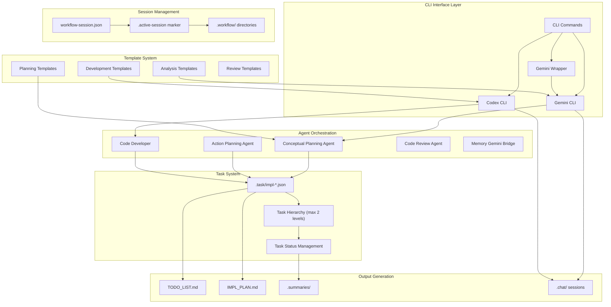
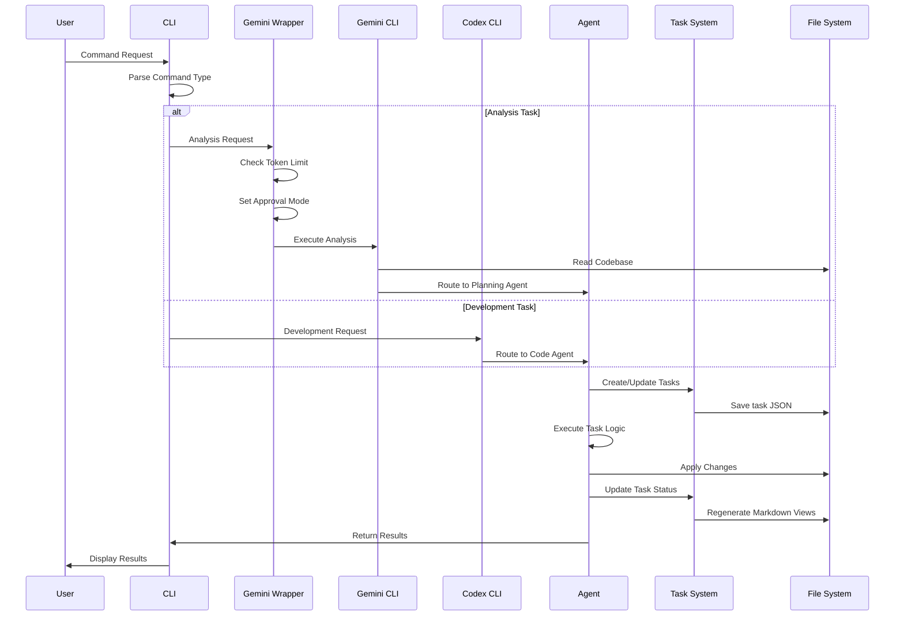
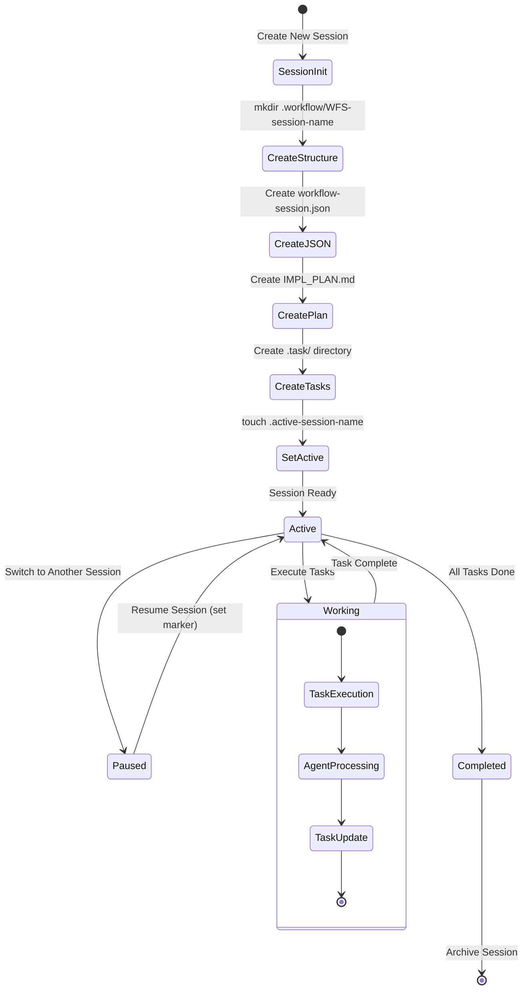
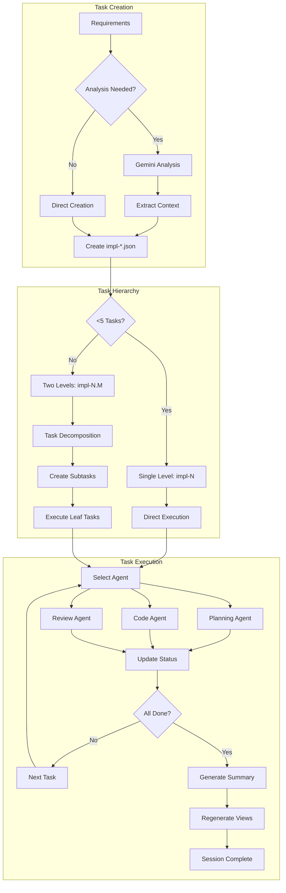
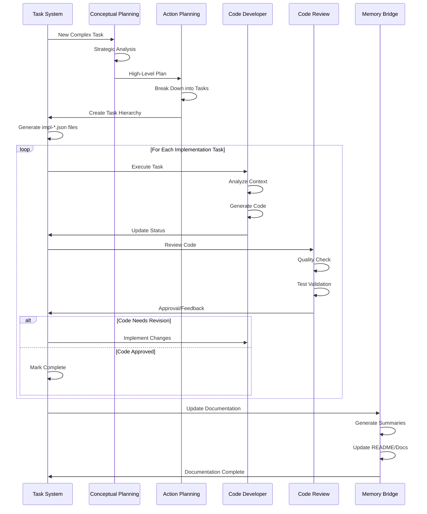
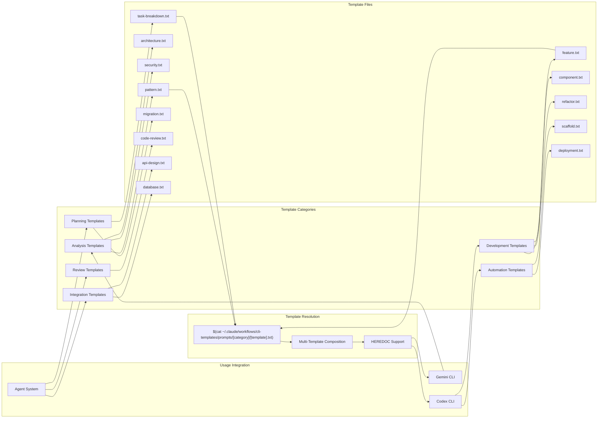
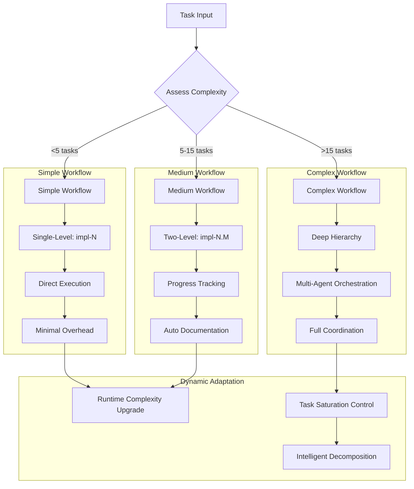

# Claude Code Workflow (CCW) - Enhanced Workflow Diagrams

Based on comprehensive analysis of changes since v1.0, this document provides detailed mermaid diagrams illustrating the CCW architecture and execution flows.

## 1. System Architecture Overview



## 2. Command Execution Flow



## 3. Session Management Flow



## 4. Task Lifecycle Management



## 5. CLI Tool Integration Architecture

```mermaid
graph TB
    subgraph "User Input Layer"
        CMD[User Commands]
        INTENT{Task Intent}
    end

    subgraph "CLI Routing Layer"
        DISPATCHER[Command Dispatcher]
        GEMINI_ROUTE[Gemini Route]
        CODEX_ROUTE[Codex Route]
    end

    subgraph "Gemini Analysis Path"
        WRAPPER[Gemini Wrapper]
        TOKEN_CHECK{Token Limit Check}
        APPROVAL_MODE[Set Approval Mode]
        GEMINI_EXEC[Gemini Execution]

        subgraph "Gemini Features"
            ALL_FILES[--all-files Mode]
            PATTERNS[@{pattern} Mode]
            TEMPLATES[Template Integration]
        end
    end

    subgraph "Codex Development Path"
        CODEX_EXEC[Codex --full-auto exec]
        AUTO_DISCOVERY[Automatic File Discovery]
        CONTEXT_AWARE[Context-Aware Execution]

        subgraph "Codex Features"
            EXPLICIT_PATTERNS[@{pattern} Control]
            AUTONOMOUS[Full Autonomous Mode]
            TEMPLATE_INTEGRATION[Template Support]
        end
    end

    subgraph "Backend Processing"
        FILE_ANALYSIS[File Analysis]
        CONTEXT_EXTRACTION[Context Extraction]
        CODE_GENERATION[Code Generation]
        VALIDATION[Validation & Testing]
    end

    subgraph "Output Layer"
        RESULTS[Command Results]
        ARTIFACTS[Generated Artifacts]
        DOCUMENTATION[Updated Documentation]
    end

    CMD --> INTENT
    INTENT -->|Analyze/Review/Understand| GEMINI_ROUTE
    INTENT -->|Implement/Build/Develop| CODEX_ROUTE

    GEMINI_ROUTE --> WRAPPER
    WRAPPER --> TOKEN_CHECK
    TOKEN_CHECK -->|<2M tokens| ALL_FILES
    TOKEN_CHECK -->|>2M tokens| PATTERNS
    ALL_FILES --> APPROVAL_MODE
    PATTERNS --> APPROVAL_MODE
    APPROVAL_MODE --> GEMINI_EXEC
    GEMINI_EXEC --> TEMPLATES

    CODEX_ROUTE --> CODEX_EXEC
    CODEX_EXEC --> AUTO_DISCOVERY
    AUTO_DISCOVERY --> CONTEXT_AWARE
    CONTEXT_AWARE --> AUTONOMOUS
    AUTONOMOUS --> TEMPLATE_INTEGRATION

    TEMPLATES --> FILE_ANALYSIS
    TEMPLATE_INTEGRATION --> FILE_ANALYSIS

    FILE_ANALYSIS --> CONTEXT_EXTRACTION
    CONTEXT_EXTRACTION --> CODE_GENERATION
    CODE_GENERATION --> VALIDATION
    VALIDATION --> RESULTS

    RESULTS --> ARTIFACTS
    ARTIFACTS --> DOCUMENTATION
```

## 6. Agent Workflow Coordination



## 7. Template System Architecture



## 8. Complexity Management System



## Key Architectural Changes Since v1.0

### Major Enhancements:
1. **Intelligent Task Saturation Control**: Prevents overwhelming agents with too many simultaneous tasks
2. **Gemini Wrapper Intelligence**: Automatic token management and approval mode detection
3. **Path-Specific Analysis**: Task-specific path management for precise CLI analysis
4. **Template System Integration**: Unified template system across all CLI tools
5. **Session Context Passing**: Proper context management for agent coordination
6. **On-Demand File Creation**: Improved performance through lazy initialization
7. **Enhanced Error Handling**: Comprehensive error logging and recovery
8. **Codex Full-Auto Mode**: Maximum autonomous development capabilities
9. **Cross-Tool Template Compatibility**: Seamless template sharing between Gemini and Codex

### Performance Improvements:
- 10-minute execution timeout for complex operations
- Sub-millisecond JSON query performance
- Atomic session switching with zero overhead
- Intelligent file discovery reducing context switching