# CCW Workflow Difficulty Guide

## Overview

CCW provides two workflow systems: **Main Workflow** and **Issue Workflow**, working together to cover the complete software development lifecycle.

```
┌──────────────────────────────────────────────────────────────────────────────────────────────┐
│                                   Main Workflow                                              │
│                                                                                              │
│  ┌─────────────┐   ┌─────────────┐   ┌─────────────┐   ┌─────────────┐  ┌──────────────┐   │
│  │   Level 1   │ → │   Level 2   │ → │   Level 3   │ → │   Level 4   │→ │   Level 5    │   │
│  │   Rapid     │   │ Lightweight │   │  Standard   │   │ Brainstorm  │  │ Intelligent  │   │
│  │             │   │             │   │             │   │             │  │ Orchestration│   │
│  │ lite-lite-  │   │ lite-plan   │   │    plan     │   │ brainstorm  │  │     ccw-     │   │
│  │    lite     │   │ lite-fix    │   │  tdd-plan   │   │  :auto-     │  │ coordinator  │   │
│  │             │   │ multi-cli-  │   │ test-fix-   │   │  parallel   │  │              │   │
│  │             │   │    plan     │   │    gen      │   │     ↓       │  │  Auto-       │   │
│  │             │   │             │   │             │   │   plan      │  │  analyze &   │   │
│  │             │   │             │   │             │   │             │  │  recommend   │   │
│  └─────────────┘   └─────────────┘   └─────────────┘   └─────────────┘  └──────────────┘   │
│                                                                                              │
│  Manual Degree: ━━━━━━━━━━━━━━━━━━━━━━━━━━━━━━━━━━━━━━━━━━━━━━━━━━━━━━━━━━━━━━━━━━▶        │
│                 High (manual selection)                                    Low (fully auto) │
│                                                                                              │
│  Complexity: ━━━━━━━━━━━━━━━━━━━━━━━━━━━━━━━━━━━━━━━━━━━━━━━━━━━━━━━━━━━━━━━━━━━━▶         │
│             Low                                                                    High     │
└──────────────────────────────────────────────────────────────────────────────────────────────┘
                                    │
                                    │ After development
                                    ▼
┌─────────────────────────────────────────────────────────────────────────────┐
│                              Issue Workflow                                 │
│                                                                             │
│     ┌──────────────┐         ┌──────────────┐         ┌──────────────┐     │
│     │  Accumulate  │    →    │    Plan      │    →    │   Execute    │     │
│     │  Discover &  │         │    Batch     │         │   Parallel   │     │
│     │   Collect    │         │   Planning   │         │  Execution   │     │
│     └──────────────┘         └──────────────┘         └──────────────┘     │
│                                                                             │
│     Supplementary role: Maintain main branch stability, worktree isolation  │
└─────────────────────────────────────────────────────────────────────────────┘
```

## What's New in v7.0

**Major New Features**:
- **Team Architecture v2**: `team-coordinate-v2` and `team-executor-v2` with unified team-worker agent
- **Queue Scheduler**: Background task execution with dependency resolution
- **Workflow Session Commands**: `start`, `resume`, `complete`, `sync` for full lifecycle management
- **New Dashboard Views**: Analysis Viewer, Terminal Dashboard, Orchestrator Template Editor

See [Session Management](#workflow-session-management-v70) and [Team Architecture v2](#team-architecture-v2-v70) sections below for details.

---

## Main Workflow vs Issue Workflow

### Design Philosophy

| Aspect | Main Workflow | Issue Workflow |
|--------|---------------|----------------|
| **Purpose** | Primary development cycle | Post-development maintenance |
| **Timing** | Feature development phase | After main workflow completes |
| **Scope** | Complete feature implementation | Targeted fixes/enhancements |
| **Parallelism** | Dependency analysis → Agent parallel | Worktree isolation (optional) |
| **Branch Model** | Work on current branch | Can use isolated worktree |

### Why Main Workflow Doesn't Use Worktree Automatically?

**Dependency analysis already solves parallelism**:

1. Planning phase (`/workflow:plan`) performs dependency analysis
2. Automatically identifies task dependencies and critical paths
3. Partitions into **parallel groups** (independent tasks) and **serial chains** (dependent tasks)
4. Agents execute independent tasks in parallel without filesystem isolation

```
┌─────────────────────────────────────────────────┐
│            Dependency Analysis                  │
│                                                 │
│  Task A ─────┐                                  │
│              ├──→ Parallel Group 1 ──→ Agent 1  │
│  Task B ─────┘                                  │
│                                                 │
│  Task C ────────→ Serial Chain ──────→ Agent 2  │
│       ↓                                         │
│  Task D ────────→                               │
│                                                 │
│  Same worktree, parallelism through scheduling  │
└─────────────────────────────────────────────────┘
```

### Why Issue Workflow Supports Worktree?

Issue Workflow serves as a **supplementary mechanism** with different scenarios:

1. Main development complete, merged to `main`
2. Issues discovered requiring fixes
3. Need to fix without affecting current development
4. Worktree isolation keeps main branch stable

```
Development → Release → Discover Issue → Worktree Fix → Merge back
    ↑                                                      │
    └────────────── Continue new feature ←─────────────────┘
```

---

## Workflow Session Management (v7.0)

CCW v7.0 introduces comprehensive session lifecycle commands for managing workflow sessions from creation to completion.

### Session Commands Overview

| Command | Purpose | When to Use |
|---------|---------|-------------|
| `/workflow:session:start` | Start new session or discover existing | Beginning any workflow |
| `/workflow:session:resume` | Resume a paused session | Returning to interrupted work |
| `/workflow:session:complete` | Archive session and extract learnings | After all tasks complete |
| `/workflow:session:sync` | Sync session work to specs | Update project documentation |

### Starting a Session

```bash
# Discovery mode - list active sessions and let user choose
/workflow:session:start

# Auto mode - intelligently create or reuse based on keywords
/workflow:session:start --auto "Implement OAuth2 authentication"

# Force new mode - always create a fresh session
/workflow:session:start --new "User authentication feature"

# Specify session type
/workflow:session:start --type tdd --auto "Test-driven user login"
```

**Session Types**:
- `workflow`: Standard implementation (default)
- `review`: Code review sessions
- `tdd`: Test-driven development
- `test`: Test generation/fix sessions
- `docs`: Documentation sessions

### Resuming a Session

```bash
# Resume most recently paused session
/workflow:session:resume

# Resume specific session via execute
/workflow:execute --resume-session="WFS-user-auth-v2"
```

### Completing a Session

```bash
# Interactive completion with review
/workflow:session:complete

# Auto-complete with sync
/workflow:session:complete --yes

# Detailed completion with metrics
/workflow:session:complete --detailed
```

**Completion Actions**:
- Archive session to `.workflow/archives/`
- Generate `manifest.json` with metrics
- Extract lessons learned (successes, challenges, patterns)
- Auto-sync project state (with `--yes`)

### Syncing Session Work

```bash
# Sync with confirmation
/workflow:session:ync "Added user authentication with JWT"

# Auto-sync without confirmation
/workflow:session:sync -y "Implemented OAuth2 flow"
```

**Sync Updates**:
- `specs/*.md` - Project specifications from session context
- `project-tech.json` - Technology stack and architecture

### Session Directory Structure

```
.workflow/
├── active/                          # Active sessions
│   └── WFS-{session-name}/
│       ├── workflow-session.json    # Session metadata
│       ├── IMPL_PLAN.md             # Implementation plan
│       ├── TODO_LIST.md             # Task checklist
│       ├── .task/                   # Task JSON files
│       └── .process/                # Process artifacts
├── archives/                        # Completed sessions
│   └── WFS-{session-name}/
│       ├── manifest.json            # Completion metrics
│       └── ...
└── project-tech.json                # Project technology registry
```

---

## Level 1: Rapid Execution (lite-lite-lite)

**Simplest - Single CLI analysis to execution, zero artifacts**

### Characteristics

| Property | Value |
|----------|-------|
| **Complexity** | Low |
| **Artifacts** | None |
| **State** | Stateless |
| **CLI Selection** | Auto-analyze task type |
| **Iteration** | Via AskUser |

### Flow

```
User Input → Clarification → Auto-select CLI → Parallel Analysis → Show Results → Direct Execute
                                  ↓
                            No intermediate files
```

### Command

```bash
/workflow:lite-lite-lite
# Or CCW auto-selects for simple tasks
```

### Use Cases

- ✅ Quick fixes
- ✅ Simple feature additions
- ✅ Configuration adjustments
- ✅ Small-scope renaming
- ❌ Multi-module changes
- ❌ Need persistent records

---

## Level 2: Lightweight Planning

**Lightweight - In-memory planning or single analysis, fast iteration**

### Included Workflows

| Workflow | Purpose | Artifacts | Execution |
|----------|---------|-----------|-----------|
| `lite-plan` | Clear requirement development | memory://plan | → `lite-execute` |
| `lite-fix` | Bug diagnosis and fix | `.workflow/.lite-fix/` | → `lite-execute` |
| `multi-cli-plan` | Multi-perspective tasks | `.workflow/.multi-cli-plan/` | → `lite-execute` |

### Common Characteristics

| Property | Value |
|----------|-------|
| **Complexity** | Low-Medium |
| **State** | Session-scoped / Lightweight persistence |
| **Execution** | Unified via `lite-execute` |
| **Use Case** | Relatively clear requirements |

---

### 2.1 lite-plan → lite-execute

**In-memory planning + Direct execution**

```
┌─────────────────┐     ┌─────────────────┐
│  lite-plan      │ ──→ │  lite-execute   │
│  In-memory plan │     │  Direct execute │
└─────────────────┘     └─────────────────┘
```

```bash
/workflow:lite-plan    # Planning
/workflow:lite-execute # Execution
```

**Use Case**: Clear single-module features

---

### 2.2 lite-fix

**Intelligent diagnosis + Fix (5 phases)**

```
Phase 1: Bug Analysis & Diagnosis
   ├─ Intelligent severity pre-assessment (Low/Medium/High/Critical)
   └─ Parallel cli-explore-agent diagnosis (1-4 angles)

Phase 2: Clarification (optional)
   └─ Aggregate clarification needs, AskUserQuestion

Phase 3: Fix Planning
   ├─ Low/Medium → Claude direct planning
   └─ High/Critical → cli-lite-planning-agent

Phase 4: Confirmation & Selection
   └─ User confirms execution method

Phase 5: Execute
   └─ SlashCommand("/workflow:lite-execute --in-memory --mode bugfix")
```

```bash
/workflow:lite-fix           # Standard fix
/workflow:lite-fix --hotfix  # Emergency hotfix (skip diagnosis)
```

**Artifacts**: `.workflow/.lite-fix/{bug-slug}-{date}/`
- `diagnosis-{angle}.json` (1-4 diagnosis files)
- `diagnoses-manifest.json`
- `fix-plan.json`

**Use Case**: Bug diagnosis, production emergencies

---

### 2.3 multi-cli-plan → lite-execute

**Multi-CLI collaborative analysis + Consensus convergence (5 phases)**

```
Phase 1: Context Gathering
   └─ ACE semantic search, build context package

Phase 2: Multi-CLI Discussion (iterative)
   ├─ cli-discuss-agent executes Gemini + Codex + Claude
   ├─ Cross-verification, synthesize solutions
   └─ Loop until convergence or max rounds

Phase 3: Present Options
   └─ Display solutions with trade-offs

Phase 4: User Decision
   └─ User selects solution

Phase 5: Plan Generation
   ├─ cli-lite-planning-agent generates plan
   └─ → lite-execute
```

```bash
/workflow:multi-cli-plan "task description"  # Multi-CLI collaborative planning
/workflow:lite-execute                       # Execute selected solution
```

**Artifacts**: `.workflow/.multi-cli-plan/{MCP-task-slug-date}/`
- `rounds/*/synthesis.json` (per-round analysis)
- `context-package.json`
- `IMPL_PLAN.md` + `plan.json`

**vs lite-plan comparison**:

| Aspect | multi-cli-plan | lite-plan |
|--------|---------------|-----------|
| **Context** | ACE semantic search | Manual file patterns |
| **Analysis** | Multi-CLI cross-verification | Single planning |
| **Iteration** | Multiple rounds until convergence | Single round |
| **Confidence** | High (consensus-driven) | Medium (single perspective) |

**Use Case**: Multi-perspective analysis, technology selection, solution comparison

---

## Level 3: Standard Planning

**Standard - Complete planning + Persistent Session + Verification**

### Included Workflows

| Workflow | Purpose | Phases | Artifact Location |
|----------|---------|--------|-------------------|
| `plan` | Complex feature development | 5 phases | `.workflow/active/{session}/` |
| `tdd-plan` | Test-driven development | 6 phases | `.workflow/active/{session}/` |
| `test-fix-gen` | Test fix generation | 5 phases | `.workflow/active/WFS-test-{session}/` |

### Common Characteristics

| Property | Value |
|----------|-------|
| **Complexity** | Medium-High |
| **Artifacts** | Persistent files (`.workflow/active/{session}/`) |
| **State** | Full session management |
| **Verification** | Built-in verification steps |
| **Execution** | `/workflow:execute` |
| **Use Case** | Multi-module, traceable tasks |

---

### 3.1 plan → verify → execute

**5-phase complete planning workflow**

```
Phase 1: Session Discovery
   └─ /workflow:session:start --auto

Phase 2: Context Gathering
   └─ /workflow:tools:context-gather
      └─ Returns context-package.json + conflict_risk

Phase 3: Conflict Resolution (conditional)
   └─ IF conflict_risk ≥ medium → /workflow:tools:conflict-resolution

Phase 4: Task Generation
   └─ /workflow:tools:task-generate-agent
      └─ Returns IMPL_PLAN.md + IMPL-*.json + TODO_LIST.md

Return: Summary + Next Steps
```

```bash
/workflow:plan "task description"   # Complete planning
/workflow:plan-verify        # Verify plan (recommended)
/workflow:execute                   # Execute
/workflow:review                    # (optional) Review
```

**Artifacts**: `.workflow/active/{WFS-session}/`
- `workflow-session.json`
- `IMPL_PLAN.md`
- `TODO_LIST.md`
- `.task/IMPL-*.json`
- `.process/context-package.json`

**Use Case**: Multi-module changes, refactoring, dependency analysis needed

---

### 3.2 tdd-plan → execute → tdd-verify

**6-phase test-driven development workflow**

```
Phase 1: Session Discovery
   └─ /workflow:session:start --type tdd --auto

Phase 2: Context Gathering
   └─ /workflow:tools:context-gather

Phase 3: Test Coverage Analysis
   └─ /workflow:tools:test-context-gather
      └─ Detect test framework, analyze coverage

Phase 4: Conflict Resolution (conditional)
   └─ IF conflict_risk ≥ medium → /workflow:tools:conflict-resolution

Phase 5: TDD Task Generation
   └─ /workflow:tools:task-generate-tdd
      └─ Generate IMPL tasks with built-in Red-Green-Refactor cycles

Phase 6: TDD Structure Validation
   └─ Verify TDD structure compliance
```

```bash
/workflow:tdd-plan "feature description"  # TDD planning
/workflow:plan-verify              # Verify (recommended)
/workflow:execute                         # Execute (follow Red-Green-Refactor)
/workflow:tdd-verify                      # Verify TDD compliance
```

**TDD Task Structure**:
- Each IMPL task contains complete internal Red-Green-Refactor cycle
- `meta.tdd_workflow: true`
- `flow_control.implementation_approach` contains 3 steps (red/green/refactor)
- Green phase includes test-fix-cycle configuration

**Use Case**: Test-driven development, high-quality feature requirements

---

### 3.3 test-fix-gen → test-cycle-execute

**5-phase test fix generation workflow**

```
Phase 1: Create Test Session
   └─ /workflow:session:start --type test --new

Phase 2: Gather Test Context
   ├─ Session Mode: /workflow:tools:test-context-gather
   └─ Prompt Mode: /workflow:tools:context-gather

Phase 3: Test Generation Analysis
   └─ /workflow:tools:test-concept-enhanced
      └─ Multi-layer test requirements (L0: Static, L1: Unit, L2: Integration, L3: E2E)

Phase 4: Generate Test Tasks
   └─ /workflow:tools:test-task-generate
      └─ IMPL-001 (generate) + IMPL-001.5 (quality gate) + IMPL-002 (execute fix)

Phase 5: Return Summary
   └─ → /workflow:test-cycle-execute
```

**Dual-mode support**:
| Mode | Input Pattern | Context Source |
|------|---------------|----------------|
| Session Mode | `WFS-xxx` | Source session summaries |
| Prompt Mode | Text/file path | Direct codebase analysis |

```bash
/workflow:test-fix-gen WFS-user-auth-v2        # Session Mode
/workflow:test-fix-gen "Test the auth API"     # Prompt Mode
/workflow:test-cycle-execute                   # Execute test-fix cycle
```

**Artifacts**: `.workflow/active/WFS-test-{session}/`
- `.task/IMPL-001.json` (test understanding & generation)
- `.task/IMPL-001.5-review.json` (quality gate)
- `.task/IMPL-002.json` (test execution & fix cycle)
- `.process/TEST_ANALYSIS_RESULTS.md`

**Use Case**: Test failure fixes, coverage improvement

---

## Level 4: Brainstorming (brainstorm:auto-parallel)

**Most Complex - Multi-role brainstorming + Complete planning + Execution**

### Characteristics

| Property | Value |
|----------|-------|
| **Complexity** | High |
| **Artifacts** | Multi-role analysis docs + `IMPL_PLAN.md` |
| **Role Count** | 3-9 (default 3) |
| **Execution Mode** | Phase 1/3 sequential, Phase 2 parallel |

### 3-Phase Flow

```
Phase 1: Interactive Framework Generation
   └─ /workflow:brainstorm:artifacts
      ├─ Topic analysis, generate questions
      ├─ Role selection (user confirmation)
      ├─ Role question collection
      ├─ Conflict detection and resolution
      └─ Generate guidance-specification.md

Phase 2: Parallel Role Analysis (parallel)
   └─ N × Task(conceptual-planning-agent)
      ├─ Each role analyzes independently
      └─ Parallel generate {role}/analysis.md

Phase 3: Synthesis Integration
   └─ /workflow:brainstorm:synthesis
      └─ Integrate all role analyses → synthesis-specification.md
```

### Commands

```bash
/workflow:brainstorm:auto-parallel "topic" [--count N] [--style-skill package]
/workflow:plan --session {sessionId}     # Plan based on brainstorm results
/workflow:plan-verify             # Verify
/workflow:execute                        # Execute
```

### Available Roles

| Role | Description |
|------|-------------|
| `system-architect` | System Architect |
| `ui-designer` | UI Designer |
| `ux-expert` | UX Expert |
| `product-manager` | Product Manager |
| `product-owner` | Product Owner |
| `data-architect` | Data Architect |
| `scrum-master` | Scrum Master |
| `subject-matter-expert` | Domain Expert |
| `test-strategist` | Test Strategist |

### Artifact Structure

```
.workflow/active/WFS-{topic}/
├── workflow-session.json              # Session metadata
└── .brainstorming/
    ├── guidance-specification.md      # Framework (Phase 1)
    ├── {role}/
    │   ├── analysis.md                # Main document
    │   └── analysis-{slug}.md         # Sub-documents (optional, max 5)
    └── synthesis-specification.md     # Integration (Phase 3)
```

### Use Cases

- ✅ New feature design
- ✅ System architecture refactoring
- ✅ Exploratory requirements
- ✅ Uncertain implementation approach
- ✅ Multi-dimensional trade-offs needed
- ❌ Clear requirements
- ❌ Time-sensitive tasks

---

## Level 5: Intelligent Orchestration (CCW Coordinator)

**Most Intelligent - Automated command chain orchestration + Sequential execution + State persistence**

### Core Concept: Minimum Execution Units

**Definition**: A set of commands that must execute together as an atomic group to achieve a meaningful workflow milestone. Splitting these commands breaks the logical flow and creates incomplete states.

**Why This Matters**:
- **Prevents Incomplete States**: Avoid stopping after task generation without execution
- **User Experience**: User gets complete results, not intermediate artifacts requiring manual follow-up
- **Workflow Integrity**: Maintains logical coherence of multi-step operations

### Minimum Execution Units

**Planning + Execution Units**:

| Unit Name | Commands | Purpose | Output |
|-----------|----------|---------|--------|
| **Quick Implementation** | lite-plan → lite-execute | Lightweight plan and immediate execution | Working code |
| **Multi-CLI Planning** | multi-cli-plan → lite-execute | Multi-perspective analysis and execution | Working code |
| **Bug Fix** | lite-fix → lite-execute | Quick bug diagnosis and fix execution | Fixed code |
| **Full Planning + Execution** | plan → execute | Detailed planning and execution | Working code |
| **Verified Planning + Execution** | plan → plan-verify → execute | Planning with verification and execution | Working code |
| **Replanning + Execution** | replan → execute | Update plan and execute changes | Working code |
| **TDD Planning + Execution** | tdd-plan → execute | Test-driven development planning and execution | Working code |
| **Test Generation + Execution** | test-gen → execute | Generate test suite and execute | Generated tests |

**Testing Units**:

| Unit Name | Commands | Purpose | Output |
|-----------|----------|---------|--------|
| **Test Validation** | test-fix-gen → test-cycle-execute | Generate test tasks and execute test-fix cycle | Tests passed |

**Review Units**:

| Unit Name | Commands | Purpose | Output |
|-----------|----------|---------|--------|
| **Code Review (Session)** | review-session-cycle → review-fix | Complete review cycle and apply fixes | Fixed code |
| **Code Review (Module)** | review-module-cycle → review-fix | Module review cycle and apply fixes | Fixed code |

### 3-Phase Workflow

#### Phase 1: Analyze Requirements

Parse task description to extract: goal, scope, constraints, complexity, and task type.

```javascript
function analyzeRequirements(taskDescription) {
  return {
    goal: extractMainGoal(taskDescription),           // e.g., "Implement user registration"
    scope: extractScope(taskDescription),             // e.g., ["auth", "user_management"]
    constraints: extractConstraints(taskDescription), // e.g., ["no breaking changes"]
    complexity: determineComplexity(taskDescription), // 'simple' | 'medium' | 'complex'
    task_type: detectTaskType(taskDescription)        // See task type patterns below
  };
}

// Task Type Detection Patterns
function detectTaskType(text) {
  // Priority order (first match wins)
  if (/fix|bug|error|crash|fail|debug|diagnose/.test(text)) return 'bugfix';
  if (/tdd|test-driven|test first/.test(text)) return 'tdd';
  if (/test fail|fix test|failing test/.test(text)) return 'test-fix';
  if (/generate test|add test/.test(text)) return 'test-gen';
  if (/review/.test(text)) return 'review';
  if (/explore|brainstorm/.test(text)) return 'brainstorm';
  if (/multi-perspective|comparison/.test(text)) return 'multi-cli';
  return 'feature';  // Default
}

// Complexity Assessment
function determineComplexity(text) {
  let score = 0;
  if (/refactor|migrate|architect|system/.test(text)) score += 2;
  if (/multiple|across|all|entire/.test(text)) score += 2;
  if (/integrate|api|database/.test(text)) score += 1;
  if (/security|performance|scale/.test(text)) score += 1;
  return score >= 4 ? 'complex' : score >= 2 ? 'medium' : 'simple';
}
```

#### Phase 2: Discover Commands & Recommend Chain

Dynamic command chain assembly using port-based matching.

**Display to user**:
```
Recommended Command Chain:

Pipeline (visual):
Requirement → lite-plan → Plan → lite-execute → Code → test-cycle-execute → Tests Passed

Commands:
1. /workflow:lite-plan
2. /workflow:lite-execute
3. /workflow:test-cycle-execute

Proceed? [Confirm / Show Details / Adjust / Cancel]
```

**User Confirmation**:
```javascript
async function getUserConfirmation(chain) {
  // Present chain with options:
  // - Confirm and execute
  // - Show details
  // - Adjust chain
  // - Cancel
}
```

#### Phase 3: Execute Sequential Command Chain

```javascript
async function executeCommandChain(chain, analysis) {
  const sessionId = `ccw-coord-${Date.now()}`;
  const stateDir = `.workflow/.ccw-coordinator/${sessionId}`;

  // Initialize state
  const state = {
    session_id: sessionId,
    status: 'running',
    created_at: new Date().toISOString(),
    analysis: analysis,
    command_chain: chain.map((cmd, idx) => ({ ...cmd, index: idx, status: 'pending' })),
    execution_results: [],
    prompts_used: []
  };

  // Save initial state
  Write(`${stateDir}/state.json`, JSON.stringify(state, null, 2));

  for (let i = 0; i < chain.length; i++) {
    const cmd = chain[i];

    // Assemble prompt
    let prompt = formatCommand(cmd, state.execution_results, analysis);
    prompt += `\n\nTask: ${analysis.goal}`;
    if (state.execution_results.length > 0) {
      prompt += '\n\nPrevious results:\n';
      state.execution_results.forEach(r => {
        if (r.session_id) {
          prompt += `- ${r.command}: ${r.session_id}\n`;
        }
      });
    }

    // Launch CLI in background
    const taskId = Bash(
      `ccw cli -p "${escapePrompt(prompt)}" --tool claude --mode write`,
      { run_in_background: true }
    ).task_id;

    // Save checkpoint
    state.execution_results.push({
      index: i,
      command: cmd.command,
      status: 'in-progress',
      task_id: taskId,
      session_id: null,
      artifacts: [],
      timestamp: new Date().toISOString()
    });

    // Stop here - wait for hook callback
    Write(`${stateDir}/state.json`, JSON.stringify(state, null, 2));
    break;
  }

  state.status = 'waiting';
  Write(`${stateDir}/state.json`, JSON.stringify(state, null, 2));
  return state;
}
```

### State File Structure

**Location**: `.workflow/.ccw-coordinator/{session_id}/state.json`

```json
{
  "session_id": "ccw-coord-20250124-143025",
  "status": "running|waiting|completed|failed",
  "created_at": "2025-01-24T14:30:25Z",
  "updated_at": "2025-01-24T14:35:45Z",
  "analysis": {
    "goal": "Implement user registration",
    "scope": ["authentication", "user_management"],
    "constraints": ["no breaking changes"],
    "complexity": "medium",
    "task_type": "feature"
  },
  "command_chain": [
    {
      "index": 0,
      "command": "/workflow:plan",
      "name": "plan",
      "status": "completed"
    },
    {
      "index": 1,
      "command": "/workflow:execute",
      "name": "execute",
      "status": "running"
    }
  ],
  "execution_results": [
    {
      "index": 0,
      "command": "/workflow:plan",
      "status": "completed",
      "task_id": "task-001",
      "session_id": "WFS-plan-20250124",
      "artifacts": ["IMPL_PLAN.md"],
      "timestamp": "2025-01-24T14:30:25Z",
      "completed_at": "2025-01-24T14:30:45Z"
    }
  ]
}
```

### Complete Lifecycle Decision Flowchart

```mermaid
flowchart TD
    Start([Start New Task]) --> Q0{Is this a bug fix?}

    Q0 -->|Yes| BugFix[🐛 Bug Fix Process]
    Q0 -->|No| Q1{Do you know what to do?}

    BugFix --> BugSeverity{Understand root cause?}
    BugSeverity -->|Clear| LiteFix[/workflow:lite-fix<br>Standard fix /]
    BugSeverity -->|Production incident| HotFix[/workflow:lite-fix --hotfix<br>Emergency hotfix /]
    BugSeverity -->|Unclear| BugDiag[/workflow:lite-fix<br>Auto-diagnose root cause /]

    BugDiag --> LiteFix
    LiteFix --> BugComplete[Bug fixed]
    HotFix --> FollowUp[/Auto-generate follow-up tasks<br>Complete fix + post-mortem /]
    FollowUp --> BugComplete
    BugComplete --> End([Task Complete])

    Q1 -->|No| Ideation[💡 Exploration Phase<br>Clarify requirements]
    Q1 -->|Yes| Q2{Do you know how to do it?}

    Ideation --> BrainIdea[/workflow:brainstorm:auto-parallel<br>Explore product direction /]
    BrainIdea --> Q2

    Q2 -->|No| Design[🏗️ Design Exploration<br>Explore architecture]
    Q2 -->|Yes| Q3{Need planning?}

    Design --> BrainDesign[/workflow:brainstorm:auto-parallel<br>Explore technical solutions /]
    BrainDesign --> Q3

    Q3 -->|Quick and simple| LitePlan[⚡ Lightweight Planning<br>/workflow:lite-plan]
    Q3 -->|Complex and complete| FullPlan[📋 Standard Planning<br>/workflow:plan]

    LitePlan --> Q4{Need code exploration?}
    Q4 -->|Yes| LitePlanE[/workflow:lite-plan -e<br>Task description /]
    Q4 -->|No| LitePlanNormal[/workflow:lite-plan<br>Task description /]

    LitePlanE --> LiteConfirm[Three-dimensional confirmation:<br>1️⃣ Task approval<br>2️⃣ Execution method<br>3️⃣ Code review]
    LitePlanNormal --> LiteConfirm

    LiteConfirm --> Q5{Select execution method}
    Q5 -->|Agent| LiteAgent[/workflow:lite-execute<br>Use @code-developer /]
    Q5 -->|CLI tool| LiteCLI[CLI Execution<br>Gemini/Qwen/Codex]
    Q5 -->|Plan only| UserImpl[User manual implementation]

    FullPlan --> PlanVerify{Verify plan quality?}
    PlanVerify -->|Yes| Verify[/workflow:action-plan-verify /]
    PlanVerify -->|No| Execute
    Verify --> Q6{Verification passed?}
    Q6 -->|No| FixPlan[Fix plan issues]
    Q6 -->|Yes| Execute
    FixPlan --> Execute

    Execute[🚀 Execution Phase<br>/workflow:execute]
    LiteAgent --> TestDecision
    LiteCLI --> TestDecision
    UserImpl --> TestDecision
    Execute --> TestDecision

    TestDecision{Need tests?}
    TestDecision -->|TDD mode| TDD[/workflow:tdd-plan<br>Test-driven development /]
    TestDecision -->|Post-test| TestGen[/workflow:test-gen<br>Generate tests /]
    TestDecision -->|Tests exist| TestCycle[/workflow:test-cycle-execute<br>Test-fix cycle /]
    TestDecision -->|Not needed| Review

    TDD --> TDDExecute[/workflow:execute<br>Red-Green-Refactor /]
    TDDExecute --> TDDVerify[/workflow:tdd-verify<br>Verify TDD compliance /]
    TDDVerify --> Review

    TestGen --> TestExecute[/workflow:execute<br>Execute test tasks /]
    TestExecute --> TestResult{Tests passed?}
    TestResult -->|No| TestCycle
    TestResult -->|Yes| Review

    TestCycle --> TestPass{Pass rate ≥ 95%?}
    TestPass -->|No, continue fixing| TestCycle
    TestPass -->|Yes| Review

    Review[📝 Review Phase]
    Review --> Q7{Need specialized review?}
    Q7 -->|Security| SecurityReview[/workflow:review<br>--type security /]
    Q7 -->|Architecture| ArchReview[/workflow:review<br>--type architecture /]
    Q7 -->|Quality| QualityReview[/workflow:review<br>--type quality /]
    Q7 -->|General| GeneralReview[/workflow:review<br>General review /]
    Q7 -->|Not needed| Complete

    SecurityReview --> Complete
    ArchReview --> Complete
    QualityReview --> Complete
    GeneralReview --> Complete

    Complete[✅ Completion Phase<br>/workflow:session:complete]
    Complete --> End

    style Start fill:#e1f5ff
    style BugFix fill:#ffccbc
    style LiteFix fill:#ffccbc
    style HotFix fill:#ff8a65
    style BugDiag fill:#ffccbc
    style BugComplete fill:#c8e6c9
    style End fill:#c8e6c9
    style BrainIdea fill:#fff9c4
    style BrainDesign fill:#fff9c4
    style LitePlan fill:#b3e5fc
    style FullPlan fill:#b3e5fc
    style Execute fill:#c5e1a5
    style TDD fill:#ffccbc
    style TestGen fill:#ffccbc
    style TestCycle fill:#ffccbc
    style Review fill:#d1c4e9
    style Complete fill:#c8e6c9
```



### Commands

```bash
/ccw-coordinator "task description"
# Auto-analyze → recommend command chain → execute sequentially
```

### Use Cases

- ✅ Complex multi-step workflows
- ✅ Uncertain which commands to use
- ✅ Desire end-to-end automation
- ✅ Need full state tracking and resumability
- ✅ Team collaboration with unified execution flow
- ❌ Simple single-command tasks
- ❌ Already know exact commands needed

### Relationship with Other Levels

| Level | Manual Degree | CCW Coordinator Role |
|-------|---------------|-----------------------|
| Level 1-4 | Manual command selection | Auto-combine these commands |
| Level 5 | Auto command selection | Intelligent orchestrator |

**CCW Coordinator uses Level 1-4 internally**:
- Analyzes task → Auto-selects appropriate Level
- Assembles command chain → Includes Level 1-4 commands
- Executes sequentially → Follows Minimum Execution Units

---

## Team Architecture v2 (v7.0)

**For complex multi-role projects requiring specialized expertise and orchestration.**

### Overview

Team Architecture v2 (`team-coordinate-v2`, `team-executor-v2`) provides a unified team-worker agent architecture for complex software development workflows.

```
┌─────────────────────────────────────────────────────────────────────────────────┐
│                         Team Coordinate / Team Executor v2                      │
│                                                                                  │
│  ┌─────────────┐        ┌─────────────────────────────────────────────────┐    │
│  │ Coordinator │ ──→   │  Dynamic Role-Spec Generation                    │    │
│  │ / Executor  │        │  (analyst, planner, executor, tester, reviewer)  │    │
│  └─────────────┘        └─────────────────────────────────────────────────┘    │
│          │                            │                                        │    │
│          ▼                            ▼                                        │    │
│  ┌─────────────┐        ┌─────────────────────────────────────────────────┐    │
│  │   Task      │        │            team-worker Agents                     │    │
│  │ Dispatching │        │  (Phase 1: Task Discovery - built-in)            │    │
│  │             │        │  (Phase 2-4: Role-Specific - from spec files)     │    │
│  └─────────────┘        │  (Phase 5: Report + Fast-Advance - built-in)      │    │
│                         └─────────────────────────────────────────────────┘    │
│                                      │                                        │    │
│                                      ▼                                        │    │
│                         ┌─────────────────────────────────────────────────┐    │
│                         │  Subagents (Discuss, Explore, Doc-Generation)    │    │
│                         └─────────────────────────────────────────────────┘    │
└─────────────────────────────────────────────────────────────────────────────────┘
```

### Key Concepts

#### team-worker Agent

The unified worker agent that:
- **Phase 1 (Built-in)**: Task discovery - filters tasks by prefix and status
- **Phase 2-4 (Role-Specific)**: Loads domain logic from role-spec markdown files
- **Phase 5 (Built-in)**: Report + Fast-Advance - handles completion and successor spawning

#### Role-Spec Files

Lightweight markdown files containing only Phase 2-4 logic:

```yaml
---
role: analyst
prefix: RESEARCH
inner_loop: false
subagents: [explore, discuss]
message_types:
  success: research_ready
  error: error
---
```

#### Inner Loop Framework

When `inner_loop: true`, a single agent processes all same-prefix tasks sequentially:

```
context_accumulator = []

Phase 1: Find first RESEARCH-* task
  Phase 2-4: Execute role spec
  Phase 5-L: Mark done, log, accumulate
    More RESEARCH-* tasks? → Phase 1 (loop)
    No more? → Phase 5-F (final report)
```

### Commands

#### Team Coordinate

Generate role-specs and orchestrate a team from scratch:

```bash
/team-coordinate "Design and implement a real-time collaboration system"
```

**Process**:
1. Analyze requirements and detect capabilities
2. Generate role-specs dynamically
3. Create tasks with dependency chains
4. Spawn team-worker agents
5. Monitor progress via callbacks
6. Complete with comprehensive report

#### Team Executor

Execute a pre-planned team session:

```bash
# Initial execution
/team-executor <session-folder>

# Resume paused session
/team-executor <session-folder> resume

# Check status without advancing
/team-executor <session-folder> status
```

### Available Roles

| Role | Prefix | Responsibility | Inner Loop |
|------|--------|----------------|------------|
| analyst | RESEARCH | Codebase exploration, multi-perspective analysis | No |
| planner | PLAN | Task breakdown and dependency planning | Yes |
| executor | IMPL | Implementation and coding | Yes |
| tester | TEST | Testing and quality assurance | Yes |
| reviewer | REVIEW | Code review and quality gates | Yes |
| architect | DESIGN | Architecture and design decisions | No |
| fe-developer | FE-IMPL | Frontend implementation | Yes |
| fe-qa | FE-TEST | Frontend testing | Yes |

### Subagents

| Subagent | Purpose |
|----------|---------|
| discuss | Multi-perspective critique with dynamic perspectives |
| explore | Codebase exploration with caching |
| doc-generation | Document generation from templates |

### Message Bus Protocol

Team communication via `team_msg` operation:

```javascript
mcp__ccw-tools__team_msg({
  operation: "log",
  team: "<session_id>",      // Session ID, NOT team name
  from: "<role>",
  to: "coordinator",
  type: "<message_type>",
  summary: "[<role>] <message>",
  ref: "<artifact_path>"
})
```

### Session Structure

```
.workflow/.team/<session-id>/
├── team-session.json           # Session metadata
├── task-analysis.json          # Task dependencies
├── role-specs/                 # Generated role-spec files
│   ├── analyst.md
│   ├── planner.md
│   └── executor.md
├── artifacts/                  # Task outputs
├── discussions/                # Multi-perspective critiques
└── wisdom/                     # Accumulated learnings
    ├── learnings.md
    ├── decisions.md
    ├── conventions.md
    └── issues.md
```

### Use Cases

- ✅ Complex multi-system projects requiring specialized expertise
- ✅ Projects requiring architectural exploration before implementation
- ✅ Quality-critical projects requiring comprehensive testing and review
- ✅ Frontend + Backend coordination
- ❌ Simple single-module features (use `/workflow:plan` instead)
- ❌ Quick fixes (use `/workflow:lite-fix` instead)

---

## Issue Workflow

**Main Workflow Supplement - Post-development continuous maintenance**

### Two-Phase Lifecycle

```
┌─────────────────────────────────────────────────────────────────────┐
│                    Phase 1: Accumulation                            │
│                                                                     │
│   Triggers:                                                         │
│   • Post-task review                                                │
│   • Code review findings                                            │
│   • Test failures                                                   │
│                                                                     │
│   ┌────────────┐     ┌────────────┐     ┌────────────┐             │
│   │ discover   │     │ discover-  │     │    new     │             │
│   │ Auto-find  │     │ by-prompt  │     │  Manual    │             │
│   └────────────┘     └────────────┘     └────────────┘             │
│                                                                     │
│   Continuously accumulate issues to pending queue                   │
└─────────────────────────────────────────────────────────────────────┘
                               │
                               │ After sufficient accumulation
                               ▼
┌─────────────────────────────────────────────────────────────────────┐
│                  Phase 2: Batch Resolution                          │
│                                                                     │
│   ┌────────────┐     ┌────────────┐     ┌────────────┐             │
│   │   plan     │ ──→ │   queue    │ ──→ │  execute   │             │
│   │ --all-     │     │ Optimize   │     │  Parallel  │             │
│   │  pending   │     │  order     │     │ execution  │             │
│   └────────────┘     └────────────┘     └────────────┘             │
│                                                                     │
│   Supports worktree isolation, maintains main branch stability      │
└─────────────────────────────────────────────────────────────────────┘
```

### Command List

**Accumulation Phase:**
```bash
/issue:discover            # Multi-perspective auto-discovery
/issue:discover-by-prompt  # Prompt-based discovery
/issue:new                 # Manual creation
```

**Batch Resolution:**
```bash
/issue:plan --all-pending  # Batch plan all pending
/issue:queue               # Generate optimized execution queue
/issue:execute             # Parallel execution
```

### Collaboration with Main Workflow

```
┌─────────────────────────────────────────────────────────────────────┐
│                      Development Iteration Loop                     │
│                                                                     │
│   ┌─────────┐                              ┌─────────┐             │
│   │ Feature │ ──→ Main Workflow ──→ Done ──→│ Review  │             │
│   │ Request │     (Level 1-4)              └────┬────┘             │
│   └─────────┘                                   │                  │
│        ▲                                        │ Issues found      │
│        │                                        ▼                  │
│        │                                  ┌─────────┐              │
│        │                                  │  Issue  │              │
│        │                                  │ Workflow│              │
│   Continue│                               └────┬────┘              │
│   new     │                                    │                   │
│   feature │         ┌──────────────────────────┘                   │
│        │         │ Fix complete                                    │
│        │         ▼                                                 │
│   ┌────┴────┐◀──────                                               │
│   │  Main   │    Merge                                             │
│   │ Branch  │    back                                              │
│   └─────────┘                                                      │
│                                                                     │
└─────────────────────────────────────────────────────────────────────┘
```

---

## Workflow Selection Guide

### Quick Selection Table

| Scenario | Recommended Workflow | Level |
|----------|---------------------|-------|
| Quick fixes, config adjustments | `lite-lite-lite` | 1 |
| Clear single-module features | `lite-plan → lite-execute` | 2 |
| Bug diagnosis and fix | `lite-fix` | 2 |
| Production emergencies | `lite-fix --hotfix` | 2 |
| Technology selection, solution comparison | `multi-cli-plan → lite-execute` | 2 |
| Multi-module changes, refactoring | `plan → verify → execute` | 3 |
| Test-driven development | `tdd-plan → execute → tdd-verify` | 3 |
| Test failure fixes | `test-fix-gen → test-cycle-execute` | 3 |
| New features, architecture design | `brainstorm:auto-parallel → plan → execute` | 4 |
| Complex multi-step workflows, uncertain commands | `ccw-coordinator` | 5 |
| Post-development issue fixes | Issue Workflow | - |

### Decision Flowchart

```
Start
  │
  ├─ Is it post-development maintenance?
  │     ├─ Yes → Issue Workflow
  │     └─ No ↓
  │
  ├─ Uncertain which commands to use?
  │     ├─ Yes → Level 5 (ccw-coordinator - auto-analyze & recommend)
  │     └─ No ↓
  │
  ├─ Are requirements clear?
  │     ├─ Uncertain → Level 4 (brainstorm:auto-parallel)
  │     └─ Clear ↓
  │
  ├─ Need persistent Session?
  │     ├─ Yes → Level 3 (plan / tdd-plan / test-fix-gen)
  │     └─ No ↓
  │
  ├─ Need multi-perspective / solution comparison?
  │     ├─ Yes → Level 2 (multi-cli-plan)
  │     └─ No ↓
  │
  ├─ Is it a bug fix?
  │     ├─ Yes → Level 2 (lite-fix)
  │     └─ No ↓
  │
  ├─ Need planning?
  │     ├─ Yes → Level 2 (lite-plan)
  │     └─ No → Level 1 (lite-lite-lite)
```

### Complexity Indicators

System auto-evaluates complexity based on these keywords:

| Weight | Keywords |
|--------|----------|
| +2 | refactor, migrate, architect, system |
| +2 | multiple, across, all, entire |
| +1 | integrate, api, database |
| +1 | security, performance, scale |

- **High complexity** (≥4): Auto-select Level 3-4
- **Medium complexity** (2-3): Auto-select Level 2
- **Low complexity** (<2): Auto-select Level 1

---

## Semantic CLI Invocation

Users can **semantically specify CLI tools** in prompts - the system automatically invokes the corresponding CLI.

### Basic Invocation

| User Prompt | System Action |
|-------------|---------------|
| "Use Gemini to analyze the auth module" | Auto-invoke `gemini` CLI for analysis |
| "Let Codex review this code" | Auto-invoke `codex` CLI for review |
| "Ask Qwen about performance optimization" | Auto-invoke `qwen` CLI for consultation |

### Multi-CLI Orchestration

| Pattern | User Prompt Example |
|---------|---------------------|
| **Collaborative** | "Use Gemini and Codex to collaboratively analyze security vulnerabilities" |
| **Parallel** | "Have Gemini, Codex, and Qwen analyze the architecture in parallel" |
| **Iterative** | "Use Gemini to diagnose, then Codex to fix, iterate until resolved" |
| **Pipeline** | "Gemini designs the solution, Codex implements, Claude reviews" |

### Custom CLI Registration

Register **any API as a custom CLI** via Dashboard interface:

```bash
ccw view  # Open Dashboard → Status → API Settings → Add Custom CLI
```

| Field | Example |
|-------|---------|
| **Name** | `deepseek` |
| **Endpoint** | `https://api.deepseek.com/v1/chat` |
| **API Key** | `your-api-key` |

> Register once, invoke semantically forever - no code changes needed.

---

## ACE Tool Configuration

ACE (Augment Context Engine) provides powerful semantic code search. Two configuration methods available:

| Method | Link |
|--------|------|
| **Official** | [Augment MCP Documentation](https://docs.augmentcode.com/context-services/mcp/overview) |
| **Proxy** | [ace-tool (GitHub)](https://github.com/eastxiaodong/ace-tool) |

### Usage Example

```javascript
mcp__ace-tool__search_context({
  project_root_path: "/path/to/project",
  query: "authentication logic"
})
```

---

## Summary

### Level Overview

| Level | Name | Included Workflows | Artifacts | Execution |
|-------|------|-------------------|-----------|-----------|
| **1** | Rapid | `lite-lite-lite` | None | Direct execute |
| **2** | Lightweight | `lite-plan`, `lite-fix`, `multi-cli-plan` | Memory/Lightweight files | → `lite-execute` |
| **3** | Standard | `plan`, `tdd-plan`, `test-fix-gen` | Session persistence | → `execute` / `test-cycle-execute` |
| **4** | Brainstorm | `brainstorm:auto-parallel` → `plan` | Multi-role analysis + Session | → `execute` |
| **5** | Intelligent | `ccw-coordinator` | Full state persistence | Auto-analyze & recommend |
| **-** | Issue | `discover` → `plan` → `queue` → `execute` | Issue records | Worktree isolation (optional) |

### Core Principles

1. **Main Workflow** solves parallelism through **dependency analysis + Agent parallel execution**, no worktree needed
2. **Issue Workflow** serves as a **supplementary mechanism**, supporting worktree isolation to maintain main branch stability
3. Select appropriate workflow level based on task complexity, **avoid over-engineering**
4. **Level 1-4** require manual command selection; **Level 5** auto-analyzes and recommends optimal command chains
5. Level 2 workflow selection criteria:
   - Clear requirements → `lite-plan`
   - Bug fix → `lite-fix`
   - Need multi-perspective → `multi-cli-plan`
6. Level 3 workflow selection criteria:
   - Standard development → `plan`
   - Test-driven → `tdd-plan`
   - Test fix → `test-fix-gen`
7. Level 5 usage:
   - Uncertain which commands to use → `ccw-coordinator`
   - Need end-to-end workflow automation → `ccw-coordinator`
   - Require complete state tracking and resumability → `ccw-coordinator`
