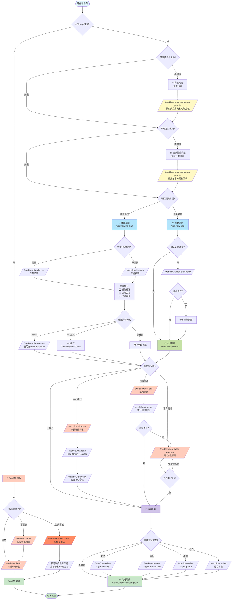

# CCW Workflow Difficulty Guide

## Overview

CCW 提供两类工作流体系：**主干工作流** (Main Workflow) 和 **Issue 工作流** (Issue Workflow)，它们协同覆盖软件开发的完整生命周期。

```
┌───────────────────────────────────────────────────────────────────────────────────────────┐
│                              Main Workflow (主干工作流)                                    │
│                                                                                           │
│  ┌──────────┐  ┌──────────┐  ┌──────────┐  ┌──────────┐  ┌──────────────────────────┐    │
│  │ Level 1  │→ │ Level 2  │→ │ Level 3  │→ │ Level 4  │→ │       Level 5           │    │
│  │ 急速执行  │  │ 轻量规划  │  │ 标准规划  │  │ 头脑风暴 │  │      智能编排            │    │
│  │          │  │          │  │          │  │          │  │                          │    │
│  │ lite-    │  │lite-plan │  │   plan   │  │brainstorm│  │   自动分析需求           │    │
│  │ lite-    │  │lite-fix  │  │ tdd-plan │  │  :auto-  │  │   ↓                      │    │
│  │ lite     │  │multi-cli-│  │test-fix- │  │ parallel │  │   智能推荐命令链         │    │
│  │          │  │   plan   │  │   gen    │  │    ↓     │  │   ↓                      │    │
│  │          │  │          │  │          │  │   plan   │  │   序列执行 (最小单元)    │    │
│  └──────────┘  └──────────┘  └──────────┘  └──────────┘  └──────────────────────────┘    │
│                                                                                           │
│  手动程度: ━━━━━━━━━━━━━━━━━━━━━━━━━━━━━━━━━━━━━━━━━━━━━━━━━━━━━━━━━━━━━━━━━━━━━━━━━━▶  │
│            高 (手动选择每个命令)                                            低 (全自动)   │
│                                                                                           │
│  复杂度: ━━━━━━━━━━━━━━━━━━━━━━━━━━━━━━━━━━━━━━━━━━━━━━━━━━━━━━━━━━━━━━━━━━━━━━━━━━━▶  │
│          低                                                                        高     │
└───────────────────────────────────────────────────────────────────────────────────────────┘
                                    │
                                    │ 开发完成后
                                    ▼
┌─────────────────────────────────────────────────────────────────────────────┐
│                          Issue Workflow (Issue 工作流)                       │
│                                                                             │
│     ┌──────────────┐         ┌──────────────┐         ┌──────────────┐     │
│     │  Accumulate  │    →    │    Plan      │    →    │   Execute    │     │
│     │  发现 & 积累  │         │  批量规划    │         │  并行执行    │     │
│     └──────────────┘         └──────────────┘         └──────────────┘     │
│                                                                             │
│     补充角色: 维护主分支稳定，支持 worktree 隔离                              │
└─────────────────────────────────────────────────────────────────────────────┘
```

## v7.0 新增功能

**主要新特性**：
- **团队架构 v2**: `team-coordinate-v2` 和 `team-executor-v2` 统一 team-worker 代理
- **队列调度器**: 具有依赖解析的后台任务执行
- **工作流会话命令**: `start`、`resume`、`complete`、`sync` 完整生命周期管理
- **新仪表板视图**: 分析查看器、终端仪表板、编排器模板编辑器

详情请参阅下面的[会话管理](#workflow-会话管理-v70)和[团队架构 v2](#团队架构-v2-v70)章节。

---

## 主干工作流与 Issue 工作流的关系

### 设计哲学

| 维度 | 主干工作流 (Main) | Issue 工作流 (Issue) |
|------|-------------------|---------------------|
| **定位** | 主要开发周期 | 开发后的维护补充 |
| **时机** | 功能开发阶段 | 主干开发完成后 |
| **范围** | 完整功能实现 | 针对性修复/增强 |
| **并行策略** | 依赖分析 → Agent 并行 | Worktree 隔离 (可选) |
| **分支模型** | 在当前分支工作 | 可使用独立 worktree |

### 为什么主干工作流不自动使用 Worktree？

**依赖分析已解决并行问题**：

1. 规划阶段 (`/workflow:plan`) 执行依赖分析
2. 自动识别任务依赖和关键路径
3. 划分**并行组** (独立任务) 和**串行链** (依赖任务)
4. Agent 并行执行独立任务，无需文件系统隔离

```
┌─────────────────────────────────────────────────┐
│         Dependency Analysis (依赖分析)           │
│                                                 │
│  Task A ─────┐                                  │
│              ├──→ Parallel Group 1 ──→ Agent 1  │
│  Task B ─────┘                                  │
│                                                 │
│  Task C ────────→ Serial Chain ──────→ Agent 2  │
│       ↓                                         │
│  Task D ────────→                               │
│                                                 │
│  同一 worktree，通过调度实现并行                   │
└─────────────────────────────────────────────────┘
```

### 为什么 Issue 工作流支持 Worktree？

Issue 工作流作为**补充机制**，场景不同：

1. 主干开发完成，已合并到 `main`
2. 发现需要修复的问题
3. 需要在不影响当前开发的情况下修复
4. Worktree 隔离让主分支保持稳定

```
开发完成 → 发布 → 发现 Issue → Worktree 隔离修复 → 合并回主干
    ↑                                              │
    └──────────── 继续新功能开发 ←─────────────────┘
```

---

## Workflow 会话管理 (v7.0)

CCW v7.0 引入完整的会话生命周期命令，用于管理工作流会话从创建到完成的全过程。

### 会话命令概览

| 命令 | 用途 | 使用时机 |
|------|------|----------|
| `/workflow:session:start` | 启动新会话或发现现有会话 | 开始任何工作流 |
| `/workflow:session:resume` | 恢复暂停的会话 | 返回中断的工作 |
| `/workflow:session:complete` | 归档会话并提取经验 | 所有任务完成后 |
| `/workflow:session:sync` | 同步会话工作到规范 | 更新项目文档 |

### 启动会话

```bash
# 发现模式 - 列出活动会话并让用户选择
/workflow:session:start

# 自动模式 - 基于关键词智能创建或重用
/workflow:session:start --auto "实现 OAuth2 认证"

# 强制新模式 - 始终创建新会话
/workflow:session:start --new "用户认证功能"

# 指定会话类型
/workflow:session:start --type tdd --auto "测试驱动的用户登录"
```

**会话类型**：
- `workflow`: 标准实现（默认）
- `review`: 代码审查会话
- `tdd`: 测试驱动开发
- `test`: 测试生成/修复会话
- `docs`: 文档会话

### 恢复会话

```bash
# 恢复最近暂停的会话
/workflow:session:resume

# 通过 execute 恢复特定会话
/workflow:execute --resume-session="WFS-user-auth-v2"
```

### 完成会话

```bash
# 带审查的交互式完成
/workflow:session:complete

# 自动完成并同步
/workflow:session:complete --yes

# 带指标的详细完成
/workflow:session:complete --detailed
```

**完成操作**：
- 将会话归档到 `.workflow/archives/`
- 生成带指标的 `manifest.json`
- 提取经验教训（成功、挑战、模式）
- 自动同步项目状态（使用 `--yes`）

### 同步会话工作

```bash
# 带确认的同步
/workflow:session:sync "添加了用户认证 JWT"

# 无确认的自动同步
/workflow:session:sync -y "实现了 OAuth2 流程"
```

**同步更新**：
- `specs/*.md` - 会话上下文的项目规范
- `project-tech.json` - 技术栈和架构

### 会话目录结构

```
.workflow/
├── active/                          # 活动会话
│   └── WFS-{session-name}/
│       ├── workflow-session.json    # 会话元数据
│       ├── IMPL_PLAN.md             # 实现计划
│       ├── TODO_LIST.md             # 任务清单
│       ├── .task/                   # 任务 JSON 文件
│       └── .process/                # 过程工件
├── archives/                        # 已完成的会话
│   └── WFS-{session-name}/
│       ├── manifest.json            # 完成指标
│       └── ...
└── project-tech.json                # 项目技术注册表
```

---

## Level 1: 急速执行 (lite-lite-lite)

**最简单 - 一次 CLI 分析到执行，零产物**

### 特点

| 属性 | 值 |
|------|-----|
| **复杂度** | 低 |
| **产物** | 无文件 |
| **状态** | 无状态 |
| **CLI 选择** | 自动分析任务类型 |
| **迭代方式** | 通过 AskUser |

### 流程

```
用户输入 → 需求澄清 → 自动选择 CLI → 并行分析 → 展示结果 → 直接执行
                         ↓
                    无中间文件
```

### 命令

```bash
/workflow:lite-lite-lite
# 或 CCW 自动识别简单任务时选择
```

### 适用场景

- ✅ 快速修复
- ✅ 简单功能添加
- ✅ 配置调整
- ✅ 小范围重命名
- ❌ 多模块改动
- ❌ 需要持久化记录

---

## Level 2: 轻量规划

**轻量 - 内存规划或单次分析，快速迭代**

### 包含工作流

| 工作流 | 用途 | 产物 | 执行方式 |
|--------|------|------|----------|
| `lite-plan` | 明确需求的功能开发 | memory://plan | → `lite-execute` |
| `lite-fix` | Bug 诊断修复 | `.workflow/.lite-fix/` | → `lite-execute` |
| `multi-cli-plan` | 需要多视角的任务 | `.workflow/.multi-cli-plan/` | → `lite-execute` |

### 共同特点

| 属性 | 值 |
|------|-----|
| **复杂度** | 低-中 |
| **状态** | 会话内 / 轻量持久化 |
| **执行** | 统一通过 `lite-execute` |
| **适用** | 需求相对明确的任务 |

---

### 2.1 lite-plan → lite-execute

**内存规划 + 直接执行**

```
┌─────────────────┐     ┌─────────────────┐
│  lite-plan      │ ──→ │  lite-execute   │
│  内存中规划      │     │  直接执行       │
└─────────────────┘     └─────────────────┘
```

```bash
/workflow:lite-plan    # 规划
/workflow:lite-execute # 执行
```

**适用**: 明确需求的单模块功能

---

### 2.2 lite-fix

**智能诊断 + 修复 (5 阶段)**

```
Phase 1: Bug Analysis & Diagnosis
   ├─ 智能严重性预评估 (Low/Medium/High/Critical)
   └─ 并行 cli-explore-agent 诊断 (1-4 个角度)

Phase 2: Clarification (可选)
   └─ 聚合澄清需求，AskUserQuestion

Phase 3: Fix Planning
   ├─ Low/Medium → Claude 直接规划
   └─ High/Critical → cli-lite-planning-agent

Phase 4: Confirmation & Selection
   └─ 用户确认执行方式

Phase 5: Execute
   └─ SlashCommand("/workflow:lite-execute --in-memory --mode bugfix")
```

```bash
/workflow:lite-fix           # 标准修复
/workflow:lite-fix --hotfix  # 紧急热修复 (跳过诊断)
```

**产物**: `.workflow/.lite-fix/{bug-slug}-{date}/`
- `diagnosis-{angle}.json` (1-4 个诊断文件)
- `diagnoses-manifest.json`
- `fix-plan.json`

**适用**: Bug 诊断修复、紧急生产问题

---

### 2.3 multi-cli-plan → lite-execute

**多 CLI 协作分析 + 共识收敛 (5 阶段)**

```
Phase 1: Context Gathering
   └─ ACE 语义搜索，构建上下文包

Phase 2: Multi-CLI Discussion (迭代)
   ├─ cli-discuss-agent 执行 Gemini + Codex + Claude
   ├─ 交叉验证，合成方案
   └─ 循环直到收敛或达到最大轮数

Phase 3: Present Options
   └─ 展示方案及权衡

Phase 4: User Decision
   └─ 用户选择方案

Phase 5: Plan Generation
   ├─ cli-lite-planning-agent 生成计划
   └─ → lite-execute
```

```bash
/workflow:multi-cli-plan "task description"  # 多 CLI 协作规划
/workflow:lite-execute                       # 执行选定方案
```

**产物**: `.workflow/.multi-cli-plan/{MCP-task-slug-date}/`
- `rounds/*/synthesis.json` (每轮分析)
- `context-package.json`
- `IMPL_PLAN.md` + `plan.json`

**vs lite-plan 对比**:

| 维度 | multi-cli-plan | lite-plan |
|------|---------------|-----------|
| **上下文** | ACE 语义搜索 | 手动文件模式 |
| **分析** | 多 CLI 交叉验证 | 单次规划 |
| **迭代** | 多轮直到收敛 | 单轮 |
| **置信度** | 高 (共识驱动) | 中 (单一视角) |

**适用**: 需要多视角分析、技术选型、方案比较

---

## Level 3: 标准规划

**标准 - 完整规划 + 持久化 Session + 验证**

### 包含工作流

| 工作流 | 用途 | 阶段数 | 产物位置 |
|--------|------|--------|----------|
| `plan` | 复杂功能开发 | 5 阶段 | `.workflow/active/{session}/` |
| `tdd-plan` | 测试驱动开发 | 6 阶段 | `.workflow/active/{session}/` |
| `test-fix-gen` | 测试修复生成 | 5 阶段 | `.workflow/active/WFS-test-{session}/` |

### 共同特点

| 属性 | 值 |
|------|-----|
| **复杂度** | 中-高 |
| **产物** | 持久化文件 (`.workflow/active/{session}/`) |
| **状态** | 完整 session 管理 |
| **验证** | 内置验证步骤 |
| **执行** | `/workflow:execute` |
| **适用** | 多模块、需要追溯的任务 |

---

### 3.1 plan → verify → execute

**5 阶段完整规划工作流**

```
Phase 1: Session Discovery
   └─ /workflow:session:start --auto

Phase 2: Context Gathering
   └─ /workflow:tools:context-gather
      └─ 返回 context-package.json + conflict_risk

Phase 3: Conflict Resolution (条件触发)
   └─ IF conflict_risk ≥ medium → /workflow:tools:conflict-resolution

Phase 4: Task Generation
   └─ /workflow:tools:task-generate-agent
      └─ 返回 IMPL_PLAN.md + IMPL-*.json + TODO_LIST.md

Return: Summary + Next Steps
```

```bash
/workflow:plan "task description"   # 完整规划
/workflow:plan-verify        # 验证计划 (推荐)
/workflow:execute                   # 执行
/workflow:review                    # (可选) 审查
```

**产物**: `.workflow/active/{WFS-session}/`
- `workflow-session.json`
- `IMPL_PLAN.md`
- `TODO_LIST.md`
- `.task/IMPL-*.json`
- `.process/context-package.json`

**适用**: 多模块改动、重构任务、需要依赖分析

---

### 3.2 tdd-plan → execute → tdd-verify

**6 阶段测试驱动开发工作流**

```
Phase 1: Session Discovery
   └─ /workflow:session:start --type tdd --auto

Phase 2: Context Gathering
   └─ /workflow:tools:context-gather

Phase 3: Test Coverage Analysis
   └─ /workflow:tools:test-context-gather
      └─ 检测测试框架，分析覆盖率

Phase 4: Conflict Resolution (条件触发)
   └─ IF conflict_risk ≥ medium → /workflow:tools:conflict-resolution

Phase 5: TDD Task Generation
   └─ /workflow:tools:task-generate-tdd
      └─ 生成内置 Red-Green-Refactor 循环的 IMPL 任务

Phase 6: TDD Structure Validation
   └─ 验证 TDD 结构合规性
```

```bash
/workflow:tdd-plan "feature description"  # TDD 规划
/workflow:plan-verify              # 验证 (推荐)
/workflow:execute                         # 执行 (遵循 Red-Green-Refactor)
/workflow:tdd-verify                      # 验证 TDD 流程合规
```

**TDD 任务结构**:
- 每个 IMPL 任务包含完整的 Red-Green-Refactor 内部循环
- `meta.tdd_workflow: true`
- `flow_control.implementation_approach` 包含 3 步 (red/green/refactor)
- Green 阶段包含 test-fix-cycle 配置

**适用**: 测试驱动开发、高质量要求的功能

---

### 3.3 test-fix-gen → test-cycle-execute

**5 阶段测试修复生成工作流**

```
Phase 1: Create Test Session
   └─ /workflow:session:start --type test --new

Phase 2: Gather Test Context
   ├─ Session Mode: /workflow:tools:test-context-gather
   └─ Prompt Mode: /workflow:tools:context-gather

Phase 3: Test Generation Analysis
   └─ /workflow:tools:test-concept-enhanced
      └─ 多层测试需求 (L0: Static, L1: Unit, L2: Integration, L3: E2E)

Phase 4: Generate Test Tasks
   └─ /workflow:tools:test-task-generate
      └─ IMPL-001 (生成) + IMPL-001.5 (质量门) + IMPL-002 (执行修复)

Phase 5: Return Summary
   └─ → /workflow:test-cycle-execute
```

**双模式支持**:
| 模式 | 输入模式 | 上下文来源 |
|------|----------|-----------|
| Session Mode | `WFS-xxx` | 源 session 摘要 |
| Prompt Mode | 文本/文件路径 | 直接代码库分析 |

```bash
/workflow:test-fix-gen WFS-user-auth-v2        # Session Mode
/workflow:test-fix-gen "Test the auth API"     # Prompt Mode
/workflow:test-cycle-execute                   # 执行测试修复循环
```

**产物**: `.workflow/active/WFS-test-{session}/`
- `.task/IMPL-001.json` (测试理解与生成)
- `.task/IMPL-001.5-review.json` (质量门)
- `.task/IMPL-002.json` (测试执行与修复循环)
- `.process/TEST_ANALYSIS_RESULTS.md`

**适用**: 测试失败修复、覆盖率提升

---

## Level 4: 头脑风暴 (brainstorm:auto-parallel)

**最复杂 - 多角色头脑风暴 + 完整规划 + 执行**

### 特点

| 属性 | 值 |
|------|-----|
| **复杂度** | 高 |
| **产物** | 多角色分析文档 + `IMPL_PLAN.md` |
| **角色数** | 3-9 个 (默认 3) |
| **执行模式** | Phase 1/3 串行，Phase 2 并行 |

### 3 阶段流程

```
Phase 1: Interactive Framework Generation
   └─ /workflow:brainstorm:artifacts
      ├─ Topic 分析，生成问题
      ├─ 角色选择 (用户确认)
      ├─ 角色问题收集
      ├─ 冲突检测与解决
      └─ 生成 guidance-specification.md

Phase 2: Parallel Role Analysis (并行)
   └─ N × Task(conceptual-planning-agent)
      ├─ 每个角色独立分析
      └─ 并行生成 {role}/analysis.md

Phase 3: Synthesis Integration
   └─ /workflow:brainstorm:synthesis
      └─ 整合所有角色分析 → synthesis-specification.md
```

### 命令

```bash
/workflow:brainstorm:auto-parallel "topic" [--count N] [--style-skill package]
/workflow:plan --session {sessionId}     # 基于头脑风暴结果规划
/workflow:plan-verify             # 验证
/workflow:execute                        # 执行
```

### 可用角色

| 角色 | 描述 |
|------|------|
| `system-architect` | 系统架构师 |
| `ui-designer` | UI 设计师 |
| `ux-expert` | UX 专家 |
| `product-manager` | 产品经理 |
| `product-owner` | 产品负责人 |
| `data-architect` | 数据架构师 |
| `scrum-master` | 敏捷教练 |
| `subject-matter-expert` | 领域专家 |
| `test-strategist` | 测试策略师 |

### 产物结构

```
.workflow/active/WFS-{topic}/
├── workflow-session.json              # Session 元数据
└── .brainstorming/
    ├── guidance-specification.md      # 框架 (Phase 1)
    ├── {role}/
    │   ├── analysis.md                # 主文档
    │   └── analysis-{slug}.md         # 子文档 (可选，最多 5 个)
    └── synthesis-specification.md     # 整合 (Phase 3)
```

### 适用场景

- ✅ 全新功能设计
- ✅ 系统架构重构
- ✅ 探索性需求
- ✅ 不确定如何实现
- ✅ 需要多维度权衡
- ❌ 需求已明确
- ❌ 时间紧迫的任务

---

## Level 5: 智能编排 (CCW Coordinator)

**最智能 - 自动化命令链编排 + 序列执行 + 状态持久化**

### 特点

| 属性 | 值 |
|------|-----|
| **复杂度** | 高 |
| **产物** | 完整编排会话状态 |
| **状态** | 完整状态追踪 |
| **执行模式** | 3 阶段智能编排 |
| **适用** | 多命令协作、复杂流程自动化 |

### 核心概念

#### 全生命周期命令选择流程图



**流程图说明**:
- 从"这是Bug修复吗？"开始的首要决策
- 包含构思 (Ideation)、设计 (Design)、规划 (Planning)、执行 (Execution)、测试 (Testing)、审查 (Review) 完整阶段
- 每个阶段都有具体的命令推荐
- 支持轻量规划和完整规划两条路径
- 包含测试决策（TDD、后置测试、测试修复）
- 包含多种代码审查选项

#### 最小执行单元 (Minimum Execution Units)

**定义**: 一组必须一起执行的原子命令组合，分割后会破坏逻辑流程。

**设计理念**:
- **防止不完整状态**: 避免只生成任务但不执行
- **用户体验**: 用户获得完整结果，而非中间产物
- **工作流完整性**: 保持多步操作的逻辑连贯性

**Planning + Execution Units** (规划+执行单元):

| 单元名称 | 命令组合 | 目的 | 输出 |
|---------|----------|------|------|
| **Quick Implementation** | lite-plan → lite-execute | 轻量规划与立即执行 | 工作代码 |
| **Multi-CLI Planning** | multi-cli-plan → lite-execute | 多视角分析与执行 | 工作代码 |
| **Bug Fix** | lite-fix → lite-execute | 快速 Bug 诊断与修复执行 | 修复代码 |
| **Full Planning + Execution** | plan → execute | 详细规划与执行 | 工作代码 |
| **Verified Planning + Execution** | plan → plan-verify → execute | 规划验证与执行 | 工作代码 |
| **Replanning + Execution** | replan → execute | 更新规划与执行 | 工作代码 |
| **TDD Planning + Execution** | tdd-plan → execute | 测试驱动开发规划与执行 | 工作代码 |
| **Test Generation + Execution** | test-gen → execute | 测试套件生成与执行 | 生成的测试 |

**Testing Units** (测试单元):

| 单元名称 | 命令组合 | 目的 | 输出 |
|---------|----------|------|------|
| **Test Validation** | test-fix-gen → test-cycle-execute | 生成测试任务并执行测试修复循环 | 测试通过 |

**Review Units** (审查单元):

| 单元名称 | 命令组合 | 目的 | 输出 |
|---------|----------|------|------|
| **Code Review (Session)** | review-session-cycle → review-fix | 完整审查循环与应用修复 | 修复代码 |
| **Code Review (Module)** | review-module-cycle → review-fix | 模块审查循环与应用修复 | 修复代码 |

### 3 阶段工作流程

#### Phase 1: 需求分析 (Analyze Requirements)

解析任务描述，提取关键信息：

```javascript
function analyzeRequirements(taskDescription) {
  return {
    goal: extractMainGoal(taskDescription),           // 主目标
    scope: extractScope(taskDescription),             // 范围
    constraints: extractConstraints(taskDescription), // 约束
    complexity: determineComplexity(taskDescription), // 复杂度
    task_type: detectTaskType(taskDescription)        // 任务类型
  };
}
```

**任务类型检测模式**:

| 任务类型 | 检测关键词 | 示例 |
|---------|-----------|------|
| `bugfix` | fix, bug, error, crash, fail, debug | "修复登录超时问题" |
| `tdd` | tdd, test-driven, 先写测试, test first | "用 TDD 开发支付模块" |
| `test-fix` | 测试失败, test fail, fix test, failing test | "修复失败的集成测试" |
| `test-gen` | generate test, 写测试, add test, 补充测试 | "为认证模块生成测试" |
| `review` | review, 审查, code review | "审查支付模块代码" |
| `brainstorm` | 不确定, explore, 研究, what if, 权衡 | "探索缓存方案" |
| `multi-cli` | 多视角, 比较方案, cross-verify, multi-cli | "比较 OAuth 方案" |
| `feature` | (默认) | "实现用户注册" |

**复杂度评估**:

| 权重 | 关键词 |
|------|--------|
| +2 | refactor, 重构, migrate, 迁移, architect, 架构, system, 系统 |
| +2 | multiple, 多个, across, 跨, all, 所有, entire, 整个 |
| +1 | integrate, 集成, api, database, 数据库 |
| +1 | security, 安全, performance, 性能, scale, 扩展 |

- **高复杂度** (≥4): 自动选择复杂工作流
- **中复杂度** (2-3): 自动选择标准工作流
- **低复杂度** (<2): 自动选择轻量工作流

#### Phase 2: 命令发现与推荐 (Discover Commands & Recommend Chain)

**命令端口系统** - 基于端口的动态命令链组装:

```javascript
// 命令端口定义示例
const commandPorts = {
  'lite-plan': {
    input: ['requirement'],                    // 输入端口: 需求
    output: ['plan'],                          // 输出端口: 计划
    atomic_group: 'quick-implementation'       // 最小单元
  },
  'lite-execute': {
    input: ['plan', 'multi-cli-plan', 'lite-fix'], // 可接受多种输入
    output: ['code'],                          // 输出端口: 代码
    atomic_groups: [                           // 可参与多个单元
      'quick-implementation',
      'multi-cli-planning',
      'bug-fix'
    ]
  },
  'plan': {
    input: ['requirement'],
    output: ['detailed-plan'],
    atomic_groups: [
      'full-planning-execution',
      'verified-planning-execution'
    ]
  },
  'execute': {
    input: ['detailed-plan', 'verified-plan', 'replan', 'test-tasks', 'tdd-tasks'],
    output: ['code'],
    atomic_groups: [
      'full-planning-execution',
      'verified-planning-execution',
      'replanning-execution',
      'test-generation-execution',
      'tdd-planning-execution'
    ]
  }
};
```

**任务类型到端口流映射**:

| 任务类型 | 输入端口 | 输出端口 | 示例管道 |
|---------|---------|---------|---------|
| `bugfix` | bug-report | test-passed | Bug报告 → lite-fix → 修复 → test-passed |
| `tdd` | requirement | tdd-verified | 需求 → tdd-plan → execute → tdd-verify |
| `test-fix` | failing-tests | test-passed | 失败测试 → test-fix-gen → test-cycle-execute |
| `test-gen` | code/session | test-passed | 代码 → test-gen → execute → test-passed |
| `review` | code/session | review-verified | 代码 → review-* → review-fix |
| `feature` | requirement | code/test-passed | 需求 → plan → execute → code |

**管道可视化示例**:

```
需求 → 【lite-plan → lite-execute】→ 代码 → 【test-fix-gen → test-cycle-execute】→ 测试通过
       └──── Quick Implementation ────┘         └────── Test Validation ──────┘
```

**用户确认界面**:

```
Recommended Command Chain:

Pipeline (管道视图):
需求 → lite-plan → 计划 → lite-execute → 代码 → test-cycle-execute → 测试通过

Commands (命令列表):
1. /workflow:lite-plan
2. /workflow:lite-execute
3. /workflow:test-cycle-execute

Proceed? [Confirm / Show Details / Adjust / Cancel]
```

#### Phase 3: 序列执行 (Execute Sequential Command Chain)

**串行阻塞模型** - 一次执行一个命令，通过 hook 回调延续:

```javascript
async function executeCommandChain(chain, analysis) {
  const sessionId = `ccw-coord-${Date.now()}`;
  const stateDir = `.workflow/.ccw-coordinator/${sessionId}`;

  // 初始化状态
  const state = {
    session_id: sessionId,
    status: 'running',
    created_at: new Date().toISOString(),
    analysis: analysis,
    command_chain: chain.map((cmd, idx) => ({ ...cmd, index: idx, status: 'pending' })),
    execution_results: [],
    prompts_used: []
  };

  // 立即保存初始状态
  Write(`${stateDir}/state.json`, JSON.stringify(state, null, 2));

  // 执行第一个命令
  for (let i = 0; i < chain.length; i++) {
    const cmd = chain[i];

    // 组装提示词
    let prompt = formatCommand(cmd, state.execution_results, analysis);
    prompt += `\n\nTask: ${analysis.goal}`;

    // 启动后台 CLI 执行
    const taskId = Bash(
      `ccw cli -p "${escapePrompt(prompt)}" --tool claude --mode write`,
      { run_in_background: true }
    ).task_id;

    // 保存检查点
    state.execution_results.push({
      index: i,
      command: cmd.command,
      status: 'in-progress',
      task_id: taskId,
      session_id: null,
      artifacts: [],
      timestamp: new Date().toISOString()
    });
    state.command_chain[i].status = 'running';
    Write(`${stateDir}/state.json`, JSON.stringify(state, null, 2));

    // 立即停止，等待 hook 回调
    break;
  }

  state.status = 'waiting';
  Write(`${stateDir}/state.json`, JSON.stringify(state, null, 2));

  return state;
}
```

**智能参数组装**:

| 命令类型 | 参数模式 | 示例 |
|---------|---------|------|
| 规划命令 | 任务描述 | `/workflow:lite-plan -y "实现用户认证"` |
| 执行命令 (有计划) | `--resume-session` | `/workflow:execute -y --resume-session="WFS-plan-001"` |
| 执行命令 (独立) | `--in-memory` 或任务描述 | `/workflow:lite-execute -y --in-memory` |
| 基于会话 | `--session` | `/workflow:test-fix-gen -y --session="WFS-impl-001"` |
| Bug 修复 | 问题描述 | `/workflow:lite-fix -y "修复超时错误"` |

### 状态文件结构

**位置**: `.workflow/.ccw-coordinator/{session_id}/state.json`

```json
{
  "session_id": "ccw-coord-20250124-143025",
  "status": "running|waiting|completed|failed",
  "created_at": "2025-01-24T14:30:25Z",
  "updated_at": "2025-01-24T14:35:45Z",
  "analysis": {
    "goal": "实现用户注册",
    "scope": ["authentication", "user_management"],
    "constraints": ["no breaking changes"],
    "complexity": "medium",
    "task_type": "feature"
  },
  "command_chain": [
    {
      "index": 0,
      "command": "/workflow:plan",
      "name": "plan",
      "description": "详细规划",
      "status": "completed"
    },
    {
      "index": 1,
      "command": "/workflow:execute",
      "name": "execute",
      "description": "执行实现",
      "status": "running"
    },
    {
      "index": 2,
      "command": "/workflow:test-cycle-execute",
      "name": "test-cycle-execute",
      "status": "pending"
    }
  ],
  "execution_results": [
    {
      "index": 0,
      "command": "/workflow:plan",
      "status": "completed",
      "task_id": "task-001",
      "session_id": "WFS-plan-20250124",
      "artifacts": ["IMPL_PLAN.md", "exploration-architecture.json"],
      "timestamp": "2025-01-24T14:30:25Z",
      "completed_at": "2025-01-24T14:30:45Z"
    },
    {
      "index": 1,
      "command": "/workflow:execute",
      "status": "in-progress",
      "task_id": "task-002",
      "session_id": null,
      "artifacts": [],
      "timestamp": "2025-01-24T14:32:00Z"
    }
  ],
  "prompts_used": [
    {
      "index": 0,
      "command": "/workflow:plan",
      "prompt": "/workflow:plan -y \"实现用户注册...\"\n\nTask: 实现用户注册..."
    },
    {
      "index": 1,
      "command": "/workflow:execute",
      "prompt": "/workflow:execute -y --resume-session=\"WFS-plan-20250124\"\n\nTask: 实现用户注册\n\nPrevious results:\n- /workflow:plan: WFS-plan-20250124 (IMPL_PLAN.md)"
    }
  ]
}
```

**状态流转**:

```
running → waiting → [hook callback] → waiting → [hook callback] → completed
   ↓                                                                    ↑
failed ←────────────────────────────────────────────────────────────┘
```

**状态值说明**:
- `running`: 编排器主动执行 (启动 CLI 命令)
- `waiting`: 暂停，等待 hook 回调触发继续
- `completed`: 所有命令成功完成
- `failed`: 用户中止或不可恢复错误

### 产物结构

```
.workflow/.ccw-coordinator/{session_id}/
└── state.json                        # 完整会话状态
    ├── session_id                    # 会话 ID
    ├── status                        # 当前状态
    ├── analysis                      # 需求分析结果
    ├── command_chain                 # 命令链定义
    ├── execution_results             # 执行结果列表
    └── prompts_used                  # 已使用的提示词
```

### 典型场景

#### 场景 1: 简单功能开发

```bash
用户: "实现用户头像上传功能"

# CCW Coordinator 自动执行:
Phase 1: 分析
  Goal: 实现用户头像上传
  Complexity: simple
  Task Type: feature

Phase 2: 推荐命令链
  Pipeline: 需求 → 【lite-plan → lite-execute】→ 代码 → 【test-fix-gen → test-cycle-execute】→ 测试通过
  Commands: lite-plan, lite-execute, test-fix-gen, test-cycle-execute

Phase 3: 用户确认并执行
  → lite-plan: 生成规划 (内存)
  → lite-execute: 实现代码
  → test-fix-gen: 生成测试任务
  → test-cycle-execute: 测试修复循环

产物: .workflow/.ccw-coordinator/ccw-coord-20250124-xxx/state.json
```

#### 场景 2: Bug 修复

```bash
用户: "修复支付超时问题"

# CCW Coordinator 自动执行:
Phase 1: 分析
  Goal: 修复支付超时
  Task Type: bugfix

Phase 2: 推荐命令链
  Pipeline: Bug报告 → 【lite-fix → lite-execute】→ 修复 → 【test-fix-gen → test-cycle-execute】→ 测试通过
  Commands: lite-fix, lite-execute, test-fix-gen, test-cycle-execute

Phase 3: 执行
  → lite-fix: 诊断根因，生成修复计划
  → lite-execute: 应用修复
  → test-fix-gen: 生成回归测试
  → test-cycle-execute: 验证修复

产物:
  .workflow/.ccw-coordinator/ccw-coord-20250124-xxx/state.json
  .workflow/.lite-fix/payment-timeout-20250124-xxx/diagnosis.json
```

#### 场景 3: 复杂功能开发

```bash
用户: "实现完整的实时协作编辑系统"

# CCW Coordinator 自动执行:
Phase 1: 分析
  Goal: 实现实时协作编辑
  Complexity: complex
  Task Type: feature

Phase 2: 推荐命令链
  Pipeline: 需求 → 【plan → plan-verify → execute】→ 代码 → 【review-session-cycle → review-fix】→ 修复
  Commands: plan, plan-verify, execute, review-session-cycle, review-fix

Phase 3: 执行
  → plan: 完整规划 (持久化)
  → plan-verify: 验证计划质量
  → execute: 实现功能
  → review-session-cycle: 多维度审查
  → review-fix: 应用审查修复

产物:
  .workflow/.ccw-coordinator/ccw-coord-20250124-xxx/state.json
  .workflow/active/WFS-realtime-collab-xxx/IMPL_PLAN.md
```

### 命令

```bash
/ccw-coordinator "任务描述"
# 自动分析、推荐命令链、用户确认、序列执行
```

### 适用场景

- ✅ 需要多命令协作的复杂任务
- ✅ 不确定需要哪些命令组合
- ✅ 希望自动化端到端流程
- ✅ 需要完整状态追踪和可恢复性
- ✅ 团队协作需要统一执行流程
- ❌ 单一简单命令即可完成
- ❌ 已明确知道要用的具体命令

### 与其他 Level 的关系

| Level | 手动程度 | CCW Coordinator 角色 |
|-------|---------|---------------------|
| Level 1-4 | 手动选择命令 | 自动组合这些命令 |
| Level 5 | 自动选择命令 | 智能编排器 |

**CCW Coordinator 内部使用 Level 1-4 命令**:
- 分析任务 → 自动选择合适的 Level
- 组装命令链 → 包含 Level 1-4 的命令
- 序列执行 → 按最小单元执行

---

## 团队架构 v2 (v7.0)

**适用于需要多角色专业知识和编排的复杂多角色项目。**

### 概述

团队架构 v2 (`team-coordinate-v2`、`team-executor-v2`) 为复杂软件开发工作流提供统一的 team-worker 代理架构。

```
┌─────────────────────────────────────────────────────────────────────────────────┐
│                         Team Coordinate / Team Executor v2                      │
│                                                                                  │
│  ┌─────────────┐        ┌─────────────────────────────────────────────────┐    │
│  │ Coordinator │ ──→   │  动态角色规范生成                                  │    │
│  │ / Executor  │        │  (analyst, planner, executor, tester, reviewer)  │    │
│  └─────────────┘        └─────────────────────────────────────────────────┘    │
│          │                            │                                        │    │
│          ▼                            ▼                                        │    │
│  ┌─────────────┐        ┌─────────────────────────────────────────────────┐    │
│  │   任务      │        │            team-worker 代理                        │    │
│  │  分发       │        │  (阶段1: 任务发现 - 内置)                        │    │
│  └─────────────┘        │  (阶段2-4: 角色特定 - 从规范文件)                  │    │
│                         │  (阶段5: 报告 + 快速推进 - 内置)                    │    │
│                         └─────────────────────────────────────────────────┘    │
│                                      │                                        │    │
│                                      ▼                                        │    │
│                         ┌─────────────────────────────────────────────────┐    │
│                         │  子代理 (Discuss, Explore, Doc-Generation)       │    │
│                         └─────────────────────────────────────────────────┘    │
└─────────────────────────────────────────────────────────────────────────────────┘
```

### 核心概念

#### team-worker 代理

统一的工作代理，负责：
- **阶段1（内置）**: 任务发现 - 按前缀和状态过滤任务
- **阶段2-4（角色特定）**: 从角色规范 markdown 文件加载领域逻辑
- **阶段5（内置）**: 报告 + 快速推进 - 处理完成和后继生成

#### 角色规范文件

仅包含阶段2-4逻辑的轻量级 markdown 文件：

```yaml
---
role: analyst
prefix: RESEARCH
inner_loop: false
subagents: [explore, discuss]
message_types:
  success: research_ready
  error: error
---
```

#### 内循环框架

当 `inner_loop: true` 时，单个代理顺序处理所有相同前缀任务：

```
context_accumulator = []

阶段1: 查找第一个 RESEARCH-* 任务
  阶段2-4: 执行角色规范
  阶段5-L: 标记完成，记录，累积
    更多 RESEARCH-* 任务？→ 阶段1（循环）
    没有了？→ 阶段5-F（最终报告）
```

### 命令

#### Team Coordinate

从头生成角色规范并编排团队：

```bash
/team-coordinate "设计和实现实时协作系统"
```

**流程**：
1. 分析需求并检测能力
2. 动态生成角色规范
3. 创建带依赖链的任务
4. 生成 team-worker 代理
5. 通过回调监控进度
6. 完成并生成综合报告

#### Team Executor

执行预规划的团队会话：

```bash
# 初始执行
/team-executor <session-folder>

# 恢复暂停的会话
/team-executor <session-folder> resume

# 检查状态但不推进
/team-executor <session-folder> status
```

### 可用角色

| 角色 | 前缀 | 职责 | 内循环 |
|------|------|------|--------|
| analyst | RESEARCH | 代码库探索、多视角分析 | 否 |
| planner | PLAN | 任务分解和依赖规划 | 是 |
| executor | IMPL | 实现和编码 | 是 |
| tester | TEST | 测试和质量保证 | 是 |
| reviewer | REVIEW | 代码审查和质量门 | 是 |
| architect | DESIGN | 架构和设计决策 | 否 |
| fe-developer | FE-IMPL | 前端实现 | 是 |
| fe-qa | FE-TEST | 前端测试 | 是 |

### 子代理

| 子代理 | 用途 |
|--------|------|
| discuss | 多视角批判，动态视角 |
| explore | 代码库探索，带缓存 |
| doc-generation | 从模板生成文档 |

### 消息总线协议

通过 `team_msg` 操作进行团队通信：

```javascript
mcp__ccw-tools__team_msg({
  operation: "log",
  team: "<session_id>",      // 会话 ID，不是团队名称
  from: "<role>",
  to: "coordinator",
  type: "<message_type>",
  summary: "[<role>] <message>",
  ref: "<artifact_path>"
})
```

### 会话结构

```
.workflow/.team/<session-id>/
├── team-session.json           # 会话元数据
├── task-analysis.json          # 任务依赖
├── role-specs/                 # 生成的角色规范文件
│   ├── analyst.md
│   ├── planner.md
│   └── executor.md
├── artifacts/                  # 任务输出
├── discussions/                # 多视角批判
└── wisdom/                     # 累积的经验
    ├── learnings.md
    ├── decisions.md
    ├── conventions.md
    └── issues.md
```

### 使用场景

- ✅ 需要多专业知识的复杂多系统项目
- ✅ 需要在实现前进行架构探索的项目
- ✅ 质量关键项目，需要全面测试和审查
- ✅ 前端 + 后端协调
- ❌ 简单单模块功能（改用 `/workflow:plan`）
- ❌ 快速修复（改用 `/workflow:lite-fix`）

---

## Issue 工作流

**主干工作流的补充 - 开发后的持续维护**

### 两阶段生命周期

```
┌─────────────────────────────────────────────────────────────────────┐
│                    Phase 1: Accumulation (积累阶段)                  │
│                                                                     │
│   触发源:                                                           │
│   • 任务完成后的 review                                              │
│   • 代码审查发现                                                     │
│   • 测试失败                                                        │
│                                                                     │
│   ┌────────────┐     ┌────────────┐     ┌────────────┐             │
│   │ discover   │     │ discover-  │     │    new     │             │
│   │ 自动发现   │     │ by-prompt  │     │  手动创建  │             │
│   └────────────┘     └────────────┘     └────────────┘             │
│                                                                     │
│   持续积累 Issue 到待处理队列                                         │
└─────────────────────────────────────────────────────────────────────┘
                               │
                               │ 积累足够后
                               ▼
┌─────────────────────────────────────────────────────────────────────┐
│                  Phase 2: Batch Resolution (批量解决)                │
│                                                                     │
│   ┌────────────┐     ┌────────────┐     ┌────────────┐             │
│   │   plan     │ ──→ │   queue    │ ──→ │  execute   │             │
│   │ --all-     │     │ 优化顺序   │     │ 并行执行   │             │
│   │  pending   │     │ 冲突分析   │     │           │             │
│   └────────────┘     └────────────┘     └────────────┘             │
│                                                                     │
│   支持 Worktree 隔离，保持主分支稳定                                  │
└─────────────────────────────────────────────────────────────────────┘
```

### 命令清单

**积累阶段:**
```bash
/issue:discover            # 多视角自动发现
/issue:discover-by-prompt  # 基于提示发现
/issue:new                 # 手动创建
```

**批量解决:**
```bash
/issue:plan --all-pending  # 批量规划所有待处理
/issue:queue               # 生成优化执行队列
/issue:execute             # 并行执行
```

### 与主干工作流的协作模式

```
┌─────────────────────────────────────────────────────────────────────┐
│                         开发迭代循环                                 │
│                                                                     │
│   ┌─────────┐                              ┌─────────┐             │
│   │ Feature │ ──→ Main Workflow ──→ 完成 ──→│ Review  │             │
│   │ Request │     (Level 1-4)              └────┬────┘             │
│   └─────────┘                                   │                  │
│        ▲                                        │ 发现问题          │
│        │                                        ▼                  │
│        │                                  ┌─────────┐              │
│        │                                  │  Issue  │              │
│        │                                  │ Workflow│              │
│   继续 │                                  └────┬────┘              │
│   新功能│                                       │                  │
│        │         ┌──────────────────────────────┘                  │
│        │         │ 修复完成                                         │
│        │         ▼                                                 │
│   ┌────┴────┐◀──────                                               │
│   │  Main   │    合并                                              │
│   │ Branch  │    回主干                                            │
│   └─────────┘                                                      │
│                                                                     │
└─────────────────────────────────────────────────────────────────────┘
```

---

## 工作流选择指南

### 快速选择表

| 场景 | 推荐工作流 | Level |
|------|-----------|-------|
| 快速修复、配置调整 | `lite-lite-lite` | 1 |
| 明确需求的单模块功能 | `lite-plan → lite-execute` | 2 |
| Bug 诊断修复 | `lite-fix` | 2 |
| 紧急生产问题 | `lite-fix --hotfix` | 2 |
| 技术选型、方案比较 | `multi-cli-plan → lite-execute` | 2 |
| 多模块改动、重构 | `plan → verify → execute` | 3 |
| 测试驱动开发 | `tdd-plan → execute → tdd-verify` | 3 |
| 测试失败修复 | `test-fix-gen → test-cycle-execute` | 3 |
| 全新功能、架构设计 | `brainstorm:auto-parallel → plan → execute` | 4 |
| 不确定需要哪些命令 | `ccw-coordinator` (自动分析) | 5 |
| 需要端到端自动化 | `ccw-coordinator` (自动推荐+执行) | 5 |
| 开发后问题修复 | Issue Workflow | - |

### 决策流程图

```
开始
  │
  ├─ 是开发后的维护问题？
  │     ├─ 是 → Issue Workflow
  │     └─ 否 ↓
  │
  ├─ 明确知道要用哪些命令？
  │     ├─ 是 → 直接使用对应 Level 1-4 命令
  │     └─ 否 → Level 5 (ccw-coordinator 自动编排)
  │              │
  │              └─ 自动分析 → 推荐命令链 → 用户确认 → 序列执行
  │
  ├─ 需求是否明确？
  │     ├─ 不确定 → Level 4 (brainstorm:auto-parallel)
  │     └─ 明确 ↓
  │
  ├─ 需要持久化 Session？
  │     ├─ 是 → Level 3 (plan / tdd-plan / test-fix-gen)
  │     └─ 否 ↓
  │
  ├─ 需要多视角 / 方案比较？
  │     ├─ 是 → Level 2 (multi-cli-plan)
  │     └─ 否 ↓
  │
  ├─ 是 Bug 修复？
  │     ├─ 是 → Level 2 (lite-fix)
  │     └─ 否 ↓
  │
  ├─ 是否需要规划？
  │     ├─ 是 → Level 2 (lite-plan)
  │     └─ 否 → Level 1 (lite-lite-lite)
```

### 复杂度指标

系统根据以下关键词自动评估复杂度：

| 权重 | 关键词 |
|------|--------|
| +2 | refactor, 重构, migrate, 迁移, architect, 架构, system, 系统 |
| +2 | multiple, 多个, across, 跨, all, 所有, entire, 整个 |
| +1 | integrate, 集成, api, database, 数据库 |
| +1 | security, 安全, performance, 性能, scale, 扩展 |

- **高复杂度** (≥4): 自动选择 Level 3-4
- **中复杂度** (2-3): 自动选择 Level 2
- **低复杂度** (<2): 自动选择 Level 1

---

## 语义化 CLI 调用

用户可以在提示词中 **语义指定 CLI 工具** - 系统自动调用对应的 CLI。

### 基础调用

| 用户提示词 | 系统动作 |
|------------|----------|
| "使用 Gemini 分析 auth 模块" | 自动调用 `gemini` CLI 进行分析 |
| "让 Codex 审查这段代码" | 自动调用 `codex` CLI 进行审查 |
| "问问 Qwen 性能优化建议" | 自动调用 `qwen` CLI 进行咨询 |

### 多 CLI 编排

| 模式 | 用户提示词示例 |
|------|----------------|
| **协同分析** | "使用 Gemini 和 Codex 协同分析安全漏洞" |
| **并行执行** | "让 Gemini、Codex、Qwen 并行分析架构设计" |
| **迭代优化** | "用 Gemini 诊断问题，然后 Codex 修复，迭代直到解决" |
| **流水线** | "Gemini 设计方案，Codex 实现，Claude 审查" |

### 自定义 CLI 注册

通过 Dashboard 界面 **注册任意 API 为自定义 CLI**：

```bash
ccw view  # 打开 Dashboard → Status → API Settings → 添加自定义 CLI
```

| 字段 | 示例 |
|------|------|
| **名称** | `deepseek` |
| **端点** | `https://api.deepseek.com/v1/chat` |
| **API Key** | `your-api-key` |

> 注册一次，永久语义调用 - 无需修改代码。

---

## ACE Tool 配置

ACE (Augment Context Engine) 提供强大的语义代码搜索能力。两种配置方式：

| 方式 | 链接 |
|------|------|
| **官方** | [Augment MCP 文档](https://docs.augmentcode.com/context-services/mcp/overview) |
| **代理** | [ace-tool (GitHub)](https://github.com/eastxiaodong/ace-tool) |

### 使用示例

```javascript
mcp__ace-tool__search_context({
  project_root_path: "/path/to/project",
  query: "authentication logic"
})
```

---

## 总结

### 分级总览

| Level | 名称 | 包含工作流 | 产物 | 执行方式 |
|-------|------|-----------|------|----------|
| **1** | 急速执行 | `lite-lite-lite` | 无 | 直接执行 |
| **2** | 轻量规划 | `lite-plan`, `lite-fix`, `multi-cli-plan` | 内存/轻量文件 | → `lite-execute` |
| **3** | 标准规划 | `plan`, `tdd-plan`, `test-fix-gen` | Session 持久化 | → `execute` / `test-cycle-execute` |
| **4** | 头脑风暴 | `brainstorm:auto-parallel` → `plan` | 多角色分析 + Session | → `execute` |
| **5** | 智能编排 | `ccw-coordinator` | 完整编排状态 | 自动分析 → 推荐链 → 序列执行 |
| **-** | Issue | `discover` → `plan` → `queue` → `execute` | Issue 记录 | Worktree 隔离 (可选) |

### 核心原则

1. **主干工作流**通过**依赖分析 + Agent 并行**解决并行问题，无需 worktree
2. **Issue 工作流**作为**补充机制**，支持 worktree 隔离以保持主分支稳定
3. 根据任务复杂度选择合适的工作流层级，**避免过度工程化**
4. **Level 1-4** 手动选择具体命令，**Level 5** 自动编排命令链
5. Level 2 的三个工作流选择依据：
   - 需求明确 → `lite-plan`
   - Bug 修复 → `lite-fix`
   - 需要多视角 → `multi-cli-plan`
6. Level 3 的三个工作流选择依据：
   - 标准开发 → `plan`
   - 测试驱动 → `tdd-plan`
   - 测试修复 → `test-fix-gen`
7. Level 5 的使用场景：
   - 不确定需要哪些命令组合 → `ccw-coordinator`
   - 需要端到端流程自动化 → `ccw-coordinator`
   - 需要完整状态追踪和可恢复性 → `ccw-coordinator`
