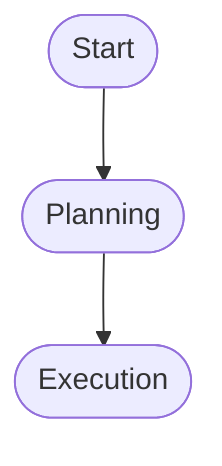

# CCW Documentation Site

This is the documentation site for CCW (Claude Code Workflow), built with [Docusaurus](https://docusaurus.io/).

## 🚀 Quick Start

```bash
# Install dependencies
npm install

# Start development server (port 3001, default locale: en)
npm start

# Start dev server for Chinese (single-locale)
npm run start:zh

# Build for production
npm run build

# Serve production build locally
npm run serve -- --build --port 3001 --no-open
```

## 📁 Project Structure

```
docs-site/
├── docs/                    # Documentation content
│   ├── overview.mdx        # Landing page
│   ├── quick-start.mdx     # Getting started
│   ├── commands/           # Command documentation
│   │   ├── workflows/      # Workflow commands (14)
│   │   ├── issue/          # Issue commands (7)
│   │   ├── cli/            # CLI commands (2)
│   │   ├── memory/         # Memory commands (6)
│   │   └── general/        # General commands (7)
│   ├── workflows/          # Workflow guides
│   │   ├── introduction.mdx
│   │   ├── level-*.mdx
│   │   └── faq.mdx
│   └── faq.mdx            # Main FAQ
├── i18n/                   # Internationalization
│   └── zh/                # Chinese translations
├── src/
│   ├── css/
│   │   ├── custom.css      # Custom styles
│   │   └── variables.css   # CSS variables (CCW theme)
│   └── components/         # Custom React components
├── docusaurus.config.ts    # Main configuration
├── sidebars.ts            # Sidebar navigation
└── package.json
```

## 🎨 Design System

The documentation uses CCW's design tokens:

- **Primary**: Blue (HSL 221, 83%, 53%)
- **Accent**: Green (HSL 142, 76%, 36%)
- **Dark Mode**: Full support with dracula syntax theme
- **Mermaid**: Workflow diagrams with light/dark themes

## 🔗 Integration with CCW Frontend

The documentation is integrated as a sub-route (`/docs`) in the main CCW frontend:

1. **Development**: Vite proxies `/docs` → `http://localhost:3001`
2. **Production**: Nginx serves both apps with `/docs` location

See `../frontend/vite.config.ts` for proxy configuration.

## 📝 Writing Documentation

### File Naming

- Use kebab-case: `workflow-lite-plan.mdx`
- Match sidebar IDs: `id: workflow-lite-plan`

### Frontmatter Template

```yaml
---
title: Workflow: Lite Plan
sidebar_label: workflow:lite-plan
sidebar_position: 3
description: Lightweight in-memory planning for simple tasks
---
```

### Mermaid Diagrams



### Admonitions

```md
:::tip Pro Tip
Use this workflow for...
:::

:::warning Warning
This feature is experimental
:::

:::danger Caution
This operation cannot be undone
:::
```

## 🌍 Internationalization

### Adding New Translations

1. Create MDX file in `i18n/zh/docusaurus-plugin-content-docs/current/`
2. Mirror the English docs structure
3. Run: `npm run write-translations -- --locale zh`

### Translation Status

- ✅ English (EN) - Complete
- 🔄 Chinese (ZH) - Interface translated, content pending

### Previewing Locales

Notes:
- `docusaurus start` serves **one locale per run**.
- To preview **both locales together**, build then serve the static output.

Examples:
```bash
# English (default locale)
npm start

# Chinese
npm run start:zh

# Both locales
npm run build
npm run serve -- --build --port 3001 --no-open
```

## 🔧 Configuration

### Docusaurus Config (`docusaurus.config.ts`)

- **Presets**: Classic (docs only, no blog)
- **Themes**: Mermaid for diagrams
- **i18n**: EN (default), ZH
- **Base URL**: `/docs/`

### Sidebar Config (`sidebars.ts`)

Organized by:
1. Quick Start
2. Commands (by category)
3. Workflows (by level)
4. FAQ

## 📦 Dependencies

| Package | Version | Purpose |
|---------|---------|---------|
| @docusaurus/core | ^3.5.2 | Core framework |
| @docusaurus/preset-classic | ^3.5.2 | Default preset |
| @docusaurus/theme-mermaid | ^3.5.2 | Diagram support |
| react | ^18.3.1 | UI framework |

## 🚢 Deployment

### Build

```bash
npm run build
```

Output: `build/` directory

### Deploy to Static Hosting

```bash
# Surge
npm run deploy -- --surge

# GitHub Pages
npm run deploy -- --git

# Custom server
npm run serve
```

## 🐛 Troubleshooting

### Port Already in Use

```bash
# Kill process on port 3001
npx kill-port 3001

# Or use different port
npm start -- --port 3002
```

### Build Errors

```bash
# Clear cache
npm run clear

# Reinstall dependencies
rm -rf node_modules package-lock.json
npm install
```

## 📚 Resources

- [Docusaurus Documentation](https://docusaurus.io/docs)
- [MDX Documentation](https://mdxjs.com/)
- [Mermaid Syntax](https://mermaid.js.org/syntax/)

## 🤝 Contributing

1. Edit/add MDX files in `docs/`
2. Update `sidebars.ts` if adding new pages
3. Run `npm start` to preview
4. Test both light and dark modes
5. Check mobile responsiveness

## 📄 License

Same as CCW main project.
