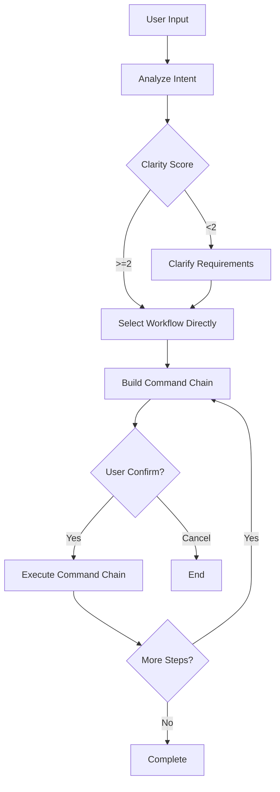
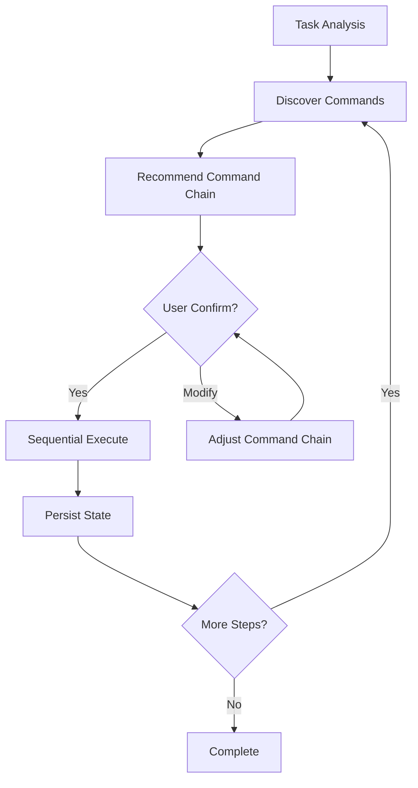

# Core Orchestration Commands

## One-Liner

**Core orchestration commands are the workflow brain of Claude Code Workflow** — analyzing task intent, selecting appropriate workflows, and automatically executing command chains.

## Command List

| Command | Function | Syntax |
|---------|----------|--------|
| [`/ccw`](#ccw) | Main workflow orchestrator - intent analysis -> workflow selection -> command chain execution | `/ccw "task description"` |
| [`/ccw-coordinator`](#ccw-coordinator) | Command orchestration tool - chained command execution and state persistence | `/ccw-coordinator "task description"` |

## Command Details

### /ccw

**Function**: Main workflow orchestrator - intent analysis -> workflow selection -> command chain execution

**Syntax**:
```bash
/ccw "task description"
```

**Options**:
- `--yes` / `-y`: Auto mode, skip confirmation steps

**Workflow**:



**Task Type Detection**:

| Type | Trigger Keywords | Workflow |
|------|------------------|----------|
| **Bug Fix** | urgent, production, critical + fix, bug | lite-fix |
| **Brainstorming** | brainstorm, ideation | brainstorm-with-file |
| **Debug Document** | debug document, hypothesis | debug-with-file |
| **Collaborative Analysis** | analyze document | analyze-with-file |
| **Collaborative Planning** | collaborative plan | collaborative-plan-with-file |
| **Requirements Roadmap** | roadmap | req-plan-with-file |
| **Integration Test** | integration test | integration-test-cycle |
| **Refactoring** | refactor | refactor-cycle |
| **Team Workflow** | team + keywords | corresponding team workflow |
| **TDD** | tdd, test-first | tdd-plan -> execute |
| **Test Fix** | test fix, failing test | test-fix-gen -> test-cycle-execute |

**Examples**:

```bash
# Basic usage - auto-select workflow
/ccw "implement user authentication"

# Bug fix
/ccw "fix login failure bug"

# TDD development
/ccw "implement payment using TDD"

# Team collaboration
/ccw "team-planex implement user notification system"
```

### /ccw-coordinator

**Function**: Command orchestration tool - analyze tasks, recommend command chains, sequential execution, state persistence

**Syntax**:
```bash
/ccw-coordinator "task description"
```

**Minimal Execution Units**:

| Unit Name | Command Chain | Output |
|-----------|---------------|--------|
| **Quick Implementation** | lite-plan -> lite-execute | Working code |
| **Multi-CLI Planning** | multi-cli-plan -> lite-execute | Working code |
| **Bug Fix** | lite-plan (--bugfix) -> lite-execute | Fixed code |
| **Full Plan+Execute** | plan -> execute | Working code |
| **Verified Plan+Execute** | plan -> plan-verify -> execute | Working code |
| **TDD Plan+Execute** | tdd-plan -> execute | Working code |
| **Test Gen+Execute** | test-gen -> execute | Generated tests |
| **Review Cycle** | review-session-cycle -> review-cycle-fix | Fixed code |
| **Issue Workflow** | discover -> plan -> queue -> execute | Completed issue |

**Workflow**:



**Examples**:

```bash
# Auto-orchestrate bug fix
/ccw-coordinator "production login failure"

# Auto-orchestrate feature implementation
/ccw-coordinator "add user avatar upload"
```

## Auto Mode

Both commands support the `--yes` flag for auto mode:

```bash
# Auto mode - skip all confirmations
/ccw "implement user authentication" --yes
/ccw-coordinator "fix login bug" --yes
```

**Auto mode behavior**:
- Skip requirement clarification
- Skip user confirmation
- Execute command chain directly

## Related Skills

| Skill | Function |
|-------|----------|
| `workflow-lite-plan` | Lightweight planning workflow |
| `workflow-plan` | Full planning workflow |
| `workflow-execute` | Execution workflow |
| `workflow-tdd-plan` | TDD workflow |
| `review-cycle` | Code review cycle |

## Comparison

| Feature | /ccw | /ccw-coordinator |
|---------|------|------------------|
| **Execution Location** | Main process | External CLI + background tasks |
| **State Persistence** | No | Yes |
| **Hook Callbacks** | Not supported | Supported |
| **Complex Workflows** | Simple chains | Supports parallel, dependencies |
| **Use Cases** | Daily development | Complex projects, team collaboration |

## Related Documentation

- [Workflow Commands](./workflow.md)
- [Session Management](./session.md)
- [CLI Invocation System](../features/cli.md)
