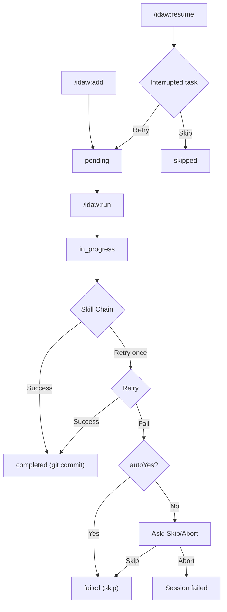

# IDAW Commands

## One-Liner

**IDAW (Independent Development Autonomous Workflow) is the batch task execution engine** — queue development tasks, execute skill chains serially with per-task git checkpoints, and resume from interruptions.

## Core Concepts

| Concept | Description | Location |
|---------|-------------|----------|
| **Task** | Independent JSON task definition | `.workflow/.idaw/tasks/IDAW-*.json` |
| **Session** | Execution session with progress tracking | `.workflow/.idaw/sessions/IDA-*/` |
| **Skill Chain** | Ordered sequence of skills per task type | Mapped from `SKILL_CHAIN_MAP` |
| **Checkpoint** | Per-task git commit after successful execution | Automatic `git add -A && git commit` |

## IDAW vs Issue System

| Aspect | Issue System | IDAW |
|--------|-------------|------|
| **Granularity** | Fine-grained, multi-step orchestration | Coarse-grained, batch autonomous |
| **Pipeline** | new → plan → queue → execute | add → run (all-in-one) |
| **Execution** | DAG parallel | Serial with checkpoints |
| **Storage** | `.workflow/issues.jsonl` | `.workflow/.idaw/tasks/IDAW-*.json` |
| **Use Case** | Individual issue resolution | Batch task queue, unattended execution |

## Command List

| Command | Function | Syntax |
|---------|----------|--------|
| [`add`](#add) | Create tasks manually or import from issue | `/idaw:add [-y] [--from-issue <id>] "description" [--type <type>] [--priority 1-5]` |
| [`run`](#run) | Execute task queue with git checkpoints | `/idaw:run [-y] [--task <id,...>] [--dry-run]` |
| [`run-coordinate`](#run-coordinate) | Execute via external CLI with hook callbacks | `/idaw:run-coordinate [-y] [--task <id,...>] [--tool <tool>]` |
| [`status`](#status) | View task and session progress | `/idaw:status [session-id]` |
| [`resume`](#resume) | Resume interrupted session | `/idaw:resume [-y] [session-id]` |

## Command Details

### add

**Function**: Create IDAW tasks manually or import from existing ccw issues.

**Syntax**:
```bash
/idaw:add [-y|--yes] [--from-issue <id>[,<id>,...]] "description" [--type <task_type>] [--priority <1-5>]
```

**Options**:
- `--from-issue <id>`: Import from ccw issue (comma-separated for multiple)
- `--type <type>`: Explicit task type (see [Task Types](#task-types))
- `--priority 1-5`: Priority (1=critical, 5=low, default=3)

**Modes**:

| Mode | Trigger | Behavior |
|------|---------|----------|
| Manual | No `--from-issue` | Parse description, generate task |
| Import | `--from-issue` | Fetch issue, freeze snapshot, create task |

**Examples**:
```bash
# Manual creation
/idaw:add "Fix login timeout bug" --type bugfix --priority 2
/idaw:add "Add rate limiting to API endpoints" --priority 1
/idaw:add "Refactor auth module to use strategy pattern"

# Import from ccw issue
/idaw:add --from-issue ISS-20260128-001
/idaw:add --from-issue ISS-20260128-001,ISS-20260128-002

# Auto mode (skip clarification)
/idaw:add -y "Quick fix for typo in header"
```

**Output**:
```
Created IDAW-001: Fix login timeout bug
  Type: bugfix | Priority: 2 | Source: manual
  → Next: /idaw:run or /idaw:status
```

---

### run

**Function**: Main orchestrator — execute task skill chains serially with git checkpoints.

**Syntax**:
```bash
/idaw:run [-y|--yes] [--task <id>[,<id>,...]] [--dry-run]
```

**Options**:
- `--task <id,...>`: Execute specific tasks (default: all pending)
- `--dry-run`: Show execution plan without running
- `-y`: Auto mode — skip confirmations, auto-skip on failure

**6-Phase Execution**:

```
Phase 1: Load Tasks
   └─ Glob IDAW-*.json → filter → sort by priority ASC, ID ASC

Phase 2: Session Setup
   └─ Create session.json + progress.md + TodoWrite

Phase 3: Startup Protocol
   ├─ Check running sessions → offer resume or fresh
   └─ Check git status → stash/continue/abort

Phase 4: Main Loop (serial)
   For each task:
   ├─ Resolve: skill_chain || SKILL_CHAIN_MAP[task_type || inferred]
   ├─ Execute each skill (retry once on failure)
   └─ On error: skip (autoYes) or ask (interactive)

Phase 5: Checkpoint (per task)
   ├─ git add -A && git commit
   ├─ Update task.json + session.json
   └─ Append to progress.md

Phase 6: Report
   └─ Summary: completed/failed/skipped counts + git commits
```

**Examples**:
```bash
# Execute all pending tasks (auto mode)
/idaw:run -y

# Execute specific tasks
/idaw:run --task IDAW-001,IDAW-003

# Preview execution plan
/idaw:run --dry-run
```

---

### run-coordinate

**Function**: Coordinator variant of `/idaw:run` — executes via external CLI with hook callbacks instead of blocking Skill() calls.

**Syntax**:
```bash
/idaw:run-coordinate [-y|--yes] [--task <id>[,<id>,...]] [--dry-run] [--tool <tool>]
```

**Options**:
- `--tool <tool>`: CLI tool to use (`claude`, `gemini`, `qwen`, default: `claude`)
- `--task <id,...>`: Execute specific tasks
- `--dry-run`: Preview plan without executing
- `-y`: Auto mode

**Execution Model**:

```
Launch skill via ccw cli --tool <tool> --mode write (background)
    ↓
★ STOP — wait for hook callback
    ↓
Hook fires → handleStepCompletion()
    ├─ More skills in chain → launch next → STOP
    ├─ Chain complete → git checkpoint → next task → STOP
    └─ All done → Report
```

**When to Use**:

| Scenario | Command |
|----------|---------|
| Standard execution (main process, blocking) | `/idaw:run` |
| External CLI, isolated context per skill | `/idaw:run-coordinate` |
| Long-running tasks, avoid context pressure | `/idaw:run-coordinate` |
| Need specific CLI tool (claude/gemini) | `/idaw:run-coordinate --tool gemini` |

**Differences from `/idaw:run`**:

| Aspect | `/idaw:run` | `/idaw:run-coordinate` |
|--------|-------------|----------------------|
| Execution | `Skill()` blocking | `ccw cli` background + hook |
| Context | Shared main context | Isolated per CLI call |
| Tool selection | N/A | `--tool claude\|gemini\|qwen` |
| State | session.json | session.json + prompts_used |

**Examples**:
```bash
# Execute via claude CLI (default)
/idaw:run-coordinate -y

# Use gemini as execution tool
/idaw:run-coordinate -y --tool gemini

# Specific tasks
/idaw:run-coordinate --task IDAW-001,IDAW-003 --tool claude
```

---

### status

**Function**: Read-only view of IDAW task queue and session progress.

**Syntax**:
```bash
/idaw:status [session-id]
```

**View Modes**:

| Mode | Trigger | Output |
|------|---------|--------|
| Overview | No arguments | All tasks table + latest session summary |
| Session Detail | Session ID provided | Task × status × commit table + progress.md |

**Examples**:
```bash
# Overview
/idaw:status

# Specific session
/idaw:status IDA-auth-fix-20260301
```

**Output Example**:
```
# IDAW Tasks

| ID       | Title                    | Type    | Priority | Status    |
|----------|--------------------------|---------|----------|-----------|
| IDAW-001 | Fix auth token refresh   | bugfix  | 1        | completed |
| IDAW-002 | Add rate limiting        | feature | 2        | pending   |
| IDAW-003 | Refactor payment module  | refactor| 3        | pending   |

Total: 3 | Pending: 2 | Completed: 1 | Failed: 0
```

---

### resume

**Function**: Resume an interrupted IDAW session from the last checkpoint.

**Syntax**:
```bash
/idaw:resume [-y|--yes] [session-id]
```

**Options**:
- `session-id`: Resume specific session (default: latest running)
- `-y`: Auto-skip interrupted task, continue with remaining

**Recovery Flow**:
```
1. Find session with status=running
2. Handle interrupted task (in_progress):
   ├─ autoYes → mark as skipped
   └─ interactive → ask: Retry or Skip
3. Build remaining task queue
4. Execute Phase 4-6 from /idaw:run
```

**Examples**:
```bash
# Resume most recent running session
/idaw:resume

# Resume specific session
/idaw:resume IDA-auth-fix-20260301

# Resume with auto mode
/idaw:resume -y
```

## Task Types

IDAW supports 10 task types, each mapping to a specific skill chain:

| Task Type | Skill Chain | Use Case |
|-----------|-------------|----------|
| `bugfix` | lite-plan → test-fix | Standard bug fixes |
| `bugfix-hotfix` | lite-plan (--hotfix) | Urgent production fixes |
| `feature` | lite-plan → test-fix | New features |
| `feature-complex` | plan → execute → test-fix | Multi-module features |
| `refactor` | refactor-cycle | Code restructuring |
| `tdd` | tdd-plan → execute | Test-driven development |
| `test` | test-fix | Test generation |
| `test-fix` | test-fix | Fix failing tests |
| `review` | review-cycle | Code review |
| `docs` | lite-plan | Documentation |

**Type Resolution**: Explicit `task_type` field takes priority. When null, the type is inferred from title and description using keyword matching at execution time.

## Task Schema

```json
{
  "id": "IDAW-001",
  "title": "Fix auth token refresh race condition",
  "description": "Detailed problem/goal description...",
  "status": "pending",
  "priority": 2,
  "task_type": "bugfix",
  "skill_chain": null,
  "context": {
    "affected_files": ["src/auth/token-manager.ts"],
    "acceptance_criteria": ["No concurrent refresh requests"],
    "constraints": [],
    "references": []
  },
  "source": {
    "type": "manual",
    "issue_id": null,
    "issue_snapshot": null
  },
  "execution": {
    "session_id": null,
    "started_at": null,
    "completed_at": null,
    "skill_results": [],
    "git_commit": null,
    "error": null
  },
  "created_at": "2026-03-01T10:00:00Z",
  "updated_at": "2026-03-01T10:00:00Z"
}
```

**Key Fields**:
- `task_type`: Optional — inferred from title/description when null
- `skill_chain`: Optional — overrides automatic mapping when set
- `source.type`: `manual` or `import-issue`
- `source.issue_snapshot`: Frozen copy of original issue data (import only)
- `execution`: Runtime state populated by `/idaw:run`

## Task Lifecycle



## Directory Structure

```
.workflow/.idaw/
├── tasks/                          # Task definitions (persist across sessions)
│   ├── IDAW-001.json
│   ├── IDAW-002.json
│   └── IDAW-003.json
└── sessions/                       # Execution sessions
    └── IDA-{slug}-YYYYMMDD/
        ├── session.json            # Session state + task queue
        └── progress.md             # Human-readable progress log
```

## Error Handling

| Error | Resolution |
|-------|------------|
| No tasks found | Suggest `/idaw:add` |
| Task JSON parse error | Skip malformed task, log warning |
| Task type unresolvable | Default to `feature` chain |
| Skill failure | Retry once → skip (autoYes) or ask (interactive) |
| Git commit fails (no changes) | Record `no-commit`, continue |
| Dirty git tree | autoYes: proceed; interactive: ask |
| Session ID collision | Append `-2` suffix |
| Issue fetch fails (import) | Log error, skip issue |
| Duplicate import (same issue_id) | Warn and skip |
| No resumable sessions | Suggest `/idaw:run` |

## Typical Workflow

```bash
# 1. Queue tasks
/idaw:add "Fix login timeout bug" --type bugfix --priority 1
/idaw:add "Add rate limiting to API" --priority 2
/idaw:add --from-issue ISS-20260128-001,ISS-20260128-002

# 2. Preview execution plan
/idaw:run --dry-run

# 3. Execute all (unattended)
/idaw:run -y

# 4. Check progress
/idaw:status

# 5. Resume if interrupted
/idaw:resume -y
```

## Related Documentation

- [Issue Commands](./issue.md) — Fine-grained issue management
- [Core Orchestration](./core-orchestration.md) — `/ccw` main orchestrator
- [Workflow Commands](./workflow.md) — Individual workflow skills
