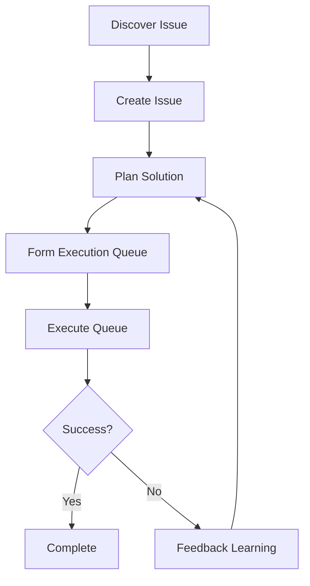

# Issue Workflow Commands

## One-Liner

**Issue workflow commands are the closed-loop system for issue management** — from discovery, planning to execution, fully tracking the issue resolution process.

## Core Concepts

| Concept | Description | Location |
|---------|-------------|----------|
| **Issue** | Structured issue definition | `.workflow/issues/ISS-*.json` |
| **Solution** | Execution plan | `.workflow/solutions/SOL-*.json` |
| **Queue** | Execution queue | `.workflow/queues/QUE-*.json` |
| **Execution State** | Progress tracking | State within queue |

## Command List

| Command | Function | Syntax |
|---------|----------|--------|
| [`new`](#new) | Create structured issue from GitHub URL or text description | `/issue:new [-y] <github-url \| description> [--priority 1-5]` |
| [`discover`](#discover) | Discover potential issues from multiple perspectives | `/issue:discover [-y] <path pattern> [--perspectives=dimensions] [--external]` |
| [`discover-by-prompt`](#discover-by-prompt) | Discover issues via user prompt | `/issue:discover-by-prompt [-y] <prompt> [--scope=src/**]` |
| [`plan`](#plan) | Batch plan issue solutions | `/issue:plan [-y] --all-pending <issue-id>[,...] [--batch-size 3]` |
| [`queue`](#queue) | Form execution queue | `/issue:queue [-y] [--queues N] [--issue id]` |
| [`execute`](#execute) | Execute queue | `/issue:execute [-y] --queue <queue-id> [--worktree [path]]` |
| [`convert-to-plan`](#convert-to-plan) | Convert planning artifact to issue solution | `/issue:convert-to-plan [-y] [--issue id] [--supplement] <source>` |

## Command Details

### new

**Function**: Create structured issue from GitHub URL or text description, supporting requirement clarity detection.

**Syntax**:
```
/issue:new [-y|--yes] <github-url | text description> [--priority 1-5]
```

**Options**:
- `--priority 1-5`: Priority (1=critical, 5=low)

**Clarity Detection**:

| Input Type | Clarity | Behavior |
|------------|---------|----------|
| GitHub URL | 3 | Direct creation |
| Structured text | 2 | Direct creation |
| Long text | 1 | Partial clarification |
| Short text | 0 | Full clarification |

**Issue Structure**:
```typescript
interface Issue {
  id: string;                    // GH-123 or ISS-YYYYMMDD-HHMMSS
  title: string;
  status: 'registered' | 'planned' | 'queued' | 'in_progress' | 'completed' | 'failed';
  priority: number;              // 1-5
  context: string;               // Issue description (single source of truth)
  source: 'github' | 'text' | 'discovery';
  source_url?: string;

  // Binding
  bound_solution_id: string | null;

  // Feedback history
  feedback?: Array<{
    type: 'failure' | 'clarification' | 'rejection';
    stage: string;
    content: string;
    created_at: string;
  }>;
}
```

**Examples**:
```bash
# Create from GitHub
/issue:new https://github.com/owner/repo/issues/123

# Create from text (structured)
/issue:new "login failed: expected success, actual 500 error"

# Create from text (vague - will ask)
/issue:new "auth has problems"

# Specify priority
/issue:new --priority 2 "payment timeout issue"
```

### discover

**Function**: Discover potential issues from multiple perspectives (Bug, UX, Test, Quality, Security, Performance, Maintainability, Best Practices).

**Syntax**:
```
/issue:discover [-y|--yes] <path pattern> [--perspectives=bug,ux,...] [--external]
```

**Options**:
- `--perspectives=dimensions`: Analysis dimensions
  - `bug`: Potential bugs
  - `ux`: UX issues
  - `test`: Test coverage
  - `quality`: Code quality
  - `security`: Security issues
  - `performance`: Performance issues
  - `maintainability`: Maintainability
  - `best-practices`: Best practices
- `--external`: Use Exa external research (security, best practices)

**Examples**:
```bash
# Comprehensive scan
/issue:discover src/

# Specific dimensions
/issue:discover src/auth/ --perspectives=security,bug

# With external research
/issue:discover src/payment/ --perspectives=security --external
```

### discover-by-prompt

**Function**: Discover issues via user prompt, using Gemini-planned iterative multi-agent exploration, supporting cross-module comparison.

**Syntax**:
```
/issue:discover-by-prompt [-y|--yes] <prompt> [--scope=src/**] [--depth=standard|deep] [--max-iterations=5]
```

**Options**:
- `--scope=path`: Scan scope
- `--depth=depth`: standard or deep
- `--max-iterations=N`: Maximum iteration count

**Examples**:
```bash
# Standard scan
/issue:discover-by-prompt "find auth module issues"

# Deep scan
/issue:discover-by-prompt "analyze API performance bottlenecks" --depth=deep

# Specify scope
/issue:discover-by-prompt "check database query optimization" --scope=src/db/
```

### plan

**Function**: Batch plan issue solutions, using issue-plan-agent (explore + plan closed loop).

**Syntax**:
```
/issue:plan [-y|--yes] --all-pending <issue-id>[,<issue-id>,...] [--batch-size 3]
```

**Options**:
- `--all-pending`: Plan all pending issues
- `--batch-size=N`: Issues per batch

**Examples**:
```bash
# Plan specific issues
/issue:plan ISS-20240115-001,ISS-20240115-002

# Plan all pending issues
/issue:plan --all-pending

# Specify batch size
/issue:plan --all-pending --batch-size 5
```

### queue

**Function**: Form execution queue from bound solutions, using issue-queue-agent (solution level).

**Syntax**:
```
/issue:queue [-y|--yes] [--queues <n>] [--issue <id>]
```

**Options**:
- `--queues N`: Number of queues to create
- `--issue id`: Specific issue

**Examples**:
```bash
# Form queue
/issue:queue

# Create multiple queues
/issue:queue --queues 3

# Specific issue
/issue:queue --issue ISS-20240115-001
```

### execute

**Function**: Execute queue, using DAG parallel orchestration (one commit per solution).

**Syntax**:
```
/issue:execute [-y|--yes] --queue <queue-id> [--worktree [<existing-path>]]
```

**Options**:
- `--queue id`: Queue ID
- `--worktree [path]`: Optional worktree path

**Examples**:
```bash
# Execute queue
/issue:execute --queue QUE-20240115-001

# Use worktree
/issue:execute --queue QUE-20240115-001 --worktree ../feature-branch
```

### convert-to-plan

**Function**: Convert planning artifact (lite-plan, workflow session, markdown) to issue solution.

**Syntax**:
```
/issue:convert-to-plan [-y|--yes] [--issue <id>] [--supplement] <source>
```

**Options**:
- `--issue id`: Bind to existing issue
- `--supplement`: Supplement mode (add to existing solution)

**Source Types**:
- lite-plan artifact
- workflow session
- Markdown file

**Examples**:
```bash
# Convert from lite-plan
/issue:convert-to-plan .workflow/sessions/WFS-xxx/artifacts/lite-plan.md

# Bind to issue
/issue:convert-to-plan --issue ISS-20240115-001 plan.md

# Supplement mode
/issue:convert-to-plan --supplement additional-plan.md
```

### from-brainstorm

**Function**: Convert brainstorm session ideas to issues and generate executable solutions.

**Syntax**:
```
/issue:from-brainstorm SESSION="session-id" [--idea=<index>] [--auto] [-y|--yes]
```

**Options**:
- `--idea=index`: Specific idea index
- `--auto`: Auto mode

**Examples**:
```bash
# Convert all ideas
/issue:from-brainstorm SESSION="WFS-brainstorm-2024-01-15"

# Convert specific idea
/issue:from-brainstorm SESSION="WFS-brainstorm-2024-01-15" --idea=3

# Auto mode
/issue:from-brainstorm --auto SESSION="WFS-brainstorm-2024-01-15"
```

## Issue Workflow



## Related Documentation

- [Workflow Commands](./workflow.md)
- [Core Orchestration](./core-orchestration.md)
- [Team System](../../features/)
