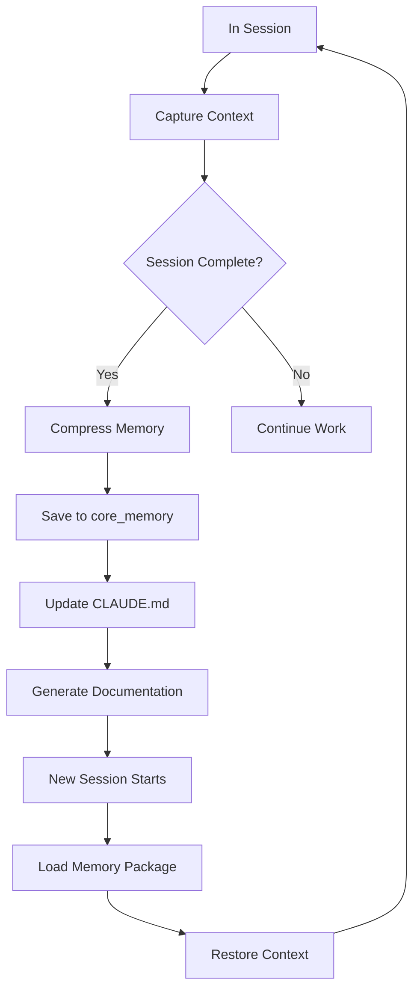

# Memory Commands

## One-Liner

**Memory commands are the cross-session knowledge persistence system** — capturing context, updating memory, generating documentation, making AI remember the project.

## Core Concepts

| Concept | Description | Location |
|---------|-------------|----------|
| **Memory Package** | Structured project context | MCP core_memory |
| **CLAUDE.md** | Module-level project guide | Each module/directory |
| **Tips** | Quick notes | `MEMORY.md` |
| **Project Documentation** | Generated documentation | `docs/` directory |

## Command List

| Command | Function | Syntax |
|---------|----------|--------|
| [`compact`](#compact) | Compress current session memory to structured text | `/memory:compact [optional: session description]` |
| [`tips`](#tips) | Quick note-taking | `/memory:tips <note content> [--tag tags] [--context context]` |
| [`load`](#load) | Load task context via CLI project analysis | `/memory:load [--tool gemini\|qwen] "task context description"` |
| [`update-full`](#update-full) | Update all CLAUDE.md files | `/memory:update-full [--tool gemini\|qwen\|codex] [--path directory]` |
| [`update-related`](#update-related) | Update CLAUDE.md for git-changed modules | `/memory:update-related [--tool gemini\|qwen\|codex]` |
| [`docs-full-cli`](#docs-full-cli) | Generate full project documentation using CLI | `/memory:docs-full-cli [path] [--tool tool]` |
| [`docs-related-cli`](#docs-related-cli) | Generate documentation for git-changed modules | `/memory:docs-related-cli [--tool tool]` |
| [`style-skill-memory`](#style-skill-memory) | Generate SKILL memory package from style reference | `/memory:style-skill-memory [package-name] [--regenerate]` |

## Command Details

### compact

**Function**: Compress current session memory to structured text, extracting objectives, plans, files, decisions, constraints, and state, saving via MCP core_memory tool.

**Syntax**:
```
/memory:compact [optional: session description]
```

**Extracted Content**:
- Objectives
- Plans
- Files
- Decisions
- Constraints
- State

**Examples**:
```bash
# Basic compression
/memory:compact

# With description
/memory:compact "user authentication implementation session"
```

### tips

**Function**: Quick note-taking command, capturing thoughts, snippets, reminders, and insights for future reference.

**Syntax**:
```
/memory:tips <note content> [--tag <tag1,tag2>] [--context <context>]
```

**Options**:
- `--tag=tags`: Tags (comma-separated)
- `--context=context`: Context information

**Examples**:
```bash
# Basic note
/memory:tips "remember to use rate limiting for API calls"

# With tags
/memory:tips "auth middleware needs to handle token expiry" --tag auth,api

# With context
/memory:tips "use Redis to cache user sessions" --context "login optimization"
```

### load

**Function**: Delegate to universal-executor agent, analyzing project via Gemini/Qwen CLI and returning JSON core content package for task context.

**Syntax**:
```
/memory:load [--tool gemini|qwen] "task context description"
```

**Options**:
- `--tool=tool`: CLI tool to use

**Output**: JSON format project context package

**Examples**:
```bash
# Use default tool
/memory:load "user authentication module"

# Specify tool
/memory:load --tool gemini "payment system architecture"
```

### update-full

**Function**: Update all CLAUDE.md files, using layer-based execution (Layer 3->1), batch agent processing (4 modules/agent), and gemini->qwen->codex fallback.

**Syntax**:
```
/memory:update-full [--tool gemini|qwen|codex] [--path <directory>]
```

**Options**:
- `--tool=tool`: CLI tool to use
- `--path=directory`: Specific directory

**Layer Structure**:
- Layer 3: Project-level analysis
- Layer 2: Module-level analysis
- Layer 1: File-level analysis

**Examples**:
```bash
# Update entire project
/memory:update-full

# Update specific directory
/memory:update-full --path src/auth/

# Specify tool
/memory:update-full --tool qwen
```

### update-related

**Function**: Update CLAUDE.md files for git-changed modules, using batch agent execution (4 modules/agent) and gemini->qwen->codex fallback.

**Syntax**:
```
/memory:update-related [--tool gemini|qwen|codex]
```

**Options**:
- `--tool=tool`: CLI tool to use

**Examples**:
```bash
# Default update
/memory:update-related

# Specify tool
/memory:update-related --tool gemini
```

### docs-full-cli

**Function**: Generate full project documentation using CLI (Layer 3->1), batch agent processing (4 modules/agent), gemini->qwen->codex fallback, direct parallel for <20 modules.

**Syntax**:
```
/memory:docs-full-cli [path] [--tool <gemini|qwen|codex>]
```

**Examples**:
```bash
# Generate entire project documentation
/memory:docs-full-cli

# Generate specific directory documentation
/memory:docs-full-cli src/

# Specify tool
/memory:docs-full-cli --tool gemini
```

### docs-related-cli

**Function**: Generate documentation for git-changed modules using CLI, batch agent processing (4 modules/agent), gemini->qwen->codex fallback, direct execution for <15 modules.

**Syntax**:
```
/memory:docs-related-cli [--tool <gemini|qwen|codex>]
```

**Examples**:
```bash
# Default generation
/memory:docs-related-cli

# Specify tool
/memory:docs-related-cli --tool qwen
```

### style-skill-memory

**Function**: Generate SKILL memory package from style reference, facilitating loading and consistent design system usage.

**Syntax**:
```
/memory:style-skill-memory [package-name] [--regenerate]
```

**Options**:
- `--regenerate`: Regenerate

**Examples**:
```bash
# Generate style memory package
/memory:style-skill-memory my-design-system

# Regenerate
/memory:style-skill-memory my-design-system --regenerate
```

## Memory System Workflow



## CLAUDE.md Structure

```markdown
# Module Name

## One-Liner
Core value description of the module

## Tech Stack
- Framework/library
- Main dependencies

## Key Files
- File path: Description

## Code Conventions
- Naming conventions
- Architecture patterns
- Best practices

## TODO
- Planned features
- Known issues
```

## Related Documentation

- [Memory System](../../features/memory.md)
- [Core Orchestration](./core-orchestration.md)
- [Core Concepts Guide](../../guide/ch03-core-concepts.md)
