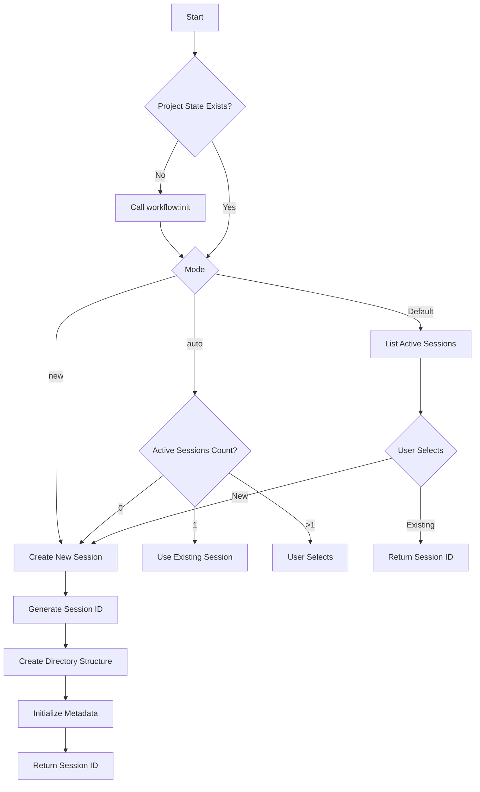
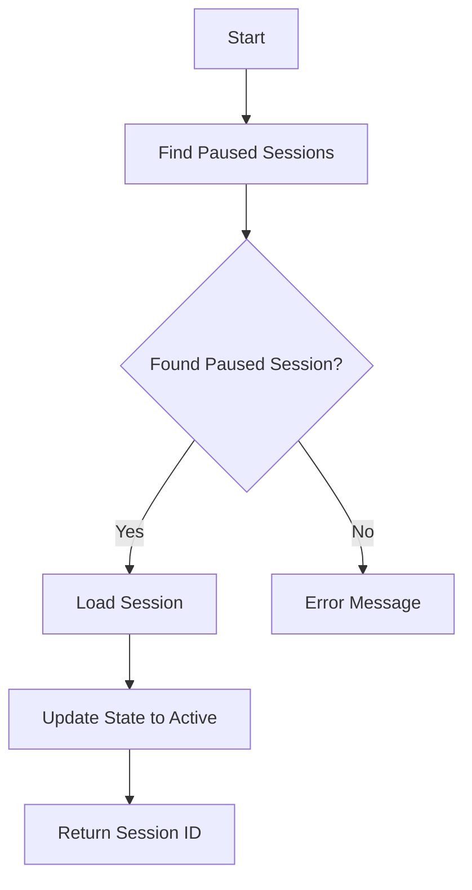
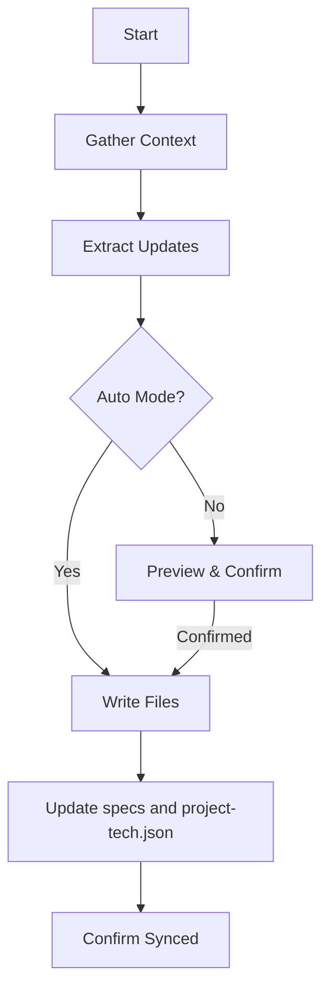
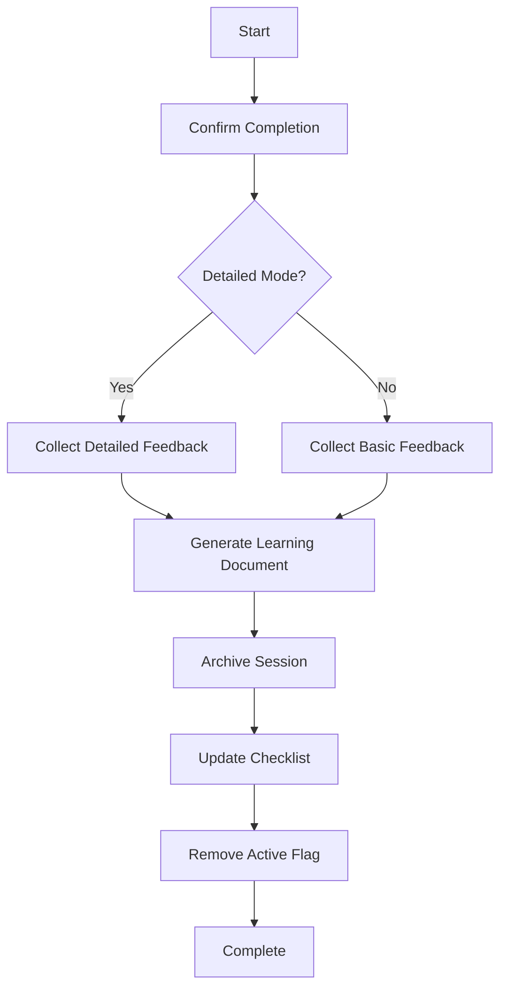

# Session Management Commands

## One-Liner

**Session management commands are the workflow state managers** — creating, tracking, resuming, and completing workflow sessions.

## Core Concepts

| Concept | Description | Location |
|---------|-------------|----------|
| **Session ID** | Unique identifier (WFS-YYYY-MM-DD) | `.workflow/active/WFS-xxx/` |
| **Session Type** | workflow, review, tdd, test, docs | Session metadata |
| **Session State** | active, paused, completed | workflow-session.json |
| **Artifacts** | Plans, tasks, TODOs, etc. | Session directory |

## Command List

| Command | Function | Syntax |
|---------|----------|--------|
| [`start`](#start) | Discover existing sessions or start new workflow session | `/workflow:session:start [--type type] [--auto\|--new] [description]` |
| [`list`](#list) | List all workflow sessions | `/workflow:session:list` |
| [`resume`](#resume) | Resume most recently paused workflow session | `/workflow:session:resume` |
| [`sync`](#sync) | Quick-sync session work to specs and project-tech | `/workflow:session:sync [-y] ["what was done"]` |
| [`complete`](#complete) | Mark active workflow session as completed | `/workflow:session:complete [-y] [--detailed]` |
| [`solidify`](#solidify) | Crystallize session learnings into project guidelines | `/workflow:session:solidify [-y] [--type type] [--category category] "rule"` |

## Command Details

### start

**Function**: Discover existing sessions or start new workflow session, supporting intelligent session management and conflict detection.

**Syntax**:
```bash
/workflow:session:start [--type <workflow|review|tdd|test|docs>] [--auto|--new] [optional: task description]
```

**Options**:
- `--type=type`: Session type
  - `workflow`: Standard implementation (default)
  - `review`: Code review
  - `tdd`: TDD development
  - `test`: Test generation/fix
  - `docs`: Documentation session
- `--auto`: Smart mode (auto detect/create)
- `--new`: Force create new session

**Session Types**:

| Type | Description | Default Source |
|------|-------------|----------------|
| `workflow` | Standard implementation | workflow-plan skill |
| `review` | Code review | review-cycle skill |
| `tdd` | TDD development | workflow-tdd skill |
| `test` | Test generation/fix | workflow-test-fix skill |
| `docs` | Documentation session | memory-manage skill |

**Workflow**:



**Examples**:

```bash
# Discovery mode - list active sessions
/workflow:session:start

# Auto mode - smart select/create
/workflow:session:start --auto "implement user authentication"

# New mode - force create new session
/workflow:session:start --new "refactor payment module"

# Specify type
/workflow:session:start --type review "review auth code"
/workflow:session:start --type tdd --auto "implement login feature"
```

### list

**Function**: List all workflow sessions, supporting state filtering, displaying session metadata and progress information.

**Syntax**:
```bash
/workflow:session:list
```

**Output Format**:

| Session ID | Type | State | Description | Progress |
|------------|------|-------|-------------|----------|
| WFS-2024-01-15 | workflow | active | User authentication | 5/10 |
| WFS-2024-01-14 | review | paused | Code review | 8/8 |
| WFS-2024-01-13 | tdd | completed | TDD development | 12/12 |

**Examples**:
```bash
# List all sessions
/workflow:session:list
```

### resume

**Function**: Resume most recently paused workflow session, supporting automatic session discovery and state update.

**Syntax**:
```bash
/workflow:session:resume
```

**Workflow**:



**Examples**:
```bash
# Resume most recently paused session
/workflow:session:resume
```

### sync

**Function**: Quick-sync session work to specs and project-tech, extracting guidelines and tech entries from recent changes.

**Syntax**:
```bash
/workflow:session:sync [-y|--yes] ["what was done"]
```

**Options**:
- `--yes` or `-y`: Skip confirmation, auto-write both files

**Workflow**:



**Examples**:
```bash
# Sync with confirmation prompt
/workflow:session:sync "implemented user authentication"

# Auto-sync without confirmation
/workflow:session:sync --yes "fixed login bug"

# Quick sync with auto-yes
/workflow:session:sync -y
```

### complete

**Function**: Mark active workflow session as completed, archive and learn from experience, update checklist and remove active flag.

**Syntax**:
```bash
/workflow:session:complete [-y|--yes] [--detailed]
```

**Options**:
- `--detailed`: Detailed mode, collect more learnings

**Workflow**:



**Examples**:
```bash
# Standard completion
/workflow:session:complete

# Detailed completion
/workflow:session:complete --detailed

# Auto mode
/workflow:session:complete -y
```

### solidify

**Function**: Crystallize session learnings and user-defined constraints into permanent project guidelines.

**Syntax**:
```bash
/workflow:session:solidify [-y|--yes] [--type <convention|constraint|learning|compress>] [--category <category>] "rule or insight"
```

**Options**:
- `--type=type`:
  - `convention`: Code convention
  - `constraint`: Constraint condition
  - `learning`: Experience learning
  - `compress`: Consolidate multiple memories into core memory
- `--category=category`: Category name (e.g., `authentication`, `testing`)

**Output Locations**:
- Conventions: `.workflow/specs/conventions/<category>.md`
- Constraints: `.workflow/specs/constraints/<category>.md`
- Learnings: `.workflow/specs/learnings/<category>.md`
- Compress: Core memory (MEMORY.md)

**Examples**:
```bash
# Add code convention
/workflow:session:solidify --type=convention --category=auth "all auth functions must use rate limiting"

# Add constraint
/workflow:session:solidify --type=constraint --category=database "no N+1 queries"

# Add learning
/workflow:session:solidify --type=learning --category=api "REST API design lessons learned"

# Consolidate memories into core memory
/workflow:session:solidify --type=compress --category=workflow "session learnings summary"
```

## Session Directory Structure

```
.workflow/
├── active/                        # Active sessions
│   └── WFS-2024-01-15/           # Session directory
│       ├── workflow-session.json  # Session metadata
│       ├── tasks/                 # Task definitions
│       ├── artifacts/             # Artifact files
│       └── context/               # Context files
└── archived/                      # Archived sessions
    └── WFS-2024-01-14/
```

## Session Metadata

```json
{
  "session_id": "WFS-2024-01-15",
  "type": "workflow",
  "status": "active",
  "created_at": "2024-01-15T10:00:00Z",
  "updated_at": "2024-01-15T14:30:00Z",
  "description": "User authentication feature implementation",
  "progress": {
    "total": 10,
    "completed": 5,
    "percentage": 50
  }
}
```

## Related Documentation

- [Workflow Commands](./workflow.md)
- [Core Orchestration](./core-orchestration.md)
- [Workflow Basics](../../guide/ch04-workflow-basics.md)
