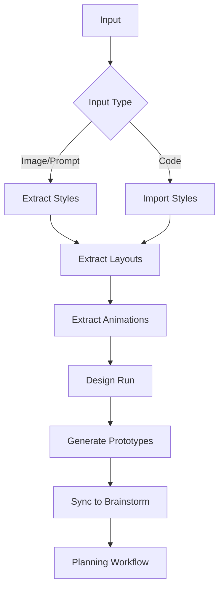

# UI Design Commands

## One-Liner

**UI design commands are the interface prototype generation system** — from style extraction, layout analysis to prototype assembly, fully covering the UI design workflow.

## Core Concepts

| Concept | Description | Storage Location |
|----------|-------------|------------------|
| **Design Run** | Design session directory | `.workflow/ui-design-runs/<run-id>/` |
| **Design Tokens** | Style variables | `design-tokens.json` |
| **Layout Templates** | Structure definitions | `layouts/` |
| **Prototypes** | Generated components | `prototypes/` |

## Command List

### Discovery and Extraction

| Command | Function | Syntax |
|---------|----------|--------|
| [`explore-auto`](#explore-auto) | Interactive exploratory UI design workflow | `/workflow:ui-design:explore-auto [--input "value"] [--targets "list"]` |
| [`imitate-auto`](#imitate-auto) | Direct code/image input UI design | `/workflow:ui-design:imitate-auto [--input "value"] [--session id]` |
| [`style-extract`](#style-extract) | Extract design styles from reference images or prompts | `/workflow:ui-design:style-extract [-y] [--design-id id]` |
| [`layout-extract`](#layout-extract) | Extract layout information from reference images | `/workflow:ui-design:layout-extract [-y] [--design-id id]` |
| [`animation-extract`](#animation-extract) | Extract animation and transition patterns | `/workflow:ui-design:animation-extract [-y] [--design-id id]` |

### Import and Export

| Command | Function | Syntax |
|---------|----------|--------|
| [`import-from-code`](#import-from-code) | Import design system from code files | `/workflow:ui-design:import-from-code [--design-id id] [--session id] [--source path]` |
| [`codify-style`](#codify-style) | Extract styles from code and generate shareable reference package | `/workflow:ui-design:codify-style <path> [--package-name name]` |
| [`reference-page-generator`](#reference-page-generator) | Generate multi-component reference page from design run | `/workflow:ui-design:reference-page-generator [--design-run path]` |

### Generation and Sync

| Command | Function | Syntax |
|---------|----------|--------|
| [`generate`](#generate) | Combine layout templates with design tokens to generate prototypes | `/workflow:ui-design:generate [--design-id id] [--session id]` |
| [`design-sync`](#design-sync) | Sync final design system reference to brainstorm artifacts | `/workflow:ui-design:design-sync --session <session_id>` |

## Command Details

### explore-auto

**Function**: Interactive exploratory UI design workflow, style-centric batch generation, creating design variants from prompts/images, supporting parallel execution and user selection.

**Syntax**:
```bash
/workflow:ui-design:explore-auto [--input "<value>"] [--targets "<list>"] [--target-type "page|component"] [--session <id>] [--style-variants <count>] [--layout-variants <count>]
```

**Options**:
- `--input=value`: Input prompt or image path
- `--targets=list`: Target component list (comma-separated)
- `--target-type=type`: page or component
- `--session=id`: Session ID
- `--style-variants=N`: Number of style variants
- `--layout-variants=N`: Number of layout variants

**Examples**:
```bash
# Page design exploration
/workflow:ui-design:explore-auto --input "modern e-commerce homepage" --target-type page --style-variants 3

# Component design exploration
/workflow:ui-design:explore-auto --input "user card component" --target-type component --layout-variants 5

# Multi-target design
/workflow:ui-design:explore-auto --targets "header,sidebar,footer" --style-variants 2
```

### imitate-auto

**Function**: UI design workflow supporting direct code/image input for design token extraction and prototype generation.

**Syntax**:
```bash
/workflow:ui-design:imitate-auto [--input "<value>"] [--session <id>]
```

**Options**:
- `--input=value`: Code file path or image path
- `--session=id`: Session ID

**Examples**:
```bash
# Imitate from code
/workflow:ui-design:imitate-auto --input "./src/components/Button.tsx"

# Imitate from image
/workflow:ui-design:imitate-auto --input "./designs/mockup.png"
```

### style-extract

**Function**: Extract design styles using Claude analysis from reference images or text prompts, supporting variant generation or refine mode.

**Syntax**:
```bash
/workflow:ui-design:style-extract [-y|--yes] [--design-id <id>] [--session <id>] [--images "<glob>"] [--prompt "<description>"] [--variants <count>] [--interactive] [--refine]
```

**Options**:
- `--images=glob`: Image glob pattern
- `--prompt=description`: Text description
- `--variants=N`: Number of variants
- `--interactive`: Interactive mode
- `--refine`: Refine mode

**Examples**:
```bash
# Extract styles from images
/workflow:ui-design:style-extract --images "./designs/*.png" --variants 3

# Extract from prompt
/workflow:ui-design:style-extract --prompt "dark theme, blue primary, rounded corners"

# Interactive refine
/workflow:ui-design:style-extract --images "reference.png" --refine --interactive
```

### layout-extract

**Function**: Extract structural layout information using Claude analysis from reference images or text prompts, supporting variant generation or refine mode.

**Syntax**:
```bash
/workflow:ui-design:layout-extract [-y|--yes] [--design-id <id>] [--session <id>] [--images "<glob>"] [--prompt "<description>"] [--targets "<list>"] [--variants <count>] [--device-type <desktop|mobile|tablet|responsive>] [--interactive] [--refine]
```

**Options**:
- `--device-type=type`: desktop, mobile, tablet or responsive
- Other options same as style-extract

**Examples**:
```bash
# Extract desktop layout
/workflow:ui-design:layout-extract --images "desktop-mockup.png" --device-type desktop

# Extract responsive layout
/workflow:ui-design:layout-extract --prompt "three-column layout, responsive design" --device-type responsive

# Multiple variants
/workflow:ui-design:layout-extract --images "layout.png" --variants 5
```

### animation-extract

**Function**: Extract animation and transition patterns from prompts inference and image references for design system documentation.

**Syntax**:
```bash
/workflow:ui-design:animation-extract [-y|--yes] [--design-id <id>] [--session <id>] [--images "<glob>"] [--focus "<type>"] [--interactive] [--refine]
```

**Options**:
- `--focus=type`: Specific animation type (e.g., fade, slide, scale)

**Examples**:
```bash
# Extract all animations
/workflow:ui-design:animation-extract --images "./animations/*.gif"

# Extract specific type
/workflow:ui-design:animation-extract --focus "fade,slide" --interactive
```

### import-from-code

**Function**: Import design system from code files (CSS/JS/HTML/SCSS), using automatic file discovery and parallel agent analysis.

**Syntax**:
```bash
/workflow:ui-design:import-from-code [--design-id <id>] [--session <id>] [--source <path>]
```

**Options**:
- `--source=path`: Source code directory

**Examples**:
```bash
# Import from project
/workflow:ui-design:import-from-code --source "./src/styles/"

# Specify design ID
/workflow:ui-design:import-from-code --design-id my-design --source "./theme/"
```

### codify-style

**Function**: Orchestrator extracts styles from code and generates shareable reference package, supporting preview (automatic file discovery).

**Syntax**:
```bash
/workflow:ui-design:codify-style <path> [--package-name <name>] [--output-dir <path>] [--overwrite]
```

**Options**:
- `--package-name=name`: Package name
- `--output-dir=path`: Output directory
- `--overwrite`: Overwrite existing files

**Examples**:
```bash
# Generate style package
/workflow:ui-design:codify-style ./src/styles/ --package-name my-design-system

# Specify output directory
/workflow:ui-design:codify-style ./theme/ --output-dir ./design-packages/
```

### reference-page-generator

**Function**: Extract and generate multi-component reference pages and documentation from design run.

**Syntax**:
```bash
/workflow:ui-design:reference-page-generator [--design-run <path>] [--package-name <name>] [--output-dir <path>]
```

**Examples**:
```bash
# Generate reference page
/workflow:ui-design:reference-page-generator --design-run .workflow/ui-design-runs/latest/

# Specify package name
/workflow:ui-design:reference-page-generator --package-name component-library
```

### generate

**Function**: Assemble UI prototypes, combining layout templates with design tokens (default animation support), pure assembler with no new content generation.

**Syntax**:
```bash
/workflow:ui-design:generate [--design-id <id>] [--session <id>]
```

**Examples**:
```bash
# Generate prototypes
/workflow:ui-design:generate

# Use specific design
/workflow:ui-design:generate --design-id my-design
```

### design-sync

**Function**: Sync final design system reference to brainstorm artifacts, preparing for consumption by `/workflow:plan`.

**Syntax**:
```bash
/workflow:ui-design:design-sync --session <session_id> [--selected-prototypes "<list>"]
```

**Options**:
- `--selected-prototypes=list`: List of selected prototypes

**Examples**:
```bash
# Sync all prototypes
/workflow:ui-design:design-sync --session WFS-design-2024-01-15

# Sync selected prototypes
/workflow:ui-design:design-sync --session WFS-design-2024-01-15 --selected-prototypes "header,button,card"
```

## UI Design Workflow



## Design Run Structure

```plaintext
.workflow/ui-design-runs/<run-id>/
├── design-tokens.json       # Design tokens
├── layouts/                 # Layout templates
│   ├── header.json
│   ├── footer.json
│   └── ...
├── prototypes/              # Generated prototypes
│   ├── header/
│   ├── button/
│   └── ...
└── reference-pages/         # Reference pages
```

## Related Documentation

- [Core Orchestration](./core-orchestration.md)
- [Workflow Commands](./workflow.md)
- [Brainstorming](../../features/)
