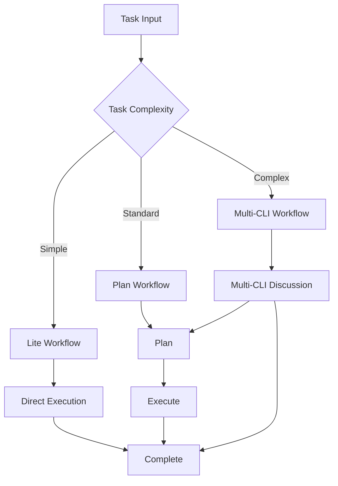

# Workflow Commands

## One-Liner

**Workflow commands are the execution engine of Claude_dms3** — providing complete workflow support from lightweight tasks to complex projects.

## Command List

### Lightweight Workflows

| Command | Function | Syntax |
|---------|----------|--------|
| [`lite-lite-lite`](#lite-lite-lite) | Ultra-lightweight multi-tool analysis and direct execution | `/workflow:lite-lite-lite [-y] <task>` |
| [`lite-plan`](#lite-plan) | Lightweight interactive planning workflow | `/workflow-lite-plan [-y] [-e] "task"` |
| [`lite-execute`](#lite-execute) | Execute tasks based on in-memory plan | `/workflow:lite-execute [-y] [--in-memory] [task]` |
| [`lite-fix`](#lite-fix) | Lightweight bug diagnosis and fix | `/workflow:lite-fix [-y] [--hotfix] "bug description"` |

### Standard Workflows

| Command | Function | Syntax |
|---------|----------|--------|
| [`plan`](#plan) | 5-phase planning workflow | `/workflow-plan [-y] "description"\|file.md` |
| [`execute`](#execute) | Coordinate agent execution of workflow tasks | `/workflow-execute [-y] [--resume-session=ID]` |
| [`replan`](#replan) | Interactive workflow replanning | `/workflow:replan [-y] [--session ID] [task-id] "requirement"` |

### Collaborative Workflows

| Command | Function | Syntax |
|---------|----------|--------|
| [`multi-cli-plan`](#multi-cli-plan) | Multi-CLI collaborative planning | `/workflow-multi-cli-plan [-y] <task> [--max-rounds=N]` |
| [`brainstorm-with-file`](#brainstorm-with-file) | Interactive brainstorming | `/workflow:brainstorm-with-file [-y] [-c] "idea"` |
| [`analyze-with-file`](#analyze-with-file) | Interactive collaborative analysis | `/workflow:analyze-with-file [-y] [-c] "topic"` |
| [`debug-with-file`](#debug-with-file) | Interactive hypothesis-driven debugging | `/workflow:debug-with-file [-y] "bug description"` |
| [`unified-execute-with-file`](#unified-execute-with-file) | Universal execution engine | `/workflow:unified-execute-with-file [-y] [-p path] [context]` |

### TDD Workflows

| Command | Function | Syntax |
|---------|----------|--------|
| [`tdd-plan`](#tdd-plan) | TDD planning workflow | `/workflow-tdd-plan "feature description"` |
| [`tdd-verify`](#tdd-verify) | Verify TDD workflow compliance | `/workflow-tdd-verify [--session ID]` |

### Test Workflows

| Command | Function | Syntax |
|---------|----------|--------|
| [`test-fix-gen`](#test-fix-gen) | Create test-fix workflow session | `/workflow-test-fix (session-id\|"description"\|file.md)` |
| [`test-gen`](#test-gen) | Create test session from implementation session | `/workflow:test-gen source-session-id` |
| [`test-cycle-execute`](#test-cycle-execute) | Execute test-fix workflow | `/workflow-test-fix [--resume-session=ID]` |

### Review Workflows

| Command | Function | Syntax |
|---------|----------|--------|
| [`review`](#review) | Post-implementation review | `/workflow:review [--type=type] [--archived] [session-id]` |
| [`review-module-cycle`](#review-module-cycle) | Standalone multi-dimensional code review | `/workflow:review-module-cycle <path> [--dimensions=dimensions]` |
| [`review-session-cycle`](#review-session-cycle) | Session-based review | `/workflow:review-session-cycle [session-id] [--dimensions=dimensions]` |
| [`review-cycle-fix`](#review-cycle-fix) | Auto-fix review findings | `/workflow:review-cycle-fix <export-file\|review-dir>` |

### Specialized Workflows

| Command | Function | Syntax |
|---------|----------|--------|
| [`clean`](#clean) | Smart code cleanup | `/workflow:clean [-y] [--dry-run] ["focus area"]` |
| [`init`](#init) | Initialize project state | `/workflow:init [--regenerate]` |
| [`plan-verify`](#plan-verify) | Verify planning consistency | `/workflow-plan-verify [--session session-id]` |

## Command Details

### lite-lite-lite

**Function**: Ultra-lightweight multi-tool analysis and direct execution. Simple tasks have no artifacts, complex tasks automatically create planning documents in `.workflow/.scratchpad/`.

**Syntax**:
```bash
/workflow:lite-lite-lite [-y|--yes] <task description>
```

**Use Cases**:
- Ultra-simple quick tasks
- Code modifications not needing planning documents
- Automatic tool selection

**Examples**:
```bash
# Ultra-simple task
/workflow:lite-lite-lite "fix header styles"

# Auto mode
/workflow:lite-lite-lite -y "update README links"
```

### lite-plan

**Function**: Lightweight interactive planning workflow, supporting in-memory planning, code exploration, and execution to lite-execute.

**Syntax**:
```bash
/workflow-lite-plan [-y|--yes] [-e|--explore] "task description" | file.md
```

**Options**:
- `-e, --explore`: Execute code exploration first

**Examples**:
```bash
# Basic planning
/workflow-lite-plan "add user avatar feature"

# With exploration
/workflow-lite-plan -e "refactor authentication module"
```

### lite-execute

**Function**: Execute tasks based on in-memory plan, prompt description, or file content.

**Syntax**:
```bash
/workflow:lite-execute [-y|--yes] [--in-memory] ["task description" | file-path]
```

**Options**:
- `--in-memory`: Use in-memory plan

**Examples**:
```bash
# Execute task
/workflow:lite-execute "implement avatar upload API"

# Use in-memory plan
/workflow:lite-execute --in-memory
```

### lite-fix

**Function**: Lightweight bug diagnosis and fix workflow, supporting intelligent severity assessment and optional hotfix mode.

**Syntax**:
```bash
/workflow:lite-fix [-y|--yes] [--hotfix] "bug description or issue reference"
```

**Options**:
- `--hotfix`: Hotfix mode (quick fix for production incidents)

**Examples**:
```bash
# Bug fix
/workflow:lite-fix "login returns 500 error"

# Hotfix
/workflow:lite-fix --hotfix "payment gateway timeout"
```

### plan

**Function**: 5-phase planning workflow, outputting IMPL_PLAN.md and task JSON.

**Syntax**:
```bash
/workflow-plan [-y|--yes] "text description" | file.md
```

**Phases**:
1. Session initialization
2. Context collection
3. Specification loading
4. Task generation
5. Verification/replanning

**Examples**:
```bash
# Plan from description
/workflow-plan "implement user notification system"

# Plan from file
/workflow-plan requirements.md
```

### execute

**Function**: Coordinate agent execution of workflow tasks, supporting automatic session discovery, parallel task processing, and state tracking.

**Syntax**:
```bash
/workflow-execute [-y|--yes] [--resume-session="session-id"]
```

**Examples**:
```bash
# Execute current session
/workflow-execute

# Resume and execute session
/workflow-execute --resume-session=WFS-2024-01-15
```

### replan

**Function**: Interactive workflow replanning, supporting session-level artifact updates and scope clarification.

**Syntax**:
```bash
/workflow:replan [-y|--yes] [--session session-id] [task-id] "requirement" | file.md [--interactive]
```

**Examples**:
```bash
# Replan entire session
/workflow:replan --session=WFS-xxx "add user permission checks"

# Replan specific task
/workflow:replan TASK-001 "change to use RBAC"
```

### multi-cli-plan

**Function**: Multi-CLI collaborative planning workflow, using ACE context collection and iterative cross-validation.

**Syntax**:
```bash
/workflow-multi-cli-plan [-y|--yes] <task description> [--max-rounds=3] [--tools=gemini,codex] [--mode=parallel|serial]
```

**Options**:
- `--max-rounds=N`: Maximum discussion rounds
- `--tools=tools`: CLI tools to use
- `--mode=mode`: Parallel or serial mode

**Examples**:
```bash
# Multi-CLI planning
/workflow-multi-cli-plan "design microservice architecture"

# Specify tools and rounds
/workflow-multi-cli-plan --tools=gemini,codex --max-rounds=5 "database migration plan"
```

### brainstorm-with-file

**Function**: Interactive brainstorming, multi-CLI collaboration, idea expansion, and documented thinking evolution.

**Syntax**:
```bash
/workflow:brainstorm-with-file [-y|--yes] [-c|--continue] [-m|--mode creative|structured] "idea or topic"
```

**Options**:
- `-c, --continue`: Continue existing session
- `-m, --mode=mode`: creative or structured

**Examples**:
```bash
# Creative brainstorming
/workflow:brainstorm-with-file --mode creative "user growth strategies"

# Structured brainstorming
/workflow:brainstorm-with-file --mode structured "API versioning approach"
```

### analyze-with-file

**Function**: Interactive collaborative analysis with documented discussion, CLI-assisted exploration, and evolving understanding.

**Syntax**:
```bash
/workflow:analyze-with-file [-y|--yes] [-c|--continue] "topic or question"
```

**Examples**:
```bash
# Analyze topic
/workflow:analyze-with-file "authentication architecture design"

# Continue discussion
/workflow:analyze-with-file -c
```

### debug-with-file

**Function**: Interactive hypothesis-driven debugging with documented exploration, understanding evolution, and Gemini-assisted correction.

**Syntax**:
```bash
/workflow:debug-with-file [-y|--yes] "bug description or error message"
```

**Examples**:
```bash
# Debug bug
/workflow:debug-with-file "WebSocket connection randomly disconnects"

# Debug error
/workflow:debug-with-file "TypeError: Cannot read property 'id'"
```

### unified-execute-with-file

**Function**: Universal execution engine consuming any planning/brainstorming/analysis output, supporting minimal progress tracking, multi-agent coordination, and incremental execution.

**Syntax**:
```bash
/workflow:unified-execute-with-file [-y|--yes] [-p|--plan <path>] [-m|--mode sequential|parallel] ["execution context"]
```

**Examples**:
```bash
# Execute plan
/workflow:unified-execute-with-file -p plan.md

# Parallel execution
/workflow:unified-execute-with-file -m parallel
```

## Workflow Diagram



## Related Documentation

- [Session Management](./session.md)
- [Core Orchestration](./core-orchestration.md)
- [Workflow Guide](../../guide/ch04-workflow-basics.md)
