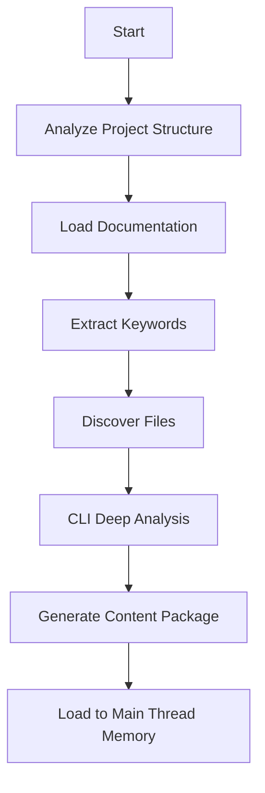

# Prep Prompts

## One-Liner

**Prep prompts are standardized templates for project context preparation** — generating structured project core content packages through agent-driven analysis.

## Core Content Package Structure

```json
{
  "task_context": "Task context description",
  "keywords": ["keyword1", "keyword2"],
  "project_summary": {
    "architecture": "Architecture description",
    "tech_stack": ["tech1", "tech2"],
    "key_patterns": ["pattern1", "pattern2"]
  },
  "relevant_files": [
    {
      "path": "file path",
      "relevance": "relevance description",
      "priority": "high|medium|low"
    }
  ],
  "integration_points": [
    "integration point 1",
    "integration point 2"
  ],
  "constraints": [
    "constraint 1",
    "constraint 2"
  ]
}
```

## memory:prepare

**Function**: Delegate to universal-executor agent, analyzing project via Gemini/Qwen CLI and returning JSON core content package for task context.

**Syntax**:
```
/memory:prepare [--tool gemini|qwen] "task context description"
```

**Options**:
- `--tool=tool`: Specify CLI tool (default: gemini)
  - `gemini`: Large context window, suitable for complex project analysis
  - `qwen`: Gemini alternative with similar capabilities

**Execution Flow**:



**Agent Call Prompt**:
```
## Mission: Prepare Project Memory Context

**Task**: Prepare project memory context for: "{task_description}"
**Mode**: analysis
**Tool Preference**: {tool}

### Step 1: Foundation Analysis
1. Project Structure: get_modules_by_depth.sh
2. Core Documentation: CLAUDE.md, README.md

### Step 2: Keyword Extraction & File Discovery
1. Extract core keywords from task description
2. Discover relevant files using ripgrep and find

### Step 3: Deep Analysis via CLI
Execute Gemini/Qwen CLI for deep analysis

### Step 4: Generate Core Content Package
Return structured JSON with required fields

### Step 5: Return Content Package
Load JSON into main thread memory
```

**Examples**:

```bash
# Basic usage
/memory:prepare "develop user authentication on current frontend"

# Specify tool
/memory:prepare --tool qwen "refactor payment module API"

# Bug fix context
/memory:prepare "fix login validation error"
```

**Returned Content Package**:

```json
{
  "task_context": "develop user authentication on current frontend",
  "keywords": ["frontend", "user", "authentication", "auth", "login"],
  "project_summary": {
    "architecture": "TypeScript + React frontend, Vite build system",
    "tech_stack": ["React", "TypeScript", "Vite", "TailwindCSS"],
    "key_patterns": [
      "State management via Context API",
      "Functional components with Hooks pattern",
      "API calls wrapped in custom hooks"
    ]
  },
  "relevant_files": [
    {
      "path": "src/components/Auth/LoginForm.tsx",
      "relevance": "Existing login form component",
      "priority": "high"
    },
    {
      "path": "src/contexts/AuthContext.tsx",
      "relevance": "Authentication state management context",
      "priority": "high"
    },
    {
      "path": "CLAUDE.md",
      "relevance": "Project development standards",
      "priority": "high"
    }
  ],
  "integration_points": [
    "Must integrate with existing AuthContext",
    "Follow component organization pattern: src/components/[Feature]/",
    "API calls should use src/hooks/useApi.ts wrapper"
  ],
  "constraints": [
    "Maintain backward compatibility",
    "Follow TypeScript strict mode",
    "Use existing UI component library"
  ]
}
```

## Quality Checklist

Before generating content package, verify:
- [ ] Valid JSON format
- [ ] All required fields complete
- [ ] relevant_files contains minimum 3-10 files
- [ ] project_summary accurately reflects architecture
- [ ] integration_points clearly specify integration paths
- [ ] keywords accurately extracted (3-8 keywords)
- [ ] Content is concise, avoid redundancy (< 5KB total)

## Memory Persistence

- **Session Scope**: Content package valid for current session
- **Subsequent References**: All subsequent agents/commands can access
- **Reload Required**: New sessions need to re-execute `/memory:prepare`

## Related Documentation

- [Memory Commands](../claude/memory.md)
- [Review Prompts](./review.md)
- [CLI Invocation System](../../features/cli.md)
