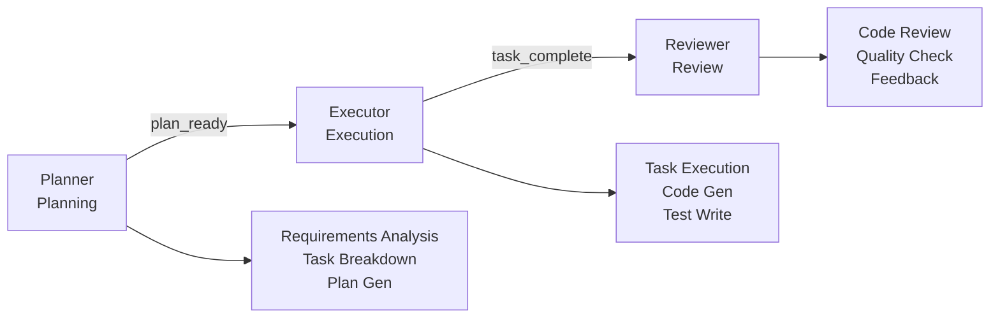
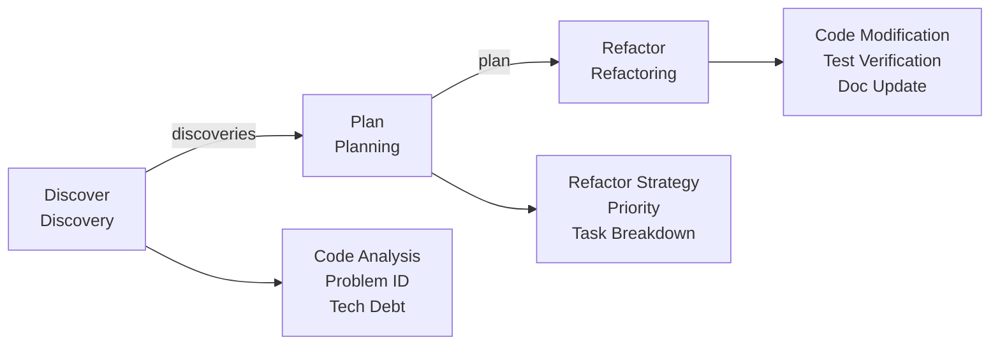
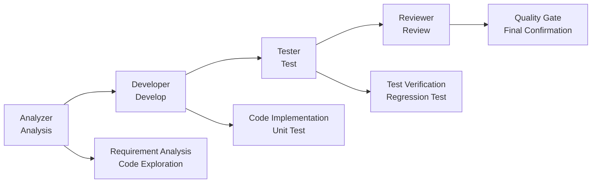
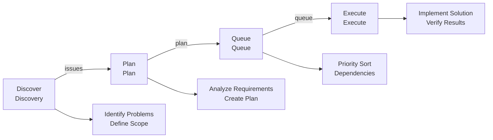
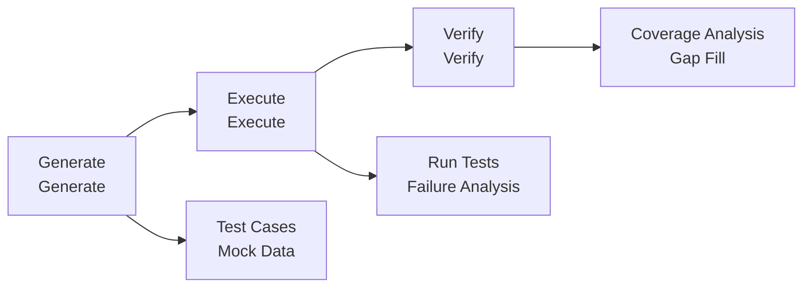

# Workflow Basics

## One-Line Positioning

**Workflows are the core of team collaboration** — 8 workflows covering the full development lifecycle, from planning to execution, from analysis to testing.

---

## 4.1 Workflow Overview

| Workflow | Core Command | Use Case | Roles |
| --- | --- | --- | --- |
| **PlanEx** | `/workflow:plan` | New feature development, requirement implementation | planner, executor |
| **IterDev** | `/refactor-cycle` | Code refactoring, technical debt handling | developer, reviewer |
| **Lifecycle** | `/unified-execute-with-file` | Complete development cycle | analyzer, developer, tester, reviewer |
| **Issue** | `/issue:*` | Issue-driven development | discoverer, planner, executor |
| **Testing** | `/integration-test-cycle` | Integration testing, test generation | tester, developer |
| **QA** | `/review-cycle` | Code review and quality assurance | qa, developer |
| **Brainstorm** | `/brainstorm-with-file` | Multi-perspective analysis, technical decisions | facilitator, perspectives |
| **UIDesign** | `/workflow:ui-design` | UI design and code generation | designer, developer |

---

## 4.2 PlanEx - Planning-Execution Workflow

### 4.2.1 One-Line Positioning

**PlanEx is a planning-execution separation workflow** — Plan first, then execute, ensuring tasks are clear before starting work.

### 4.2.2 Launch Method

```shell
/workflow:plan
```

Or describe requirements directly:

```plaintext
Implement user login functionality, supporting email and phone number login
```

### 4.2.3 Workflow Process



### 4.2.4 Output Artifacts

| Artifact | Location | Description |
| --- | --- | --- |
| **Requirements Analysis** | `artifacts/requirements.md` | Detailed requirement analysis |
| **Task Plan** | `artifacts/plan.md` | Structured task list |
| **Execution Artifacts** | `artifacts/implementation/` | Code and tests |
| **Wisdom Accumulation** | `wisdom/learnings.md` | Lessons learned |

---

## 4.3 IterDev - Iterative Development Workflow

### 4.3.1 One-Line Positioning

**IterDev is an iterative refactoring workflow** — Discover technical debt, plan refactoring, improve iteratively.

### 4.3.2 Launch Method

```shell
/refactor-cycle
```

### 4.3.3 Workflow Process



### 4.3.4 Use Cases

| Scenario | Example |
| --- | --- |
| **Code Smells** | Long functions, duplicate code |
| **Architecture Improvement** | Decoupling, modularization |
| **Performance Optimization** | Algorithm optimization, caching strategy |
| **Security Hardening** | Fix security vulnerabilities |
| **Standard Unification** | Code style consistency |

---

## 4.4 Lifecycle - Lifecycle Workflow

### 4.4.1 One-Line Positioning

**Lifecycle is a full-lifecycle coverage workflow** — From analysis to testing to review, complete closed loop.

### 4.4.2 Launch Method

```shell
/unified-execute-with-file <file>
```

### 4.4.3 Role Responsibilities

| Role | Responsibility | Output |
| --- | --- | --- |
| **Analyzer** | Analyze requirements, explore code | Analysis report |
| **Developer** | Implement features, write tests | Code + tests |
| **Tester** | Run tests, verify functionality | Test report |
| **Reviewer** | Code review, quality check | Review report |

### 4.4.4 Workflow Process



---

## 4.5 Issue - Issue Management Workflow

### 4.5.1 One-Line Positioning

**Issue is an issue-driven development workflow** — From issue discovery to planning to execution, complete tracking.

### 4.5.2 Issue Commands

| Command | Function | Example |
| --- | --- | --- |
| **discover** | Discover Issue | `/issue discover https://github.com/xxx/issue/1` |
| **discover-by-prompt** | Create from Prompt | `/issue discover-by-prompt "Login failed"` |
| **from-brainstorm** | Create from brainstorm | `/issue from-brainstorm` |
| **plan** | Batch plan Issues | `/issue plan` |
| **queue** | Form execution queue | `/issue queue` |
| **execute** | Execute Issue queue | `/issue execute` |

### 4.5.3 Workflow Process



---

## 4.6 Testing - Testing Workflow

### 4.6.1 One-Line Positioning

**Testing is a self-iterating test workflow** — Auto-generate tests, iteratively improve test coverage.

### 4.6.2 Launch Method

```shell
/integration-test-cycle
```

### 4.6.3 Workflow Process



---

## 4.7 QA - Quality Assurance Workflow

### 4.7.1 One-Line Positioning

**QA is a code review workflow** — 6-dimensional code review, auto-discover issues.

### 4.7.2 Launch Method

```shell
/review-cycle
```

### 4.7.3 Review Dimensions

| Dimension | Check Items |
| --- | --- |
| **Correctness** | Logic correct, boundary handling |
| **Performance** | Algorithm efficiency, resource usage |
| **Security** | Injection vulnerabilities, permission checks |
| **Maintainability** | Code clarity, modularity |
| **Test Coverage** | Unit tests, boundary tests |
| **Standard Compliance** | Coding standards, project conventions |

---

## 4.8 Brainstorm - Brainstorming Workflow

### 4.8.1 One-Line Positioning

**Brainstorm is a multi-perspective analysis workflow** — Analyze problems from multiple viewpoints for comprehensive insights.

### 4.8.2 Launch Method

```shell
/brainstorm-with-file <file>
```

### 4.8.3 Analysis Perspectives

| Perspective | Role | Focus |
| --- | --- | --- |
| **Product** | Product Manager | Market fit, user value |
| **Technical** | Tech Lead | Feasibility, technical debt |
| **Quality** | QA Lead | Completeness, testability |
| **Risk** | Risk Analyst | Risk identification, dependencies |

### 4.8.4 Output Format

```markdown
## Consensus Points
- [Consensus point 1]
- [Consensus point 2]

## Divergences
- [Divergence 1]
  - Perspective A: ...
  - Perspective B: ...
  - Recommendation: ...

## Action Items
- [ ] [Action item 1]
- [ ] [Action item 2]
```

---

## 4.9 UIDesign - UI Design Workflow

### 4.9.1 One-Line Positioning

**UIDesign is a UI design generation workflow** — From design to code, auto-extract styles and layouts.

### 4.9.2 UI Design Commands

| Command | Function |
| --- | --- |
| **generate** | Generate UI components |
| **import-from-code** | Import styles from code |
| **style-extract** | Extract style specifications |
| **layout-extract** | Extract layout structure |
| **imitate-auto** | Imitate reference page |
| **codify-style** | Convert styles to code |
| **design-sync** | Sync design changes |

---

## 4.10 Quick Reference

### Workflow Selection Guide

| Requirement | Recommended Workflow | Command |
| --- | --- | --- |
| New feature development | PlanEx | `/workflow:plan` |
| Code refactoring | IterDev | `/refactor-cycle` |
| Complete development | Lifecycle | `/unified-execute-with-file` |
| Issue management | Issue | `/issue:*` |
| Test generation | Testing | `/integration-test-cycle` |
| Code review | QA | `/review-cycle` |
| Multi-perspective analysis | Brainstorm | `/brainstorm-with-file` |
| UI development | UIDesign | `/workflow:ui-design` |

### Session Management Commands

| Command | Function |
| --- | --- |
| `/workflow:session:start` | Start new session |
| `/workflow:session:resume` | Resume session |
| `/workflow:session:list` | List sessions |
| `/workflow:session:complete` | Complete session |
| `/workflow:session:solidify` | Solidify results |

---

## Next Steps

- [Advanced Tips](ch05-advanced-tips.md) — CLI toolchain, multi-model collaboration
- [Best Practices](ch06-best-practices.md) — Team collaboration standards, code review process
