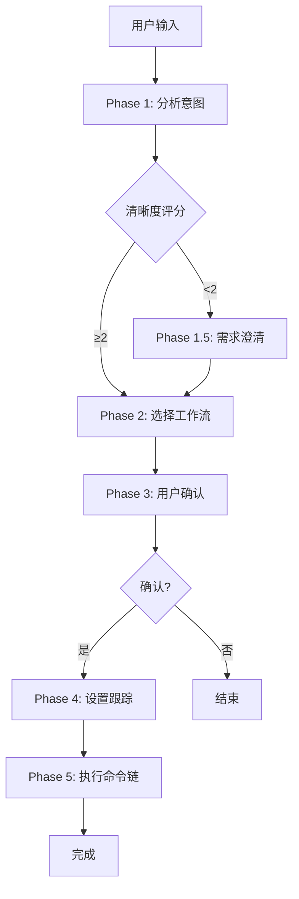
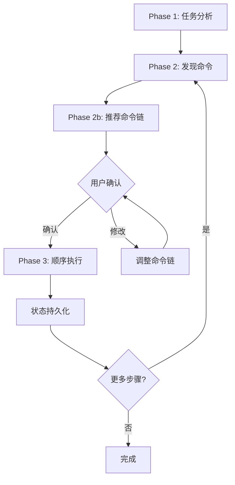

# 核心编排命令

## 一句话定位

**核心编排命令是 Claude Code Workflow 的工作流大脑** — 分析任务意图、选择合适的工作流、自动执行命令链。

## 命令列表

| 命令 | 功能 | 语法 |
| --- | --- | --- |
| [`/ccw`](#ccw) | 主工作流编排器 - 意图分析→工作流选择→命令链执行 | `/ccw "任务描述"` |
| [`/ccw-coordinator`](#ccw-coordinator) | 命令编排工具 - 链式命令执行和状态持久化 | `/ccw-coordinator "任务描述"` |

## 命令详解

### /ccw

**功能**: 主工作流编排器 - 意图分析→工作流选择→命令链执行

**核心概念: 自包含 Skill (Self-Contained Skills)**

每个 Skill 是**自包含执行单元**，内部处理完整流水线。单次 Skill 调用即完成一个有意义的工作里程碑。

| 单元类型 | Skill | 说明 |
|---------|-------|------|
| 轻量 Plan+Execute | `workflow-lite-plan` | 内部完成 plan→execute |
| 标准 Planning | `workflow-plan` → `workflow-execute` | plan 和 execute 是独立 Skill |
| TDD Planning | `workflow-tdd-plan` → `workflow-execute` | tdd-plan 和 execute 是独立 Skill |
| 规格驱动 | `spec-generator` → `workflow-plan` → `workflow-execute` | 规格文档驱动完整开发 |
| 测试流水线 | `workflow-test-fix` | 内部完成 gen→cycle |
| 代码审查 | `review-cycle` | 内部完成 review→fix |
| 分析→规划 | `workflow:analyze-with-file` → `workflow-lite-plan` | 协作分析产物自动传递给 lite-plan |
| 头脑风暴→规划 | `workflow:brainstorm-with-file` → `workflow-lite-plan` | 头脑风暴产物自动传递给 lite-plan |
| 协作规划 | `workflow:collaborative-plan-with-file` → `workflow:unified-execute-with-file` | 多 agent 协作规划→通用执行 |
| 需求路线图 | `workflow:roadmap-with-file` → `team-planex` | 需求拆解→issue 创建→wave pipeline 执行 |
| 集成测试循环 | `workflow:integration-test-cycle` | 自迭代集成测试闭环 |
| 重构循环 | `workflow:refactor-cycle` | 技术债务发现→重构→验证 |

**语法**:
```bash
/ccw "任务描述"
```

**选项**:
- `--yes` / `-y`: 自动模式，跳过确认步骤并传播到下游 Skill

**5 阶段工作流程**:



**Phase 1.5: 需求澄清** (当清晰度 < 2 时触发)

| 问题类型 | 示例 |
|---------|------|
| **目标** | Create / Fix / Optimize / Analyze |
| **范围** | 单文件 / 模块 / 跨模块 / 系统 |
| **约束** | 向后兼容 / 跳过测试 / 紧急热修复 |

**自动模式 (-y) 传播机制**:

| Phase | 正常行为 | 自动模式行为 |
|-------|---------|-------------|
| Phase 1.5 | 清晰度<2 时询问 | 跳过澄清，用已有信息推断 |
| Phase 3 | 要求用户确认 | 跳过确认，直接执行 |
| Phase 5 错误 | 询问 Retry/Skip/Abort | 自动选择 "Skip" |
| Skill 调用 | 使用给定参数 | 自动附加 `-y` 到下游 Skill |

**任务类型检测 (24 种模式)**:

| 优先级 | 类型 | 触发关键词 | 工作流 |
|--------|------|-----------|--------|
| 1 | Bug 修复 (紧急) | urgent, production, critical + fix, bug | lite-fix (--hotfix) |
| 2 | 头脑风暴 | brainstorm, ideation, 头脑风暴, 创意, 发散思维 | brainstorm-with-file |
| 3 | 头脑风暴→Issue | brainstorm.*issue, 头脑风暴.*issue | issue:from-brainstorm |
| 4 | 调试文档 | debug.*document, hypothesis, 假设验证, 深度调试 | debug-with-file |
| 5 | 协作分析 | analyze.*document, collaborative analysis, 协作分析 | analyze-with-file |
| 6 | 协作规划 | collaborative.*plan, 协作规划, 多人规划 | collaborative-plan-with-file |
| 7 | 需求路线图 | roadmap, 需求规划, 需求拆解 | roadmap-with-file |
| 8 | 规格驱动 | spec.*gen, specification, PRD, 产品需求 | spec-generator → plan |
| 9 | 集成测试 | integration.*test, 集成测试, 端到端测试 | integration-test-cycle |
| 10 | 重构 | refactor, 重构, tech.*debt, 技术债务 | refactor-cycle |
| 11 | 团队工作流 | team.*plan.*exec, 团队规划执行, wave pipeline | team-planex |
| 12 | 多CLI协作 | multi.*cli, 多CLI, 多模型协作 | multi-cli-plan |
| 13 | Bug 修复 | fix, bug, error, crash, fail, debug | lite-fix |
| 14 | Issue 批量 | issues?.*batch, 批量issue | issue:discover → execute |
| 15 | Issue 转换 | issue workflow, structured workflow | lite-plan → convert-to-plan |
| 16 | 探索 | uncertain, explore, 研究, what if | brainstorm → plan |
| 17 | 快速任务 | quick, simple, small + feature | lite-plan |
| 18 | UI 设计 | ui, design, component, style | ui-design:* |
| 19 | TDD | tdd, test-driven, 先写测试 | tdd-plan → execute |
| 20 | 测试修复 | 测试失败, test fail, failing test | test-fix-gen → cycle |
| 21 | 测试生成 | generate test, 写测试, 补充测试 | test-gen → execute |
| 22 | 代码审查 | review, 审查, code review | review-cycle |
| 23 | 文档 | docs, documentation, readme | lite-plan |
| 24 | 功能 (默认) | *(其他)* | lite-plan 或 plan → execute |

**With-File 自动链式机制**:

当 `analyze-with-file` 或 `brainstorm-with-file` 完成时，其产物（discussion.md / brainstorm.md）**自动传递**给 `workflow-lite-plan` 作为上下文输入。

| 工作流 | 自动链目标 | 产物传递 |
|--------|-----------|---------|
| analyze-with-file | → workflow-lite-plan | discussion.md |
| brainstorm-with-file | → workflow-lite-plan | brainstorm.md |

**Cycle 工作流自迭代模式**:

| 工作流 | 流水线 | 特点 |
|--------|--------|------|
| integration-test-cycle | explore → test dev → test-fix → reflection | 最大迭代次数, 自动继续 |
| refactor-cycle | discover → prioritize → execute → validate | 多维度分析, 回归验证 |

**同步执行模型**:

```
用户输入 → 分析意图 → 选择工作流 → [确认] → 执行命令链
                                              ↓
                                        Skill (阻塞)
                                              ↓
                                        更新 TodoWrite
                                              ↓
                                        下一个命令...
```

**双跟踪系统**:

1. **TodoWrite 跟踪** (UI 显示): 所有执行状态通过 `CCW:` 前缀跟踪
2. **status.json 跟踪** (持久化): 位置 `.workflow/.ccw/{session_id}/status.json`

**示例**:

```bash
# 基础用法 - 自动选择工作流
/ccw "实现用户认证功能"

# 自动模式 - 跳过确认并传播 -y
/ccw -y "实现用户认证功能"

# Bug 修复
/ccw "修复登录失败的 bug"

# 协作分析 (自动链到 lite-plan)
/ccw "协作分析: 认证架构的设计决策"

# 头脑风暴 (自动链到 lite-plan)
/ccw "头脑风暴: 用户通知系统重新设计"

# TDD 开发
/ccw "使用 TDD 实现支付功能"

# 团队协作
/ccw "team-planex 实现用户通知系统"
```

### /ccw-coordinator

**功能**: 命令编排工具 - 分析任务、推荐命令链、顺序执行、状态持久化

**核心概念: 最小执行单元 (Minimum Execution Units)**

最小执行单元是一组必须**作为原子组执行**的命令集合，拆分这些命令会破坏逻辑流并创建不完整状态。

**规划+执行单元**:

| 单元名称 | 命令链 | 输出 |
| --- | --- | --- |
| **快速实现** | lite-plan → lite-execute | 工作代码 |
| **多 CLI 规划** | multi-cli-plan → lite-execute | 工作代码 |
| **Bug 修复** | lite-plan (--bugfix) → lite-execute | 修复的代码 |
| **完整规划+执行** | plan → execute | 工作代码 |
| **验证规划+执行** | plan → plan-verify → execute | 工作代码 |
| **重规划+执行** | replan → execute | 工作代码 |
| **TDD 规划+执行** | tdd-plan → execute | 工作代码 |
| **测试生成+执行** | test-gen → execute | 生成的测试 |
| **规格驱动完整流水线** | spec-generator → plan → execute | 工作代码 |

**测试单元**:

| 单元名称 | 命令链 | 输出 |
| --- | --- | --- |
| **测试验证** | test-fix-gen → test-cycle-execute | 测试通过 |

**审查单元**:

| 单元名称 | 命令链 | 输出 |
| --- | --- | --- |
| **代码审查 (会话)** | review-session-cycle → review-cycle-fix | 修复的代码 |
| **代码审查 (模块)** | review-module-cycle → review-cycle-fix | 修复的代码 |

**Issue 单元**:

| 单元名称 | 命令链 | 输出 |
| --- | --- | --- |
| **Issue 工作流** | discover → plan → queue → execute | 完成的 Issue |
| **快速转 Issue** | lite-plan → convert-to-plan → queue → execute | 完成的 Issue |
| **头脑风暴转 Issue** | from-brainstorm → queue → execute | 完成的 Issue |

**With-File 单元**:

| 单元名称 | 命令链 | 输出 |
| --- | --- | --- |
| **分析到规划** | analyze-with-file → lite-plan | discussion.md + 代码 |
| **头脑风暴到规划** | brainstorm-with-file → lite-plan | brainstorm.md + 代码 |
| **调试文档** | debug-with-file | understanding.md |
| **协作规划** | collaborative-plan-with-file → unified-execute-with-file | plan-note.md + 代码 |
| **路线图规划** | roadmap-with-file → team-planex | execution-plan.json + 代码 |

**Cycle 单元**:

| 单元名称 | 命令链 | 输出 |
| --- | --- | --- |
| **集成测试循环** | integration-test-cycle | 测试通过 |
| **重构循环** | refactor-cycle | 重构后代码 |

**原子组规则**:

1. **永不拆分单元**: Coordinator 必须推荐完整单元，而非部分链
2. **多单元参与**: 某些命令可参与多个单元 (如 plan → execute 或 plan → plan-verify → execute)
3. **用户覆盖**: 用户可显式请求部分执行 (高级模式)
4. **可视化**: 流水线视图用 `【 】` 标记显示单元边界
5. **验证**: 执行前验证所有单元命令已包含

**流水线可视化示例**:
```
需求 → 【lite-plan → lite-execute】→ 代码 → 【test-fix-gen → test-cycle-execute】→ 测试通过
       └──── 快速实现 ────┘         └────── 测试验证 ──────┘
```

**语法**:
```bash
/ccw-coordinator "任务描述"
```

**3 阶段工作流程**:



**命令端口定义**:

每个命令有**输入/输出端口**用于流水线组合:

| 端口 | 描述 |
|------|------|
| `requirement` | 初始用户需求 |
| `bug-report` | Bug 报告 |
| `plan` | 基础规划输出 |
| `detailed-plan` | 详细规划输出 |
| `multi-cli-plan` | 多CLI规划输出 |
| `verified-plan` | 验证后规划 |
| `test-tasks` | 生成的测试任务 |
| `code` | 执行的代码 |
| `test-passed` | 测试通过验证 |
| `discussion-document` | 分析讨论文件 |
| `brainstorm-document` | 头脑风暴输出 |
| `plan-note` | 协作规划笔记 |

**外部 CLI 执行格式**:

```bash
ccw cli -p "PROMPT_CONTENT" --tool <tool> --mode <mode>
```

**参数**:
- `-p "PROMPT_CONTENT"`: 要执行的提示内容 (必需)
- `--tool <tool>`: CLI 工具 (如 `claude`, `gemini`, `qwen`)
- `--mode <mode>`: 执行模式 (`analysis` 或 `write`)

**提示组装格式**:
```
/workflow:<command> -y <parameters>

Task: <description>

<optional_context>
```

**串行阻塞执行**:

命令逐个执行。启动后台 CLI 后:
1. 编排器立即停止 (`break`)
2. 等待 Hook 回调 - **不使用 TaskOutput 轮询**
3. Hook 回调触发下一个命令

**状态持久化 (state.json)**:

位置: `.workflow/.ccw-coordinator/{session_id}/state.json`

```json
{
  "session_id": "ccw-coord-20250124-143025",
  "status": "running|waiting|completed|failed",
  "analysis": { "goal": "...", "task_type": "..." },
  "command_chain": [
    { "index": 0, "command": "/workflow-plan", "status": "completed" },
    { "index": 1, "command": "/workflow-execute", "status": "running" }
  ],
  "execution_results": [
    { "index": 0, "command": "/workflow-plan", "status": "completed", 
      "session_id": "WFS-plan-20250124", "artifacts": ["IMPL_PLAN.md"] }
  ],
  "prompts_used": [
    { "index": 0, "command": "plan", "prompt": "/workflow-plan -y \"...\"" }
  ]
}
```

**状态值**: `running` → `waiting` → `completed` | `failed`

**Hook 回调机制**:

处理后台 CLI 任务完成并触发链中下一个命令:
1. 解析 CLI 输出提取 session_id 和 artifacts
2. 更新 state.json 完成结果
3. 调用 `resumeChainExecution()` 继续链

**示例**:

```bash
# 自动编排 Bug 修复
/ccw-coordinator "生产环境登录失败"

# 自动编排功能实现
/ccw-coordinator "添加用户头像上传功能"

# 自动模式
/ccw-coordinator -y "实现用户认证系统"
```

## 自动模式

两个命令都支持 `--yes` 标志启用自动模式：

```bash
# 自动模式 - 跳过所有确认
/ccw "实现用户认证" --yes
/ccw-coordinator "修复登录 bug" --yes
```

**自动模式行为**:
- 跳过需求澄清
- 跳过用户确认
- 直接执行命令链
- 错误时自动选择 "Skip" 继续

## 相关 Skills

| Skill | 包含操作 |
| --- | --- |
| `workflow-lite-plan` | lite-plan, lite-execute |
| `workflow-plan` | plan, plan-verify, replan |
| `workflow-execute` | execute |
| `workflow-tdd-plan` | tdd-plan, tdd-verify |
| `workflow-test-fix` | test-fix-gen, test-cycle-execute |
| `review-cycle` | review-session-cycle, review-module-cycle, review-cycle-fix |
| `brainstorm` | auto-parallel, artifacts, role-analysis, synthesis |
| `spec-generator` | product-brief → PRD → architecture → epics |

## 命名空间 Skill

| 类别 | Skill |
|------|-------|
| **With-File 工作流** | workflow:brainstorm-with-file, workflow:debug-with-file, workflow:analyze-with-file, workflow:collaborative-plan-with-file, workflow:roadmap-with-file |
| **Cycle 工作流** | workflow:integration-test-cycle, workflow:refactor-cycle |
| **执行** | workflow:unified-execute-with-file |
| **会话管理** | workflow:session:start, workflow:session:resume, workflow:session:complete, workflow:session:solidify, workflow:session:list, workflow:session:sync |
| **工具** | workflow:clean, workflow:init, workflow:init-guidelines, workflow:status |
| **Issue 工作流** | issue:discover, issue:discover-by-prompt, issue:plan, issue:queue, issue:execute, issue:convert-to-plan, issue:from-brainstorm, issue:new |

## 对比

| 特性 | /ccw | /ccw-coordinator |
| --- | --- | --- |
| **核心概念** | Self-Contained Skills (自包含 Skill) | Minimum Execution Units (最小执行单元) |
| **执行位置** | 主进程 (同步阻塞) | 外部 CLI + 后台任务 |
| **执行模型** | Skill 调用 (阻塞到完成) | ccw cli + Hook 回调 |
| **状态持久化** | status.json (轻量) | state.json (含 execution_results, prompts_used) |
| **状态轮询** | 不适用 | **禁止** TaskOutput 轮询，使用 Hook 回调 |
| **命令组合** | Skill-Based (独立 Skill 组合) | Port-Based (端口匹配组合) |
| **单元可视化** | 无 | `【 】` 标记原子组边界 |
| **Hook 回调** | 不支持 | 支持 (事件驱动继续) |
| **工作流阶段** | 5 阶段 (含 Phase 1.5 澄清) | 3 阶段 |
| **复杂工作流** | 简单链式 | 支持并行、依赖 |
| **适用场景** | 日常开发 | 复杂项目、团队协作 |

## 相关文档

- [工作流命令](./workflow.md)
- [会话管理](./session.md)
- [CLI 调用系统](../features/cli.md)
