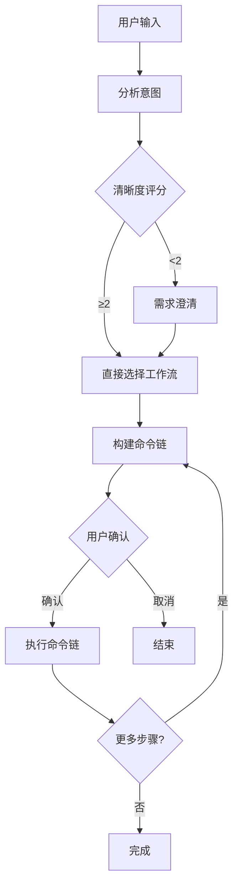
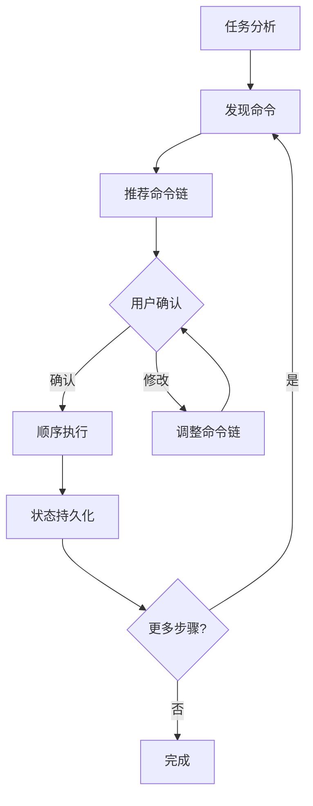

# 核心编排命令

## 一句话定位

**核心编排命令是 Claude_dms3 的工作流大脑** — 分析任务意图、选择合适的工作流、自动执行命令链。

## 命令列表

| 命令 | 功能 | 语法 |
| --- | --- | --- |
| [`/ccw`](#ccw) | 主工作流编排器 - 意图分析→工作流选择→命令链执行 | `/ccw "任务描述"` |
| [`/ccw-coordinator`](#ccw-coordinator) | 命令编排工具 - 链式命令执行和状态持久化 | `/ccw-coordinator "任务描述"` |

## 命令详解

### /ccw

**功能**: 主工作流编排器 - 意图分析→工作流选择→命令链执行

**语法**:
```bash
/ccw "任务描述"
```

**选项**:
- `--yes` / `-y`: 自动模式，跳过确认步骤

**工作流程**:



**任务类型检测**:

| 类型 | 触发关键词 | 工作流 |
| --- | --- | --- |
| **Bug 修复** | urgent, production, critical + fix, bug | lite-fix |
| **头脑风暴** | brainstorm, ideation, 头脑风暴, 创意 | brainstorm-with-file |
| **调试文档** | debug document, hypothesis, 假设验证 | debug-with-file |
| **协作分析** | analyze document, collaborative analysis | analyze-with-file |
| **协作规划** | collaborative plan, 协作规划 | collaborative-plan-with-file |
| **需求路线图** | roadmap, 需求规划 | req-plan-with-file |
| **集成测试** | integration test, 集成测试 | integration-test-cycle |
| **重构** | refactor, 重构 | refactor-cycle |
| **团队工作流** | team + 关键词 | 对应团队工作流 |
| **TDD** | tdd, test-first | tdd-plan → execute |
| **测试修复** | test fix, failing test | test-fix-gen → test-cycle-execute |

**示例**:

```bash
# 基础用法 - 自动选择工作流
/ccw "实现用户认证功能"

# Bug 修复
/ccw "修复登录失败的 bug"

# TDD 开发
/ccw "使用 TDD 实现支付功能"

# 团队协作
/ccw "team-planex 实现用户通知系统"
```

### /ccw-coordinator

**功能**: 命令编排工具 - 分析任务、推荐命令链、顺序执行、状态持久化

**语法**:
```bash
/ccw-coordinator "任务描述"
```

**最小执行单元**:

| 单元名称 | 命令链 | 输出 |
| --- | --- | --- |
| **快速实现** | lite-plan → lite-execute | 工作代码 |
| **多 CLI 规划** | multi-cli-plan → lite-execute | 工作代码 |
| **Bug 修复** | lite-plan (--bugfix) → lite-execute | 修复的代码 |
| **完整规划+执行** | plan → execute | 工作代码 |
| **验证规划+执行** | plan → plan-verify → execute | 工作代码 |
| **TDD 规划+执行** | tdd-plan → execute | 工作代码 |
| **测试生成+执行** | test-gen → execute | 生成的测试 |
| **审查循环** | review-session-cycle → review-cycle-fix | 修复的代码 |
| **Issue 工作流** | discover → plan → queue → execute | 完成的 Issue |

**工作流程**:



**示例**:

```bash
# 自动编排 Bug 修复
/ccw-coordinator "生产环境登录失败"

# 自动编排功能实现
/ccw-coordinator "添加用户头像上传功能"
```

## 自动模式

两个命令都支持 `--yes` 标志启用自动模式：

```bash
# 自动模式 - 跳过所有确认
/ccw "实现用户认证" --yes
/ccw-coordinator "修复登录 bug" --yes
```

**自动模式行为**:
- 跳过需求澄清
- 跳过用户确认
- 直接执行命令链

## 相关 Skills

| Skill | 功能 |
| --- | --- |
| `workflow-lite-plan` | 轻量级规划工作流 |
| `workflow-plan` | 完整规划工作流 |
| `workflow-execute` | 执行工作流 |
| `workflow-tdd` | TDD 工作流 |
| `review-cycle` | 代码审查循环 |

## 对比

| 特性 | /ccw | /ccw-coordinator |
| --- | --- | --- |
| **执行位置** | 主进程 | 外部 CLI + 后台任务 |
| **状态持久化** | 无 | 有 |
| **Hook 回调** | 不支持 | 支持 |
| **复杂工作流** | 简单链式 | 支持并行、依赖 |
| **适用场景** | 日常开发 | 复杂项目、团队协作 |

## 相关文档

- [工作流命令](./workflow.md)
- [会话管理](./session.md)
- [CLI 调用系统](../features/cli.md)
