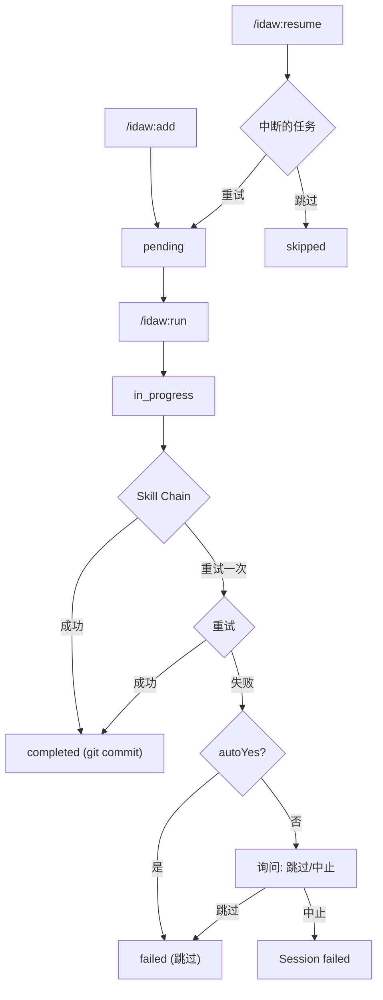

# IDAW 命令

## 一句话定位

**IDAW（Independent Development Autonomous Workflow）是批量任务自治执行引擎** — 攒任务、串行执行 Skill 链、每个任务自动 git checkpoint、中断可恢复。

## 核心概念

| 概念 | 说明 | 存储位置 |
|------|------|----------|
| **Task** | 独立 JSON 任务定义 | `.workflow/.idaw/tasks/IDAW-*.json` |
| **Session** | 执行会话与进度追踪 | `.workflow/.idaw/sessions/IDA-*/` |
| **Skill Chain** | 按任务类型的有序 Skill 序列 | 由 `SKILL_CHAIN_MAP` 映射 |
| **Checkpoint** | 每个任务成功后的 git commit | 自动 `git add -A && git commit` |

## IDAW vs Issue 系统

| 对比维度 | Issue 系统 | IDAW |
|----------|-----------|------|
| **粒度** | 精细粒度、多步编排 | 粗粒度、批量自治 |
| **流水线** | new → plan → queue → execute | add → run（一站式） |
| **执行方式** | DAG 并行 | 串行 + checkpoint |
| **存储** | `.workflow/issues.jsonl` | `.workflow/.idaw/tasks/IDAW-*.json` |
| **场景** | 单个 issue 精细解决 | 批量任务队列、无人值守执行 |

## 命令列表

| 命令 | 功能 | 语法 |
|------|------|------|
| [`add`](#add) | 手动创建或从 issue 导入任务 | `/idaw:add [-y] [--from-issue <id>] "描述" [--type <类型>] [--priority 1-5]` |
| [`run`](#run) | 串行执行任务队列并 git checkpoint | `/idaw:run [-y] [--task <id,...>] [--dry-run]` |
| [`status`](#status) | 查看任务和会话进度 | `/idaw:status [session-id]` |
| [`resume`](#resume) | 从断点恢复中断的会话 | `/idaw:resume [-y] [session-id]` |

## 命令详情

### add

**功能**：手动创建 IDAW 任务或从现有 ccw issue 导入。

**语法**：
```bash
/idaw:add [-y|--yes] [--from-issue <id>[,<id>,...]] "描述" [--type <task_type>] [--priority <1-5>]
```

**参数**：
- `--from-issue <id>`：从 ccw issue 导入（逗号分隔多个）
- `--type <type>`：显式指定任务类型（见[任务类型](#任务类型)）
- `--priority 1-5`：优先级（1=紧急，5=低，默认=3）

**模式**：

| 模式 | 触发条件 | 行为 |
|------|----------|------|
| 手动 | 无 `--from-issue` | 解析描述、生成任务 |
| 导入 | `--from-issue` | 获取 issue、冻结快照、创建任务 |

**示例**：
```bash
# 手动创建
/idaw:add "修复登录超时 Bug" --type bugfix --priority 2
/idaw:add "为 API 添加限流" --priority 1
/idaw:add "重构 auth 模块为策略模式"

# 从 ccw issue 导入
/idaw:add --from-issue ISS-20260128-001
/idaw:add --from-issue ISS-20260128-001,ISS-20260128-002

# 自动模式
/idaw:add -y "修复 header 拼写错误"
```

---

### run

**功能**：主编排器 — 串行执行任务 Skill 链，每个任务完成后自动 git commit。

**语法**：
```bash
/idaw:run [-y|--yes] [--task <id>[,<id>,...]] [--dry-run]
```

**参数**：
- `--task <id,...>`：执行特定任务（默认：所有 pending）
- `--dry-run`：预览执行计划，不实际执行
- `-y`：自动模式 — 跳过确认，失败自动跳过

**6 阶段执行流程**：

```
Phase 1: 加载任务
   └─ Glob IDAW-*.json → 过滤 → 按优先级 ASC、ID ASC 排序

Phase 2: 创建会话
   └─ 创建 session.json + progress.md + TodoWrite

Phase 3: 启动检查
   ├─ 检查运行中的会话 → 提供恢复或新建选项
   └─ 检查 git 状态 → stash/继续/中止

Phase 4: 主循环（串行）
   每个任务:
   ├─ 解析: skill_chain || SKILL_CHAIN_MAP[task_type || 推断]
   ├─ 执行每个 skill（失败重试一次）
   └─ 错误处理: skip (autoYes) 或 ask (交互)

Phase 5: Checkpoint（每个任务）
   ├─ git add -A && git commit
   ├─ 更新 task.json + session.json
   └─ 追加 progress.md

Phase 6: 报告
   └─ 汇总: 完成/失败/跳过数量 + git commits
```

**示例**：
```bash
# 执行所有 pending 任务（自动模式）
/idaw:run -y

# 执行特定任务
/idaw:run --task IDAW-001,IDAW-003

# 预览执行计划
/idaw:run --dry-run
```

---

### status

**功能**：只读查看 IDAW 任务队列和会话进度。

**语法**：
```bash
/idaw:status [session-id]
```

**视图模式**：

| 模式 | 触发 | 输出 |
|------|------|------|
| 概览 | 无参数 | 所有任务表格 + 最新会话摘要 |
| 会话详情 | 指定 session-id | 任务 × 状态 × commit 表格 + progress.md |

**示例**：
```bash
/idaw:status
/idaw:status IDA-auth-fix-20260301
```

---

### resume

**功能**：从最后一个 checkpoint 恢复中断的 IDAW 会话。

**语法**：
```bash
/idaw:resume [-y|--yes] [session-id]
```

**参数**：
- `session-id`：恢复指定会话（默认：最新 running 会话）
- `-y`：自动跳过中断任务，继续执行剩余任务

**恢复流程**：
```
1. 查找 status=running 的会话
2. 处理中断任务 (in_progress):
   ├─ autoYes → 标记为 skipped
   └─ 交互 → 询问: 重试或跳过
3. 构建剩余任务队列
4. 执行 /idaw:run 的 Phase 4-6
```

**示例**：
```bash
/idaw:resume
/idaw:resume IDA-auth-fix-20260301
/idaw:resume -y
```

## 任务类型

IDAW 支持 10 种任务类型，每种映射到特定的 Skill 链：

| 任务类型 | Skill 链 | 使用场景 |
|----------|----------|----------|
| `bugfix` | lite-plan → test-fix | 常规 Bug 修复 |
| `bugfix-hotfix` | lite-plan (--hotfix) | 紧急生产修复 |
| `feature` | lite-plan → test-fix | 新功能 |
| `feature-complex` | plan → execute → test-fix | 多模块功能 |
| `refactor` | refactor-cycle | 代码重构 |
| `tdd` | tdd-plan → execute | 测试驱动开发 |
| `test` | test-fix | 测试生成 |
| `test-fix` | test-fix | 修复失败测试 |
| `review` | review-cycle | 代码审查 |
| `docs` | lite-plan | 文档 |

**类型解析**：显式 `task_type` 字段优先。为 null 时，执行时从标题和描述通过关键字匹配推断。

## 任务 Schema

```json
{
  "id": "IDAW-001",
  "title": "修复 auth token 刷新竞态",
  "description": "详细的问题/目标描述...",
  "status": "pending",
  "priority": 2,
  "task_type": "bugfix",
  "skill_chain": null,
  "context": {
    "affected_files": ["src/auth/token-manager.ts"],
    "acceptance_criteria": ["无并发刷新请求"],
    "constraints": [],
    "references": []
  },
  "source": {
    "type": "manual",
    "issue_id": null,
    "issue_snapshot": null
  },
  "execution": {
    "session_id": null,
    "started_at": null,
    "completed_at": null,
    "skill_results": [],
    "git_commit": null,
    "error": null
  },
  "created_at": "2026-03-01T10:00:00Z",
  "updated_at": "2026-03-01T10:00:00Z"
}
```

## 任务生命周期



## 目录结构

```
.workflow/.idaw/
├── tasks/                          # 任务定义（跨会话持久化）
│   ├── IDAW-001.json
│   ├── IDAW-002.json
│   └── IDAW-003.json
└── sessions/                       # 执行会话
    └── IDA-{slug}-YYYYMMDD/
        ├── session.json            # 会话状态 + 任务队列
        └── progress.md             # 可读的进度日志
```

## 错误处理

| 错误 | 处理方式 |
|------|----------|
| 无任务 | 提示 `/idaw:add` |
| 任务 JSON 解析错误 | 跳过并记录警告 |
| 任务类型无法解析 | 默认 `feature` 链 |
| Skill 失败 | 重试一次 → skip (autoYes) 或 ask (交互) |
| Git commit 无变更 | 记录 `no-commit`，继续 |
| Git 工作区脏 | autoYes: 继续; 交互: 询问 |
| Session ID 冲突 | 追加 `-2` 后缀 |
| Issue 获取失败（导入） | 记录错误，跳过 |
| 重复导入 | 警告并跳过 |
| 无可恢复会话 | 提示 `/idaw:run` |

## 典型使用流程

```bash
# 1. 攒任务
/idaw:add "修复登录超时 Bug" --type bugfix --priority 1
/idaw:add "为 API 添加限流" --priority 2
/idaw:add --from-issue ISS-20260128-001,ISS-20260128-002

# 2. 预览执行计划
/idaw:run --dry-run

# 3. 全自动执行（无人值守）
/idaw:run -y

# 4. 查看进度
/idaw:status

# 5. 中断后恢复
/idaw:resume -y
```

## 相关文档

- [Issue 命令](./issue.md) — 精细粒度 Issue 管理
- [核心编排](./core-orchestration.md) — `/ccw` 主编排器
- [工作流命令](./workflow.md) — 各个工作流 Skill
