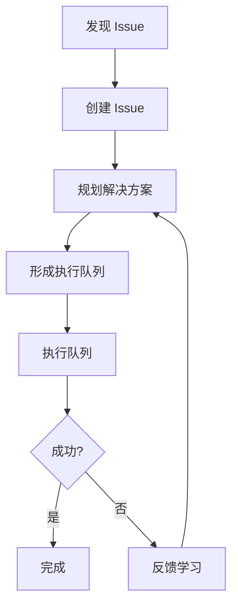

# Issue 工作流命令

## 一句话定位

**Issue 工作流命令是问题管理的闭环系统** — 从发现、规划到执行，完整追踪问题解决全流程。

## 核心概念速览

| 概念 | 说明 | 存放位置 |
| --- | --- | --- |
| **Issue** | 结构化问题定义 | `.workflow/issues/ISS-*.json` |
| **解决方案** | 执行计划 | `.workflow/solutions/SOL-*.json` |
| **队列** | 执行队列 | `.workflow/queues/QUE-*.json` |
| **执行状态** | 进度跟踪 | 队列内状态 |

## 命令列表

| 命令 | 功能 | 语法 |
| --- | --- | --- |
| [`new`](#new) | 从 GitHub URL 或文本描述创建结构化 Issue | `/issue:new [-y] <github-url \| 描述> [--priority 1-5]` |
| [`discover`](#discover) | 从多个角度发现潜在 Issue | `/issue:discover [-y] <路径模式> [--perspectives=维度] [--external]` |
| [`discover-by-prompt`](#discover-by-prompt) | 通过用户提示发现 Issue | `/issue:discover-by-prompt [-y] <提示> [--scope=src/**]` |
| [`plan`](#plan) | 批量规划 Issue 解决方案 | `/issue:plan [-y] --all-pending <issue-id>[,...] [--batch-size 3]` |
| [`queue`](#queue) | 形成执行队列 | `/issue:queue [-y] [--queues N] [--issue id]` |
| [`execute`](#execute) | 执行队列 | `/issue:execute [-y] --queue <queue-id> [--worktree [路径]]` |
| [`convert-to-plan`](#convert-to-plan) | 转换规划工件为 Issue 解决方案 | `/issue:convert-to-plan [-y] [--issue id] [--supplement] <来源>` |

## 命令详解

### new

**功能**: 从 GitHub URL 或文本描述创建结构化 Issue，支持需求清晰度检测。

**语法**:
```
/issue:new [-y|--yes] <github-url | 文本描述> [--priority 1-5]
```

**选项**:
- `--priority 1-5`: 优先级（1=关键，5=低）

**清晰度检测**:

| 输入类型 | 清晰度 | 行为 |
| --- | --- | --- |
| GitHub URL | 3 | 直接创建 |
| 结构化文本 | 2 | 直接创建 |
| 长文本 | 1 | 部分澄清 |
| 短文本 | 0 | 完全澄清 |

**Issue 结构**:
```typescript
interface Issue {
  id: string;                    // GH-123 或 ISS-YYYYMMDD-HHMMSS
  title: string;
  status: 'registered' | 'planned' | 'queued' | 'in_progress' | 'completed' | 'failed';
  priority: number;              // 1-5
  context: string;               // 问题描述（单一真相源）
  source: 'github' | 'text' | 'discovery';
  source_url?: string;

  // 绑定
  bound_solution_id: string | null;

  // 反馈历史
  feedback?: Array<{
    type: 'failure' | 'clarification' | 'rejection';
    stage: string;
    content: string;
    created_at: string;
  }>;
}
```

**示例**:
```bash
# 从 GitHub 创建
/issue:new https://github.com/owner/repo/issues/123

# 从文本创建（结构化）
/issue:new "登录失败：预期成功，实际 500 错误"

# 从文本创建（模糊 - 会询问）
/issue:new "认证有问题"

# 指定优先级
/issue:new --priority 2 "支付超时问题"
```

### discover

**功能**: 从多个角度（Bug、UX、测试、质量、安全、性能、可维护性、最佳实践）发现潜在 Issue。

**语法**:
```
/issue:discover [-y|--yes] <路径模式> [--perspectives=bug,ux,...] [--external]
```

**选项**:
- `--perspectives=维度`: 分析维度
  - `bug`: 潜在 Bug
  - `ux`: UX 问题
  - `test`: 测试覆盖
  - `quality`: 代码质量
  - `security`: 安全问题
  - `performance`: 性能问题
  - `maintainability`: 可维护性
  - `best-practices`: 最佳实践
- `--external`: 使用 Exa 外部研究（安全、最佳实践）

**示例**:
```bash
# 全面扫描
/issue:discover src/

# 特定维度
/issue:discover src/auth/ --perspectives=security,bug

# 带外部研究
/issue:discover src/payment/ --perspectives=security --external
```

### discover-by-prompt

**功能**: 通过用户提示发现 Issue，使用 Gemini 规划的迭代多代理探索，支持跨模块比较。

**语法**:
```
/issue:discover-by-prompt [-y|--yes] <提示> [--scope=src/**] [--depth=standard|deep] [--max-iterations=5]
```

**选项**:
- `--scope=路径`: 扫描范围
- `--depth=深度`: standard 或 deep
- `--max-iterations=N`: 最大迭代次数

**示例**:
```bash
# 标准扫描
/issue:discover-by-prompt "查找认证模块的问题"

# 深度扫描
/issue:discover-by-prompt "分析 API 性能瓶颈" --depth=deep

# 指定范围
/issue:discover-by-prompt "检查数据库查询优化" --scope=src/db/
```

### plan

**功能**: 批量规划 Issue 解决方案，使用 issue-plan-agent（探索+规划闭环）。

**语法**:
```
/issue:plan [-y|--yes] --all-pending <issue-id>[,<issue-id>,...] [--batch-size 3]
```

**选项**:
- `--all-pending`: 规划所有待规划的 Issue
- `--batch-size=N`: 每批处理的 Issue 数量

**示例**:
```bash
# 规划特定 Issue
/issue:plan ISS-20240115-001,ISS-20240115-002

# 规划所有待规划的 Issue
/issue:plan --all-pending

# 指定批次大小
/issue:plan --all-pending --batch-size 5
```

### queue

**功能**: 从绑定解决方案形成执行队列，使用 issue-queue-agent（解决方案级别）。

**语法**:
```
/issue:queue [-y|--yes] [--queues <n>] [--issue <id>]
```

**选项**:
- `--queues N`: 创建的队列数量
- `--issue id`: 特定 Issue

**示例**:
```bash
# 形成队列
/issue:queue

# 创建多个队列
/issue:queue --queues 3

# 特定 Issue
/issue:queue --issue ISS-20240115-001
```

### execute

**功能**: 执行队列，使用 DAG 并行编排（每个解决方案一次提交）。

**语法**:
```
/issue:execute [-y|--yes] --queue <queue-id> [--worktree [<existing-path>]]
```

**选项**:
- `--queue id`: 队列 ID
- `--worktree [路径]`: 可选的工作树路径

**示例**:
```bash
# 执行队列
/issue:execute --queue QUE-20240115-001

# 使用工作树
/issue:execute --queue QUE-20240115-001 --worktree ../feature-branch
```

### convert-to-plan

**功能**: 转换规划工件（lite-plan、工作流会话、markdown）为 Issue 解决方案。

**语法**:
```
/issue:convert-to-plan [-y|--yes] [--issue <id>] [--supplement] <来源>
```

**选项**:
- `--issue id`: 绑定到现有 Issue
- `--supplement`: 补充模式（添加到现有解决方案）

**来源类型**:
- lite-plan 工件
- 工作流会话
- Markdown 文件

**示例**:
```bash
# 从 lite-plan 转换
/issue:convert-to-plan .workflow/sessions/WFS-xxx/artifacts/lite-plan.md

# 绑定到 Issue
/issue:convert-to-plan --issue ISS-20240115-001 plan.md

# 补充模式
/issue:convert-to-plan --supplement additional-plan.md
```

### from-brainstorm

**功能**: 从头脑风暴会话想法转换为 Issue 并生成可执行解决方案。

**语法**:
```
/issue:from-brainstorm SESSION="会话-id" [--idea=<索引>] [--auto] [-y|--yes]
```

**选项**:
- `--idea=索引`: 特定想法索引
- `--auto`: 自动模式

**示例**:
```bash
# 转换所有想法
/issue:from-brainstorm SESSION="WFS-brainstorm-2024-01-15"

# 转换特定想法
/issue:from-brainstorm SESSION="WFS-brainstorm-2024-01-15" --idea=3

# 自动模式
/issue:from-brainstorm --auto SESSION="WFS-brainstorm-2024-01-15"
```

## Issue 工作流程



## 相关文档

- [工作流命令](./workflow.md)
- [核心编排](./core-orchestration.md)
- [团队系统](../../features/)
