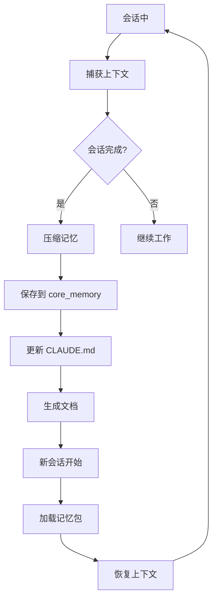

# Memory 命令

## 一句话定位

**Memory 命令是跨会话知识持久化系统** — 捕获上下文、更新记忆、生成文档，让 AI 记住项目。

## 核心概念速览

| 概念 | 说明 | 存放位置 |
| --- | --- | --- |
| **记忆包** | 结构化项目上下文 | MCP core_memory |
| **CLAUDE.md** | 模块级项目指南 | 每个模块/目录 |
| **Tips** | 快速笔记 | `MEMORY.md` |
| **项目文档** | 生成的文档 | `docs/` 目录 |

## 命令列表

| 命令 | 功能 | 语法 |
| --- | --- | --- |
| [`compact`](#compact) | 压缩当前会话记忆为结构化文本 | `/memory:compact [可选: 会话描述]` |
| [`tips`](#tips) | 快速笔记记录 | `/memory:tips <笔记内容> [--tag 标签] [--context 上下文]` |
| [`load`](#load) | 通过 CLI 分析项目加载任务上下文 | `/memory:load [--tool gemini\|qwen] "任务上下文描述"` |
| [`update-full`](#update-full) | 更新所有 CLAUDE.md 文件 | `/memory:update-full [--tool gemini\|qwen\|codex] [--path 目录]` |
| [`update-related`](#update-related) | 更新 git 变更模块的 CLAUDE.md | `/memory:update-related [--tool gemini\|qwen\|codex]` |
| [`docs-full-cli`](#docs-full-cli) | 使用 CLI 生成完整项目文档 | `/memory:docs-full-cli [路径] [--tool 工具]` |
| [`docs-related-cli`](#docs-related-cli) | 生成 git 变更模块文档 | `/memory:docs-related-cli [--tool 工具]` |
| [`style-skill-memory`](#style-skill-memory) | 从样式参考生成 SKILL 记忆包 | `/memory:style-skill-memory [包名] [--regenerate]` |

## 命令详解

### compact

**功能**: 压缩当前会话记忆为结构化文本，提取目标、计划、文件、决策、约束、状态，并通过 MCP core_memory 工具保存。

**语法**:
```
/memory:compact [可选: 会话描述]
```

**提取内容**:
- 目标 (objective)
- 计划 (plan)
- 文件 (files)
- 决策 (decisions)
- 约束 (constraints)
- 状态 (state)

**示例**:
```bash
# 基础压缩
/memory:compact

# 带描述
/memory:compact "用户认证实现会话"
```

### tips

**功能**: 快速笔记记录命令，捕获想法、片段、提醒和洞察供后续参考。

**语法**:
```
/memory:tips <笔记内容> [--tag <标签1,标签2>] [--context <上下文>]
```

**选项**:
- `--tag=标签`: 标签（逗号分隔）
- `--context=上下文`: 上下文信息

**示例**:
```bash
# 基础笔记
/memory:tips "记得使用 rate limiting 限制 API 调用"

# 带标签
/memory:tips "认证中间件需要处理 token 过期" --tag auth,api

# 带上下文
/memory:tips "使用 Redis 缓存用户会话" --context "登录优化"
```

### load

**功能**: 委托给 universal-executor 代理，通过 Gemini/Qwen CLI 分析项目并返回 JSON 核心内容包用于任务上下文。

**语法**:
```
/memory:load [--tool gemini|qwen] "任务上下文描述"
```

**选项**:
- `--tool=工具`: 使用的 CLI 工具

**输出**: JSON 格式的项目上下文包

**示例**:
```bash
# 使用默认工具
/memory:load "用户认证模块"

# 指定工具
/memory:load --tool gemini "支付系统架构"
```

### update-full

**功能**: 更新所有 CLAUDE.md 文件，使用基于层的执行（Layer 3→1），批量代理处理（4 模块/代理）和 gemini→qwen→codex 回退。

**语法**:
```
/memory:update-full [--tool gemini|qwen|codex] [--path <目录>]
```

**选项**:
- `--tool=工具`: 使用的 CLI 工具
- `--path=目录`: 特定目录

**层结构**:
- Layer 3: 项目级分析
- Layer 2: 模块级分析
- Layer 1: 文件级分析

**示例**:
```bash
# 更新整个项目
/memory:update-full

# 更新特定目录
/memory:update-full --path src/auth/

# 指定工具
/memory:update-full --tool qwen
```

### update-related

**功能**: 更新 git 变更模块的 CLAUDE.md 文件，使用批量代理执行（4 模块/代理）和 gemini→qwen→codex 回退。

**语法**:
```
/memory:update-related [--tool gemini|qwen|codex]
```

**选项**:
- `--tool=工具`: 使用的 CLI 工具

**示例**:
```bash
# 默认更新
/memory:update-related

# 指定工具
/memory:update-related --tool gemini
```

### docs-full-cli

**功能**: 使用 CLI 执行生成完整项目文档（Layer 3→1），批量代理处理（4 模块/代理）和 gemini→qwen→codex 回退，<20 模块使用直接并行。

**语法**:
```
/memory:docs-full-cli [路径] [--tool <gemini|qwen|codex>]
```

**示例**:
```bash
# 生成整个项目文档
/memory:docs-full-cli

# 生成特定目录文档
/memory:docs-full-cli src/

# 指定工具
/memory:docs-full-cli --tool gemini
```

### docs-related-cli

**功能**: 使用 CLI 执行生成 git 变更模块文档，批量代理处理（4 模块/代理）和 gemini→qwen→codex 回退，<15 模块使用直接执行。

**语法**:
```
/memory:docs-related-cli [--tool <gemini|qwen|codex>]
```

**示例**:
```bash
# 默认生成
/memory:docs-related-cli

# 指定工具
/memory:docs-related-cli --tool qwen
```

### style-skill-memory

**功能**: 从样式参考生成 SKILL 记忆包，便于加载和一致的设计系统使用。

**语法**:
```
/memory:style-skill-memory [包名] [--regenerate]
```

**选项**:
- `--regenerate`: 重新生成

**示例**:
```bash
# 生成样式记忆包
/memory:style-skill-memory my-design-system

# 重新生成
/memory:style-skill-memory my-design-system --regenerate
```

## Memory 系统工作流程



## CLAUDE.md 结构

```markdown
# 模块名称

## 一句话定位
模块的核心价值描述

## 技术栈
- 框架/库
- 主要依赖

## 关键文件
- 文件路径: 说明

## 代码约定
- 命名规范
- 架构模式
- 最佳实践

## 待办事项
- 计划中的功能
- 已知问题
```

## 相关文档

- [Memory 记忆系统](../../features/memory.md)
- [核心编排](./core-orchestration.md)
- [工作流指南](../../guide/ch03-core-concepts.md)
