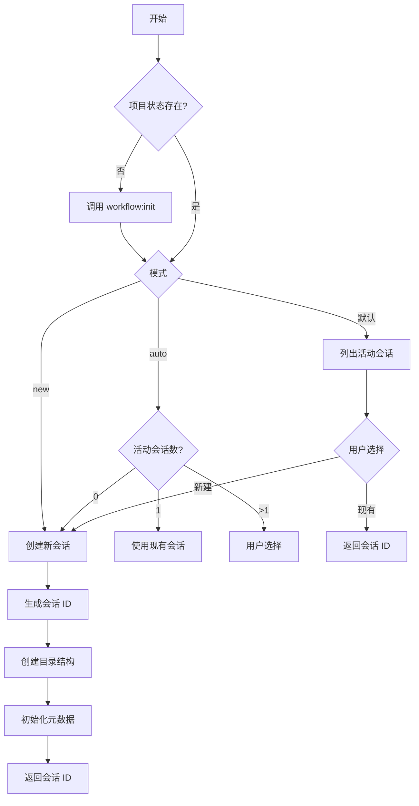
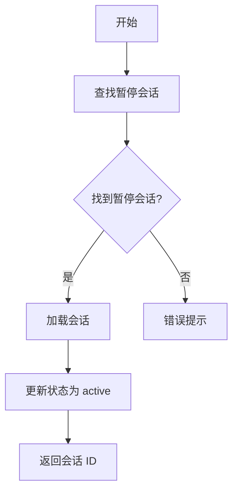
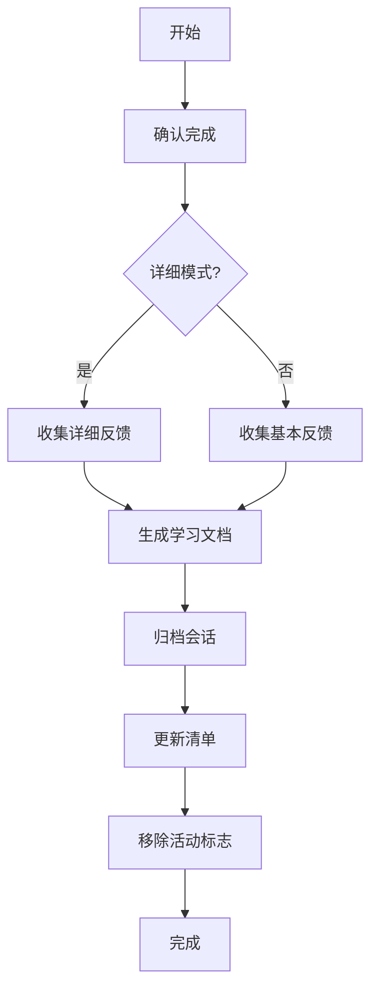

# 会话管理命令

## 一句话定位

**会话管理命令是工作流的状态管理者** — 创建、跟踪、恢复和完成工作流会话。

## 核心概念速览

| 概念 | 说明 | 位置 |
| --- | --- | --- |
| **会话 ID** | 唯一标识符 (WFS-YYYY-MM-DD) | `.workflow/active/WFS-xxx/` |
| **会话类型** | workflow, review, tdd, test, docs | 会话元数据 |
| **会话状态** | active, paused, completed | workflow-session.json |
| **工件** | 规划、任务、TODO 等文件 | 会话目录 |

## 命令列表

| 命令 | 功能 | 语法 |
| --- | --- | --- |
| [`start`](#start) | 发现现有会话或启动新工作流会话 | `/workflow:session:start [--type 类型] [--auto\|--new] [描述]` |
| [`list`](#list) | 列出所有工作流会话 | `/workflow:session:list` |
| [`resume`](#resume) | 恢复最近暂停的工作流会话 | `/workflow:session:resume` |
| [`complete`](#complete) | 标记活动工作流会话为完成 | `/workflow:session:complete [-y] [--detailed]` |
| [`solidify`](#solidify) | 将会话学习结晶为项目指南 | `/workflow:session:solidify [-y] [--type 类型] [--category 类别] "规则"` |

## 命令详解

### start

**功能**: 发现现有会话或启动新工作流会话，支持智能会话管理和冲突检测。

**语法**:
```bash
/workflow:session:start [--type <workflow|review|tdd|test|docs>] [--auto|--new] [可选: 任务描述]
```

**选项**:
- `--type=类型`: 会话类型
  - `workflow`: 标准实现（默认）
  - `review`: 代码审查
  - `tdd`: TDD 开发
  - `test`: 测试生成/修复
  - `docs`: 文档会话
- `--auto`: 智能模式（自动检测/创建）
- `--new`: 强制创建新会话

**会话类型**:

| 类型 | 描述 | 默认来源 |
| --- | --- | --- |
| `workflow` | 标准实现 | workflow-plan skill |
| `review` | 代码审查 | review-cycle skill |
| `tdd` | TDD 开发 | workflow-tdd skill |
| `test` | 测试生成/修复 | workflow-test-fix skill |
| `docs` | 文档会话 | memory-manage skill |

**工作流程**:



**示例**:

```bash
# 发现模式 - 列出活动会话
/workflow:session:start

# 自动模式 - 智能选择/创建
/workflow:session:start --auto "实现用户认证"

# 新建模式 - 强制创建新会话
/workflow:session:start --new "重构支付模块"

# 指定类型
/workflow:session:start --type review "审查认证代码"
/workflow:session:start --type tdd --auto "实现登录功能"
```

### list

**功能**: 列出所有工作流会话，支持状态过滤，显示会话元数据和进度信息。

**语法**:
```bash
/workflow:session:list
```

**输出格式**:

| 会话 ID | 类型 | 状态 | 描述 | 进度 |
| --- | --- | --- | --- | --- |
| WFS-2024-01-15 | workflow | active | 用户认证 | 5/10 |
| WFS-2024-01-14 | review | paused | 代码审查 | 8/8 |
| WFS-2024-01-13 | tdd | completed | TDD 开发 | 12/12 |

**示例**:
```bash
# 列出所有会话
/workflow:session:list
```

### resume

**功能**: 恢复最近暂停的工作流会话，支持自动会话发现和状态更新。

**语法**:
```bash
/workflow:session:resume
```

**工作流程**:



**示例**:
```bash
# 恢复最近暂停的会话
/workflow:session:resume
```

### complete

**功能**: 标记活动工作流会话为完成，归档并学习经验，更新清单并移除活动标志。

**语法**:
```bash
/workflow:session:complete [-y|--yes] [--detailed]
```

**选项**:
- `--detailed`: 详细模式，收集更多经验教训

**工作流程**:



**示例**:
```bash
# 标准完成
/workflow:session:complete

# 详细完成
/workflow:session:complete --detailed

# 自动模式
/workflow:session:complete -y
```

### solidify

**功能**: 将会话学习和用户定义的约束结晶为永久项目指南。

**语法**:
```bash
/workflow:session:solidify [-y|--yes] [--type <convention|constraint|learning>] [--category <类别>] "规则或洞察"
```

**选项**:
- `--type=类型`:
  - `convention`: 代码约定
  - `constraint`: 约束条件
  - `learning`: 经验学习
- `--category=类别`: 类别名称（如 `authentication`, `testing`）

**输出位置**:
- 约定: `.workflow/specs/conventions/<category>.md`
- 约束: `.workflow/specs/constraints/<category>.md`
- 学习: `.workflow/specs/learnings/<category>.md`

**示例**:
```bash
# 添加代码约定
/workflow:session:solidify --type=convention --category=auth "所有认证函数必须使用 rate limiting"

# 添加约束
/workflow:session:solidify --type=constraint --category=database "不使用 N+1 查询"

# 添加学习
/workflow:session:solidify --type=learning --category=api "REST API 设计经验"
```

## 会话目录结构

```
.workflow/
├── active/                        # 活动会话
│   └── WFS-2024-01-15/           # 会话目录
│       ├── workflow-session.json  # 会话元数据
│       ├── tasks/                 # 任务定义
│       ├── artifacts/             # 工件文件
│       └── context/               # 上下文文件
└── archived/                      # 归档会话
    └── WFS-2024-01-14/
```

## 会话元数据

```json
{
  "session_id": "WFS-2024-01-15",
  "type": "workflow",
  "status": "active",
  "created_at": "2024-01-15T10:00:00Z",
  "updated_at": "2024-01-15T14:30:00Z",
  "description": "用户认证功能实现",
  "progress": {
    "total": 10,
    "completed": 5,
    "percentage": 50
  }
}
```

## 相关文档

- [工作流命令](./workflow.md)
- [核心编排](./core-orchestration.md)
- [工作流基础](../../guide/ch04-workflow-basics.md)
