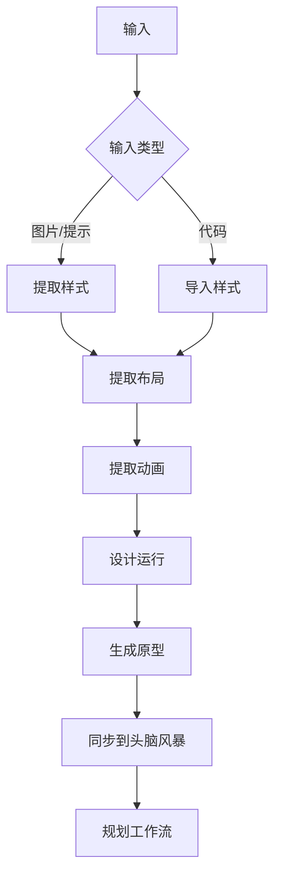

# UI 设计命令

## 一句话定位

**UI 设计命令是界面原型生成系统** — 从样式提取、布局分析到原型组装，完整覆盖 UI 设计流程。

## 核心概念速览

| 概念 | 说明 | 存放位置 |
| --- | --- | --- |
| **设计运行** | 设计会话目录 | `.workflow/ui-design-runs/<run-id>/` |
| **设计令牌** | 样式变量 | `design-tokens.json` |
| **布局模板** | 结构定义 | `layouts/` |
| **原型** | 生成的组件 | `prototypes/` |

## 命令列表

### 发现与提取

| 命令 | 功能 | 语法 |
| --- | --- | --- |
| [`explore-auto`](#explore-auto) | 交互式探索性 UI 设计工作流 | `/workflow:ui-design:explore-auto [--input "值"] [--targets "列表"]` |
| [`imitate-auto`](#imitate-auto) | 直接代码/图片输入的 UI 设计 | `/workflow:ui-design:imitate-auto [--input "值"] [--session id]` |
| [`style-extract`](#style-extract) | 从参考图片或提示提取设计样式 | `/workflow:ui-design:style-extract [-y] [--design-id id]` |
| [`layout-extract`](#layout-extract) | 从参考图片提取布局信息 | `/workflow:ui-design:layout-extract [-y] [--design-id id]` |
| [`animation-extract`](#animation-extract) | 提取动画和过渡模式 | `/workflow:ui-design:animation-extract [-y] [--design-id id]` |

### 导入与导出

| 命令 | 功能 | 语法 |
| --- | --- | --- |
| [`import-from-code`](#import-from-code) | 从代码文件导入设计系统 | `/workflow:ui-design:import-from-code [--design-id id] [--session id] [--source path]` |
| [`codify-style`](#codify-style) | 从代码提取样式并生成可共享引用包 | `/workflow:ui-design:codify-style <path> [--package-name name]` |
| [`reference-page-generator`](#reference-page-generator) | 从设计运行生成多组件参考页面 | `/workflow:ui-design:reference-page-generator [--design-run path]` |

### 生成与同步

| 命令 | 功能 | 语法 |
| --- | --- | --- |
| [`generate`](#generate) | 组合布局模板与设计令牌生成原型 | `/workflow:ui-design:generate [--design-id id] [--session id]` |
| [`design-sync`](#design-sync) | 同步最终设计系统引用到头脑风暴工件 | `/workflow:ui-design:design-sync --session <session_id>` |

## 命令详解

### explore-auto

**功能**: 交互式探索性 UI 设计工作流，以样式为中心的批量生成，从提示/图片创建设计变体，支持并行执行和用户选择。

**语法**:
```bash
/workflow:ui-design:explore-auto [--input "<值>"] [--targets "<列表>"] [--target-type "page|component"] [--session <id>] [--style-variants <数量>] [--layout-variants <数量>]
```

**选项**:
- `--input=值`: 输入提示或图片路径
- `--targets=列表`: 目标组件列表（逗号分隔）
- `--target-type=类型`: page 或 component
- `--session=id`: 会话 ID
- `--style-variants=N`: 样式变体数量
- `--layout-variants=N`: 布局变体数量

**示例**:
```bash
# 页面设计探索
/workflow:ui-design:explore-auto --input "现代电商首页" --target-type page --style-variants 3

# 组件设计探索
/workflow:ui-design:explore-auto --input "用户卡片组件" --target-type component --layout-variants 5

# 多目标设计
/workflow:ui-design:explore-auto --targets "header,sidebar,footer" --style-variants 2
```

### imitate-auto

**功能**: UI 设计工作流，支持直接代码/图片输入进行设计令牌提取和原型生成。

**语法**:
```bash
/workflow:ui-design:imitate-auto [--input "<值>"] [--session <id>]
```

**选项**:
- `--input=值`: 代码文件路径或图片路径
- `--session=id`: 会话 ID

**示例**:
```bash
# 从代码模仿
/workflow:ui-design:imitate-auto --input "./src/components/Button.tsx"

# 从图片模仿
/workflow:ui-design:imitate-auto --input "./designs/mockup.png"
```

### style-extract

**功能**: 从参考图片或文本提示使用 Claude 分析提取设计样式，支持变体生成或精化模式。

**语法**:
```bash
/workflow:ui-design:style-extract [-y|--yes] [--design-id <id>] [--session <id>] [--images "<glob>"] [--prompt "<描述>"] [--variants <数量>] [--interactive] [--refine]
```

**选项**:
- `--images=glob`: 图片 glob 模式
- `--prompt=描述`: 文本描述
- `--variants=N`: 变体数量
- `--interactive`: 交互模式
- `--refine`: 精化模式

**示例**:
```bash
# 从图片提取样式
/workflow:ui-design:style-extract --images "./designs/*.png" --variants 3

# 从提示提取
/workflow:ui-design:style-extract --prompt "深色主题，蓝色主色调，圆角设计"

# 交互精化
/workflow:ui-design:style-extract --images "reference.png" --refine --interactive
```

### layout-extract

**功能**: 从参考图片或文本提示使用 Claude 分析提取结构布局信息，支持变体生成或精化模式。

**语法**:
```bash
/workflow:ui-design:layout-extract [-y|--yes] [--design-id <id>] [--session <id>] [--images "<glob>"] [--prompt "<描述>"] [--targets "<列表>"] [--variants <数量>] [--device-type <desktop|mobile|tablet|responsive>] [--interactive] [--refine]
```

**选项**:
- `--device-type=类型`: desktop, mobile, tablet 或 responsive
- 其他同 style-extract

**示例**:
```bash
# 提取桌面布局
/workflow:ui-design:layout-extract --images "desktop-mockup.png" --device-type desktop

# 提取响应式布局
/workflow:ui-design:layout-extract --prompt "三栏布局，响应式设计" --device-type responsive

# 多变体
/workflow:ui-design:layout-extract --images "layout.png" --variants 5
```

### animation-extract

**功能**: 从提示推断和图片引用提取动画和过渡模式，用于设计系统文档。

**语法**:
```bash
/workflow:ui-design:animation-extract [-y|--yes] [--design-id <id>] [--session <id>] [--images "<glob>"] [--focus "<类型>"] [--interactive] [--refine]
```

**选项**:
- `--focus=类型`: 特定动画类型（如 fade, slide, scale）

**示例**:
```bash
# 提取所有动画
/workflow:ui-design:animation-extract --images "./animations/*.gif"

# 提取特定类型
/workflow:ui-design:animation-extract --focus "fade,slide" --interactive
```

### import-from-code

**功能**: 从代码文件（CSS/JS/HTML/SCSS）导入设计系统，使用自动文件发现和并行代理分析。

**语法**:
```bash
/workflow:ui-design:import-from-code [--design-id <id>] [--session <id>] [--source <path>]
```

**选项**:
- `--source=路径`: 源代码目录

**示例**:
```bash
# 从项目导入
/workflow:ui-design:import-from-code --source "./src/styles/"

# 指定设计 ID
/workflow:ui-design:import-from-code --design-id my-design --source "./theme/"
```

### codify-style

**功能**: 编排器从代码提取样式并生成可共享引用包，支持预览（自动文件发现）。

**语法**:
```bash
/workflow:ui-design:codify-style <path> [--package-name <name>] [--output-dir <path>] [--overwrite]
```

**选项**:
- `--package-name=名称`: 包名称
- `--output-dir=路径`: 输出目录
- `--overwrite`: 覆盖现有文件

**示例**:
```bash
# 生成样式包
/workflow:ui-design:codify-style ./src/styles/ --package-name my-design-system

# 指定输出目录
/workflow:ui-design:codify-style ./theme/ --output-dir ./design-packages/
```

### reference-page-generator

**功能**: 从设计运行提取生成多组件参考页面和文档。

**语法**:
```bash
/workflow:ui-design:reference-page-generator [--design-run <path>] [--package-name <name>] [--output-dir <path>]
```

**示例**:
```bash
# 生成参考页面
/workflow:ui-design:reference-page-generator --design-run .workflow/ui-design-runs/latest/

# 指定包名
/workflow:ui-design:reference-page-generator --package-name component-library
```

### generate

**功能**: 组装 UI 原型，将布局模板与设计令牌（默认动画支持）组合，纯组装器无新内容生成。

**语法**:
```bash
/workflow:ui-design:generate [--design-id <id>] [--session <id>]
```

**示例**:
```bash
# 生成原型
/workflow:ui-design:generate

# 使用特定设计
/workflow:ui-design:generate --design-id my-design
```

### design-sync

**功能**: 同步最终设计系统引用到头脑风暴工件，准备供 `/workflow:plan` 消费。

**语法**:
```bash
/workflow:ui-design:design-sync --session <session_id> [--selected-prototypes "<列表>"]
```

**选项**:
- `--selected-prototypes=列表`: 选定的原型列表

**示例**:
```bash
# 同步所有原型
/workflow:ui-design:design-sync --session WFS-design-2024-01-15

# 同步选定原型
/workflow:ui-design:design-sync --session WFS-design-2024-01-15 --selected-prototypes "header,button,card"
```

## UI 设计工作流程



## 设计运行结构

```
.workflow/ui-design-runs/<run-id>/
├── design-tokens.json       # 设计令牌
├── layouts/                 # 布局模板
│   ├── header.json
│   ├── footer.json
│   └── ...
├── prototypes/              # 生成的原型
│   ├── header/
│   ├── button/
│   └── ...
└── reference-pages/         # 参考页面
```

## 相关文档

- [核心编排](./core-orchestration.md)
- [工作流命令](./workflow.md)
- [头脑风暴](../../features/)
