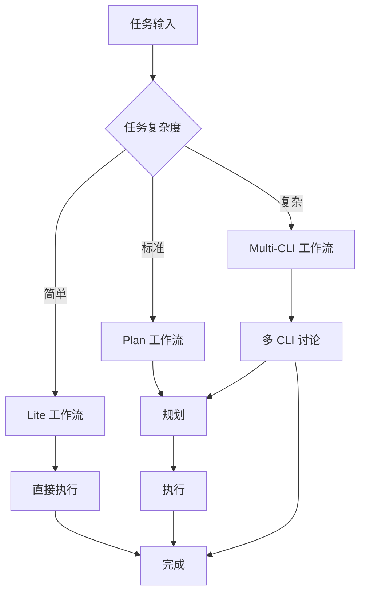

# 工作流命令

## 一句话定位

**工作流命令是 Claude_dms3 的执行引擎** — 提供从轻量级任务到复杂项目的完整工作流支持。

## 命令列表

### 轻量级工作流

| 命令 | 功能 | 语法 |
| --- | --- | --- |
| [`lite-lite-lite`](#lite-lite-lite) | 超轻量级多工具分析和直接执行 | `/workflow:lite-lite-lite [-y] <任务>` |
| [`lite-plan`](#lite-plan) | 轻量级交互式规划工作流 | `/workflow-lite-plan [-y] [-e] "任务"` |
| [`lite-execute`](#lite-execute) | 基于内存计划执行任务 | `/workflow:lite-execute [-y] [--in-memory] [任务]` |
| [`lite-fix`](#lite-fix) | 轻量级 Bug 诊断和修复 | `/workflow:lite-fix [-y] [--hotfix] "Bug 描述"` |

### 标准工作流

| 命令 | 功能 | 语法 |
| --- | --- | --- |
| [`plan`](#plan) | 5 阶段规划工作流 | `/workflow-plan [-y] "描述"\|file.md` |
| [`execute`](#execute) | 协调代理执行工作流任务 | `/workflow-execute [-y] [--resume-session=ID]` |
| [`replan`](#replan) | 交互式工作流重新规划 | `/workflow:replan [-y] [--session ID] [task-id] "需求"` |

### 协作工作流

| 命令 | 功能 | 语法 |
| --- | --- | --- |
| [`multi-cli-plan`](#multi-cli-plan) | 多 CLI 协作规划 | `/workflow-multi-cli-plan [-y] <任务> [--max-rounds=N]` |
| [`brainstorm-with-file`](#brainstorm-with-file) | 交互式头脑风暴 | `/workflow:brainstorm-with-file [-y] [-c] "想法"` |
| [`analyze-with-file`](#analyze-with-file) | 交互式协作分析 | `/workflow:analyze-with-file [-y] [-c] "主题"` |
| [`debug-with-file`](#debug-with-file) | 交互式假设驱动调试 | `/workflow:debug-with-file [-y] "Bug 描述"` |
| [`unified-execute-with-file`](#unified-execute-with-file) | 通用执行引擎 | `/workflow:unified-execute-with-file [-y] [-p path] [上下文]` |

### TDD 工作流

| 命令 | 功能 | 语法 |
| --- | --- | --- |
| [`tdd-plan`](#tdd-plan) | TDD 规划工作流 | `/workflow-tdd-plan "功能描述"` |
| [`tdd-verify`](#tdd-verify) | 验证 TDD 工作流合规性 | `/workflow-tdd-verify [--session ID]` |

### 测试工作流

| 命令 | 功能 | 语法 |
| --- | --- | --- |
| [`test-fix-gen`](#test-fix-gen) | 创建测试修复工作流会话 | `/workflow-test-fix (session-id\|"描述"\|file.md)` |
| [`test-gen`](#test-gen) | 从实现会话创建测试会话 | `/workflow:test-gen source-session-id` |
| [`test-cycle-execute`](#test-cycle-execute) | 执行测试修复工作流 | `/workflow-test-fix [--resume-session=ID]` |

### 审查工作流

| 命令 | 功能 | 语法 |
| --- | --- | --- |
| [`review`](#review) | 实现后审查 | `/workflow:review [--type=类型] [--archived] [session-id]` |
| [`review-module-cycle`](#review-module-cycle) | 独立多维度代码审查 | `/workflow:review-module-cycle <路径> [--dimensions=维度]` |
| [`review-session-cycle`](#review-session-cycle) | 基于会话的审查 | `/workflow:review-session-cycle [session-id] [--dimensions=维度]` |
| [`review-cycle-fix`](#review-cycle-fix) | 自动修复审查发现 | `/workflow:review-cycle-fix <export-file\|review-dir>` |

### 专用工作流

| 命令 | 功能 | 语法 |
| --- | --- | --- |
| [`clean`](#clean) | 智能代码清理 | `/workflow:clean [-y] [--dry-run] ["焦点区域"]` |
| [`init`](#init) | 初始化项目状态 | `/workflow:init [--regenerate]` |
| [`plan-verify`](#plan-verify) | 验证规划一致性 | `/workflow-plan-verify [--session session-id]` |

## 命令详解

### lite-lite-lite

**功能**: 超轻量级多工具分析和直接执行。简单任务无工件，复杂任务自动在 `.workflow/.scratchpad/` 创建规划文档。

**语法**:
```bash
/workflow:lite-lite-lite [-y|--yes] <任务描述>
```

**使用场景**:
- 超简单快速任务
- 不需要规划文档的代码修改
- 自动工具选择

**示例**:
```bash
# 超简单任务
/workflow:lite-lite-lite "修复 header 样式"

# 自动模式
/workflow:lite-lite-lite -y "更新 README 链接"
```

### lite-plan

**功能**: 轻量级交互式规划工作流，支持内存规划、代码探索和执行到 lite-execute。

**语法**:
```bash
/workflow-lite-plan [-y|--yes] [-e|--explore] "任务描述" | file.md
```

**选项**:
- `-e, --explore`: 先执行代码探索

**示例**:
```bash
# 基础规划
/workflow-lite-plan "添加用户头像功能"

# 带探索
/workflow-lite-plan -e "重构认证模块"
```

### lite-execute

**功能**: 基于内存计划、提示描述或文件内容执行任务。

**语法**:
```bash
/workflow:lite-execute [-y|--yes] [--in-memory] ["任务描述" | file-path]
```

**选项**:
- `--in-memory`: 使用内存计划

**示例**:
```bash
# 执行任务
/workflow:lite-execute "实现头像上传 API"

# 使用内存计划
/workflow:lite-execute --in-memory
```

### lite-fix

**功能**: 轻量级 Bug 诊断和修复工作流，支持智能严重程度评估和可选的热修复模式。

**语法**:
```bash
/workflow:lite-fix [-y|--yes] [--hotfix] "Bug 描述或 Issue 引用"
```

**选项**:
- `--hotfix`: 热修复模式（生产事故快速修复）

**示例**:
```bash
# Bug 修复
/workflow:lite-fix "登录时出现 500 错误"

# 热修复
/workflow:lite-fix --hotfix "支付网关超时"
```

### plan

**功能**: 5 阶段规划工作流，输出 IMPL_PLAN.md 和任务 JSON。

**语法**:
```bash
/workflow-plan [-y|--yes] "文本描述" | file.md
```

**阶段**:
1. 会话初始化
2. 上下文收集
3. 规范加载
4. 任务生成
5. 验证/重新规划

**示例**:
```bash
# 从描述规划
/workflow-plan "实现用户通知系统"

# 从文件规划
/workflow-plan requirements.md
```

### execute

**功能**: 协调代理执行工作流任务，支持自动会话发现、并行任务处理和状态跟踪。

**语法**:
```bash
/workflow-execute [-y|--yes] [--resume-session="session-id"]
```

**示例**:
```bash
# 执行当前会话
/workflow-execute

# 恢复并执行会话
/workflow-execute --resume-session=WFS-2024-01-15
```

### replan

**功能**: 交互式工作流重新规划，支持会话级工件更新和边界澄清。

**语法**:
```bash
/workflow:replan [-y|--yes] [--session session-id] [task-id] "需求" | file.md [--interactive]
```

**示例**:
```bash
# 重新规划整个会话
/workflow:replan --session=WFS-xxx "添加用户权限检查"

# 重新规划特定任务
/workflow:replan TASK-001 "改为使用 RBAC"
```

### multi-cli-plan

**功能**: 多 CLI 协作规划工作流，使用 ACE 上下文收集和迭代交叉验证。

**语法**:
```bash
/workflow-multi-cli-plan [-y|--yes] <任务描述> [--max-rounds=3] [--tools=gemini,codex] [--mode=parallel|serial]
```

**选项**:
- `--max-rounds=N`: 最大讨论轮数
- `--tools=工具`: 使用的 CLI 工具
- `--mode=模式`: 并行或串行模式

**示例**:
```bash
# 多 CLI 规划
/workflow-multi-cli-plan "设计微服务架构"

# 指定工具和轮数
/workflow-multi-cli-plan --tools=gemini,codex --max-rounds=5 "数据库迁移方案"
```

### brainstorm-with-file

**功能**: 交互式头脑风暴，多 CLI 协作、想法扩展和文档化思维演化。

**语法**:
```bash
/workflow:brainstorm-with-file [-y|--yes] [-c|--continue] [-m|--mode creative|structured] "想法或主题"
```

**选项**:
- `-c, --continue`: 继续现有会话
- `-m, --mode=模式`: creative 或 structured

**示例**:
```bash
# 创意头脑风暴
/workflow:brainstorm-with-file --mode creative "用户增长策略"

# 结构化头脑风暴
/workflow:brainstorm-with-file --mode structured "API 版本控制方案"
```

### analyze-with-file

**功能**: 交互式协作分析，有文档化的讨论、CLI 辅助探索和演化理解。

**语法**:
```bash
/workflow:analyze-with-file [-y|--yes] [-c|--continue] "主题或问题"
```

**示例**:
```bash
# 分析主题
/workflow:analyze-with-file "认证架构设计"

# 继续讨论
/workflow:analyze-with-file -c
```

### debug-with-file

**功能**: 交互式假设驱动调试，有文档化的探索、理解演化和 Gemini 辅助修正。

**语法**:
```bash
/workflow:debug-with-file [-y|--yes] "Bug 描述或错误信息"
```

**示例**:
```bash
# 调试 Bug
/workflow:debug-with-file "WebSocket 连接随机断开"

# 调试错误
/workflow:debug-with-file "TypeError: Cannot read property 'id'"
```

### unified-execute-with-file

**功能**: 通用执行引擎，消费任何规划/头脑风暴/分析输出，支持最小进度跟踪、多代理协调和增量执行。

**语法**:
```bash
/workflow:unified-execute-with-file [-y|--yes] [-p|--plan <path>] [-m|--mode sequential|parallel] ["执行上下文"]
```

**示例**:
```bash
# 执行规划
/workflow:unified-execute-with-file -p plan.md

# 并行执行
/workflow:unified-execute-with-file -m parallel
```

## 工作流程图



## 相关文档

- [会话管理](./session.md)
- [核心编排](./core-orchestration.md)
- [工作流指南](../../guide/ch04-workflow-basics.md)
