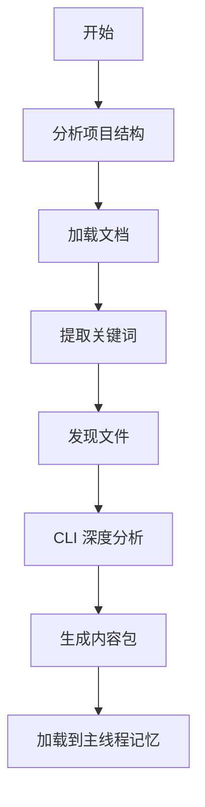

# Prep 提示

## 一句话定位

**Prep 提示是项目上下文准备的标准化模板** — 通过代理驱动分析生成结构化项目核心内容包。

## 核心内容包结构

```json
{
  "task_context": "任务上下文描述",
  "keywords": ["关键词1", "关键词2"],
  "project_summary": {
    "architecture": "架构描述",
    "tech_stack": ["技术1", "技术2"],
    "key_patterns": ["模式1", "模式2"]
  },
  "relevant_files": [
    {
      "path": "文件路径",
      "relevance": "相关性说明",
      "priority": "high|medium|low"
    }
  ],
  "integration_points": [
    "集成点1",
    "集成点2"
  ],
  "constraints": [
    "约束1",
    "约束2"
  ]
}
```

## memory:prepare

**功能**: 委托给 universal-executor 代理，通过 Gemini/Qwen CLI 分析项目并返回 JSON 核心内容包用于任务上下文。

**语法**:
```bash
/memory:prepare [--tool gemini|qwen] "任务上下文描述"
```

**选项**:
- `--tool=工具`: 指定 CLI 工具（默认：gemini）
  - `gemini`: 大上下文窗口，适合复杂项目分析
  - `qwen`: Gemini 的替代方案，具有相似能力

**执行流程**:



**代理调用提示**:
```
## Mission: Prepare Project Memory Context

**Task**: Prepare project memory context for: "{task_description}"
**Mode**: analysis
**Tool Preference**: {tool}

### Step 1: Foundation Analysis
1. Project Structure: get_modules_by_depth.sh
2. Core Documentation: CLAUDE.md, README.md

### Step 2: Keyword Extraction & File Discovery
1. Extract core keywords from task description
2. Discover relevant files using ripgrep and find

### Step 3: Deep Analysis via CLI
Execute Gemini/Qwen CLI for deep analysis

### Step 4: Generate Core Content Package
Return structured JSON with required fields

### Step 5: Return Content Package
Load JSON into main thread memory
```

**示例**:

```bash
# 基础用法
/memory:prepare "在当前前端基础上开发用户认证功能"

# 指定工具
/memory:prepare --tool qwen "重构支付模块API"

# Bug 修复上下文
/memory:prepare "修复登录验证错误"
```

**返回的内容包**:

```json
{
  "task_context": "在当前前端基础上开发用户认证功能",
  "keywords": ["前端", "用户", "认证", "auth", "login"],
  "project_summary": {
    "architecture": "TypeScript + React 前端，Vite 构建系统",
    "tech_stack": ["React", "TypeScript", "Vite", "TailwindCSS"],
    "key_patterns": [
      "通过 Context API 进行状态管理",
      "使用 Hooks 的函数组件模式",
      "API 调用封装在自定义 hooks 中"
    ]
  },
  "relevant_files": [
    {
      "path": "src/components/Auth/LoginForm.tsx",
      "relevance": "现有登录表单组件",
      "priority": "high"
    },
    {
      "path": "src/contexts/AuthContext.tsx",
      "relevance": "认证状态管理上下文",
      "priority": "high"
    },
    {
      "path": "CLAUDE.md",
      "relevance": "项目开发标准",
      "priority": "high"
    }
  ],
  "integration_points": [
    "必须与现有 AuthContext 集成",
    "遵循组件组织模式: src/components/[Feature]/",
    "API 调用应使用 src/hooks/useApi.ts 包装器"
  ],
  "constraints": [
    "保持向后兼容",
    "遵循 TypeScript 严格模式",
    "使用现有 UI 组件库"
  ]
}
```

## 质量检查清单

生成内容包前验证：
- [ ] 有效的 JSON 格式
- [ ] 所有必需字段完整
- [ ] relevant_files 包含最少 3-10 个文件
- [ ] project_summary 准确反映架构
- [ ] integration_points 清晰指定集成路径
- [ ] keywords 准确提取（3-8 个关键词）
- [ ] 内容简洁，避免冗余（< 5KB 总计）

## 记忆持久化

- **会话范围**: 内容包在当前会话有效
- **后续引用**: 所有后续代理/命令都可以访问
- **重新加载需要**: 新会话需要重新执行 `/memory:prepare`

## 相关文档

- [Memory 命令](../claude/memory.md)
- [Review 提示](./review.md)
- [CLI 调用系统](../../features/cli.md)
